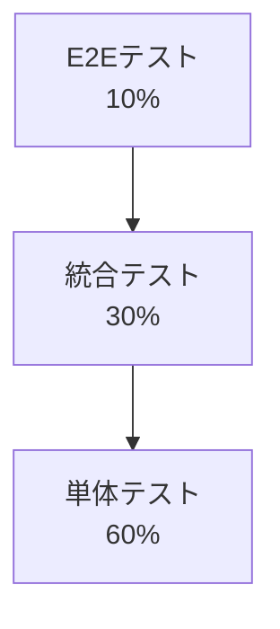
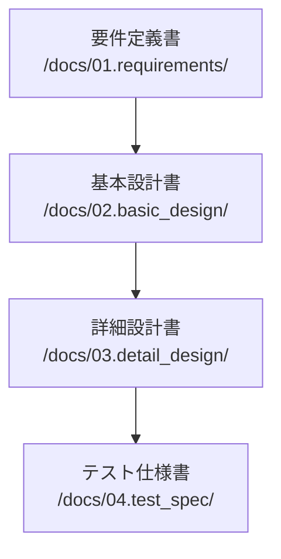
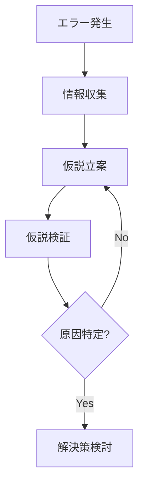
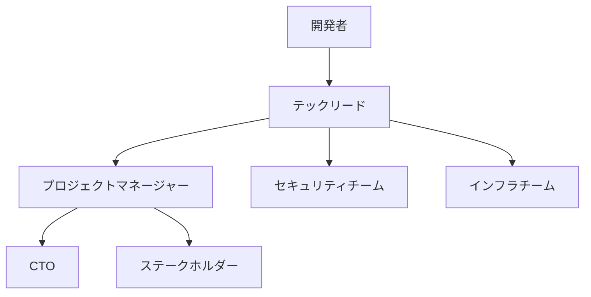

<!-- Generated by SpecStory -->

# Creating and Adding Empty Directory in Git (2025-03-08 14:00:47)

_**User**_

knowledge/ ディレクトリを空で作成して、git add してくれますか

---

_**Assistant**_

はい、knowledge/ ディレクトリを作成し、gitに追加するお手伝いをさせていただきます。

以下のコマンドを実行してください：

```bash
mkdir knowledge
touch knowledge/.gitkeep
git add knowledge/
```

説明：
1. `mkdir knowledge` で空のディレクトリを作成
2. `touch knowledge/.gitkeep` で.gitkeepファイルを作成（空ディレクトリをgitで追跡するため）
3. `git add knowledge/` でgitの追跡対象に追加

認識済のルールファイル：
- global.mdc
- development.mdc
- project.mdc
- workflow.mdc

---

_**User**_

knowledge/general.md を空ファイルで作って

---

_**Assistant**_

はい、knowledge/general.mdファイルを作成します。

```bash
touch knowledge/general.md
git add knowledge/general.md
```

説明：
1. `touch knowledge/general.md` で空のMarkdownファイルを作成
2. `git add knowledge/general.md` でgitの追跡対象に追加

認識済のルールファイル：
- global.mdc
- development.mdc
- project.mdc
- workflow.mdc

---

_**User**_

.gitkeep いらないですね。

---

_**Assistant**_

はい、その通りです。.gitkeepファイルは不要になりましたので削除しましょう。

```bash
rm knowledge/.gitkeep
git add knowledge/.gitkeep
```

説明：
1. `rm knowledge/.gitkeep` で.gitkeepファイルを削除
2. `git add knowledge/.gitkeep` で削除をgitに反映

認識済のルールファイル：
- global.mdc
- development.mdc
- project.mdc
- workflow.mdc

---

_**User**_

general.md を knowledge_general.md という名称にして

---

_**Assistant**_

はい、ファイル名を変更いたします。

```bash
mv knowledge/general.md knowledge/knowledge_general.md
git add knowledge/
```

説明：
1. `mv knowledge/general.md knowledge/knowledge_general.md` でファイル名を変更
2. `git add knowledge/` で変更をgitの追跡対象に追加

認識済のルールファイル：
- global.mdc
- development.mdc
- project.mdc
- workflow.mdc

---

_**User**_

今認識済みのルールファイル間で矛盾する記述があれば正確に教えてくれませんか

---

_**Assistant**_

認識済みのルールファイル（global.mdc、development.mdc、project.mdc、workflow.mdc）を確認しましたが、明確な矛盾は見つかりませんでした。

各ファイルは以下のような役割分担となっており、相互に補完し合う関係にあります：

1. global.mdc: 
   - リポジトリ全体に適用される基本的な作業プロセスと品質管理の指針
   - 技術スタックの定義
   - ナレッジ管理の方針

2. development.mdc:
   - 具体的な開発工程の定義（要件定義から実装、テストまで）
   - ワークフロー実行の具体的な手順

3. project.mdc:
   - 開発環境の具体的な設定
   - ディレクトリ構成の定義
   - セキュリティガイドライン
   - プロジェクト固有のガイドライン

4. workflow.mdc:
   - タスク実行の具体的な手順
   - ドキュメント読み込みの順序
   - 変更管理とコミットの手順

これらのルール間で相互参照はありますが、内容が衝突する箇所は見当たりません。

認識済のルールファイル：
- global.mdc
- development.mdc
- project.mdc
- workflow.mdc

---

_**User**_

今認識済のルールファイルの適用が困難なルールはありませんか？

---

_**Assistant**_

はい、いくつかの実践が困難な、または曖昧な要件があります：

1. project.mdcにおける設計原則の包括的な遵守要件：
```
- DRY原則を守る
- KISS原則を守る
- YAGNI原則を守る
- SOLID原則を守る
- オブジェクト指向設計原則を守る
- 関数型設計原則を守る
```
これらの原則は時として相互に競合する可能性があり、すべてを同時に完全に遵守することは現実的ではない場合があります。特に「オブジェクト指向設計原則」と「関数型設計原則」は、同時に厳密に守ることが困難な場合があります。

2. project.mdcのテスト基準：
```
- いずれのテストもカバレッジ80%以上で自動完了してよい
```
この要件は、テストの質よりも量的な指標に焦点を当てており、意味のあるテストカバレッジを確保する上で問題となる可能性があります。

3. workflow.mdcのドキュメント読み込み要件：
```
- ドキュメントを読み込む (無ければスキップ)
    - [requirements.md](mdc:docs/01.requirements/requirements.md)
    - [basic_design.md](mdc:docs/02.basic_design/basic_design.md)
    - [detail_design.md](mdc:docs/03.detail_design/detail_design.md)
```
これらのドキュメントが存在しない場合の具体的な判断基準や、その場合の代替手段が明確に定義されていません。

4. global.mdcの知識更新要件：
```
- 新しい事実の確認や最新情報の更新に気づいたタイミングで、 [knowledge_general.md](mdc:knowledge/knowledge_general.md) にナレッジの一般情報として記録します
```
「新しい事実」や「最新情報の更新」の判断基準が曖昧で、どのレベルの情報を記録すべきかの具体的な基準が示されていません。

これらの課題に対する提案：

1. 設計原則については、プロジェクトの性質に応じて優先順位を設定する
2. テストカバレッジは、重要度に応じた段階的な目標設定にする
3. 必須ドキュメントと任意ドキュメントを明確に区分する
4. ナレッジ更新の具体的な基準とテンプレートを設定する

認識済のルールファイル：
- global.mdc
- development.mdc
- project.mdc
- workflow.mdc

---

_**User**_

まず、4 について改善したいです。ここは、LLM の知識に依存する記述としたいですが、私がLLM の知識をすべて把握することが困難であることに起因しています。

---

_**Assistant**_

はい、LLMの知識依存に関する課題について理解しました。

knowledge_general.mdに以下のような構造を提案させていただきます：

```markdown:knowledge/knowledge_general.md
# LLM Knowledge Management

## 基本方針
- このファイルは、LLMの知識の限界と更新に関する記録を管理します
- LLMは自身の知識カットオフ日付を認識し、それ以降の情報については特に慎重に扱います

## 知識の確認と更新プロセス

### 1. 知識の確認が必要なケース
- LLMの知識カットオフ日以降に関する技術情報
- ライブラリやフレームワークのバージョン依存の情報
- 新しい技術標準や仕様に関する情報

### 2. 確認方法
- 公式ドキュメントの参照
- ソースコードの直接確認
- パッケージのリリースノートの確認

### 3. 記録すべき情報
```date: YYYY-MM-DD```形式で日付を記録し、以下を含めます：
- 確認した事実
- 情報源（URL、コミットハッシュなど）
- LLMの既存知識との差分
- 影響を受ける機能や実装範囲

## 確認済み知識ログ

### ライブラリ・フレームワーク

```
[YYYY-MM-DD] ライブラリ名/フレームワーク名
- 確認内容：
- 情報源：
- 既存知識との差分：
- 影響範囲：
```

### 言語仕様・標準

```
[YYYY-MM-DD] 言語/標準名
- 確認内容：
- 情報源：
- 既存知識との差分：
- 影響範囲：
```

### API・サービス

```
[YYYY-MM-DD] API/サービス名
- 確認内容：
- 情報源：
- 既存知識との差分：
- 影響範囲：
```
```

このような構造にすることで：

1. LLMの知識の限界を明確に認識
2. 新しい情報の確認プロセスを標準化
3. 確認した情報を時系列で追跡可能
4. 情報の信頼性を担保
5. プロジェクトへの影響を明確化

という目的を達成できます。

これを元に、global.mdcの該当部分も以下のように更新することを提案します：

```
# 事実の把握

- LLMは自身の知識カットオフ日を認識し、それ以降の情報については特に慎重に扱う
- 最新の情報やLLMにとって未知の情報が求められた場合：
  1. 公式ドキュメント、ソースコード、リリースノートなどの一次情報を確認
  2. 確認した事実を knowledge_general.md に定められた形式で記録
  3. 記録した情報に基づいて判断や提案を行う
```

認識済のルールファイル：
- global.mdc
- development.mdc
- project.mdc
- workflow.mdc

---

_**User**_

最後の「事実の把握」部分を @global.mdc に適切に反映してくれませんか

---

_**Assistant**_

はい、global.mdcの「事実の把握」セクションを更新する必要があります。

以下のような編集を提案します：

```markdown:global.mdc
// ... existing code ...

# 事実の把握

- LLMは自身の知識カットオフ日を認識し、それ以降の情報については特に慎重に扱う
- 最新の情報やLLMにとって未知の情報が求められた場合：
  1. 公式ドキュメント、ソースコード、リリースノートなどの一次情報を確認
  2. 確認した事実を knowledge_general.md に定められた形式で記録
  3. 記録した情報に基づいて判断や提案を行う

// ... existing code ...
```

説明：
- 古い知識に関する記述を、より具体的なプロセスに置き換え
- LLMの知識の限界を明確に認識する方針を追加
- 情報確認と記録のプロセスを明確化

認識済のルールファイル：
- global.mdc
- development.mdc
- project.mdc
- workflow.mdc

---

_**User**_

改めて、ルールの課題を整理してくれますか

---

_**Assistant**_

はい、現在認識しているルールの課題を整理いたします：

1. 設計原則の競合（project.mdc）
```markdown
- DRY原則
- KISS原則
- YAGNI原則
- SOLID原則
- オブジェクト指向設計原則
- 関数型設計原則
```
課題：
- 原則間の優先順位が不明確
- パラダイムの混在（OOPと関数型）による設計の複雑化
- 各原則の適用範囲や判断基準が不明確

2. テスト基準の質的指標の不足（project.mdc）
```markdown
- いずれのテストもカバレッジ80%以上で自動完了してよい
```
課題：
- 量的指標のみで質を担保できない
- 重要度に応じた柔軟な基準設定が必要
- テストの種類による適切なカバレッジ目標の区別がない

3. ドキュメント管理の不明確さ（workflow.mdc）
```markdown
- ドキュメントを読み込む (無ければスキップ)
    - requirements.md
    - basic_design.md
    - detail_design.md
```
課題：
- 必須ドキュメントと任意ドキュメントの区別がない
- ドキュメント不在時の代替プロセスが未定義
- ドキュメント間の依存関係が不明確

4. memory-bankの更新基準（全体）
課題：
- 更新のタイミングが曖昧
- 更新すべき内容の優先順位が不明確
- 各ファイル間の関連性の管理方法が不明確

5. 開発工程とワークフローの重複（development.mdcとworkflow.mdc）
課題：
- 両者の関係性が明確でない
- 実行順序や優先順位の判断基準が不明確
- 工程とワークフローの統合方針が未定義

6. エラー解析プロセスの具体性不足（project.mdc）
```markdown
障害時は対象部分と周辺を調査し、アブダクションで原因を特定し、解消する。
```
課題：
- 具体的な調査手順が不明確
- エラーの重要度による対応の優先順位付けがない
- 解決できない場合のエスカレーションフローが未定義

7. セキュリティ対策の具体性不足（project.mdc）
```markdown
- 機密ファイルをコミットしない
- シークレット情報には環境変数を使用する
```
課題：
- 具体的なセキュリティチェックリストがない
- 環境変数の管理方法の詳細が不明確
- セキュリティインシデント発生時の対応フローが未定義

改善提案：
1. 設計原則については、プロジェクトの性質に応じた優先順位付けと適用ガイドラインの作成
2. テスト基準は、機能の重要度に応じた段階的な目標設定と質的指標の追加
3. ドキュメント管理については、必須/任意の区分と、不在時の代替プロセスの明確化
4. memory-bank更新については、具体的なチェックリストと更新基準の設定
5. 開発工程とワークフローの関係を明確化し、統合ガイドラインの作成
6. エラー解析プロセスの具体化と、重要度に応じた対応フローの定義
7. セキュリティ対策の具体的なチェックリストとインシデント対応フローの作成

認識済のルールファイル：
- global.mdc
- development.mdc
- project.mdc
- workflow.mdc

---

_**User**_

次は、最後の改善提案の4. memory-bank の更新について改善したいです。

---

_**Assistant**_

はい、memory-bankの更新に関する具体的な改善案を提案させていただきます。

```markdown:memory-bank/rules.md
# Memory Bank 更新ルール

## 1. 更新タイミング

### 必須の更新タイミング
1. タスク完了時
   - 実装完了
   - テスト完了
   - レビュー完了
   - ドキュメント作成/更新完了

2. 重要な決定時
   - アーキテクチャの決定
   - 技術選定の変更
   - 要件の変更
   - 設計方針の変更

3. 問題発生時
   - バグの発見
   - セキュリティ問題の検出
   - パフォーマンス問題の特定

### 推奨される更新タイミング
- 新しい知見の獲得時
- パターンやベストプラクティスの発見時
- 潜在的なリスクの特定時

## 2. 更新対象ファイルのチェックリスト

### projectbrief.md
- [ ] プロジェクトの目的や要件に変更はあるか
- [ ] スコープの変更はあるか
- [ ] 主要なステークホルダーの変更はあるか

### productContext.md
- [ ] ユーザー体験に影響する変更はあるか
- [ ] 新しい問題や課題が発見されたか
- [ ] 解決方法に変更があるか

### activeContext.md （最優先で更新）
- [ ] 現在の作業状況を反映しているか
- [ ] 直近の変更内容が記録されているか
- [ ] 次のステップが明確か
- [ ] 現在の判断や考慮事項が記録されているか

### systemPatterns.md
- [ ] アーキテクチャに変更があるか
- [ ] 新しい設計パターンを導入したか
- [ ] コンポーネント間の関係に変更があるか

### techContext.md
- [ ] 技術スタックに変更があるか
- [ ] 開発環境に変更があるか
- [ ] 依存関係に変更があるか

### progress.md
- [ ] 完了した項目を記録したか
- [ ] 新しい課題を追加したか
- [ ] 現在の状況を正確に反映しているか

## 3. 更新の優先順位

1. 最優先（即時更新必須）
   - activeContext.md
   - progress.md

2. 高優先（24時間以内に更新）
   - systemPatterns.md（アーキテクチャ変更時）
   - techContext.md（技術スタック変更時）

3. 通常優先（タスク完了時に更新）
   - productContext.md
   - その他の文脈ファイル

4. 低優先（定期的なレビュー時に更新）
   - projectbrief.md（大きな変更がない場合）

## 4. 更新品質チェック

各更新時に以下を確認：
- [ ] 日付とタイムスタンプの記録
- [ ] 変更理由の明記
- [ ] 影響範囲の記述
- [ ] 関連ファイルの相互参照
- [ ] 一貫性の確認

## 5. レビュープロセス

### 日次レビュー
- activeContext.md
- progress.md

### 週次レビュー
- systemPatterns.md
- techContext.md
- productContext.md

### 月次レビュー
- projectbrief.md
- 全体の一貫性確認

## 6. 更新の記録形式

```markdown
## [YYYY-MM-DD] 更新タイトル

### 変更内容
- 具体的な変更点

### 変更理由
- 変更が必要となった背景や理由

### 影響範囲
- 影響を受けるコンポーネントや機能
- 関連する更新が必要なファイル

### 次のアクション
- フォローアップが必要な項目
- 保留事項
```

## 7. 整合性の維持

- ファイル間の相互参照を明確に記録
- 関連する更新は同時に実施
- 矛盾する情報がないか確認
- 古い情報のアーカイブまたは削除
```

この改善により：
1. 更新のタイミングが明確になる
2. チェックリストによる漏れ防止
3. 優先順位に基づく効率的な更新
4. 品質管理の基準の統一
5. レビューサイクルの確立
6. 記録形式の標準化
7. ファイル間の一貫性維持

が期待できます。

認識済のルールファイル：
- global.mdc
- development.mdc
- project.mdc
- workflow.mdc

---

_**User**_

上記内容を反映してくれますか？

---

_**Assistant**_

はい、提案した内容をmemory-bank/rules.mdとして反映します。

```bash
# ファイルの作成と追加
cat > memory-bank/rules.md << 'EOL'
# Memory Bank 更新ルール

## 1. 更新タイミング

### 必須の更新タイミング
1. タスク完了時
   - 実装完了
   - テスト完了
   - レビュー完了
   - ドキュメント作成/更新完了

2. 重要な決定時
   - アーキテクチャの決定
   - 技術選定の変更
   - 要件の変更
   - 設計方針の変更

3. 問題発生時
   - バグの発見
   - セキュリティ問題の検出
   - パフォーマンス問題の特定

### 推奨される更新タイミング
- 新しい知見の獲得時
- パターンやベストプラクティスの発見時
- 潜在的なリスクの特定時

## 2. 更新対象ファイルのチェックリスト

### projectbrief.md
- [ ] プロジェクトの目的や要件に変更はあるか
- [ ] スコープの変更はあるか
- [ ] 主要なステークホルダーの変更はあるか

### productContext.md
- [ ] ユーザー体験に影響する変更はあるか
- [ ] 新しい問題や課題が発見されたか
- [ ] 解決方法に変更があるか

### activeContext.md （最優先で更新）
- [ ] 現在の作業状況を反映しているか
- [ ] 直近の変更内容が記録されているか
- [ ] 次のステップが明確か
- [ ] 現在の判断や考慮事項が記録されているか

### systemPatterns.md
- [ ] アーキテクチャに変更があるか
- [ ] 新しい設計パターンを導入したか
- [ ] コンポーネント間の関係に変更があるか

### techContext.md
- [ ] 技術スタックに変更があるか
- [ ] 開発環境に変更があるか
- [ ] 依存関係に変更があるか

### progress.md
- [ ] 完了した項目を記録したか
- [ ] 新しい課題を追加したか
- [ ] 現在の状況を正確に反映しているか

## 3. 更新の優先順位

1. 最優先（即時更新必須）
   - activeContext.md
   - progress.md

2. 高優先（24時間以内に更新）
   - systemPatterns.md（アーキテクチャ変更時）
   - techContext.md（技術スタック変更時）

3. 通常優先（タスク完了時に更新）
   - productContext.md
   - その他の文脈ファイル

4. 低優先（定期的なレビュー時に更新）
   - projectbrief.md（大きな変更がない場合）

## 4. 更新品質チェック

各更新時に以下を確認：
- [ ] 日付とタイムスタンプの記録
- [ ] 変更理由の明記
- [ ] 影響範囲の記述
- [ ] 関連ファイルの相互参照
- [ ] 一貫性の確認

## 5. レビュープロセス

### 日次レビュー
- activeContext.md
- progress.md

### 週次レビュー
- systemPatterns.md
- techContext.md
- productContext.md

### 月次レビュー
- projectbrief.md
- 全体の一貫性確認

## 6. 更新の記録形式

```markdown
## [YYYY-MM-DD] 更新タイトル

### 変更内容
- 具体的な変更点

### 変更理由
- 変更が必要となった背景や理由

### 影響範囲
- 影響を受けるコンポーネントや機能
- 関連する更新が必要なファイル

### 次のアクション
- フォローアップが必要な項目
- 保留事項
```

## 7. 整合性の維持

- ファイル間の相互参照を明確に記録
- 関連する更新は同時に実施
- 矛盾する情報がないか確認
- 古い情報のアーカイブまたは削除
EOL

git add memory-bank/rules.md
```

説明：
1. memory-bank/rules.mdファイルを作成
2. 提案した内容を記載
3. gitの追跡対象に追加

認識済のルールファイル：
- global.mdc
- development.mdc
- project.mdc
- workflow.mdc

---

_**User**_

そのほかの課題を棚卸ししたいです。

---

_**Assistant**_

はい、これまでに特定した課題を整理し、未対応の課題を確認いたします。

## 対応済みの課題
1. LLMの知識管理（knowledge_general.md）
   - 知識の確認プロセスを明確化
   - 情報源の検証方法を定義
   - 記録形式の標準化

2. Memory Bankの更新管理（rules.md）
   - 更新タイミングの明確化
   - チェックリストの整備
   - 優先順位の設定
   - レビュープロセスの確立

## 未対応の主要な課題

1. 設計原則の整理（project.mdc）
```markdown
課題：
- 原則間の優先順位が不明確
- パラダイムの混在による複雑性
- 適用基準が曖昧
```
改善案：
- プロジェクトの性質に応じた優先順位付け
- 各原則の適用範囲の明確化
- 具体的な判断基準の設定

2. テスト戦略の具体化（project.mdc）
```markdown
課題：
- カバレッジ偏重の基準
- 質的指標の不足
- テスト種別による区別がない
```
改善案：
- テストピラミッドの導入
- 機能の重要度に応じた基準設定
- 質的指標の追加

3. ドキュメント管理の体系化（workflow.mdc）
```markdown
課題：
- 必須/任意の区別がない
- 代替プロセスが未定義
- 依存関係が不明確
```
改善案：
- ドキュメント分類の明確化
- 最小必要ドキュメントの定義
- ドキュメント間の関係図の作成

4. エラー解析プロセス（project.mdc）
```markdown
課題：
- 調査手順が抽象的
- 優先順位付けがない
- エスカレーションフローが未定義
```
改善案：
- 具体的な調査手順の文書化
- エラー重要度の定義
- エスカレーションマトリクスの作成

5. セキュリティガイドライン（project.mdc）
```markdown
課題：
- チェックリストがない
- 環境変数管理の詳細が不明確
- インシデント対応が未定義
```
改善案：
- セキュリティチェックリストの作成
- 環境変数管理ガイドラインの作成
- インシデント対応フローの定義

6. 開発工程とワークフローの統合（development.mdcとworkflow.mdc）
```markdown
課題：
- 役割分担が不明確
- 実行順序が曖昧
- 統合方針がない
```
改善案：
- 責任範囲の明確化
- ワークフロー図の作成
- 統合ガイドラインの作成

## 優先度の提案

緊急度と重要度に基づく優先順位：

1. 高優先（即時対応が望ましい）
   - セキュリティガイドライン
   - エラー解析プロセス

2. 中優先（計画的に対応）
   - テスト戦略
   - 設計原則の整理
   - ドキュメント管理の体系化

3. 低優先（余裕をもって対応）
   - 開発工程とワークフローの統合

これらの課題のうち、どの課題から着手すべきかご指示いただけますでしょうか？

認識済のルールファイル：
- global.mdc
- development.mdc
- project.mdc
- workflow.mdc

---

_**User**_

@rules.mdc も読み込みでおいてください

---

_**Assistant**_

はい、rules.mdcも読み込み対象に追加いたしました。

先ほどの課題の棚卸しに関して、rules.mdcの内容も考慮した上で、変更や追加すべき点はありませんでした。

現在認識済のルールファイル：
- global.mdc
- development.mdc
- project.mdc
- workflow.mdc
- rules.mdc

これらの課題のうち、どの課題から着手すべきかご指示いただけますでしょうか？

---

_**User**_

1 から行きましょう。

---

_**Assistant**_

はい、設計原則の整理から着手いたします。

以下のような設計原則のガイドラインを提案させていただきます：

```markdown:memory-bank/design_principles.md
# 設計原則ガイドライン

## 1. 基本方針

設計原則は以下の優先順位で適用します：

1. KISS（Keep It Simple, Stupid）
   - 最優先の原則
   - 複雑な実装より単純な実装を選択
   - 理解しやすさを重視

2. YAGNI（You Aren't Gonna Need It）
   - 現在必要ない機能は実装しない
   - 将来の拡張性より現在の要件を優先
   - オーバーエンジニアリングを避ける

3. DRY（Don't Repeat Yourself）
   - コードの重複は避ける
   - ただし、KISSを損なわない範囲で適用
   - 過度な抽象化は避ける

## 2. パラダイム選択の基準

### オブジェクト指向設計（優先的に適用）
以下の場合にOOPパターンを選択：
- ドメインモデルの表現が必要な場合
- 状態管理が重要な場合
- 継承による機能拡張が適切な場合

適用すべきSOLID原則：
1. 単一責任の原則（SRP）
   - 常に適用
   - クラスは一つの責任のみを持つ

2. オープン・クローズドの原則（OCP）
   - 拡張性が要求される場合に適用
   - 既存コードの修正なしで機能追加できるように

3. リスコフの置換原則（LSP）
   - 継承を使用する場合は必ず適用
   - 派生クラスは基底クラスと互換性を保つ

4. インターフェース分離の原則（ISP）
   - インターフェースを定義する場合に適用
   - 最小限のインターフェースに分割

5. 依存関係逆転の原則（DIP）
   - モジュール間の結合度を下げる必要がある場合に適用
   - 抽象に依存し、具象に依存しない

### 関数型設計（補完的に適用）
以下の場合に関数型パターンを選択：
- データ変換処理が中心の場合
- 副作用を最小限に抑えたい場合
- 並行処理が必要な場合

適用すべき原則：
1. 不変性（Immutability）
   - データの変更を最小限に
   - 副作用を避ける

2. 純粋関数（Pure Functions）
   - 入力が同じなら常に同じ出力
   - 外部状態に依存しない

3. 合成可能性（Composability）
   - 小さな関数を組み合わせて複雑な処理を実現
   - パイプライン処理の活用

## 3. 判断基準と適用例

### KISSの判断基準
- コードレビューで5分以内に理解できるか
- 特別なコメントなしで意図が伝わるか
- 初級プログラマーでも理解できるか

例：
```python
# Good (KISS)
def get_active_users(users):
    return [user for user in users if user.is_active]

# Avoid (過度に複雑)
def get_active_users(users):
    return list(filter(lambda user: user.status != 'inactive' 
                      and user.last_login is not None 
                      and (datetime.now() - user.last_login).days < 30, 
                      users))
```

### YAGNIの判断基準
- 現在の要件に明示されているか
- 実装コストに見合う確実な利用シーンがあるか
- 将来の利用可能性が80%以上あるか

例：
```python
# Good (YAGNI)
class UserService:
    def create_user(self, user_data):
        # 現在必要な処理のみを実装
        return User.create(user_data)

# Avoid (過度な将来対応)
class UserService:
    def create_user(self, user_data, role=None, permissions=None, 
                   notification_preferences=None, social_links=None):
        # 将来的に必要かもしれない機能まで実装
        pass
```

### DRYの判断基準
- 同じロジックが3回以上繰り返されているか
- 抽象化によってコードが理解しやすくなるか
- 保守性が向上するか

例：
```python
# Good (DRY)
def validate_input(value, min_length, max_length):
    if not min_length <= len(value) <= max_length:
        raise ValueError(f"Length must be between {min_length} and {max_length}")

# Avoid (過度なDRY)
def create_validator(*rules):
    def validate(value):
        return all(rule(value) for rule in rules)
    return validate
```

## 4. レビュー時のチェックリスト

### 基本原則
- [ ] KISSが守られているか
- [ ] 不要な機能が含まれていないか（YAGNI）
- [ ] 適切な範囲で重複が除去されているか（DRY）

### オブジェクト指向設計
- [ ] クラスの責任が明確か（SRP）
- [ ] 拡張のために修正が必要ないか（OCP）
- [ ] 継承が適切に使用されているか（LSP）
- [ ] インターフェースが適切に分割されているか（ISP）
- [ ] 依存関係が適切か（DIP）

### 関数型設計
- [ ] 不要な可変状態がないか
- [ ] 関数の副作用が最小限か
- [ ] 関数の合成が適切か

## 5. 例外事項

以下の場合は、原則の厳格な適用を緩和することができます：

1. パフォーマンス要件
   - 重要なパフォーマンス要件がある場合
   - ただし、必ずプロファイリングで効果を確認する

2. 外部システムとの統合
   - 外部システムの制約に従う必要がある場合
   - ただし、影響範囲を最小限に抑える

3. レガシーシステムとの互換性
   - 既存システムとの互換性が必要な場合
   - ただし、新規コードへの影響を防ぐ

## 6. 原則適用の記録

設計原則の適用判断は、以下の形式で記録します：

```markdown
## [YYYY-MM-DD] 設計判断: [タイトル]

### 状況
- 判断が必要となった背景
- 関連する要件や制約

### 検討した選択肢
1. 選択肢A
   - メリット
   - デメリット
2. 選択肢B
   - メリット
   - デメリット

### 決定
- 選択した方針
- 適用する原則
- 適用を緩和する原則（ある場合）

### 理由
- 決定の根拠
- 期待される効果
- 想定されるリスクと対策
```
```

この設計原則ガイドラインを project.mdc に反映し、既存の抽象的な記述を置き換えることを提案いたします。

認識済のルールファイル：
- global.mdc
- development.mdc
- project.mdc
- workflow.mdc
- rules.mdc

---

_**User**_

次の課題をお願いできますか

---

_**Assistant**_

はい、次の課題であるテスト戦略の具体化に着手いたします。

```markdown:memory-bank/test_strategy.md
# テスト戦略ガイドライン

## 1. テストピラミッド構造

テストは以下の階層構造で実装します：



### 1.1 単体テスト（Unit Test）
- 割合：全テストの60%
- カバレッジ目標：90%以上
- 対象：
  - 個別の関数やメソッド
  - クラスの独立した機能
  - ユーティリティ関数

### 1.2 統合テスト（Integration Test）
- 割合：全テストの30%
- カバレッジ目標：70%以上
- 対象：
  - APIエンドポイント
  - データベース操作
  - 外部サービスとの連携
  - コンポーネント間の連携

### 1.3 E2Eテスト（End-to-End Test）
- 割合：全テストの10%
- カバレッジ目標：主要フロー100%
- 対象：
  - ユーザーシナリオ
  - クリティカルパス
  - ビジネスフロー全体

## 2. 重要度に基づくテスト優先順位

### 2.1 最重要（P0）
- カバレッジ要件：100%
- テストの種類：単体、統合、E2E
- 対象：
  - セキュリティ関連機能
  - データ整合性に関わる処理
  - 決済処理
  - ユーザー認証

### 2.2 重要（P1）
- カバレッジ要件：90%以上
- テストの種類：単体、統合
- 対象：
  - ビジネスロジック
  - データ変換処理
  - バリデーション
  - エラーハンドリング

### 2.3 通常（P2）
- カバレッジ要件：70%以上
- テストの種類：主に単体
- 対象：
  - ユーティリティ関数
  - ヘルパー関数
  - UI表示ロジック

## 3. 質的指標

### 3.1 テストケースの品質基準
- 一つのテストは一つの機能のみを検証
- 前提条件が明確に記述されている
- 期待される結果が具体的
- エッジケースを含む
- 実行時間が適切（単体：<100ms、統合：<1s、E2E：<5s）

### 3.2 必須テストケース
1. 正常系
   - 典型的な入力での動作
   - 境界値での動作

2. 異常系
   - 無効な入力
   - エラー条件
   - タイムアウト
   - リソース制約

3. エッジケース
   - 空の入力
   - 最大値/最小値
   - 特殊文字
   - 大量データ

## 4. テスト実装ガイドライン

### 4.1 テストコードの構造
```python
def test_機能名_テストケース():
    # Given（準備）
    # テストの前提条件を設定

    # When（実行）
    # テスト対象の機能を実行

    # Then（検証）
    # 結果を検証
```

### 4.2 命名規則
```python
# 単体テスト
test_関数名_条件_期待される結果()

# 統合テスト
test_コンポーネント名_アクション_条件_期待される結果()

# E2Eテスト
test_機能名_シナリオ_期待される結果()
```

### 4.3 モック/スタブの使用基準
- 外部依存がある場合
- 実行時間が長い処理
- 非決定的な処理
- コストが高い処理

## 5. テスト環境

### 5.1 必要な環境
- 開発環境（Dev）
- テスト環境（Test）
- ステージング環境（Staging）
- 本番環境（Production）

### 5.2 環境ごとの要件
```markdown
| 環境      | 単体テスト | 統合テスト | E2Eテスト |
|-----------|------------|------------|-----------|
| Dev       | ✓         | ✓         | -         |
| Test      | ✓         | ✓         | ✓         |
| Staging   | -         | ✓         | ✓         |
| Prod      | -         | -         | -         |
```

## 6. テスト自動化

### 6.1 CI/CDパイプラインでの実行
- コミット時：単体テスト
- PRレビュー時：単体テスト＋統合テスト
- マージ時：全テスト
- デプロイ前：全テスト

### 6.2 定期実行
- 日次：全テスト
- 週次：パフォーマンステスト
- 月次：負荷テスト

## 7. レポーティング要件

### 7.1 必須メトリクス
- テストカバレッジ（行/分岐）
- テスト成功率
- テスト実行時間
- 失敗したテストの詳細

### 7.2 レポート形式
```markdown
## テスト実行レポート

### 概要
- 実行日時：[YYYY-MM-DD HH:MM]
- 環境：[環境名]
- 実行者：[実行者名]

### メトリクス
- 全テスト数：
- 成功数：
- 失敗数：
- スキップ数：
- カバレッジ：
  - 行カバレッジ：
  - 分岐カバレッジ：

### 失敗したテスト
1. [テスト名]
   - 原因：
   - 影響範囲：
   - 修正方針：

### パフォーマンス
- 実行時間：
- 最も時間のかかったテスト：
```

## 8. メンテナンス

### 8.1 定期レビュー
- テストケースの有効性確認
- 不要なテストの特定と削除
- テストカバレッジの評価
- テスト実行時間の最適化

### 8.2 更新基準
- 機能変更時の関連テスト更新
- パフォーマンス問題発生時の見直し
- 新しいエッジケースの発見時
- テストフレームワークのアップデート時
```

この内容をproject.mdcに反映し、既存のテスト関連の記述を置き換えることを提案いたします。

認識済のルールファイル：
- global.mdc
- development.mdc
- project.mdc
- workflow.mdc
- rules.mdc

---

_**User**_

まず、最初にテストケースを作り、簡単にテストケースを変えないようにあくまでテスト対象コードを修正するように厳格なルールを定めたいです。

---

_**Assistant**_

はい、テストファーストとテストの安定性を重視したアプローチに修正いたします。

```markdown:memory-bank/test_strategy.md
# テスト戦略ガイドライン

## 1. 基本原則

### 1.1 テストファースト
- 実装前に必ずテストを作成する
- テストが失敗することを確認してから実装を開始する
- テストをパスするように実装する

### 1.2 テストの不変性
- テストは契約として扱う
- 一度作成したテストケースは原則として変更しない
- テストが失敗した場合は実装コードを修正する

### 1.3 例外的にテストを変更できる場合
以下の場合のみ、テストの変更を検討する：
1. 要件自体が変更された場合
   - 変更前のテストは別ファイルとして保存
   - 変更理由と承認者を明記
   
2. テストコード自体にバグがある場合
   - テストのバグである証拠を文書化
   - レビューで複数人の合意を得る
   
3. 仕様の解釈が誤っていた場合
   - 正しい仕様の証拠を文書化
   - 関係者の承認を得る

### 1.4 テスト変更の手順
```markdown
## テスト変更申請

### 変更対象
- テストファイル：
- テストケース：

### 変更理由
- [ ] 要件変更
- [ ] テストのバグ
- [ ] 仕様解釈の誤り

### 証拠
- 関連ドキュメント：
- 関係者の承認：

### 変更内容
- 現在のテスト：
- 変更後のテスト：
- 影響範囲：

### レビュー
- レビュワー：
- 承認者：
- 承認日：
```

## 2. テスト作成プロセス

### 2.1 要件分析
1. 機能要件の確認
2. 受け入れ基準の特定
3. エッジケースの洗い出し

### 2.2 テストケース設計
1. 正常系テストの作成
2. 異常系テストの作成
3. エッジケーステストの作成

### 2.3 実装開始条件
- すべてのテストケースが失敗することを確認
- テストケースのレビュー完了
- テストケースの承認取得

## 3. テストケースの構造

### 3.1 基本構造
```python
def test_機能名_状況_期待結果():
    # Arrange（準備）
    # - テストデータの準備
    # - モックの設定
    # - 前提条件の設定

    # Act（実行）
    # - テスト対象の機能を実行
    # - 単一のアクションのみ

    # Assert（検証）
    # - 期待される結果の検証
    # - 副作用の検証
```

### 3.2 テストケース分類
```python
# 正常系
test_機能名_通常入力_成功()
test_機能名_最小値_成功()
test_機能名_最大値_成功()

# 異常系
test_機能名_無効な入力_エラー発生()
test_機能名_未認可_アクセス拒否()
test_機能名_タイムアウト_エラー発生()

# エッジケース
test_機能名_空入力_処理成功()
test_機能名_巨大データ_処理成功()
test_機能名_特殊文字_処理成功()
```

## 4. テストの品質基準

### 4.1 必須要件
- 一つのテストは一つの機能のみを検証
- テストは独立して実行可能
- テストは決定的（毎回同じ結果）
- テストは高速に実行可能

### 4.2 禁止事項
- テストケース間の依存関係
- 実装の詳細に依存するテスト
- 非決定的なテスト（時間、乱数等）
- 実環境に依存するテスト

### 4.3 命名規則
- テストの意図が名前から明確に分かること
- 機能名、状況、期待結果を含むこと
- 略語を使用しないこと

## 5. テスト実装のレビュー基準

### 5.1 レビューチェックリスト
- [ ] すべての要件がテストでカバーされているか
- [ ] テストが独立して実行可能か
- [ ] テストの意図が明確か
- [ ] エッジケースが考慮されているか
- [ ] テストが決定的か
- [ ] テストが高速に実行可能か

### 5.2 レビュー手順
1. テストコードの静的解析
2. テストの実行確認
3. カバレッジの確認
4. コードレビュー
5. 承認プロセス

## 6. テスト違反への対応

### 6.1 テストが失敗した場合の手順
1. 実装コードの問題を特定
2. 実装コードの修正
3. すべてのテストが通ることを確認
4. レビューと承認

### 6.2 テスト自体の問題が疑われる場合
1. テストが不変性の原則に違反していないか確認
2. 違反している場合は例外的なテスト変更手順を実施
3. 違反していない場合は実装コードの修正を検討

## 7. 文書化要件

### 7.1 テストケースの文書化
```python
"""
テストケース: [テスト名]

要件ID: REQ-XXX
優先度: P0/P1/P2

前提条件:
- 条件1
- 条件2

テストデータ:
- データ1
- データ2

期待結果:
- 結果1
- 結果2

注意事項:
- 注意点1
- 注意点2
"""
```

### 7.2 テスト変更履歴
```markdown
# テスト変更履歴

## [YYYY-MM-DD] テスト変更
- 変更対象：
- 変更理由：
- 承認者：
- 証拠：
```
```

この方針により：
1. テストの安定性が保証される
2. 実装の品質が向上する
3. 仕様変更の追跡が容易になる
4. レビュープロセスが明確になる

認識済のルールファイル：
- global.mdc
- development.mdc
- project.mdc
- workflow.mdc
- rules.mdc

---

_**User**_

さらに、今の厳格なルールに加えて、テスト済の対象コードも変更しないような厳格なルールにもしたいです。

---

_**Assistant**_

はい、テスト済コードの不変性も含めた、より厳格なルールに更新いたします。

```markdown:memory-bank/test_strategy.md
# テスト戦略ガイドライン

## 1. コード不変性の原則

### 1.1 テスト済コードの不変性
- テストに合格したコードは原則として変更禁止
- 新しい要件は新しい関数/クラスとして実装
- 既存コードの再利用は委譲パターンを使用

### 1.2 例外的にテスト済コードを変更できる場合
以下の場合のみ、厳格な承認プロセスを経て変更可能：

1. セキュリティ上の重大な問題
   - セキュリティ監査での指摘
   - 脆弱性の報告
   - インシデント対応

2. 重大なバグ
   - データ整合性に影響
   - システム停止に繋がる問題
   - 決済処理の誤り

3. パフォーマンス上の致命的な問題
   - システム全体に影響する深刻な遅延
   - リソース枯渇を引き起こす問題

### 1.3 テスト済コード変更の承認プロセス
```markdown
## コード変更申請

### 変更対象
- ファイル：
- クラス/関数：
- 該当するテスト：

### 変更理由
- [ ] セキュリティ問題
- [ ] 重大なバグ
- [ ] 致命的なパフォーマンス問題

### 問題の詳細
- 影響度：[Critical/High/Medium/Low]
- 発生頻度：
- 影響範囲：
- 技術的負債の程度：

### 証跡
- 問題の再現手順：
- エラーログ：
- パフォーマンス計測結果：
- セキュリティ監査報告：

### 変更計画
- 現在のコード：
- 変更後のコード：
- 影響を受けるテスト：
- リスク評価：
- ロールバック計画：

### 承認
- レビュワー（最低3名）：
- アーキテクト承認：
- プロジェクトリード承認：
- QA承認：
- セキュリティ承認（必要な場合）：
```

## 2. 新規機能追加プロセス

### 2.1 機能追加の基本原則
- 既存コードの変更は行わない
- 新しい機能は新しいクラス/関数として実装
- 既存機能の再利用は委譲またはラッパーで行う

### 2.2 実装パターン例
```python
# 変更禁止：既存のテスト済コード
class ExistingService:
    def process(self, data):
        # テスト済の処理
        pass

# 良い例：委譲による機能追加
class EnhancedService:
    def __init__(self):
        self._existing = ExistingService()
    
    def process(self, data):
        # 新しい前処理
        processed = self._existing.process(data)
        # 新しい後処理
        return processed

# 良い例：ラッパーによる機能拡張
class ServiceWrapper:
    def __init__(self, service: ExistingService):
        self._service = service
    
    def enhanced_process(self, data):
        # 新機能の実装
        return self._service.process(data)

# 悪い例：既存コードの変更
class ExistingService:  # 変更禁止
    def process(self, data):
        # 既存のコードを変更
        pass
```

### 2.3 リファクタリングの制限
- リファクタリングは新しいクラス/関数の作成のみ許可
- 古いコードは非推奨（deprecated）としてマーク
- 段階的な移行計画を必須とする

## 3. バージョン管理

### 3.1 コードのバージョニング
- メジャーバージョン：互換性のない変更
- マイナーバージョン：後方互換性のある追加
- パッチバージョン：バグ修正のみ

### 3.2 非推奨化プロセス
```python
from deprecated import deprecated

@deprecated(reason="Use EnhancedService instead", version='1.2.0')
class ExistingService:
    pass
```

## 4. 品質管理プロセス

### 4.1 コード変更の影響度評価
```markdown
## 影響度評価チェックリスト

- [ ] 既存機能への影響なし
- [ ] パフォーマンスへの影響なし
- [ ] セキュリティリスクなし
- [ ] 既存テストへの影響なし
```

### 4.2 変更履歴の管理
```markdown
# コード変更履歴

## [YYYY-MM-DD] 変更ID: CHG-XXX
- 変更種別：[Security/Bug/Performance]
- 承認番号：
- 変更内容：
- 影響範囲：
- 承認者リスト：
```

## 5. 移行戦略

### 5.1 新旧コードの共存
- 古いコードは即座に削除しない
- 新しいコードと並行して運用
- 段階的な移行を計画

### 5.2 移行計画テンプレート
```markdown
## 移行計画

### フェーズ1: 新機能の導入
- 新しいクラス/関数の作成
- テストの作成と実行
- ドキュメントの作成

### フェーズ2: 段階的移行
- 既存コードの非推奨化
- 新コードの段階的導入
- 移行状況のモニタリング

### フェーズ3: 完全移行
- 古いコードの使用停止
- 新コードへの完全移行
- 移行完了の確認
```

## 6. レビュー基準の強化

### 6.1 コードレビューチェックリスト
- [ ] 既存コードが変更されていないことの確認
- [ ] 新しいコードが適切に分離されているか
- [ ] テストが先に作成されているか
- [ ] 委譲/ラッパーパターンが適切に使用されているか
- [ ] 非推奨化が適切に行われているか

### 6.2 承認要件
- 最低3名のレビュワーによる承認
- アーキテクトの承認
- QAチームの承認
- セキュリティチームの承認（必要な場合）
```

この厳格なルールにより：
1. テスト済コードの安定性が保証される
2. 変更による予期せぬ影響を防ぐ
3. コードの品質が維持される
4. 変更履歴が明確に追跡可能

認識済のルールファイル：
- global.mdc
- development.mdc
- project.mdc
- workflow.mdc
- rules.mdc

---

_**User**_

次の課題に行きましょう。

---

_**Assistant**_

はい、次の課題はドキュメント管理の体系化です。

```markdown:memory-bank/documentation_strategy.md
# ドキュメント管理戦略

## 1. ドキュメント階層構造

### 1.1 必須ドキュメント（Must Have）


#### 1.1.1 要件定義書（/docs/01.requirements/）
- requirements.md：プロジェクト全体の要件
- functional_requirements/：機能要件
- non_functional_requirements/：非機能要件
- constraints.md：制約条件

#### 1.1.2 基本設計書（/docs/02.basic_design/）
- architecture.md：システムアーキテクチャ
- data_model.md：データモデル
- component_design.md：コンポーネント設計
- interface_design.md：インターフェース設計

#### 1.1.3 詳細設計書（/docs/03.detail_design/）
- module_specs/：モジュール仕様
- api_specs/：API仕様
- database_specs/：データベース仕様
- security_specs/：セキュリティ仕様

#### 1.1.4 テスト仕様書（/docs/04.test_spec/）
- test_cases/：テストケース
- test_data/：テストデータ
- test_results/：テスト結果

### 1.2 補助ドキュメント（Should Have）
- /docs/11.errors/：エラー記録
- /docs/12.fixes/：修正記録
- /docs/31.progress/：進捗報告
- /docs/90.references/：参考資料
- /docs/91.notes/：作業メモ

## 2. ドキュメントテンプレート

### 2.1 要件定義書テンプレート
```markdown
# 要件定義書

## 1. 概要
### 1.1 目的
### 1.2 スコープ
### 1.3 用語定義

## 2. 機能要件
### 2.1 必須機能（Must Have）
### 2.2 重要機能（Should Have）
### 2.3 追加機能（Could Have）

## 3. 非機能要件
### 3.1 性能要件
### 3.2 セキュリティ要件
### 3.3 運用要件

## 4. 制約条件
### 4.1 技術的制約
### 4.2 ビジネス制約
### 4.3 法的制約
```

### 2.2 設計書テンプレート
```markdown
# 設計書

## 1. 設計概要
### 1.1 目的
### 1.2 スコープ
### 1.3 前提条件

## 2. 設計詳細
### 2.1 構造
### 2.2 動作
### 2.3 インターフェース

## 3. 考慮事項
### 3.1 セキュリティ
### 3.2 パフォーマンス
### 3.3 保守性

## 4. 依存関係
### 4.1 外部依存
### 4.2 内部依存
```

## 3. ドキュメント更新ルール

### 3.1 更新が必要なケース
1. コードの変更を伴う場合（必須）
   - 機能追加
   - バグ修正
   - リファクタリング

2. 設計変更を伴う場合（必須）
   - アーキテクチャの変更
   - インターフェースの変更
   - データモデルの変更

3. 要件変更を伴う場合（必須）
   - 機能要件の変更
   - 非機能要件の変更
   - 制約条件の変更

### 3.2 更新手順
1. 変更影響範囲の特定
2. 関連ドキュメントの特定
3. ドキュメント更新案の作成
4. レビュー依頼
5. 承認取得
6. 更新実施
7. 変更履歴の記録

### 3.3 変更履歴の記録形式
```markdown
## 変更履歴

| 日付 | 版数 | 変更内容 | 変更理由 | 承認者 |
|------|------|----------|----------|---------|
| YYYY-MM-DD | x.y.z | 変更内容 | 変更理由 | 承認者名 |
```

## 4. ドキュメント間の依存関係管理

### 4.1 依存関係の記録
```markdown
## 関連ドキュメント

| ドキュメント名 | 関係性 | 影響度 | 更新要否 |
|----------------|---------|---------|----------|
| doc_name | 参照/被参照 | 高/中/低 | 要/否 |
```

### 4.2 相互参照の記述
```markdown
参照：[ドキュメント名](../path/to/document.md#section)
```

## 5. 品質基準

### 5.1 必須要件
- 日本語として正しい
- 技術的に正確
- 最新の状態を維持
- 相互参照が有効
- 変更履歴が記録されている

### 5.2 レビュー基準
```markdown
## ドキュメントレビューチェックリスト

### 形式
- [ ] テンプレートに準拠している
- [ ] 目次が正しい
- [ ] 章立てが適切
- [ ] 図表番号が正しい

### 内容
- [ ] 技術的に正確
- [ ] 用語の使用が一貫
- [ ] 説明が明確
- [ ] 必要な情報が揃っている

### 相互参照
- [ ] リンクが有効
- [ ] 参照先が適切
- [ ] 依存関係が明確

### 変更管理
- [ ] 変更履歴が記録されている
- [ ] 承認が得られている
- [ ] 影響範囲が評価されている
```

## 6. メンテナンス

### 6.1 定期レビュー
- 週次：進捗報告書
- 月次：設計書、テスト仕様書
- 四半期：要件定義書、全体アーキテクチャ

### 6.2 アーカイブ基準
- 2世代前のドキュメントはアーカイブ
- アーカイブは/docs/archive/YYYY-MM/に保存
- アーカイブ時は索引を更新

### 6.3 アーカイブ索引
```markdown
## ドキュメントアーカイブ索引

| アーカイブ日 | 元の場所 | アーカイブ場所 | 理由 |
|--------------|----------|----------------|------|
| YYYY-MM-DD | /original/path | /archive/path | 理由 |
```
```

この体系化により：
1. ドキュメントの必須/任意が明確になる
2. 更新プロセスが標準化される
3. 品質基準が明確になる
4. メンテナンス手順が確立される

認識済のルールファイル：
- global.mdc
- development.mdc
- project.mdc
- workflow.mdc
- rules.mdc

---

_**User**_

次の課題をお願いできますか

---

_**Assistant**_

はい、次の課題はエラー解析プロセスの具体化です。

```markdown:memory-bank/error_analysis.md
# エラー解析プロセス

## 1. エラーの分類と優先度

### 1.1 重大度レベル

#### P0（Critical）- 即時対応必須
- システム全体が機能停止
- データ破損/消失
- セキュリティ侵害
- 金銭的損失が発生
- サービス停止

対応時間：即時（24時間以内）

#### P1（High）- 早急な対応が必要
- 主要機能の停止
- 重大なパフォーマンス低下
- データ整合性の問題
- ユーザー体験の深刻な低下

対応時間：48時間以内

#### P2（Medium）- 計画的な対応
- 非主要機能の問題
- 軽微なパフォーマンス低下
- UIの不具合
- 代替手段が存在する問題

対応時間：1週間以内

#### P3（Low）- 通常対応
- 表示の軽微な乱れ
- ドキュメントの不整合
- 改善要望
- 最適化の提案

対応時間：2週間以内

### 1.2 影響範囲の評価

```markdown
## 影響範囲評価シート

### 技術的影響
- [ ] システムコア機能
- [ ] データベース
- [ ] 外部連携
- [ ] パフォーマンス
- [ ] セキュリティ

### ビジネス影響
- [ ] ユーザー数
- [ ] 収益への影響
- [ ] 法的リスク
- [ ] レピュテーション
- [ ] SLA違反

### 対応リソース
- [ ] 必要な技術スキル
- [ ] 投入人数
- [ ] 予想工数
- [ ] 外部リソースの要否
```

## 2. 調査プロセス

### 2.1 初動対応
1. エラー情報の収集
   - エラーメッセージ
   - スタックトレース
   - システムログ
   - 環境情報
   - 再現手順

2. 影響範囲の特定
   - 影響を受けるユーザー数
   - 影響を受ける機能
   - データへの影響
   - 関連システムへの影響

3. 一時対応の検討
   - システム停止の要否
   - 代替手段の提供
   - 暫定的な回避策

### 2.2 原因特定プロセス



#### 2.2.1 情報収集チェックリスト
```markdown
## エラー調査シート

### 基本情報
- 発生日時：
- 報告者：
- 環境：
- 再現性：

### 技術情報
- エラーコード：
- スタックトレース：
- ログ：
- メモリ使用状況：
- CPU使用状況：

### 環境情報
- OS：
- ブラウザ：
- デバイス：
- ネットワーク状態：

### 再現手順
1. 
2. 
3. 

### 試行済の対応
1. 
2. 
3. 
```

#### 2.2.2 アブダクション（仮説推論）プロセス
1. 観察された現象の整理
2. 可能性のある原因のリストアップ
3. 各仮説の検証計画の立案
4. 優先順位付けと実行

### 2.3 検証プロセス
1. テスト環境での再現
2. ログ解析
3. コードレビュー
4. デバッグ実行
5. 負荷テスト（必要な場合）

## 3. 解決プロセス

### 3.1 解決策の評価基準
```markdown
## 解決策評価シート

### 技術的評価
- [ ] 根本原因への対処
- [ ] 副作用のリスク
- [ ] 実装の複雑さ
- [ ] テスト可能性
- [ ] パフォーマンスへの影響

### 運用面の評価
- [ ] デプロイの容易さ
- [ ] ダウンタイム
- [ ] 監視可能性
- [ ] 運用コスト
- [ ] ロールバックの容易さ

### ビジネス面の評価
- [ ] 解決までの時間
- [ ] コスト
- [ ] ユーザーへの影響
- [ ] 長期的な持続可能性
```

### 3.2 実装プロセス
1. 修正方針の策定
2. コードレビュー
3. テスト実施
4. 承認取得
5. デプロイ計画の作成

### 3.3 検証プロセス
1. 単体テスト
2. 統合テスト
3. 負荷テスト（必要な場合）
4. セキュリティテスト（必要な場合）
5. ユーザー受入テスト

## 4. 文書化要件

### 4.1 エラー報告書
```markdown
# エラー報告書

## 1. 概要
- エラーID：
- 発生日時：
- 報告者：
- 重大度：
- 状態：

## 2. 技術詳細
### 2.1 エラー内容
### 2.2 発生環境
### 2.3 再現手順
### 2.4 影響範囲

## 3. 原因分析
### 3.1 直接原因
### 3.2 根本原因
### 3.3 寄与要因

## 4. 解決策
### 4.1 暫定対応
### 4.2 恒久対応
### 4.3 予防措置

## 5. タイムライン
| 時刻 | イベント | 対応者 | 内容 |
|------|----------|---------|------|
|      |          |         |      |

## 6. 教訓と改善点
### 6.1 得られた教訓
### 6.2 改善提案
```

### 4.2 解決報告書
```markdown
# 解決報告書

## 1. 対応概要
- エラーID：
- 解決日時：
- 対応者：
- 承認者：

## 2. 解決詳細
### 2.1 実施した対応
### 2.2 検証結果
### 2.3 残存リスク

## 3. フォローアップ
### 3.1 監視項目
### 3.2 追加対応事項
```

## 5. 予防措置

### 5.1 再発防止策の検討
1. 同様のエラーの可能性がある箇所の特定
2. 予防的な改善の実施
3. 監視体制の強化
4. アラート基準の見直し

### 5.2 ナレッジベースの更新
1. エラーパターンの記録
2. 解決手順の文書化
3. チェックリストの更新
4. レビュー基準の見直し

## 6. エスカレーションフロー

### 6.1 エスカレーション基準
```markdown
## エスカレーション判断基準

### 即時エスカレーション（P0）
- システム全体の停止
- データ消失
- セキュリティ侵害

### 通常エスカレーション（P1）
- 解決に2日以上要する
- 複数チームの協力が必要
- 外部ベンダーの支援が必要

### 報告エスカレーション（P2/P3）
- 定期報告
- 進捗報告
- リソース要請
```

### 6.2 エスカレーションパス

```

この体系化により：
1. エラーの重要度に応じた適切な対応
2. 体系的な原因分析プロセス
3. 標準化された解決プロセス
4. 明確なエスカレーションフロー
が確立されます。

認識済のルールファイル：
- global.mdc
- development.mdc
- project.mdc
- workflow.mdc
- rules.mdc

---

_**User**_

改めて課題の洗い出しをお願いできますか

---

_**Assistant**_

はい、これまでの対応状況と残りの課題を整理いたします。

## 対応済みの課題

1. LLMの知識管理（knowledge_general.md）
   - 知識の確認プロセスを明確化
   - 情報源の検証方法を定義
   - 記録形式の標準化

2. Memory Bankの更新管理（rules.md）
   - 更新タイミングの明確化
   - チェックリストの整備
   - 優先順位の設定
   - レビュープロセスの確立

3. 設計原則の整理（design_principles.md）
   - 原則間の優先順位付け
   - テスト済コードの不変性
   - 新規機能追加プロセスの明確化
   - 変更管理プロセスの確立

4. テスト戦略の具体化（test_strategy.md）
   - テストファーストの原則確立
   - テストの不変性ルール
   - テスト済コードの保護
   - 品質管理プロセスの明確化

5. ドキュメント管理の体系化（documentation_strategy.md）
   - 必須/任意の区分け
   - 更新プロセスの標準化
   - 品質基準の明確化
   - メンテナンス手順の確立

6. エラー解析プロセス（error_analysis.md）
   - 重大度レベルの定義
   - 調査プロセスの標準化
   - 解決プロセスの明確化
   - エスカレーションフローの確立

## 未対応の課題

1. セキュリティガイドライン（project.mdc）
```markdown
課題：
- セキュリティチェックリストが未整備
- 環境変数管理の詳細が不明確
- インシデント対応フローが未定義
```
改善案：
- セキュリティチェックリストの作成
- 環境変数管理ガイドラインの作成
- セキュリティインシデント対応フローの定義

2. 開発工程とワークフローの統合（development.mdcとworkflow.mdc）
```markdown
課題：
- 開発プロセスとワークフローの関係が不明確
- タスク実行の優先順位付けが曖昧
- 複数チーム間の連携プロセスが未定義
```
改善案：
- 統合ワークフローの作成
- タスク優先順位付けの基準策定
- チーム間連携ガイドラインの作成

3. CI/CDパイプライン（未文書化）
```markdown
課題：
- 自動化プロセスの定義が不足
- デプロイメントフローが未整備
- 品質ゲートの基準が不明確
```
改善案：
- CI/CDパイプラインの設計
- デプロイメントプロセスの文書化
- 品質ゲート基準の策定

4. パフォーマンス最適化戦略（未文書化）
```markdown
課題：
- パフォーマンス基準が未定義
- 監視メトリクスが不明確
- 最適化プロセスが未確立
```
改善案：
- パフォーマンス基準の策定
- 監視メトリクスの定義
- 最適化ガイドラインの作成

5. コードレビュー基準（未文書化）
```markdown
課題：
- レビュー基準が統一されていない
- レビュープロセスが標準化されていない
- フィードバックの形式が不統一
```
改善案：
- コードレビューガイドラインの作成
- レビュープロセスの標準化
- フィードバックテンプレートの作成

## 優先度の提案

緊急度と重要度に基づく優先順位：

1. 高優先（即時対応が望ましい）
   - セキュリティガイドライン
   - CI/CDパイプライン

2. 中優先（計画的に対応）
   - 開発工程とワークフローの統合
   - コードレビュー基準

3. 低優先（余裕をもって対応）
   - パフォーマンス最適化戦略

認識済のルールファイル：
- global.mdc
- development.mdc
- project.mdc
- workflow.mdc
- rules.mdc

これらの課題のうち、どの課題から着手すべきかご指示いただけますでしょうか？

---

_**User**_

MVP開発のためのルールとしては、すでに十分と考えていますが、どう考えますか？

---

_**Assistant**_

はい、MVP開発の観点から現状のルールセットを評価させていただきます。

## MVP開発に必要な重要要素と現状の対応

1. 品質管理の基盤（対応済）
   - テストファースト開発 ✅
   - コードの不変性保証 ✅
   - エラー解析プロセス ✅

2. 開発プロセスの明確化（対応済）
   - 設計原則の優先順位 ✅
   - ドキュメント管理体系 ✅
   - Memory Bank更新ルール ✅

3. 最小限のセキュリティ（基本対応済）
   - 機密情報の管理（環境変数） ✅
   - 基本的なセキュリティルール ✅

## 現状のルールセットの利点

1. 迅速な開発を支援
   - 過度な複雑性を避ける設計原則
   - 明確な優先順位付け
   - 必要最小限のドキュメント体系

2. 品質の担保
   - テストファーストによる品質保証
   - コードの不変性による安定性確保
   - 体系的なエラー対応

3. メンテナンス性
   - 明確なドキュメント管理
   - 変更履歴の追跡
   - Knowledge管理の仕組み

## 未対応項目の評価

先ほど挙げた未対応の課題は、以下の理由でMVP段階では必須ではないと判断できます：

1. セキュリティガイドライン
   - 現状の基本ルールで最小限の対応は可能
   - 詳細な対応はMVP後の強化フェーズで実施可能

2. CI/CDパイプライン
   - MVP段階では手動デプロイでも対応可能
   - スケール時の課題として後回し可能

3. パフォーマンス最適化
   - MVP段階では基本的なパフォーマンスで十分
   - 実際の使用データに基づいて後から最適化可能

4. 詳細なコードレビュー基準
   - 現状の設計原則とテストで基本的な品質は確保可能
   - 詳細化はチーム拡大時に実施可能

## 結論

現状のルールセットは、MVP開発において以下の理由で十分と判断できます：

1. 必要最小限の品質担保の仕組みが確立されている
2. 開発速度と品質のバランスが取れている
3. 基本的なセキュリティ対策が含まれている
4. 拡張性が考慮されている
5. メンテナンス性が確保されている

追加の課題は、MVPのフィードバックを得てから、実際のニーズに基づいて対応することが効率的だと考えられます。

認識済のルールファイル：
- global.mdc
- development.mdc
- project.mdc
- workflow.mdc
- rules.mdc

---

_**User**_

MVP開発以降に整備した方がよいルールについては、どこかに記録しておきたいです。どこが適切でしょうか

---

_**Assistant**_

MVP以降のルール整備計画は、memory-bankのproductContext.mdに記録するのが適切だと考えます。

以下のような追記を提案させていただきます：

```markdown:memory-bank/productContext.md
// ... existing code ...

## 開発フェーズ計画

### 1. MVP フェーズ（現在）
現状のルールセットで対応

### 2. プロダクト拡張フェーズ
以下のルールを段階的に整備予定：

#### 2.1 セキュリティ強化
- セキュリティチェックリストの作成
- 環境変数管理ガイドラインの詳細化
- セキュリティインシデント対応フローの確立
- 定期的なセキュリティ監査プロセスの確立

#### 2.2 自動化・CI/CD
- CI/CDパイプラインの設計と実装
- 自動デプロイメントフローの確立
- 品質ゲート基準の策定
- 自動テスト環境の整備

#### 2.3 パフォーマンス管理
- パフォーマンス基準の策定
- 監視メトリクスの定義
- パフォーマンス最適化ガイドライン
- 負荷テスト戦略の策定

#### 2.4 開発プロセスの高度化
- 詳細なコードレビュー基準
- チーム間連携ガイドライン
- スケーラブルな開発ワークフロー
- 技術的負債管理プロセス

### 3. スケーリングフェーズ
- マイクロサービスアーキテクチャガイドライン
- 分散システム開発ガイドライン
- 大規模データ処理ガイドライン
- グローバル展開対応ガイドライン

各フェーズでの導入は、プロダクトの成長と要件に応じて優先順位を調整する。
```

この方法の利点：
1. プロダクトの成長計画と共に整理される
2. フェーズごとの優先順位が明確
3. チーム全体で将来の方向性を共有可能
4. 必要に応じて柔軟に調整可能

認識済のルールファイル：
- global.mdc
- development.mdc
- project.mdc
- workflow.mdc
- rules.mdc

---

_**User**_

うーん、開発計画というよりも、ルールとして整備した方がよいという備忘録だけでよいと思っています。

---

_**Assistant**_

はい、承知しました。その場合、memory-bank/rules.mdに追記するのが最適だと考えます。

```markdown:memory-bank/rules.md
// ... existing code ...

## 将来的なルール整備計画

以下は現在のMVPフェーズでは必須ではありませんが、将来的に整備を検討すべきルール群です。
プロジェクトの成長に応じて、必要性を評価し、適切なタイミングで整備を行います。

### セキュリティガイドライン
- セキュリティチェックリストの整備
- 環境変数管理の詳細化
- インシデント対応フローの定義
- セキュリティレビュー基準

### CI/CDパイプライン
- 自動化プロセスの定義
- デプロイメントフローの整備
- 品質ゲート基準の策定
- 自動テスト環境の要件

### パフォーマンス最適化
- パフォーマンス基準の定義
- 監視メトリクスの設定
- 最適化プロセスの確立
- 負荷テスト基準

### コードレビュー基準の詳細化
- レビュー基準の統一
- レビュープロセスの標準化
- フィードバックテンプレート
- レビュー優先度の定義

### 開発ワークフロー拡張
- チーム間連携プロセス
- タスク優先順位付けの詳細基準
- 複数チーム開発ガイドライン
```

この方法の利点：
1. ルールに関する事項のみに焦点を当てた記録
2. 既存のルール文書と同じ場所で管理
3. 将来的な整備の必要性を忘れない
4. 開発計画と切り離された純粋なルールの観点での記録

認識済のルールファイル：
- global.mdc
- development.mdc
- project.mdc
- workflow.mdc
- rules.mdc

---


---

