# CLAUDE.md

This file provides guidance to Claude Code (claude.ai/code) when working with code in this repository.

## 🆕 3-Layer Architecture Overview

This project employs a **3-Layer Architecture Framework** that combines:
1. **🔴 Direct Constraint Enforcement**: Mandatory rules loaded from explicit files
2. **🧠 Intelligent Knowledge Augmentation**: Cognee-powered search and context
3. **🔄 Integrated Development Flow**: tmux-based parallel development with continuous verification

This architecture ensures **absolute compliance** while maintaining **development efficiency**.


## Project Status Overview

**Project**: A2A MVP - Test-Driven Development
**Status**: ✅ Implementation Complete
**Coverage**: 92% ✅ (実測値: 2025-06-05)
**Tests**: 101 tests, 100% passing
**Quality**: Flake8 0 violations, Black formatted
**Output**: Organized in `output/` directory structure

## 🏗️ CRITICAL: 3-Layer Architecture Framework (ABSOLUTE COMPLIANCE)

**This framework ensures both constraint enforcement AND intelligent assistance.**

### 🔴 Layer 1: Critical Constraints Foundation (絶対制約基盤層)

#### 🚨 Mandatory Knowledge Loading (SESSION START REQUIRED)

**Before ANY development work, MUST load these documents in this exact order:**

##### Phase 1A: Core Compliance Rules (MUST READ FIRST)
1. **[memory-bank/user_authorization_mandatory_rules.md](memory-bank/user_authorization_mandatory_rules.md)** - ユーザー承認必須ルール（絶対遵守）
2. **[memory-bank/testing_mandatory_rules.md](memory-bank/testing_mandatory_rules.md)** - 自動化機能テスト必須化ルール
3. **[memory-bank/code_quality_anti_hacking_rules.md](memory-bank/code_quality_anti_hacking_rules.md)** - 品質指標アンチハッキング・ルール（絶対遵守）

##### Phase 1B: Core Development Knowledge
4. **[memory-bank/tdd_implementation_knowledge.md](memory-bank/tdd_implementation_knowledge.md)** - TDD実践の具体的手法
5. **[memory-bank/generic_tdd_patterns.md](memory-bank/generic_tdd_patterns.md)** - 汎用的なTDDパターン
6. **[memory-bank/development_workflow_rules.md](memory-bank/development_workflow_rules.md)** - 開発ワークフロー

##### Phase 1C: Project & Architecture
7. **[memory-bank/a2a_protocol_implementation_rules.md](memory-bank/a2a_protocol_implementation_rules.md)** - A2Aプロトコル実装仕様
8. **[docs/02.basic_design/a2a_architecture.md](docs/02.basic_design/a2a_architecture.md)** - システムアーキテクチャ設計
9. **[docs/03.detail_design/a2a_tdd_implementation.md](docs/03.detail_design/a2a_tdd_implementation.md)** - TDD実装の詳細記録

##### Phase 1D: Quality & Documentation
10. **[memory-bank/critical_review_framework.md](memory-bank/critical_review_framework.md)** - 批判的レビューフレームワーク
11. **[memory-bank/accuracy_verification_rules.md](memory-bank/accuracy_verification_rules.md)** - ドキュメント正確性検証ルール
12. **[memory-bank/documentation_accuracy_verification_rules.md](memory-bank/documentation_accuracy_verification_rules.md)** - 正確性検証の詳細手順

##### Phase 1E: Advanced Patterns & Tools
13. **[memory-bank/ci_cd_optimization_rules.md](memory-bank/ci_cd_optimization_rules.md)** - CI/CD設定と最適化
14. **[memory-bank/knowledge/ai_agent_delegation_patterns.md](memory-bank/knowledge/ai_agent_delegation_patterns.md)** - AIエージェント委託パターン
15. **[memory-bank/git_worktree_parallel_development_verified.md](memory-bank/git_worktree_parallel_development_verified.md)** - 並列開発実証完了報告書

#### 🚨 Constraint Compliance Check (AUTOMATED)
```bash
# MANDATORY: Direct file access to ensure constraint availability
echo "=== CRITICAL CONSTRAINTS VERIFICATION ==="
ls -la memory-bank/user_authorization_mandatory_rules.md memory-bank/testing_mandatory_rules.md memory-bank/code_quality_anti_hacking_rules.md

# Load core constraints with verification
cat memory-bank/user_authorization_mandatory_rules.md | head -30
cat memory-bank/testing_mandatory_rules.md | head -20
cat memory-bank/code_quality_anti_hacking_rules.md | head -20

# Execute mandatory pre-action validation
python scripts/pre_action_check.py --strict-mode
# Exit code 0: Proceed | Exit code 1: STOP ALL ACTIONS
```

### 1. 事実ベース判断の原則（Core Principle）

#### 根本原則
```
推測禁止 = 憶測・推定・想像による判断の絶対禁止
事実のみ = 客観的に検証可能な事実のみに基づく判断
確認優先 = 結論前に必ず物理的・直接的確認を実施
```

#### 禁止事項（絶対遵守）
- ❌ **憶測による状況判断**: 「たぶん」「おそらく」による結論
- ❌ **推測による問題診断**: 根拠なき「技術的制約」判定
- ❌ **責任回避的判断**: 安易な外部要因への転嫁
- ✅ **必須**: 客観的事実確認後の判断のみ

### 2. Documentation Accuracy Principles (ドキュメント正確性原則)

#### 事実ベース記載の強制原則
```bash
# 記載前必須チェック（絶対実行）
less Makefile                # Makeターゲット確認（直接ファイル確認）
python scripts/script.py --help  # スクリプト動作確認
ls -la path/to/file         # ファイル存在確認

# 数値記載前の必須確認
pytest --cov=app | grep TOTAL  # カバレッジ実測値取得
time command                    # パフォーマンス実測
ls -la output/coverage/         # 出力ファイル確認
```

#### 禁止事項（絶対遵守）
- ❌ 未確認のコマンド記載
- ❌ 推測による数値記載  
- ❌ 憶測による機能説明
- ❌ 根拠なき性能主張

#### 必須記載パターン
```markdown
# ✅ 正しい記載例
**実測値**: 92%（pytest --cov実行結果: 2025-06-05）
**コマンド確認済み**: make up（Makefile:35行目で確認）
**出力先確認済み**: output/coverage/（実際に存在確認）
**解釈**: 上記データから、業界平均を上回ると判断される
```

#### 自動検証の実行（コミット前必須）
```bash
# ドキュメント正確性チェック
python scripts/verify_accuracy.py
python scripts/critical_documentation_review.py --target README.md
```

### 3. Git Hook Integration (Automated Enforcement)
プロジェクトのGitフックが以下を自動実行:
1. **セキュリティチェック**: 機密情報の検出・ブロック
2. **ユーザー認証チェック**: 無許可変更の防止
3. **ドキュメント正確性検証**: 記載内容の事実確認
4. **批判的レビュー**: README.md変更時の品質確認

**トラブル時の対処**: [Gitフック仕様書](docs/90.references/git_hooks_specification.md)を参照

## 🎯 Agent Working Principles & Mindset Framework (ABSOLUTE COMPLIANCE)

**All AI Agents MUST adhere to these fundamental working principles and mindset requirements.**

### 1. Precision & Thoroughness Principle (精緻性の原則)

#### Core Mindset: "丁寧にかつ論理的に精緻に"
```
精緻性 = 丁寧さ + 論理性 + 詳細分析
徹底性 = 表面的解決ではなく根本原因への対処
継続性 = 一時的対処ではなく持続可能な改善
```

#### MANDATORY Requirements
- ❌ **禁止**: 推測・憶測による判断（「たぶん」「おそらく」「～と思われる」）
- ❌ **禁止**: 表面的な対処による問題隠蔽
- ❌ **禁止**: 不十分な分析による早急な実行
- ✅ **必須**: 客観的事実に基づく論理的分析
- ✅ **必須**: 根本原因の特定と本質的解決
- ✅ **必須**: 段階的アプローチによる確実な改善

### 2. Deep Analysis Protocol (本質的問題分析)

#### "ultrathink" Response Framework
ユーザーが"ultrathink"を指示した場合、以下を実行：

```bash
# Phase 1: 根本原因分析 (MANDATORY)
echo "=== 根本原因分析 ==="
echo "1. 現在の問題は何か？（事実）"
echo "2. なぜこの問題が発生したか？（原因追跡）"
echo "3. 表面的解決と根本的解決の違いは？（対策比較）"
echo "4. 提案する解決策の想定される副作用は？（リスク分析）"

# Phase 2: 代替案検討 (MANDATORY)
echo "=== 代替案検討 ==="
echo "1. 他にどのようなアプローチが可能か？"
echo "2. それぞれの利点・欠点は？"
echo "3. 最適解の選択根拠は？"

# Phase 3: 影響範囲分析 (MANDATORY)
echo "=== 影響範囲分析 ==="
echo "1. この変更は何に影響するか？"
echo "2. 想定外の副作用はないか？"
echo "3. ロールバック可能性は？"
```

#### Implementation Requirements
- **必須**: 3段階分析の完全実行
- **必須**: 各段階での具体的根拠の提示
- **必須**: 論理的説明による妥当性証明

### 3. YAGNI Principle Integration (必要最小限の原則)

#### Decision Framework
```python
def should_create_resource(resource_type, necessity_level):
    """
    リソース作成判定フレームワーク
    
    Args:
        resource_type: "file", "directory", "function", "class", etc.
        necessity_level: "critical", "helpful", "nice_to_have"
    
    Returns:
        bool: 作成すべきかどうか
    """
    if necessity_level == "critical":
        return True  # 必須リソースは作成
    elif necessity_level == "helpful":
        return False  # 「あると便利」は作成しない
    elif necessity_level == "nice_to_have":
        return False  # 「あるといいかも」は絶対作成しない
```

#### Mandatory Checks Before Creating ANY Resource
- [ ] **実際の必要性**: 現在の要求を満たすために本当に必要か？
- [ ] **代替手段**: 既存のリソースで代用可能か？
- [ ] **将来性**: 推測される将来の需要は判断材料にしない
- [ ] **メンテナンス負荷**: 作成後の保守コストは適切か？

### 4. Phased Improvement Methodology (段階的改善手法)

#### Three-Phase Approach (MANDATORY)
```
Phase 1: 即時修正 (Immediate Fix)
- 目的: ブロッカーの除去、基本機能の復旧
- 時間: 最短ルートでの問題解決
- 制約: 最小限の変更による影響局所化

Phase 2: 構造的改善 (Structural Improvement)  
- 目的: 根本原因への対処、再発防止
- 時間: 中期計画での持続可能な解決
- 制約: アーキテクチャ整合性の維持

Phase 3: 最適化・拡張 (Optimization & Extension)
- 目的: パフォーマンス向上、機能拡張
- 時間: 長期計画での継続的価値創造
- 制約: 技術的負債の蓄積防止
```

#### Task DAG Construction Rules
- **必須**: TodoWriteによる依存関係明確化
- **必須**: 各Phase内の並列実行可能タスク特定
- **必須**: ボトルネック特定による実行順序最適化

### 5. Verification & Validation Framework (検証・確認の枠組み)

#### Before ANY Action (TRIPLE VERIFICATION)
```bash
# Verification Layer 1: Constraint Check
python scripts/pre_action_check.py --strict-mode

# Verification Layer 2: Logic Validation
echo "=== 論理的妥当性チェック ==="
echo "1. 前提条件は正しいか？"
echo "2. 推論過程に飛躍はないか？"
echo "3. 結論は前提から導出可能か？"

# Verification Layer 3: Implementation Readiness
echo "=== 実装準備確認 ==="
echo "1. 必要なリソースは利用可能か？"
echo "2. 実行手順は明確か？"
echo "3. エラー時の対処法は定義済みか？"
```

#### Mandatory Verification Points
- **事実確認**: 推測ではなく実際の確認
- **論理確認**: 因果関係の妥当性検証
- **実装確認**: 技術的実現可能性の確認

### 6. Communication Protocol (コミュニケーション規約)

#### Response Quality Standards
- **明確性**: 曖昧さを排除した具体的表現
- **簡潔性**: 冗長性を避けた要点集約
- **根拠性**: 全ての主張に対する根拠提示
- **建設性**: 問題指摘と同時に解決策提案

#### Mandatory Phrases for Uncertainty
```bash
# ❌ 禁止表現
"たぶん", "おそらく", "思われる", "かもしれない"

# ✅ 許可表現  
"事実確認が必要です", "追加調査を実行します", "検証後に判断します"
```

### 7. Continuous Learning Integration (継続学習の統合)

#### Knowledge Extraction Process
```bash
# After EVERY significant task completion
echo "=== 知見抽出プロセス ==="
echo "1. 何を学んだか？（具体的知見）"
echo "2. 次回同様の問題でどう活かすか？（応用可能性）"
echo "3. 他のプロジェクトにも適用可能か？（汎用性）"
echo "4. ルール化・自動化可能か？（システム化）"
```

#### Knowledge Recording Requirements
- **必須**: 学習内容のmemory-bank/記録
- **必須**: Cognee統合による検索可能化
- **必須**: CLAUDE.md該当セクションへの反映

---

**このマインドセット・フレームワークは、全てのAI Agentが遵守すべき基本原則です。違反は品質低下、プロジェクト遅延、ユーザー信頼失墜に直結するため、絶対遵守が要求されます。**

## 🔄 Development Workflow (MUST FOLLOW)

### tmux Session Management Rules (MANDATORY)

**This repository assumes Claude Code sessions run within tmux environments.**

#### Session Environment Requirements
```bash
# Check current tmux session state
tmux list-sessions
tmux list-panes -F "#{pane_index}: #{pane_title} #{pane_current_command}"

# Create additional work panes when needed
tmux split-window -v     # Split vertically (create pane below)
tmux split-window -h     # Split horizontally (create pane right)
tmux new-window -n work  # Create new window for parallel work
```

#### Multi-Pane Development Strategy
1. **Main Pane**: Primary Claude Code session for development
2. **Test Pane**: Dedicated for running tests and quality checks
3. **Server Pane**: For running development servers
4. **Monitor Pane**: For system monitoring and logs

#### Pane Communication Protocol
```bash
# 🚨 CRITICAL: Send commands to specific panes (SEPARATE MESSAGE AND ENTER)
tmux send-keys -t <pane_number> '<command>'
tmux send-keys -t <pane_number> Enter

# Capture output from panes
tmux capture-pane -t <pane_number> -p

# Switch between panes during development
tmux select-pane -t <pane_number>
```

#### ⚠️ ABSOLUTE RULE: Never use single-line tmux send with Enter
```bash
# ❌ FORBIDDEN PATTERN - will cause Enter sending failures
tmux send-keys -t <pane> '<message>' Enter

# ✅ REQUIRED PATTERN - separate message and Enter sending
tmux send-keys -t <pane> '<message>'
tmux send-keys -t <pane> Enter
```

#### Safe Send Function (Recommended for Automation)
```bash
function safe_send() {
    local pane=$1
    local message="$2"
    
    echo "=== SAFE SEND to pane $pane ==="
    echo "Message: $message"
    
    # 1. Message sending
    tmux send-keys -t $pane "$message"
    echo "✓ Message sent"
    
    # 2. Enter sending
    tmux send-keys -t $pane Enter
    echo "✓ Enter sent"
    
    # 3. Verification
    sleep 2
    echo "=== Verification ==="
    tmux capture-pane -t $pane -p | tail -5
}
```

#### Pre/Post Execution Checklist
**Before sending:**
- [ ] Verify message content
- [ ] Confirm target pane number
- [ ] Use separate send pattern

**After sending:**
- [ ] Confirm message display on receiver
- [ ] Check for Thinking or prompt display
- [ ] Verify response starts within 3 seconds

#### tmux-Claude Integration Best Practices
- Use tmux pane numbers for task delegation
- Maintain separate Claude Code instances for parallel work
- Coordinate testing across multiple panes
- Use tmux session persistence for long-running tasks

**Note**: Claude Code instances within tmux may report different pane numbers internally than tmux's actual pane indexing due to execution context differences.

### 🧠 Layer 2: Enhanced Intelligence Layer (知能拡張層)

#### Phase 2A: Cognee Knowledge Augmentation (SUPPLEMENTARY)
```bash
# 1. Cognee system status verification
mcp__cognee__cognify_status

# 2. Developer rules integration (supplement to direct loading)
mcp__cognee__cognee_add_developer_rules --base_path /home/devuser/workspace

# 3. Project context search (enhanced understanding)
mcp__cognee__search --search_query "A2A project constraints user authorization" --search_type "GRAPH_COMPLETION"
```

#### Phase 2B: Cross-Validation Protocol (DUAL VERIFICATION)
```bash
# Compare direct constraints vs Cognee knowledge
echo "=== CROSS-VALIDATION CHECK ==="
# Ensure Cognee results align with direct constraint files
# Flag any discrepancies for manual review
```

### 🔄 Layer 3: Development Flow Integration (統合フロー層)

#### Complete Session Initialization (COPY-PASTE READY)
```bash
#!/bin/bash
echo "🚨 CLAUDE SESSION INITIALIZATION - 3-Layer Architecture"
echo "======================================================="

# Layer 1: Critical Constraints (MANDATORY)
echo "=== Layer 1: Critical Constraints Loading ==="
ls -la memory-bank/user_authorization_mandatory_rules.md memory-bank/testing_mandatory_rules.md memory-bank/code_quality_anti_hacking_rules.md
python scripts/pre_action_check.py --strict-mode || exit 1

# Layer 2: Enhanced Intelligence (SUPPLEMENTARY)
echo "=== Layer 2: Cognee Knowledge Integration ==="
mcp__cognee__cognify_status
mcp__cognee__cognee_add_developer_rules --base_path /home/devuser/workspace
mcp__cognee__search --search_query "A2A project session start checklist" --search_type "GRAPH_COMPLETION"

# Layer 3: Development Flow Setup (ENVIRONMENT)
echo "=== Layer 3: tmux Environment Setup ==="
tmux list-sessions
tmux list-panes -F "#{pane_index}: #{pane_title} #{pane_current_command}"

echo "✅ 3-Layer Architecture Initialization Complete"
echo "Ready for development with enhanced constraint enforcement + Cognee intelligence"
```

### Enhanced Development Flow (3-Layer Architecture Integrated)

```mermaid
graph LR
    A[要件定義] --> A1[🔍 Constraint Check]
    A1 --> A2[🧠 Cognee Search]
    A2 --> B[設計レビュー]
    B --> B1[📋 Pattern Search]
    B1 --> B2[✅ Validation]
    B2 --> C[TDD実装]
    C --> D[セルフレビュー]
    D --> E[🚨 Constraint Verification]
    E --> F[自動品質チェック]
    F --> G{基準達成?}
    G -->|No| C
    G -->|Yes| H[批判的レビュー]
    H --> I[📊 Knowledge Recording]
    I --> J[マージ]
    
    style A1 fill:#ff6b6b
    style E fill:#ff6b6b
    style A2 fill:#e1f5fe
    style B1 fill:#e1f5fe
    style I fill:#e1f5fe
```


### 🛡️ Failsafe Mechanisms (フェイルセーフ・メカニズム)

#### 1. Cognee Connection Failure Protocol
```bash
# Test Cognee availability
if ! mcp__cognee__cognify_status > /dev/null 2>&1; then
    echo "⚠️ Cognee unavailable - Activating Direct Constraint Mode"
    
    # MANDATORY: Load all critical constraints directly
    echo "=== DIRECT CONSTRAINT LOADING ==="
    cat memory-bank/user_authorization_mandatory_rules.md
    cat memory-bank/testing_mandatory_rules.md
    cat memory-bank/code_quality_anti_hacking_rules.md
    
    # Set environment flag
    export CLAUDE_CONSTRAINT_MODE="DIRECT_ONLY"
fi
```

#### 2. Multi-Layer Verification Protocol
```bash
# Every Action Verification (TRIPLE CHECK)
# Check 1: Direct constraint validation
python scripts/pre_action_check.py --constraint-source=direct

# Check 2: Cognee knowledge validation (if available)
if [ "$CLAUDE_CONSTRAINT_MODE" != "DIRECT_ONLY" ]; then
    mcp__cognee__search --search_query "action validation $(echo $PROPOSED_ACTION)" --search_type "INSIGHTS"
fi

# Check 3: Cross-validation
python scripts/cross_validate_constraints.py --action="$PROPOSED_ACTION"
```

#### 3. Violation Response Escalation
- **Level 1**: Warning + Guidance (minor issues)
- **Level 2**: Action Block + User Confirmation Required (moderate violations)  
- **Level 3**: Full Stop + Manual Review Required (critical violations)
- **Level 4**: Session Termination + Administrative Review (security violations)

### Critical Review Points
1. **汎用性**: 他プロジェクトへの転用可能性
2. **再現性**: ゼロから同品質を再現可能か
3. **保守性**: 6ヶ月後の他者による修正容易性
4. **拡張性**: 新機能追加の容易性
5. **セキュリティ**: 脆弱性対策の網羅性

## Project Architecture (MUST FOLLOW)

### Project Directory Structure
```
./
├── app/a2a/        # Source code (Python packages)
│   ├── core/       # Business entities (NO dependencies)
│   ├── storage/    # Data persistence (depends on: core)
│   ├── skills/     # Business logic (depends on: core, storage)
│   ├── agents/     # A2A agents (depends on: ALL layers)
│   └── server/     # API server (depends on: agents)
├── tests/          # Test code (unit, integration, e2e)
├── docs/           # Documentation (requirements, design, reports)
├── memory-bank/    # AI context and knowledge management
│   └── knowledge/  # Generic technical knowledge
├── output/         # Build artifacts and reports (git ignored)
│   ├── coverage/   # Test coverage reports (HTML, JSON, XML)
│   ├── reports/    # Quality/security analysis results
│   ├── artifacts/  # Build artifacts
│   └── logs/       # Execution logs
├── scripts/        # Utility scripts for development
├── templates/      # Documentation templates
└── dev-tools/      # Development tools (git ignored, Docker persistent)
    ├── mcp-servers/    # MCP server installations
    ├── external-repos/ # External repository clones
    └── knowledge-base/ # Development knowledge and notes
```

**CRITICAL RULE**: Dependencies flow in ONE direction only (bottom to top)

## TDD Implementation Process (MANDATORY)

### Red-Green-Refactor Cycle
1. **Red Phase (5-10 min)**: Write failing test FIRST
   ```python
   def test_new_feature():
       # Test for non-existent code
       result = feature_that_doesnt_exist()
       assert result == expected
   ```

2. **Green Phase (10-15 min)**: Minimal implementation
   ```python
   def feature_that_doesnt_exist():
       return expected  # Just make it pass
   ```

3. **Refactor Phase (5-10 min)**: Improve quality
   - Extract methods if complexity > 10
   - Add type hints
   - Improve naming

### Test Structure Requirements
```python
class TestFeature:
    @pytest.fixture
    def mock_dependency(self):
        return Mock(spec=DependencyInterface)
    
    def test_success_case(self, mock_dependency):
        # Given: Setup
        # When: Action
        # Then: Assert
    
    def test_error_case(self, mock_dependency):
        # Test error handling
    
    def test_edge_case(self, mock_dependency):
        # Test boundaries
```

## Quality Standards (NON-NEGOTIABLE)

### Before EVERY Commit
```bash
# 1. Documentation accuracy verification (MANDATORY)
python scripts/verify_accuracy.py
python scripts/critical_documentation_review.py --target README.md

# 2. Code quality gate check
python scripts/quality_gate_check.py

# 3. Individual checks if needed
pytest --cov=app --cov-fail-under=85
flake8 app/ tests/ --max-complexity=10
black app/ tests/ --line-length=79
isort app/ tests/
mypy app/ --ignore-missing-imports
```

### Coverage Requirements
- Overall: ≥85% (currently 92% - 実測値: 2025-06-05)
- Core modules: ≥95%
- New code: ≥90%
- Per file: ≥50%

### Output Directory Structure
- **Coverage reports**: `output/coverage/` (HTML, JSON, XML formats)
- **Quality reports**: `output/reports/` (security, quality metrics)
- **Build artifacts**: `output/artifacts/` (distribution packages)
- **Execution logs**: `output/logs/` (test, build, deploy logs)

## Generic Implementation Patterns (USE THESE)

### 1. Result Type Pattern (Language Agnostic)
```python
class Result:
    @classmethod
    def ok(cls, value):
        return cls(success=True, value=value)
    
    @classmethod
    def fail(cls, error):
        return cls(success=False, error=error)

# Usage
def divide(a, b):
    if b == 0:
        return Result.fail("Division by zero")
    return Result.ok(a / b)
```

### 2. Action Map Pattern (Complexity Reduction)
```python
class Handler:
    def __init__(self):
        self._actions = {
            "create": self._handle_create,
            "update": self._handle_update,
            "delete": self._handle_delete,
        }
    
    def handle(self, action, data):
        handler = self._actions.get(action)
        if not handler:
            return Result.fail(f"Unknown action: {action}")
        return handler(data)
```

### 3. Dependency Injection Pattern
```python
class Service:
    def __init__(self, repository: RepositoryInterface):
        self._repository = repository  # Testable
    
    def process(self, data):
        return self._repository.save(data)
```

## A2A Protocol Requirements

### Agent Card Structure
```python
{
    "name": "Task Manager Agent",
    "version": "1.0.0",
    "description": "Manages TODO tasks with full CRUD operations",
    "capabilities": {
        "request_response": True,
        "streaming": False,
        "batch": True
    },
    "skills": [
        {
            "id": "create_task",
            "name": "Create Task",
            "description": "Create a new TODO task",
            "tags": ["task", "create", "todo"],
            "examples": ["Create task 'Buy groceries'"]
        }
    ]
}
```

### Message Format
```python
# Request
{
    "action": "create",
    "data": {"title": "Task title"},
    "task_id": "optional-for-specific-actions"
}

# Response
{
    "success": true,
    "data": {"task": {...}},
    "error": null
}
```

## Security Rules (ABSOLUTE)

### Never Expose Secrets
```bash
# ❌ FORBIDDEN
cat .env
echo $API_KEY
grep -r "API" .env

# ✅ ALLOWED
[ -f .env ] && echo "exists"
wc -l .env
```

### Input Validation (MUST IMPLEMENT)
```python
from pydantic import BaseModel, validator

class TaskCreateModel(BaseModel):
    title: str = Field(..., min_length=1, max_length=200)
    description: Optional[str] = Field(None, max_length=2000)
    
    @validator('title')
    def validate_title(cls, v):
        if not v.strip():
            raise ValueError('Title cannot be empty')
        # Check for malicious patterns
        if re.search(r'[<>\"\'`;]', v):
            raise ValueError('Invalid characters in title')
        return v.strip()
```

## Critical Review Checklist

### Before Merging ANY Code
- [ ] **Reproducibility**: Can someone recreate this from scratch?
- [ ] **Genericity**: Can this be used in other projects?
- [ ] **Maintainability**: Will this be understandable in 6 months?
- [ ] **Scalability**: Can this handle 10x load?
- [ ] **Security**: Are all inputs validated?
- [ ] **Documentation**: Is the intent clear?
- [ ] **Test Quality**: Do tests specify behavior, not implementation?

## Common Commands Reference

### 3-Layer Knowledge Management (MANDATORY AT SESSION START)

#### 🔴 Layer 1: Direct Constraint Access (PRIMARY)
```bash
# Mandatory constraint verification
ls -la memory-bank/*_mandatory_rules.md
cat memory-bank/user_authorization_mandatory_rules.md | head -30
python scripts/pre_action_check.py --strict-mode
```

#### 🧠 Layer 2: Cognee Intelligence (SUPPLEMENTARY)
```bash
# Session initialization with failsafe
if mcp__cognee__cognify_status > /dev/null 2>&1; then
    # Cognee available - Full intelligence mode
    mcp__cognee__cognee_add_developer_rules --base_path /home/devuser/workspace
    
    # Search patterns
    mcp__cognee__search --search_query "TDD patterns" --search_type "GRAPH_COMPLETION"
    mcp__cognee__search --search_query "error handling" --search_type "INSIGHTS"
    mcp__cognee__search --search_query "pytest fixture" --search_type "CHUNKS"
    
    # Knowledge registration
    mcp__cognee__cognify --data /path/to/knowledge.md
    mcp__cognee__cognify_status
else
    # Cognee unavailable - Direct constraint mode
    echo "⚠️ Cognee unavailable - Using direct constraint mode"
    cat memory-bank/*.md | grep -A 5 "MANDATORY\|CRITICAL\|MUST"
fi

# Knowledge maintenance (ONLY with authorization)
mcp__cognee__prune  # CAUTION: Deletes all data - requires explicit user approval
```

#### 🔄 Layer 3: Integrated Workflow Commands
```bash
# Before EVERY action - Automated verification
python scripts/pre_action_check.py || echo "ACTION BLOCKED"

# Cross-validation when available
python scripts/cross_validate_constraints.py --cognee-available=$(mcp__cognee__cognify_status > /dev/null 2>&1 && echo "yes" || echo "no")
```

### Development
```bash
# Environment setup
poetry install
poetry shell

# Run server
uvicorn app.a2a_mvp.server.app:app --reload

# Run specific tests
pytest tests/unit/test_skills/test_task_skills.py -v
pytest -k "test_create_task"

# Generate coverage report
pytest --cov=app --cov-report=html
open output/coverage/html/index.html
```

### Quality Checks
```bash
# Full quality check
python scripts/quality_gate_check.py

# Individual tools
flake8 app/ tests/ --statistics
black app/ tests/ --check --diff
isort app/ tests/ --check-only --diff
mypy app/ --show-error-codes
radon cc app/ -a  # Cyclomatic complexity
bandit -r app/    # Security scan
```

### Docker
```bash
make              # Start development environment
make bash         # Access container shell
# Note: test commands use pytest directly
make clean        # Clean up everything
```

## Performance Benchmarks

### Target Metrics
- Response time: <50ms (currently ~12ms)
- Throughput: >1000 req/s
- Memory usage: <100MB per agent
- Startup time: <2s

### Optimization Patterns
1. Pre-compute action maps at startup
2. Use async/await for I/O operations
3. Implement caching where appropriate
4. Batch database operations

## Troubleshooting Guide

### Common Issues

1. **Import Errors**
   - Check PYTHONPATH includes project root
   - Verify `__init__.py` files exist
   - Run from project root: `python -m app.a2a_mvp.server.app`

2. **Test Failures**
   - Check fixtures are properly scoped
   - Verify mocks match interfaces
   - Look for state leakage between tests

3. **Coverage Drops**
   - Run coverage report: `pytest --cov=app --cov-report=term-missing`
   - Check coverage reports in: `output/coverage/html/index.html`
   - Focus on uncovered lines
   - Add tests for error cases

4. **Complexity Errors**
   - Extract methods from complex functions
   - Use action map pattern
   - Apply strategy pattern for many conditions

## Project Improvement Roadmap

### Immediate (1-2 weeks)
- [ ] Add Pydantic for input validation
- [ ] Implement async handlers
- [ ] Add performance benchmarks
- [ ] Create interactive tutorial

### Short-term (1-2 months)
- [ ] Extract generic agent framework
- [ ] Add authentication/authorization
- [ ] Implement PostgreSQL storage
- [ ] Add WebSocket support

### Long-term (3-6 months)
- [ ] Microservice architecture
- [ ] Kubernetes deployment
- [ ] Multi-agent orchestration
- [ ] AI/ML integration

## 📋 Ongoing Development Protocol (CONTINUOUS VERIFICATION)

### Before EVERY Action (TASK DAG + CONSTRAINT SYSTEM)
1. **Task DAG Construction**: Structure tasks with dependencies and parallelism using TodoWrite
2. **Constraint Gate Check**: Execute `python scripts/pre_action_check.py` for integrated validation
3. **Delegation Assessment**: Automatic scoring and optimization using Task DAG analysis
4. **Cognee Context Search**: Relevant pattern/knowledge lookup (if available)
5. **Cross-Validation**: Compare direct constraints vs Cognee results
6. **Proceed**: Execute using hybrid strategy (parallel delegation + direct execution)

### During Development (CONTINUOUS MONITORING)
1. **tmux Pane Coordination**: Use multiple panes for parallel validation
2. **Real-time Constraint Monitoring**: Background constraint checking
3. **Knowledge Recording**: Capture lessons learned in both MD files and Cognee
4. **Session State Tracking**: Maintain development state across panes

### Action Verification Checklist
```markdown
**Pre-Action Questions (MUST ALL BE "YES"):**
- [ ] Have I constructed a Task DAG with clear dependencies using TodoWrite?
- [ ] Have I run `python scripts/pre_action_check.py` on the complete task plan?
- [ ] Does the Task DAG comply with user_authorization_mandatory_rules.md?
- [ ] Have I verified testing requirements for each DAG node?
- [ ] Have I evaluated delegation opportunities using automatic scoring?
- [ ] Is there objective evidence supporting this execution plan?
- [ ] Are delegation candidates identified for parallel execution?

**If ANY answer is "NO" - STOP and redesign the Task DAG**
```

## 🚨 Final Reminders

1. **Always construct Task DAG first** - Structure before execution
2. **Always run pre_action_check.py** - Integrated constraint validation
3. **Always evaluate delegation opportunities** - Optimize execution strategy
4. **Always write tests first** - No exceptions
5. **Run quality checks before commit** - Save CI time
6. **Think generic** - Will this work elsewhere?
7. **Document why, not what** - Code shows what
8. **Review critically** - Question everything
9. **Verify constraints continuously** - Not just at start

---

**Remember**: Quality is not negotiable. When in doubt, write a test!