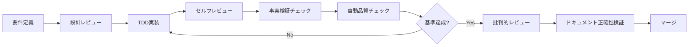

# CLAUDE.md

This file provides guidance to Claude Code (claude.ai/code) when working with code in this repository.

## Project Status Overview

**Project**: A2A MVP - Test-Driven Development
**Status**: ✅ Implementation Complete
**Coverage**: 91.77% ✅
**Tests**: 84 tests, 100% passing
**Quality**: Flake8 0 violations, Black formatted

## 🚨 IMPORTANT: Essential Knowledge Documents

**When starting ANY work on this project, ALWAYS load these documents in order:**

### 1. Mandatory Compliance Rules (MUST READ FIRST)
1. **[memory-bank/user_authorization_mandatory_rules.md](memory-bank/user_authorization_mandatory_rules.md)** - ユーザー承認必須ルール（絶対遵守）
2. **[memory-bank/testing_mandatory_rules.md](memory-bank/testing_mandatory_rules.md)** - 自動化機能テスト必須化ルール
3. **[memory-bank/code_quality_anti_hacking_rules.md](memory-bank/code_quality_anti_hacking_rules.md)** - 品質指標アンチハッキング・ルール（絶対遵守）

### 2. Core Development Knowledge
3. **[memory-bank/tdd_implementation_knowledge.md](memory-bank/tdd_implementation_knowledge.md)** - TDD実践の具体的手法
4. **[memory-bank/generic_tdd_patterns.md](memory-bank/generic_tdd_patterns.md)** - 汎用的なTDDパターン
5. **[memory-bank/development_workflow_rules.md](memory-bank/development_workflow_rules.md)** - 開発ワークフロー

### 3. Project Specific Knowledge
6. **[memory-bank/a2a_protocol_implementation_rules.md](memory-bank/a2a_protocol_implementation_rules.md)** - A2Aプロトコル実装仕様
7. **[memory-bank/ci_cd_optimization_rules.md](memory-bank/ci_cd_optimization_rules.md)** - CI/CD設定と最適化

### 4. Quality Assurance & Documentation Accuracy
8. **[memory-bank/critical_review_framework.md](memory-bank/critical_review_framework.md)** - 批判的レビューフレームワーク
9. **[memory-bank/a2a_critical_review.md](memory-bank/a2a_critical_review.md)** - プロジェクトレビュー結果

### 5. Architecture Documentation
10. **[docs/02.basic_design/a2a_architecture.md](docs/02.basic_design/a2a_architecture.md)** - システムアーキテクチャ設計
11. **[docs/03.detail_design/a2a_tdd_implementation.md](docs/03.detail_design/a2a_tdd_implementation.md)** - TDD実装の詳細記録

### 6. System Configuration & Tools
12. **[docs/90.references/git_hooks_specification.md](docs/90.references/git_hooks_specification.md)** - Gitフック仕様とトラブルシューティング
13. **[memory-bank/project_reproduction_checklist.md](memory-bank/project_reproduction_checklist.md)** - プロジェクト再現手順

## 🚨 CRITICAL: Documentation Accuracy Rules (ABSOLUTE COMPLIANCE)

### 事実ベース記載の強制原則

#### 1. 記載前必須チェック（絶対実行）
```bash
# コマンド記載前の必須確認
less Makefile                # Makeターゲット確認（直接ファイル確認）
python scripts/script.py --help  # スクリプト動作確認
ls -la path/to/file         # ファイル存在確認

# 数値記載前の必須確認
pytest --cov=app | grep TOTAL  # カバレッジ実測値取得
time command                    # パフォーマンス実測
```

#### 2. 禁止事項（絶対遵守）
- ❌ 未確認のコマンド記載
- ❌ 推測による数値記載  
- ❌ 憶測による機能説明
- ❌ 根拠なき性能主張

#### 3. 必須記載パターン
```markdown
# ✅ 正しい記載例
**実測値**: 91.77%（pytest --cov実行結果: 2024-12-XX）
**コマンド確認済み**: make up（Makefile:35行目で確認）
**解釈**: 上記データから、業界平均を上回ると判断される
```

#### 4. 自動検証の実行（コミット前必須）
```bash
# ドキュメント正確性チェック
python scripts/verify_accuracy.py
python scripts/critical_documentation_review.py --target README.md
```

#### 5. Gitフック自動実行（コミット時）
プロジェクトのGitフックが以下を自動実行:
1. **セキュリティチェック**: 機密情報の検出・ブロック
2. **ユーザー認証チェック**: 無許可変更の防止
3. **ドキュメント正確性検証**: 記載内容の事実確認
4. **批判的レビュー**: README.md変更時の品質確認

**トラブル時の対処**: [Gitフック仕様書](docs/90.references/git_hooks_specification.md)を参照

## 🔄 Development Workflow (MUST FOLLOW)

### Enhanced Development Flow with Accuracy Verification


### Critical Review Points
1. **汎用性**: 他プロジェクトへの転用可能性
2. **再現性**: ゼロから同品質を再現可能か
3. **保守性**: 6ヶ月後の他者による修正容易性
4. **拡張性**: 新機能追加の容易性
5. **セキュリティ**: 脆弱性対策の網羅性

## Project Architecture (MUST FOLLOW)

### Layer Structure and Dependencies
```
app/a2a_mvp/
├── core/           # Business entities (NO dependencies)
│   ├── types.py    # Task, TaskRequest, TaskResponse
│   └── exceptions.py # Custom exceptions
├── storage/        # Data persistence (depends on: core)
│   ├── interface.py # Abstract storage interface
│   └── memory.py   # In-memory implementation
├── skills/         # Business logic (depends on: core, storage)
│   ├── base.py     # Base skill class
│   └── task_skills.py # Task management logic
├── agents/         # A2A agents (depends on: ALL layers)
│   ├── base.py     # Base agent class
│   └── task_agent.py # Task management agent
└── server/         # API server (depends on: agents)
    └── app.py      # FastAPI application
```

**CRITICAL RULE**: Dependencies flow in ONE direction only (bottom to top)

## TDD Implementation Process (MANDATORY)

### Red-Green-Refactor Cycle
1. **Red Phase (5-10 min)**: Write failing test FIRST
   ```python
   def test_new_feature():
       # Test for non-existent code
       result = feature_that_doesnt_exist()
       assert result == expected
   ```

2. **Green Phase (10-15 min)**: Minimal implementation
   ```python
   def feature_that_doesnt_exist():
       return expected  # Just make it pass
   ```

3. **Refactor Phase (5-10 min)**: Improve quality
   - Extract methods if complexity > 10
   - Add type hints
   - Improve naming

### Test Structure Requirements
```python
class TestFeature:
    @pytest.fixture
    def mock_dependency(self):
        return Mock(spec=DependencyInterface)
    
    def test_success_case(self, mock_dependency):
        # Given: Setup
        # When: Action
        # Then: Assert
    
    def test_error_case(self, mock_dependency):
        # Test error handling
    
    def test_edge_case(self, mock_dependency):
        # Test boundaries
```

## Quality Standards (NON-NEGOTIABLE)

### Before EVERY Commit
```bash
# 1. Documentation accuracy verification (MANDATORY)
python scripts/verify_accuracy.py
python scripts/critical_documentation_review.py --target README.md

# 2. Code quality gate check
python scripts/quality_gate_check.py

# 3. Individual checks if needed
pytest --cov=app --cov-fail-under=85
flake8 app/ tests/ --max-complexity=10
black app/ tests/ --line-length=79
isort app/ tests/
mypy app/ --ignore-missing-imports
```

### Coverage Requirements
- Overall: ≥85% (currently 91.77%)
- Core modules: ≥95%
- New code: ≥90%
- Per file: ≥50%

## Generic Implementation Patterns (USE THESE)

### 1. Result Type Pattern (Language Agnostic)
```python
class Result:
    @classmethod
    def ok(cls, value):
        return cls(success=True, value=value)
    
    @classmethod
    def fail(cls, error):
        return cls(success=False, error=error)

# Usage
def divide(a, b):
    if b == 0:
        return Result.fail("Division by zero")
    return Result.ok(a / b)
```

### 2. Action Map Pattern (Complexity Reduction)
```python
class Handler:
    def __init__(self):
        self._actions = {
            "create": self._handle_create,
            "update": self._handle_update,
            "delete": self._handle_delete,
        }
    
    def handle(self, action, data):
        handler = self._actions.get(action)
        if not handler:
            return Result.fail(f"Unknown action: {action}")
        return handler(data)
```

### 3. Dependency Injection Pattern
```python
class Service:
    def __init__(self, repository: RepositoryInterface):
        self._repository = repository  # Testable
    
    def process(self, data):
        return self._repository.save(data)
```

## A2A Protocol Requirements

### Agent Card Structure
```python
{
    "name": "Task Manager Agent",
    "version": "1.0.0",
    "description": "Manages TODO tasks with full CRUD operations",
    "capabilities": {
        "request_response": True,
        "streaming": False,
        "batch": True
    },
    "skills": [
        {
            "id": "create_task",
            "name": "Create Task",
            "description": "Create a new TODO task",
            "tags": ["task", "create", "todo"],
            "examples": ["Create task 'Buy groceries'"]
        }
    ]
}
```

### Message Format
```python
# Request
{
    "action": "create",
    "data": {"title": "Task title"},
    "task_id": "optional-for-specific-actions"
}

# Response
{
    "success": true,
    "data": {"task": {...}},
    "error": null
}
```

## Security Rules (ABSOLUTE)

### Never Expose Secrets
```bash
# ❌ FORBIDDEN
cat .env
echo $API_KEY
grep -r "API" .env

# ✅ ALLOWED
[ -f .env ] && echo "exists"
wc -l .env
```

### Input Validation (MUST IMPLEMENT)
```python
from pydantic import BaseModel, validator

class TaskCreateModel(BaseModel):
    title: str = Field(..., min_length=1, max_length=200)
    description: Optional[str] = Field(None, max_length=2000)
    
    @validator('title')
    def validate_title(cls, v):
        if not v.strip():
            raise ValueError('Title cannot be empty')
        # Check for malicious patterns
        if re.search(r'[<>\"\'`;]', v):
            raise ValueError('Invalid characters in title')
        return v.strip()
```

## Critical Review Checklist

### Before Merging ANY Code
- [ ] **Reproducibility**: Can someone recreate this from scratch?
- [ ] **Genericity**: Can this be used in other projects?
- [ ] **Maintainability**: Will this be understandable in 6 months?
- [ ] **Scalability**: Can this handle 10x load?
- [ ] **Security**: Are all inputs validated?
- [ ] **Documentation**: Is the intent clear?
- [ ] **Test Quality**: Do tests specify behavior, not implementation?

## Common Commands Reference

### Development
```bash
# Environment setup
poetry install
poetry shell

# Run server
uvicorn app.a2a_mvp.server.app:app --reload

# Run specific tests
pytest tests/unit/test_skills/test_task_skills.py -v
pytest -k "test_create_task"

# Generate coverage report
pytest --cov=app --cov-report=html
open htmlcov/index.html
```

### Quality Checks
```bash
# Full quality check
python scripts/quality_gate_check.py

# Individual tools
flake8 app/ tests/ --statistics
black app/ tests/ --check --diff
isort app/ tests/ --check-only --diff
mypy app/ --show-error-codes
radon cc app/ -a  # Cyclomatic complexity
bandit -r app/    # Security scan
```

### Docker
```bash
make              # Start development environment
make bash         # Access container shell
# Note: test commands use pytest directly
make clean        # Clean up everything
```

## Performance Benchmarks

### Target Metrics
- Response time: <50ms (currently ~12ms)
- Throughput: >1000 req/s
- Memory usage: <100MB per agent
- Startup time: <2s

### Optimization Patterns
1. Pre-compute action maps at startup
2. Use async/await for I/O operations
3. Implement caching where appropriate
4. Batch database operations

## Troubleshooting Guide

### Common Issues

1. **Import Errors**
   - Check PYTHONPATH includes project root
   - Verify `__init__.py` files exist
   - Run from project root: `python -m app.a2a_mvp.server.app`

2. **Test Failures**
   - Check fixtures are properly scoped
   - Verify mocks match interfaces
   - Look for state leakage between tests

3. **Coverage Drops**
   - Run coverage report: `pytest --cov=app --cov-report=term-missing`
   - Focus on uncovered lines
   - Add tests for error cases

4. **Complexity Errors**
   - Extract methods from complex functions
   - Use action map pattern
   - Apply strategy pattern for many conditions

## Project Improvement Roadmap

### Immediate (1-2 weeks)
- [ ] Add Pydantic for input validation
- [ ] Implement async handlers
- [ ] Add performance benchmarks
- [ ] Create interactive tutorial

### Short-term (1-2 months)
- [ ] Extract generic agent framework
- [ ] Add authentication/authorization
- [ ] Implement PostgreSQL storage
- [ ] Add WebSocket support

### Long-term (3-6 months)
- [ ] Microservice architecture
- [ ] Kubernetes deployment
- [ ] Multi-agent orchestration
- [ ] AI/ML integration

## 🚨 Final Reminders

1. **Always write tests first** - No exceptions
2. **Run quality checks before commit** - Save CI time
3. **Think generic** - Will this work elsewhere?
4. **Document why, not what** - Code shows what
5. **Review critically** - Question everything

---

**Remember**: Quality is not negotiable. When in doubt, write a test!