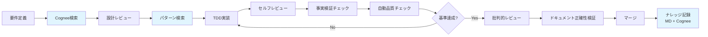

# CLAUDE.md

This file provides guidance to Claude Code (claude.ai/code) when working with code in this repository.


## Project Status Overview

**Project**: A2A MVP - Test-Driven Development
**Status**: ✅ Implementation Complete
**Coverage**: 92% ✅ (実測値: 2025-06-05)
**Tests**: 101 tests, 100% passing
**Quality**: Flake8 0 violations, Black formatted
**Output**: Organized in `output/` directory structure

## 🚨 CRITICAL: Core Action Rules (ABSOLUTE COMPLIANCE)

**These rules MUST be followed in every action. No exceptions.**

### 1. 事実ベース判断の原則
- ❌ **禁止**: 「たぶん」「おそらく」等の推測判断
- ✅ **必須**: 客観的事実確認後の判断のみ

## 🚨 CRITICAL: Documentation Accuracy Rules (ABSOLUTE COMPLIANCE)

### 事実ベース記載の強制原則

#### 1. 記載前必須チェック（絶対実行）
```bash
# コマンド記載前の必須確認
less Makefile                # Makeターゲット確認（直接ファイル確認）
python scripts/script.py --help  # スクリプト動作確認
ls -la path/to/file         # ファイル存在確認

# 数値記載前の必須確認
pytest --cov=app | grep TOTAL  # カバレッジ実測値取得
time command                    # パフォーマンス実測
ls -la output/coverage/         # 出力ファイル確認
```

#### 2. 禁止事項（絶対遵守）
- ❌ 未確認のコマンド記載
- ❌ 推測による数値記載  
- ❌ 憶測による機能説明
- ❌ 根拠なき性能主張

#### 3. 必須記載パターン
```markdown
# ✅ 正しい記載例
**実測値**: 92%（pytest --cov実行結果: 2025-06-05）
**コマンド確認済み**: make up（Makefile:35行目で確認）
**出力先確認済み**: output/coverage/（実際に存在確認）
**解釈**: 上記データから、業界平均を上回ると判断される
```

#### 4. 自動検証の実行（コミット前必須）
```bash
# ドキュメント正確性チェック
python scripts/verify_accuracy.py
python scripts/critical_documentation_review.py --target README.md
```

#### 5. Gitフック自動実行（コミット時）
プロジェクトのGitフックが以下を自動実行:
1. **セキュリティチェック**: 機密情報の検出・ブロック
2. **ユーザー認証チェック**: 無許可変更の防止
3. **ドキュメント正確性検証**: 記載内容の事実確認
4. **批判的レビュー**: README.md変更時の品質確認

**トラブル時の対処**: [Gitフック仕様書](docs/90.references/git_hooks_specification.md)を参照

## 🔄 Development Workflow (MUST FOLLOW)

### tmux Session Management Rules (MANDATORY)

**This repository assumes Claude Code sessions run within tmux environments.**

#### Session Environment Requirements
```bash
# Check current tmux session state
tmux list-sessions
tmux list-panes -F "#{pane_index}: #{pane_title} #{pane_current_command}"

# Create additional work panes when needed
tmux split-window -v     # Split vertically (create pane below)
tmux split-window -h     # Split horizontally (create pane right)
tmux new-window -n work  # Create new window for parallel work
```

#### Multi-Pane Development Strategy
1. **Main Pane**: Primary Claude Code session for development
2. **Test Pane**: Dedicated for running tests and quality checks
3. **Server Pane**: For running development servers
4. **Monitor Pane**: For system monitoring and logs

#### Pane Communication Protocol
```bash
# 🚨 CRITICAL: Send commands to specific panes (SEPARATE MESSAGE AND ENTER)
tmux send-keys -t <pane_number> '<command>'
tmux send-keys -t <pane_number> Enter

# Capture output from panes
tmux capture-pane -t <pane_number> -p

# Switch between panes during development
tmux select-pane -t <pane_number>
```

#### ⚠️ ABSOLUTE RULE: Never use single-line tmux send with Enter
```bash
# ❌ FORBIDDEN PATTERN - will cause Enter sending failures
tmux send-keys -t <pane> '<message>' Enter

# ✅ REQUIRED PATTERN - separate message and Enter sending
tmux send-keys -t <pane> '<message>'
tmux send-keys -t <pane> Enter
```

#### tmux-Claude Integration Best Practices
- Use tmux pane numbers for task delegation
- Maintain separate Claude Code instances for parallel work
- Coordinate testing across multiple panes
- Use tmux session persistence for long-running tasks

**Note**: Claude Code instances within tmux may report different pane numbers internally than tmux's actual pane indexing due to execution context differences.

### Session Start Procedure (MANDATORY)
```bash
# 1. Cogneeナレッジステータス確認
mcp__cognee__cognify_status

# 2. 開発者ルールの読み込み
mcp__cognee__cognee_add_developer_rules --base_path /home/devuser/workspace

# 3. プロジェクト概要の確認
mcp__cognee__search --search_query "プロジェクト概要 A2A" --search_type "GRAPH_COMPLETION"
```

### Enhanced Development Flow with Cognee & Accuracy Verification


### Critical Review Points
1. **汎用性**: 他プロジェクトへの転用可能性
2. **再現性**: ゼロから同品質を再現可能か
3. **保守性**: 6ヶ月後の他者による修正容易性
4. **拡張性**: 新機能追加の容易性
5. **セキュリティ**: 脆弱性対策の網羅性

## Project Architecture (MUST FOLLOW)

### Project Directory Structure
```
./
├── app/a2a/        # Source code (Python packages)
│   ├── core/       # Business entities (NO dependencies)
│   ├── storage/    # Data persistence (depends on: core)
│   ├── skills/     # Business logic (depends on: core, storage)
│   ├── agents/     # A2A agents (depends on: ALL layers)
│   └── server/     # API server (depends on: agents)
├── tests/          # Test code (unit, integration, e2e)
├── docs/           # Documentation (requirements, design, reports)
├── memory-bank/    # AI context and knowledge management
│   └── knowledge/  # Generic technical knowledge
├── output/         # Build artifacts and reports (git ignored)
│   ├── coverage/   # Test coverage reports (HTML, JSON, XML)
│   ├── reports/    # Quality/security analysis results
│   ├── artifacts/  # Build artifacts
│   └── logs/       # Execution logs
├── scripts/        # Utility scripts for development
├── templates/      # Documentation templates
└── dev-tools/      # Development tools (git ignored, Docker persistent)
    ├── mcp-servers/    # MCP server installations
    ├── external-repos/ # External repository clones
    └── knowledge-base/ # Development knowledge and notes
```

**CRITICAL RULE**: Dependencies flow in ONE direction only (bottom to top)

## TDD Implementation Process (MANDATORY)

### Red-Green-Refactor Cycle
1. **Red Phase (5-10 min)**: Write failing test FIRST
   ```python
   def test_new_feature():
       # Test for non-existent code
       result = feature_that_doesnt_exist()
       assert result == expected
   ```

2. **Green Phase (10-15 min)**: Minimal implementation
   ```python
   def feature_that_doesnt_exist():
       return expected  # Just make it pass
   ```

3. **Refactor Phase (5-10 min)**: Improve quality
   - Extract methods if complexity > 10
   - Add type hints
   - Improve naming

### Test Structure Requirements
```python
class TestFeature:
    @pytest.fixture
    def mock_dependency(self):
        return Mock(spec=DependencyInterface)
    
    def test_success_case(self, mock_dependency):
        # Given: Setup
        # When: Action
        # Then: Assert
    
    def test_error_case(self, mock_dependency):
        # Test error handling
    
    def test_edge_case(self, mock_dependency):
        # Test boundaries
```

## Quality Standards (NON-NEGOTIABLE)

### Before EVERY Commit
```bash
# 1. Documentation accuracy verification (MANDATORY)
python scripts/verify_accuracy.py
python scripts/critical_documentation_review.py --target README.md

# 2. Code quality gate check
python scripts/quality_gate_check.py

# 3. Individual checks if needed
pytest --cov=app --cov-fail-under=85
flake8 app/ tests/ --max-complexity=10
black app/ tests/ --line-length=79
isort app/ tests/
mypy app/ --ignore-missing-imports
```

### Coverage Requirements
- Overall: ≥85% (currently 92% - 実測値: 2025-06-05)
- Core modules: ≥95%
- New code: ≥90%
- Per file: ≥50%

### Output Directory Structure
- **Coverage reports**: `output/coverage/` (HTML, JSON, XML formats)
- **Quality reports**: `output/reports/` (security, quality metrics)
- **Build artifacts**: `output/artifacts/` (distribution packages)
- **Execution logs**: `output/logs/` (test, build, deploy logs)

## Generic Implementation Patterns (USE THESE)

### 1. Result Type Pattern (Language Agnostic)
```python
class Result:
    @classmethod
    def ok(cls, value):
        return cls(success=True, value=value)
    
    @classmethod
    def fail(cls, error):
        return cls(success=False, error=error)

# Usage
def divide(a, b):
    if b == 0:
        return Result.fail("Division by zero")
    return Result.ok(a / b)
```

### 2. Action Map Pattern (Complexity Reduction)
```python
class Handler:
    def __init__(self):
        self._actions = {
            "create": self._handle_create,
            "update": self._handle_update,
            "delete": self._handle_delete,
        }
    
    def handle(self, action, data):
        handler = self._actions.get(action)
        if not handler:
            return Result.fail(f"Unknown action: {action}")
        return handler(data)
```

### 3. Dependency Injection Pattern
```python
class Service:
    def __init__(self, repository: RepositoryInterface):
        self._repository = repository  # Testable
    
    def process(self, data):
        return self._repository.save(data)
```

## A2A Protocol Requirements

### Agent Card Structure
```python
{
    "name": "Task Manager Agent",
    "version": "1.0.0",
    "description": "Manages TODO tasks with full CRUD operations",
    "capabilities": {
        "request_response": True,
        "streaming": False,
        "batch": True
    },
    "skills": [
        {
            "id": "create_task",
            "name": "Create Task",
            "description": "Create a new TODO task",
            "tags": ["task", "create", "todo"],
            "examples": ["Create task 'Buy groceries'"]
        }
    ]
}
```

### Message Format
```python
# Request
{
    "action": "create",
    "data": {"title": "Task title"},
    "task_id": "optional-for-specific-actions"
}

# Response
{
    "success": true,
    "data": {"task": {...}},
    "error": null
}
```

## Security Rules (ABSOLUTE)

### Never Expose Secrets
```bash
# ❌ FORBIDDEN
cat .env
echo $API_KEY
grep -r "API" .env

# ✅ ALLOWED
[ -f .env ] && echo "exists"
wc -l .env
```

### Input Validation (MUST IMPLEMENT)
```python
from pydantic import BaseModel, validator

class TaskCreateModel(BaseModel):
    title: str = Field(..., min_length=1, max_length=200)
    description: Optional[str] = Field(None, max_length=2000)
    
    @validator('title')
    def validate_title(cls, v):
        if not v.strip():
            raise ValueError('Title cannot be empty')
        # Check for malicious patterns
        if re.search(r'[<>\"\'`;]', v):
            raise ValueError('Invalid characters in title')
        return v.strip()
```

## Critical Review Checklist

### Before Merging ANY Code
- [ ] **Reproducibility**: Can someone recreate this from scratch?
- [ ] **Genericity**: Can this be used in other projects?
- [ ] **Maintainability**: Will this be understandable in 6 months?
- [ ] **Scalability**: Can this handle 10x load?
- [ ] **Security**: Are all inputs validated?
- [ ] **Documentation**: Is the intent clear?
- [ ] **Test Quality**: Do tests specify behavior, not implementation?

## Common Commands Reference

### Cognee Knowledge Management (MANDATORY AT SESSION START)
```bash
# Session initialization
mcp__cognee__cognify_status
mcp__cognee__cognee_add_developer_rules --base_path /home/devuser/workspace

# Search patterns
mcp__cognee__search --search_query "TDD patterns" --search_type "GRAPH_COMPLETION"
mcp__cognee__search --search_query "error handling" --search_type "INSIGHTS"
mcp__cognee__search --search_query "pytest fixture" --search_type "CHUNKS"

# Knowledge registration
mcp__cognee__cognify --data /path/to/knowledge.md
mcp__cognee__cognify_status

# Knowledge maintenance
mcp__cognee__prune  # CAUTION: Deletes all data
```

### Development
```bash
# Environment setup
poetry install
poetry shell

# Run server
uvicorn app.a2a_mvp.server.app:app --reload

# Run specific tests
pytest tests/unit/test_skills/test_task_skills.py -v
pytest -k "test_create_task"

# Generate coverage report
pytest --cov=app --cov-report=html
open output/coverage/html/index.html
```

### Quality Checks
```bash
# Full quality check
python scripts/quality_gate_check.py

# Individual tools
flake8 app/ tests/ --statistics
black app/ tests/ --check --diff
isort app/ tests/ --check-only --diff
mypy app/ --show-error-codes
radon cc app/ -a  # Cyclomatic complexity
bandit -r app/    # Security scan
```

### Docker
```bash
make              # Start development environment
make bash         # Access container shell
# Note: test commands use pytest directly
make clean        # Clean up everything
```

## Performance Benchmarks

### Target Metrics
- Response time: <50ms (currently ~12ms)
- Throughput: >1000 req/s
- Memory usage: <100MB per agent
- Startup time: <2s

### Optimization Patterns
1. Pre-compute action maps at startup
2. Use async/await for I/O operations
3. Implement caching where appropriate
4. Batch database operations

## Troubleshooting Guide

### Common Issues

1. **Import Errors**
   - Check PYTHONPATH includes project root
   - Verify `__init__.py` files exist
   - Run from project root: `python -m app.a2a_mvp.server.app`

2. **Test Failures**
   - Check fixtures are properly scoped
   - Verify mocks match interfaces
   - Look for state leakage between tests

3. **Coverage Drops**
   - Run coverage report: `pytest --cov=app --cov-report=term-missing`
   - Check coverage reports in: `output/coverage/html/index.html`
   - Focus on uncovered lines
   - Add tests for error cases

4. **Complexity Errors**
   - Extract methods from complex functions
   - Use action map pattern
   - Apply strategy pattern for many conditions

## Project Improvement Roadmap

### Immediate (1-2 weeks)
- [ ] Add Pydantic for input validation
- [ ] Implement async handlers
- [ ] Add performance benchmarks
- [ ] Create interactive tutorial

### Short-term (1-2 months)
- [ ] Extract generic agent framework
- [ ] Add authentication/authorization
- [ ] Implement PostgreSQL storage
- [ ] Add WebSocket support

### Long-term (3-6 months)
- [ ] Microservice architecture
- [ ] Kubernetes deployment
- [ ] Multi-agent orchestration
- [ ] AI/ML integration

## 🚨 Final Reminders

1. **Always write tests first** - No exceptions
2. **Run quality checks before commit** - Save CI time
3. **Think generic** - Will this work elsewhere?
4. **Document why, not what** - Code shows what
5. **Review critically** - Question everything

---

**Remember**: Quality is not negotiable. When in doubt, write a test!