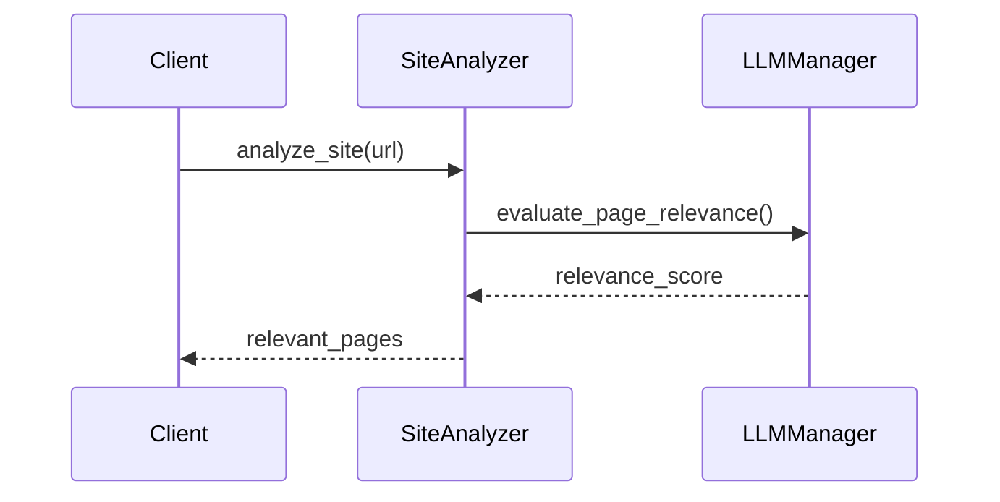
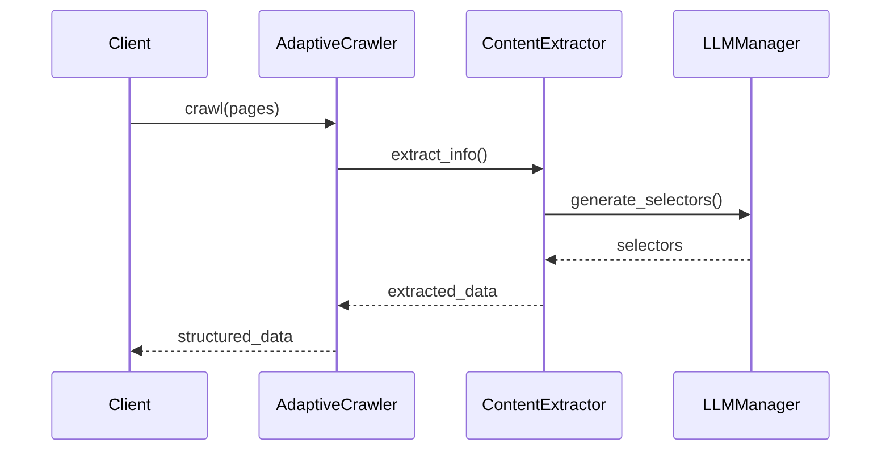

# AdaptiveCrawler 詳細設計書

## 1. システム概要

### 1.1 目的
任意の企業HPから企業情報を自動的に抽出するシステム

### 1.2 機能概要
- サイト構造の自動解析
- 企業情報ページの特定
- 情報の抽出と構造化
- エラー処理とリカバリー

## 2. システム構成

### 2.1 主要コンポーネント

#### 2.1.1 SiteAnalyzer
- 役割：サイト構造の解析とページの分類
- 主な機能：
  - サイトマップの解析
  - ナビゲーション構造の解析
  - 企業情報関連ページの特定

#### 2.1.2 AdaptiveCrawler
- 役割：情報収集の実行と制御
- 主な機能：
  - クロール処理の実行
  - 並行処理の制御
  - キャッシュ管理
  - エラー処理

#### 2.1.3 ContentExtractor
- 役割：ページからの情報抽出
- 主な機能：
  - HTML解析
  - 情報抽出
  - データ構造化

#### 2.1.4 LLMManager
- 役割：LLMを使用した解析と判断
- 主な機能：
  - ページの関連性評価
  - 情報抽出のためのセレクタ生成
  - 抽出データの検証

### 2.2 データフロー

1. サイト構造解析フェーズ


2. 情報抽出フェーズ


## 3. 詳細仕様

### 3.1 SiteAnalyzer

#### 3.1.1 サイト構造解析
```python
async def analyze_site_structure(url: str) -> Dict[str, Any]:
    """
    サイト構造を解析
    
    Args:
        url: トップページのURL
    
    Returns:
        解析結果の辞書
        {
            'sitemap': サイトマップ情報,
            'navigation': ナビゲーション構造,
            'relevant_pages': 関連ページリスト
        }
    """
```

#### 3.1.2 ページ評価
```python
async def evaluate_page(url: str, content: str) -> float:
    """
    ページの関連性を評価
    
    Args:
        url: ページのURL
        content: ページのコンテンツ
    
    Returns:
        関連性スコア（0.0-1.0）
    """
```

### 3.2 ContentExtractor

#### 3.2.1 情報抽出
```python
async def extract_info(
    html: str,
    target_info: Dict[str, str]
) -> Dict[str, str]:
    """
    HTMLから情報を抽出
    
    Args:
        html: HTML文字列
        target_info: 抽出対象の情報
    
    Returns:
        抽出された情報の辞書
    """
```

### 3.3 LLMManager

#### 3.3.1 ページ評価プロンプト
```
以下のHTMLコンテンツを分析し、企業情報ページとしての関連性を評価してください。

評価基準：
1. URLパターン（/company/, /about/等）
2. ページタイトル
3. メタ情報
4. コンテンツ内の企業情報関連キーワード

結果は0.0-1.0のスコアで返してください。
```

#### 3.3.2 セレクタ生成プロンプト
```
以下のHTMLから企業情報を抽出するためのCSSセレクタを生成してください。

抽出対象：
- 会社名
- 設立日
- 事業内容
- etc.

結果はJSON形式で返してください。
```

## 4. エラー処理

### 4.1 想定されるエラー
1. ネットワークエラー
2. ページ不存在（404）
3. アクセス制限（403）
4. レート制限
5. 情報抽出失敗

### 4.2 エラー処理戦略
1. リトライ処理
   - 指数バックオフ
   - 最大リトライ回数の制限

2. 代替手段
   - 別URLからの情報収集
   - キャッシュデータの利用

3. エラーログ
   - エラー内容の記録
   - コンテキスト情報の保存

## 5. パフォーマンス考慮事項

### 5.1 並行処理
- 同時リクエスト数の制限
- セマフォによる制御
- コネクションプールの管理

### 5.2 キャッシュ戦略
- インメモリキャッシュ
- TTLベースの有効期限管理
- キャッシュサイズの制限

### 5.3 リソース制限
- メモリ使用量の制限
- CPU使用率の監視
- ネットワーク帯域の制御

## 6. 監視と運用

### 6.1 監視項目
- クロール成功率
- 情報抽出成功率
- 処理時間
- エラー発生率
- リソース使用率

### 6.2 ログ管理
- ログレベル
  - DEBUG: 詳細な処理情報
  - INFO: 主要な処理の開始・完了
  - WARNING: 軽微な問題
  - ERROR: 重大な問題

- ログ形式
```json
{
    "timestamp": "ISO8601形式の時刻",
    "level": "ログレベル",
    "component": "コンポーネント名",
    "message": "メッセージ",
    "context": {
        "url": "処理対象URL",
        "error": "エラー情報（該当する場合）",
        "duration": "処理時間"
    }
}
```

## 7. テスト戦略

### 7.1 単体テスト
- 各コンポーネントの機能テスト
- モックを使用した依存関係の分離
- エラーケースの網羅的テスト

### 7.2 統合テスト
- コンポーネント間の連携テスト
- 実際のウェブサイトを使用したE2Eテスト
- パフォーマンステスト

### 7.3 テストデータ
- モックレスポンスの準備
- 実際のウェブサイトのスナップショット
- エラーケース用のデータ 