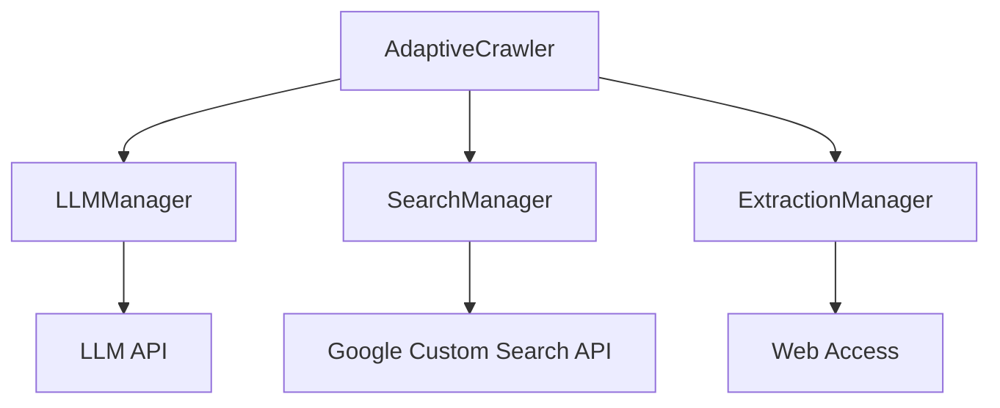
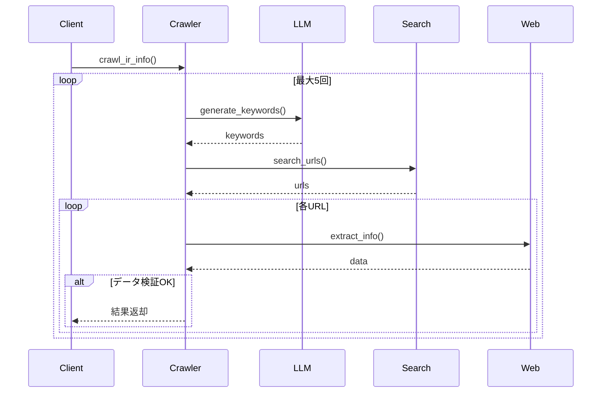
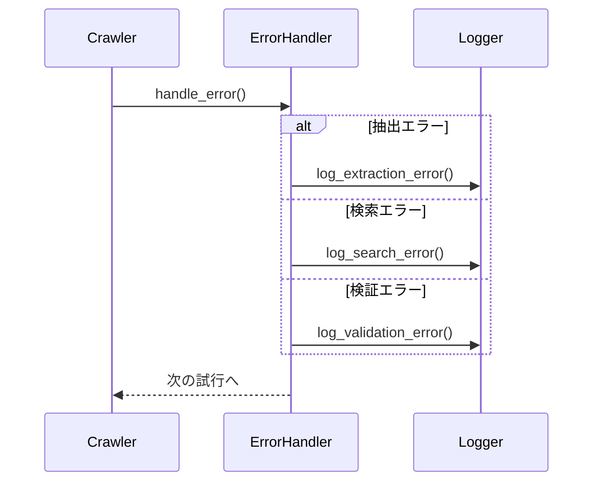

# 適応的検索機能基本設計

## 1. システム構成

### 1.1 コンポーネント構成


### 1.2 主要クラス
- AdaptiveCrawler: クローリング制御
- LLMManager: LLM操作
- SearchManager: 検索制御
- ExtractionManager: 情報抽出

## 2. 処理フロー

### 2.1 メイン処理フロー


### 2.2 エラーハンドリングフロー


## 3. データ構造

### 3.1 検索キーワード
```python
class SearchKeywords:
    keywords: List[str]
    priority: float
    context: Dict[str, Any]
```

### 3.2 検索結果
```python
class SearchResult:
    url: str
    title: str
    snippet: str
    score: float
```

### 3.3 抽出データ
```python
class ExtractedData:
    data: Dict[str, Any]
    metadata: Dict[str, Any]
    validation_score: float
```

## 4. インターフェース設計

### 4.1 LLMインターフェース
```python
class LLMInterface:
    async def generate_keywords(
        self,
        target_info: Dict[str, Any],
        attempt: int
    ) -> List[str]

    async def validate_data(
        self,
        data: Dict[str, Any],
        expected: Dict[str, Any]
    ) -> bool
```

### 4.2 検索インターフェース
```python
class SearchInterface:
    async def search(
        self,
        keywords: List[str],
        options: Dict[str, Any]
    ) -> List[SearchResult]
```

### 4.3 抽出インターフェース
```python
class ExtractionInterface:
    async def extract(
        self,
        url: str,
        target_data: Dict[str, Any]
    ) -> ExtractedData
```

## 5. 設定パラメータ

### 5.1 タイムアウト設定
```python
TIMEOUTS = {
    "llm": 30,        # 秒
    "search": 10,     # 秒
    "extraction": 45, # 秒
    "total": 90       # 秒
}
```

### 5.2 再試行設定
```python
RETRY_CONFIG = {
    "max_attempts": 5,
    "base_delay": 2,  # 秒
    "max_delay": 32   # 秒
}
```

### 5.3 検証閾値
```python
THRESHOLDS = {
    "relevance": 0.7,
    "validation": 0.8,
    "confidence": 0.6
}
```

## 6. 監視設計

### 6.1 メトリクス
- 成功率
- 平均試行回数
- 平均レスポンス時間
- エラー発生率

### 6.2 ログレベル
- INFO: 通常の処理フロー
- WARNING: 再試行発生
- ERROR: 致命的エラー
- DEBUG: 詳細なデバッグ情報

## 7. セキュリティ設計

### 7.1 API認証
- 環境変数による認証情報管理
- キーのローテーション対応

### 7.2 アクセス制御
- レート制限の実装
- IPアドレス制限
- User-Agent制御

## 8. 運用設計

### 8.1 デプロイメント
- 段階的なロールアウト
- フォールバック手順
- バージョン管理

### 8.2 監視体制
- リアルタイムモニタリング
- アラート設定
- 定期レポート生成 