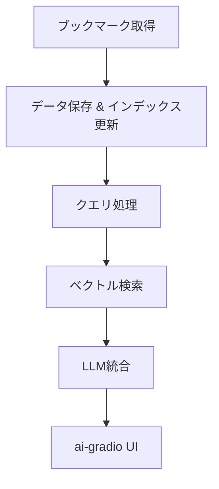

# 基本設計書

## 1. 目的
本ドキュメントは、X（旧Twitter）のブックマーク情報をリアルタイムに取得し、LLMによるRAG（Retrieval-Augmented Generation）を実現するシステムの基本設計を定義するものです。

## 2. システム全体概要
システムは以下の主要なコンポーネントで構成されます。

- **ブックマーク取得モジュール:**  
  - 正式API（OAuth2認証）または非公式手法（ヘッドレスブラウザやGraphQLリクエスト）を用いてユーザのブックマークを取得する。

- **データ保存・管理モジュール:**  
  - 取得したブックマーク情報をSQLiteなどのローカルデータベースまたはJSON形式で保存し、更新・削除・同期を管理する。

- **検索・インデックスモジュール:**  
  - 各ツイート本文をベクトル化して、ベクトル検索（Faiss や Pinecone など）やキーワード検索（BM25等）を実現する。

- **LLM連携モジュール:**  
  - 検索結果上位の関連ツイート情報を元に、Gemini 2.0 FlashをデフォルトとするLLMで回答生成や要約を実施。OpenAI GPT、Claude、もしくはローカルのOllamaホストモデルなどへの切替も可能とする。

- **ユーザインターフェース (ai-gradio):**  
  - ai-gradio を用いたWebベースのUIを構築し、ユーザが検索クエリ入力、フィルタ設定を行い、結果（ツイート一覧やLLM生成の回答）を確認できる。

## 3. アーキテクチャ設計

### 3.1 データフロー
1. **ブックマーク取得:**  
   ユーザのXアカウントからブックマークデータを取得。初回は全件取得し、その後は定期的なポーリングやイベント検知により新規データを反映する。

2. **データ保存:**  
   取得したデータは、ツイートID、本文、投稿者、日時、メディア情報などのメタデータとともにローカルDBに保存される。

3. **検索・インデックス:**  
   各ツイート本文は埋め込みベクトルに変換され、ベクトルデータベースに登録。また、キーワード検索用としてBM25等の逆引き索引も構築する。

4. **LLM連携:**  
   検索結果上位の関連ツイートをプロンプトに組み込み、LLMがユーザクエリに対する回答や要約を生成する。

5. **UI表示:**  
   ai-gradio UI は、ユーザの入力を受け付け、検索結果およびLLM生成の回答を分かりやすく表示する。

### 3.2 コンポーネント間の連携
- **API通信:**  
  - ブックマーク取得モジュールやLLM連携モジュール間のデータ交換はAPIを介して行い、認証情報は環境変数で管理する。

- **データベースアクセス:**  
  - データ保存モジュールは検索モジュールに対して効率的なクエリを提供し、必要なメタデータを供給する。

- **UI連携:**  
  - ai-gradio UIはバックエンドと非同期通信（AJAXやWebSocket）を利用し、ユーザ操作に対して迅速なレスポンスを実現する。

## 4. 各モジュールの詳細設計

### 4.1 ブックマーク取得モジュール
- **機能:**  
  ユーザのXブックマークを取得する。公式APIの場合はOAuth2認証を、非公式手法の場合はヘッドレスブラウザやGraphQLエンドポイントを利用する。

- **設計ポイント:**  
  - 認証プロセスとAPI制限への対応  
  - 取得データの正規化と統一フォーマット（JSON形式等）

### 4.2 データ保存・管理モジュール
- **機能:**  
  取得したブックマークを永続的に保存し、更新・削除・同期処理を管理する。

- **設計ポイント:**  
  - SQLite等の軽量データベースの利用  
  - ツイートIDを主キーとした整合性のあるデータ管理  
  - 定期同期機能の実装

### 4.3 検索・インデックスモジュール
- **機能:**  
  ユーザの入力に対して高速な類似検索およびキーワード検索を行う。

- **設計ポイント:**  
  - 各ツイートの自然言語テキストをベクトル化する仕組み  
  - Faiss や Pinecone 等による高速ベクトル検索  
  - BM25等の逆引き索引による補完的検索機能

### 4.4 LLM連携モジュール
- **機能:**  
  検索結果をもとにLLMへプロンプトを作成し、回答生成、要約、または分類を実施する。

- **設計ポイント:**  
  - デフォルトモデルとしてGemini 2.0 Flashの利用  
  - モデル間の切替（OpenAI GPT、Claude、Ollamaホスト）のための抽象化  
  - プロンプト設計におけるコンテキスト管理と最大トークン数の調整

### 4.5 ai-gradio UI モジュール
- **機能:**  
  ユーザからのクエリ入力、フィルタ条件の設定、検索結果およびLLM応答の表示を実現する。

- **設計ポイント:**  
  - ai-gradio を用いた直感的で操作しやすいUI設計  
  - クエリ入力、実行ボタン、結果表示エリア、フィルタ設定コンポーネントの設置  
  - 検索結果表示のためのカードまたはリスト形式のレイアウト

## 5. セキュリティおよびエラーハンドリング
- **セキュリティ:**  
  - 認証情報やAPIキーは環境変数で管理し、ソースコード内にハードコードしない  
  - 必要に応じた通信の暗号化（SSL/TLS）の実装

- **エラーハンドリング:**  
  - 各モジュールでの例外捕捉とログ出力  
  - 障害発生時のユーザへのフィードバックと自動リカバリ機能の検討

## 6. 開発環境とツール
- **プログラミング言語:** Python 3.10～3.12  
- **ライブラリ管理:** poetry  
- **テスト:** pytest による単体・統合テスト  
- **CI/CD:** GitHub Actions 等を用いた自動テストおよびデプロイ

## 7. 今後の拡張性
- 他SNS（Likes、リスト等）への対応  
- 複数LLMエンジンのシームレスな切替機能  
- ブックマーク件数の大規模化に対応するための分散型データベースへの移行検討 

## MVP基本設計
以下は、MVP用の簡易な基本設計です。

### 主要コンポーネント
1. **ブックマーク取得モジュール**: Xからブックマークを取得し、JSON形式で整形する.
2. **データ保存・インデックス化モジュール**: データをSQLiteに保存し、FAISSでベクトルインデックスを構築する.
3. **クエリ処理・検索モジュール**: ユーザクエリをEmbedding化し、ベクトル検索を実施する.
4. **LLM統合モジュール**: 検索結果とクエリを組み合わせたプロンプトでLLMに問い合わせる.
5. **ai-gradio UI モジュール**: ユーザがクエリ入力し、結果とLLMの回答を表示するUIを提供する.

### システムワークフロー
1. Xからブックマークデータを取得
2. SQLiteとFAISSにデータ保存およびインデックス更新
3. ai-gradio UIでクエリ入力
4. クエリをEmbedding化し、ベクトル検索を実施
5. 検索結果を基にLLMが回答生成
6. UIに結果と回答を表示

### アーキテクチャ概要（Mermaid）



---

# MVP 基本設計

以下は、本プロジェクトの MVP（Minimum Viable Product）として実装する基本設計です。MVP では、以下の主要機能に絞り、システム全体のワークフローと各モジュール間の連携を実現します。

---

## 主要コンポーネント

1. **ブックマーク取得モジュール**  
   - **機能:**  
     - X（旧Twitter）からブックマークを取得する。公式 API を優先しつつ、必要に応じて非公式手法も検討する。  
     - 定期的なポーリングやイベント検知により、最新ブックマークの取得を実現（リアルタイム性の確保）。
   - **実装例:**  
     - Python の `requests` や `selenium` を利用してデータを取得する。  
     - 取得したデータは JSON 形式で整形し、以降の処理へ渡す。

2. **データ保存・インデックス化モジュール**  
   - **機能:**  
     - 取得したブックマークをローカルのデータベース（SQLite など）に保存。  
     - 各ツイートの本文から Embedding を計算し、ベクトルデータベース（例：FAISS）に格納する。  
     - 新規取得時の差分更新に対応し、リアルタイム検索を可能にする。
   - **実装例:**  
     - 既存ライブラリ（例：SentenceTransformers や OpenAI の Embedding API）を用いて埋め込みを生成。  
     - FAISS を用いてベクトルインデックスを構築し、検索クエリと類似度計算を行う。

3. **クエリ処理・検索モジュール**  
   - **機能:**  
     - ユーザからの自然言語クエリを受け取り、Embedding 化してベクトル検索を実行する。  
     - 上位 N 件のブックマークを抽出し、LLM への入力として整形する。
   - **実装例:**  
     - ユーザ入力を受け付け、同様の Embedding モデルを用いてクエリベクトルを作成。  
     - ベクトル DB から類似度スコア上位の結果を取得する。

4. **LLM 統合モジュール**  
   - **機能:**  
     - 検索結果（関連ブックマーク）とユーザクエリを組み合わせたプロンプトを作成し、LLM（デフォルトは Gemini 2.0 Flash）に問い合わせる。  
     - 必要に応じて OpenAI GPT、Claude、ローカルの Ollama など他の LLM へ切替可能な設計とする。
   - **実装例:**  
     - 各 LLM の API インターフェースをラップする抽象化レイヤーを実装。  
     - ユーザが選択した LLM のエンドポイントや API キーを設定ファイルで管理。

5. **ai-gradio UI モジュール**  
   - **機能:**  
     - ユーザがクエリを入力し、検索結果および LLM からの回答を確認できるシンプルな Web UI を提供。  
     - LLM の選択、フィルタ条件（例：タグ、日時）など、柔軟なプロンプト設定をサポートする.
   - **実装例:**  
     - ai-gradio を用いて、テキスト入力、ドロップダウン、ボタンなどの UI コンポーネントを実装。  
     - 検索結果はカード形式やリスト形式で表示し、必要に応じて詳細表示やリンク遷移を実現.

---

## システムワークフロー

1. **ブックマーク取得:**  
   定期的なジョブまたは手動トリガーにより、X から最新のブックマークデータを取得する。

2. **データ保存とインデックス更新:**  
   取得したブックマークをローカルデータベースに保存し、各ツイートの埋め込みを計算、FAISS などのベクトル DB に登録する。

3. **ユーザクエリ受け付け:**  
   ai-gradio UI でユーザが検索クエリを入力。必要に応じて、LLM 選択やフィルタ条件を設定可能。

4. **ベクトル検索:**  
   クエリを Embedding 化し、ベクトル DB から関連性の高いブックマークを抽出する。

5. **LLM 応答生成:**  
   検索結果とユーザクエリを組み合わせたプロンプトを作成し、デフォルト（Gemini 2.0 Flash）またはユーザ選択の LLM に問い合わせる。

6. **結果表示:**  
   ai-gradio UI にて、関連ブックマークの一覧と LLM 生成の回答を表示する。

---

## MVP のアーキテクチャ概要（Mermaid ダイアグラム）

```mermaid
flowchart TD
    subgraph Data Acquisition
      A1[ブックマーク取得モジュール] --> A2[データ整形]
      A2 --> A3[ローカルDB & FAISSインデックス更新]
    end

    subgraph Query & Retrieval
      B1[ai-gradio UI (クエリ入力)] --> B2[クエリ処理・Embedding化]
      B2 --> B3[ベクトル検索モジュール]
      B3 --> B4[上位 N 件のブックマーク取得]
    end

    subgraph LLM Integration
      C1[プロンプト作成 (クエリ＋検索結果)] --> C2[LLM 統合モジュール]
      C2 --> C3[回答生成]
    end

    subgraph UI Output
      D1[ai-gradio UI] <-- B1
      D1 <-- C3
    end

    %% 定期更新ループ
    A3 -- 定期的更新 --> A1

    %% 全体のフロー
    B4 --> C1
