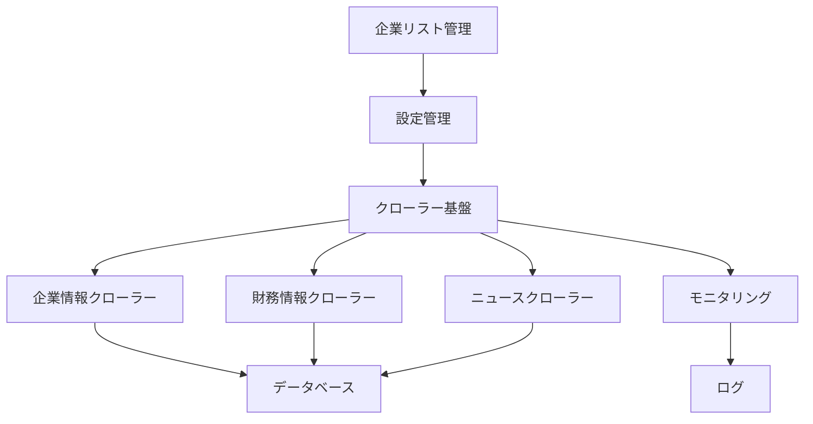

# 企業情報クローラー 基本設計書

## 1. システムアーキテクチャ

### 1.1 全体構成


### 1.2 コンポーネント構成
1. 企業リスト管理（Company List Management）
   - 企業リストの読み込み
   - 企業情報の検証
   - リストの更新管理

2. 設定管理（Configuration）
   - YAML形式の設定ファイル
   - 設定読み込みクラス
   - バリデーション機能

3. クローラー基盤（Crawler Base）
   - HTTPクライアント
   - エラーハンドリング
   - リトライ機能
   - 進捗管理
   - 並行処理制御

4. データ収集（Data Collection）
   - 企業情報クローラー
   - 財務情報クローラー
   - ニュースクローラー

5. モニタリング（Monitoring）
   - メト���クス収集
   - ログ管理
   - アラート機能

6. データ永続化（Persistence）
   - データベース管理
   - モデル定義
   - マイグレーション

## 2. モジュール設計

### 2.1 企業リスト管理モジュール
```python
class CompanyList:
    """企業リスト管理"""
    def load_company_list()
    def validate_company_info()
    def update_company_list()
    def get_target_companies()

class CompanyValidator:
    """企業情報検証"""
    def validate_company_code()
    def validate_company_url()
    def validate_company_status()
```

### 2.2 クローラー基盤モジュール
```python
class BaseCrawler:
    """クローラーの基底クラス"""
    def crawl()
    def make_request()
    def handle_error()
    def update_progress()
```

### 2.3 データモデル
```python
class Company:
    """企業情報モデル"""
    company_code: str
    name: str
    stock_exchange: str
    industry: str
    description: str

class Financial:
    """財務情報モデル"""
    company_id: int
    fiscal_year: int
    revenue: float
    operating_income: float
    net_income: float

class News:
    """ニュースモデル"""
    company_id: int
    title: str
    url: str
    published_at: datetime
    source: str
```

### 2.4 モニタリングモジュール
```python
class CrawlerMetrics:
    """クローラーのメトリクス"""
    start_time: datetime
    end_time: datetime
    status: str
    error_count: int
    warning_count: int

class CrawlerMonitor:
    """モニタリング機能"""
    def start_crawler()
    def stop_crawler()
    def log_error()
    def log_warning()
    def update_progress()
```

## 3. データフロー

### 3.1 クローリングプロセス
1. 企業リストの読み込み
2. 企業リストの検証
3. 設定ファイルの読み込み
4. 各企業に対して：
   a. 企業情報の取得
   b. 財務情報の取得
   c. ニュース情報の取得
   d. データの保存
5. モニタリング情報の更新

### 3.2 エラーハンドリングフロー
1. エラー検出
2. リトライ判断
3. エラーログ記録
4. モニタリング更新
5. 適切なエラーレスポンス

## 4. 外部インターフェース

### 4.1 グローバル設定ファイル（YAML）
```yaml
global:
  concurrent:
    max_workers: 5  # 同時実行数の最大値
    request_interval: 1.0  # リクエスト間隔（秒）
  
  update_intervals:
    company_list: 86400  # 企業リスト更新間隔（秒）
    company_info: 604800  # 企業情報更新間隔（秒）
    financial_info: 86400  # 財務情報更新間隔（秒）
    news: 3600  # ニュース更新間隔（秒）

  llm:
    default_model: "gemini-2.0-flash-exp"  # デフォルトのモデル
    available_models:  # 利用可能なモデル
      - name: "gemini-2.0-flash-exp"
        provider: "google"
        timeout: 30
        max_retries: 3
      - name: "gpt-4"
        provider: "openai"
        timeout: 30
        max_retries: 3
      - name: "claude-3-sonnet"
        provider: "anthropic"
        timeout: 30
        max_retries: 3
    
    tasks:  # タスクごとのモデル設定
      selector_generation:
        model: "gemini-2.0-flash-exp"
        temperature: 0.2
        max_tokens: 1000
      content_extraction:
        model: "gemini-2.0-flash-exp"
        temperature: 0.1
        max_tokens: 2000
      error_analysis:
        model: "gemini-2.0-flash-exp"
        temperature: 0.3
        max_tokens: 1500

  monitoring:
    log_level: "INFO"
    metrics_interval: 60  # メトリクス収集間隔（秒）
    alert_threshold:
      error_rate: 0.1  # エラー率閾値
      response_time: 5.0  # 応答時間閾値（秒）
```

### 4.2 企業リストファイル（YAML）
```yaml
company_list:
  source: "jpx"  # 企業リストのソース
  update_interval: 86400  # 更新間隔（秒）
  filters:
    markets:  # 対象市場
      - "プライム"
      - "スタンダード"
      - "グロース"
    industries:  # 対象業種
      - "小売業"
      - "サービス業"
  validation:
    timeout: 5  # 接続確認タイムアウト
    retry_count: 3  # リトライ回数
```

## 5. セキュリティ設計

### 5.1 アクセス制御
- User-Agentの適切な設定
- アクセス頻度の制限
- robots.txtの遵守

### 5.2 データ保護
- DB接続情報の環境変数管理
- エラーログの適切な保護
- センシティブ情報の管理

## 6. 監視設計

### 6.1 メトリクス
- クローリング成功率
- 実行時間
- エラー発生率
- データ取得数

### 6.2 ログレベル
- INFO: 通常の実行ログ
- WARNING: 警告情報
- ERROR: エラー情報
- DEBUG: デバッグ情報

## 7. 拡張性設計

### 7.1 新規企業の追加
1. 設定ファイルへの追加のみで対応可能
2. スクレイピングルールの柔軟な定義
3. 日付フォーマットのカスタマイズ

### 7.2 機能拡張
1. 新規クローラーの追加
2. モニタリング機能の拡張
3. データモデルの拡張 

## 8. 並行処理設計

### 8.1 同時実行制御
1. セマフォによる同時実行数の制限
2. キューによるタスク管理
3. スロットリングによるアクセス制御

### 8.2 エラー時の動作
1. 個別企業の失敗を全体に影響させない
2. リトライキューへの追加
3. エラー情報の記録と報告

### 8.3 進捗管理
1. 全体の進捗状況の追跡
2. 企業ごとの処理状態の管理
3. 中断・再開機能の提供 

## 9. LLM統合設計

### 9.1 LLMマネージャー
```python
class LLMManager:
    """LLMの管理を行うクラス"""
    def get_model(self, task: str) -> BaseLLM
    def generate_selectors(self, html: str) -> Dict[str, str]
    def extract_content(self, html: str, selectors: Dict[str, str]) -> Dict[str, Any]
    def analyze_error(self, error: Exception, context: Dict[str, Any]) -> str
```

### 9.2 LLMタスク
1. セレクター生成
   - HTMLの構造解析
   - 最適なセレクターの提案
   - セレクターの検証

2. コンテンツ抽出
   - HTMLからの情報抽出
   - データの構造化
   - 抽出結果の検証

3. エラー分析
   - エラーの原因特定
   - 解決策の提案
   - 再試行戦略の決定

### 9.3 プロンプトテンプレート
```yaml
prompts:
  selector_generation: |
    以下のHTMLから{target_data}を抽出するための最適なCSSセレクターを生成してください。
    HTMLの構造:
    {html_structure}
    
    必要な情報:
    - セレクターの種類（class, id, 属性等）
    - セレクターの具体的な指定方法
    - セレクターの一意性の確認
    
  content_extraction: |
    以下のHTMLから{target_data}を抽出し、指定された形式で構造化してください。
    HTML:
    {html_content}
    
    セレクター:
    {selectors}
    
    出力形式:
    {output_format}
    
  error_analysis: |
    以下のエラー情報を分析し、適切な対処方法を提案してください。
    エラー:
    {error_message}
    
    コンテキスト:
    {context}
    
    必要な情報:
    - エラーの根本原因
    - 推奨される解決策
    - 再試行の是非
``` 