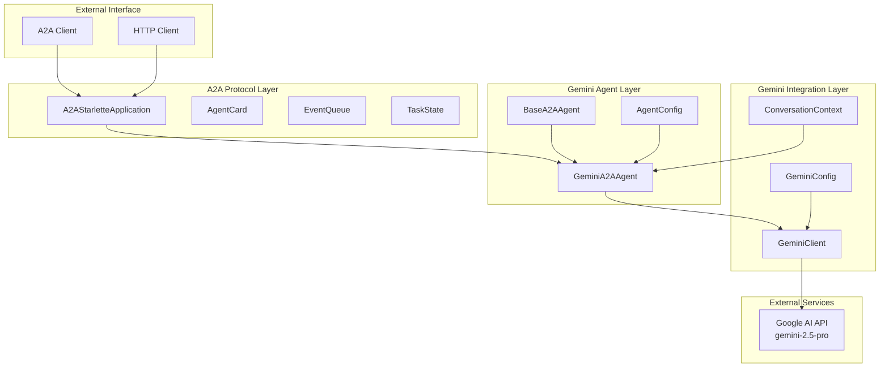
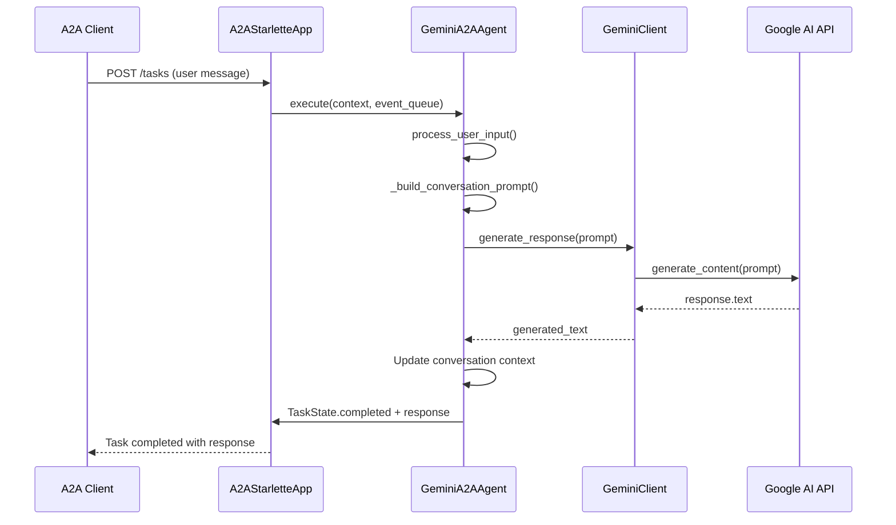
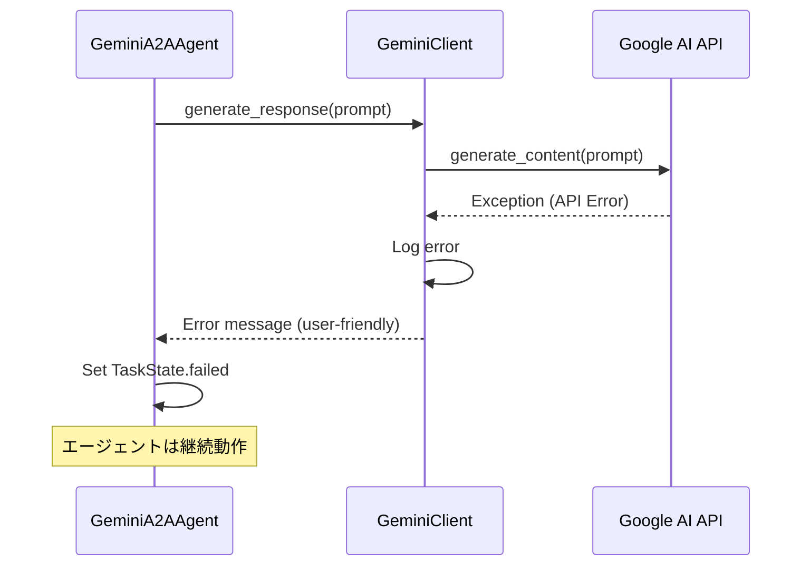

# Gemini-2.5-Pro統合A2Aエージェント - 基本設計書

## 1. システム構成

### 1.1 アーキテクチャ概要



### 1.2 コンポーネント設計

#### 1.2.1 GeminiConfig（設定管理）
```python
@dataclass
class GeminiConfig:
    api_key: str                    # Google AI API キー
    model: str = "gemini-2.5-pro"   # モデル名
    temperature: float = 0.7        # 創造性パラメータ
    max_tokens: int = 1000          # 最大トークン数
    safety_settings: dict = None    # セーフティ設定
```

#### 1.2.2 GeminiClient（API Client）
```python
class GeminiClient:
    def __init__(config: GeminiConfig) -> None
    async def generate_response(prompt: str) -> str
    async def health_check() -> bool
    def _setup_client() -> None
```

#### 1.2.3 GeminiA2AAgent（メインエージェント）
```python
class GeminiA2AAgent(BaseA2AAgent):
    def __init__(config: AgentConfig, gemini_config: GeminiConfig) -> None
    def get_skills() -> List[AgentSkill]
    async def process_user_input(user_input: str) -> str
    def _build_conversation_prompt(user_input: str) -> str
    def _get_help_message() -> str
```

## 2. インターフェース設計

### 2.1 A2Aプロトコルインターフェース

#### 2.1.1 AgentCard
```json
{
  "name": "gemini-chat-agent",
  "description": "Advanced conversational AI agent powered by Gemini 2.5 Pro",
  "url": "http://localhost:8004",
  "version": "1.0.0",
  "capabilities": {
    "streaming": false,
    "pushNotifications": false,
    "stateTransitionHistory": false
  },
  "defaultInputModes": ["text"],
  "defaultOutputModes": ["text"],
  "skills": [...]
}
```

#### 2.1.2 AgentSkills
```json
[
  {
    "id": "chat",
    "name": "intelligent_chat",
    "description": "Have an intelligent conversation using Gemini 2.5 Pro",
    "tags": ["conversation", "ai", "general"]
  },
  {
    "id": "qa", 
    "name": "question_answering",
    "description": "Answer questions using advanced AI capabilities",
    "tags": ["qa", "knowledge", "research"]
  },
  {
    "id": "help",
    "name": "help_assistant",
    "description": "Provide help and guidance", 
    "tags": ["help", "assistance", "guide"]
  }
]
```

### 2.2 Gemini APIインターフェース

#### 2.2.1 リクエスト形式
```python
# Gemini API呼び出し
response = model.generate_content(
    prompt,
    generation_config=GenerationConfig(
        temperature=0.7,
        max_output_tokens=1000
    )
)
```

#### 2.2.2 レスポンス処理
```python
# 成功時
response.text  # 生成されたテキスト

# エラー時
except Exception as e:
    logger.error(f"Gemini API error: {e}")
    return "申し訳ございません。回答の生成中にエラーが発生しました。"
```

## 3. データフロー設計

### 3.1 基本対話フロー



### 3.2 エラーハンドリングフロー



### 3.3 会話履歴管理

```python
# 会話履歴の構造
conversation_context = [
    "User: こんにちは",
    "Assistant: こんにちは！何かお手伝いできることはありますか？",
    "User: 天気について教えて",
    "Assistant: 申し訳ございませんが...",
    # 最新20件（10往復）を保持
]

# プロンプト構築
prompt = base_prompt + conversation_history + current_input
```

## 4. エラー処理設計

### 4.1 エラー分類

#### 4.1.1 設定エラー
```python
class GeminiConfigError(Exception):
    """Gemini設定関連のエラー"""
    pass

# 例
- APIキー未設定
- 無効な設定値
- 環境変数読み込み失敗
```

#### 4.1.2 API通信エラー
```python
class GeminiAPIError(Exception):
    """Gemini API通信関連のエラー"""
    pass

# 例  
- ネットワーク接続エラー
- APIキー認証エラー
- レート制限エラー
- サービス停止エラー
```

#### 4.1.3 A2Aプロトコルエラー
```python
class A2AProtocolError(Exception):
    """A2Aプロトコル関連のエラー"""
    pass

# 例
- TaskState遷移エラー
- EventQueue処理エラー
- AgentSkill定義エラー
```

### 4.2 エラー処理戦略

```python
async def process_user_input(self, user_input: str) -> str:
    try:
        # メイン処理
        response = await self.gemini_client.generate_response(prompt)
        return response
        
    except GeminiAPIError as e:
        self.logger.error(f"Gemini API error: {e}")
        return "申し訳ございません。AIサービスに一時的な問題が発生しています。"
        
    except Exception as e:
        self.logger.error(f"Unexpected error: {e}")
        return "予期しない問題が発生しました。しばらく時間をおいて再度お試しください。"
```

## 5. セキュリティ設計

### 5.1 APIキー管理
```python
# 環境変数からの安全な読み込み
api_key = os.getenv("GEMINI_API_KEY")
if not api_key:
    raise GeminiConfigError("GEMINI_API_KEY environment variable is required")

# APIキーのマスキング（ログ出力時）
masked_key = f"{api_key[:8]}{'*' * (len(api_key) - 8)}"
```

### 5.2 入力サニタイズ
```python
def sanitize_user_input(user_input: str) -> str:
    """ユーザー入力のサニタイズ"""
    # 長すぎる入力の制限
    if len(user_input) > 10000:
        raise ValueError("Input too long")
    
    # 危険な文字の除去
    sanitized = user_input.strip()
    return sanitized
```

### 5.3 Gemini Safety Settings
```python
safety_settings = {
    HarmCategory.HARM_CATEGORY_HARASSMENT: HarmBlockThreshold.BLOCK_FEW,
    HarmCategory.HARM_CATEGORY_HATE_SPEECH: HarmBlockThreshold.BLOCK_FEW,
    HarmCategory.HARM_CATEGORY_SEXUALLY_EXPLICIT: HarmBlockThreshold.BLOCK_FEW,
    HarmCategory.HARM_CATEGORY_DANGEROUS_CONTENT: HarmBlockThreshold.BLOCK_FEW,
}
```

## 6. パフォーマンス設計

### 6.1 非同期処理
```python
# 非同期API呼び出し
async def generate_response(self, prompt: str) -> str:
    response = await asyncio.to_thread(
        self._model.generate_content, prompt
    )
    return response.text
```

### 6.2 タイムアウト設定
```python
# API呼び出しタイムアウト
async def generate_response_with_timeout(self, prompt: str) -> str:
    try:
        return await asyncio.wait_for(
            self.generate_response(prompt),
            timeout=5.0  # 5秒タイムアウト
        )
    except asyncio.TimeoutError:
        return "応答時間が長すぎます。より簡潔な質問でお試しください。"
```

### 6.3 メモリ管理
```python
# 会話履歴の制限
MAX_CONTEXT_MESSAGES = 20  # 10往復分

def update_conversation_context(self, user_msg: str, ai_msg: str):
    self.conversation_context.extend([f"User: {user_msg}", f"Assistant: {ai_msg}"])
    if len(self.conversation_context) > self.MAX_CONTEXT_MESSAGES:
        self.conversation_context = self.conversation_context[-self.MAX_CONTEXT_MESSAGES:]
```

## 7. テスト設計方針

### 7.1 テスト戦略
- **単体テスト**: 各コンポーネントの個別機能
- **統合テスト**: GeminiClient ⟷ A2AAgent 連携
- **E2Eテスト**: A2Aプロトコル準拠の完全シナリオ

### 7.2 モック戦略
```python
# GeminiClient のモック
@pytest.fixture
def mock_gemini_client():
    client = AsyncMock(spec=GeminiClient)
    client.generate_response.return_value = "Test response"
    client.health_check.return_value = True
    return client
```

### 7.3 テストデータ
```python
# テスト用設定
TEST_GEMINI_CONFIG = GeminiConfig(
    api_key="test-api-key",
    model="gemini-2.5-pro",
    temperature=0.5,
    max_tokens=500
)

TEST_AGENT_CONFIG = AgentConfig(
    name="test-gemini-agent",
    description="Test agent",
    url="http://localhost:8999",
    port=8999
)
```

---

**作成日**: 2025-01-XX  
**バージョン**: 1.0  
**承認**: TBD 