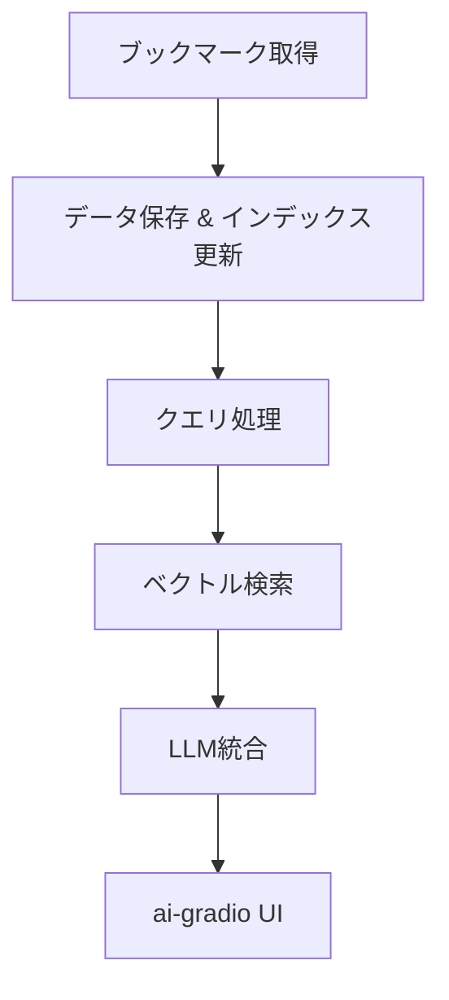

# 詳細設計書 (MVP版)

## 1. 目的
本ドキュメントは、MVP基本設計に基づき、各モジュールの実装方法をシンプルにまとめた詳細設計書です。MVPとして必要な最低限の機能実装に焦点を当て、後日の拡張性も視野に入れて設計しています。

## 2. アーキテクチャ概要
下記の図は、MVPの全体的なフローを示します。

## 3. 各モジュールの詳細設計

// Start of Selection
### 3.1 ブックマーク取得モジュール
**概要:**  
Seleniumを用いてX（旧Twitter）にログインし、ブックマークページをブラウザ操作によって取得したうえで、必要な項目（tweet_id, text, user, timestamp, media_infoなど）に整形します。  

**主な処理:**  
- 環境変数で管理している認証情報を使用し、Selenium WebDriverでログインフローを自動化  
- ブックマーク一覧ページを開き、HTML要素から必要な情報を抽出  
- 取得データをパースし、tweet_id, text, user, timestamp, media_infoを含むJSON形式に整形  

**実装例:**  
- PythonのSeleniumライブラリ（webdriver）を利用し、headlessモードで実行  
- エラーハンドリングとして、要素が読み込まれるまでの待機やリトライ機能、タイムアウト設定などを導入

### 3.2 データ保存・インデックス化モジュール
**概要:**  
取得したブックマーク情報をSQLiteに保存し、検索用のベクトルインデックスをFAISSで構築します。  
**主な処理:**  
- SQLiteデータベースに「bookmarks」テーブルを作成  
  - 例: tweet_id (PRIMARY KEY), text, user, timestamp, media_info  
- テキストデータから埋め込みベクトルを生成（例：SentenceTransformersを使用）  
- FAISSライブラリでベクトルインデックスを構築・更新  
**実装例:**  
- Pythonの`sqlite3`モジュールとFAISSライブラリ  
- インデックスの差分更新ロジックを実装

### 3.3 クエリ処理・検索モジュール
**概要:**  
ユーザの自然言語クエリを受け取り、同じEmbeddingモデルでベクトル化後、FAISSを用いた類似検索を実施します。  
**主な処理:**  
- ユーザ入力のクエリをEmbeddingに変換  
- FAISSの検索APIを用いて、上位N件のブックマークを取得  
- 検索結果のランキングおよび整形処理を実施  
**実装例:**  
- 取得済みの埋め込みモデルでクエリにも同じ処理を適用  
- FAISS検索API（例: `index.search`）の利用

### 3.4 LLM統合モジュール
**概要:**  
取得した検索結果とユーザのクエリを組み合わせ、プロンプトを生成してLLM（デフォルトはGemini 2.0 Flash）に問い合わせ、回答を得ます。  
**主な処理:**  
- 検索結果とクエリを統合し、プロンプトテンプレートに沿った文字列を作成  
- HTTPリクエストを用いてLLM APIを呼び出す  
- LLMの応答をパースし、次工程に渡せる形に整形  
**実装例:**  
- LLM統合用の抽象化レイヤーを実装し、複数LLMへの切替に対応  
- API呼び出し時のエラーハンドリングとタイムアウト設定

### 3.5 ai-gradio UI モジュール
**概要:**  
シンプルなWebインターフェースを構築し、ユーザの入力受付、結果表示、LLM応答のフィードバックを行います。  
**主な処理:**  
- ai-gradioライブラリを利用してUIコンポーネント（テキスト入力、ボタン、結果表示エリア）を構築  
- ユーザのクエリ入力後、バックエンドの各モジュールと連携して結果を受信  
- リアルタイムでの表示更新を実装  
**実装例:**  
- ai-gradioによるレイアウト設計  
- イベントハンドラで各モジュールの処理結果を結合し表示

## 4. 共通の設計方針
- **シンプルさの維持:**  
  各モジュールはMVP実装のために必要な最低限の機能のみを実装し、複雑なエラーハンドリングや冗長な機能は後日拡張する設計とする。
- **拡張性:**  
  各モジュールは抽象化レイヤーを設け、後の機能追加や他のサービスへの移行が容易になるように設計する。
- **エラーハンドリング:**  
  各モジュールで例外捕捉、ログ記録の標準化を実施し、問題発生時には適切なフィードバックを行う。

## 5. 開発環境とツール
- **プログラミング言語:** Python 3.10～3.12  
- **ライブラリ管理:** Poetry  
- **主要ライブラリ:**  
  - requests  
  - sqlite3  
  - FAISS  
  - SentenceTransformers（または類似の埋め込み生成ライブラリ）  
  - ai-gradio  
- **テスト:** pytestによる単体テストおよび統合テスト

## 6. 今後の課題
- APIのレート制限や認証の強化  
- インデックスの効率的な更新・再構築方法の検討  
- UIのレスポンス向上や非同期処理の実装

---

この詳細設計書は、MVPとして実装するためのシンプルかつ拡張可能な基盤を提供することを目的としています。 