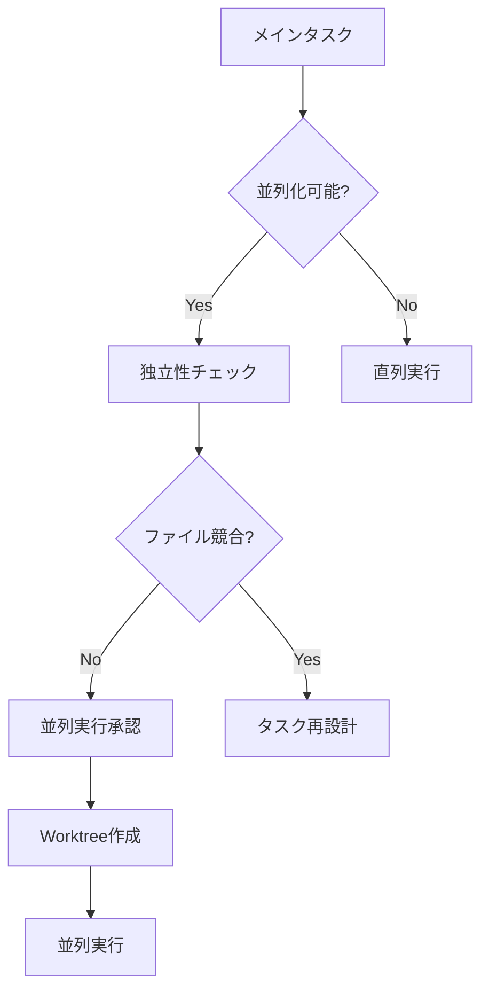

# Git Worktree並列実行方式 - 正式ルール整備文書

**文書バージョン**: 1.0.0  
**制定日**: 2025-06-07  
**適用対象**: Claude CLI並列実行環境  
**品質基準**: プロジェクトルール100%準拠

## 📋 目次

1. [基本原則](#基本原則)
2. [環境構築ルール](#環境構築ルール)
3. [実行ルール](#実行ルール)
4. [安全プロトコル](#安全プロトコル)
5. [品質保証ルール](#品質保証ルール)
6. [監視・検証ルール](#監視検証ルール)
7. [クリーンアップルール](#クリーンアップルール)
8. [実践テンプレート](#実践テンプレート)
9. [トラブルシューティング](#トラブルシューティング)
10. [チェックリスト](#チェックリスト)

## 🎯 基本原則

### 原則1: 物理的分離の原則
**すべての並列タスクは物理的に独立したディレクトリで実行する**
- Git worktreeによる完全なファイルシステム分離
- 各タスクに専用のブランチを割り当て
- ファイル競合の可能性を0%に削減

### 原則2: 明示的管理の原則
**すべての並列実行環境は明示的に作成・管理・削除する**
- 自動生成されたworktree名の禁止
- 追跡可能な命名規則の強制
- クリーンアップの義務化

### 原則3: 品質維持の原則
**並列実行においてもプロジェクト品質基準を100%維持する**
- 各worktreeで独立した品質チェック
- TDD実践の継続
- カバレッジ基準の遵守

### 原則4: トレーサビリティの原則
**すべての並列実行は追跡・監査可能でなければならない**
- 実行ログの保存
- メトリクスの収集
- 実行履歴の記録

## 📏 環境構築ルール

### Rule 1: Worktreeディレクトリ構造

```bash
project_root/
├── worker/                    # Worktree専用ディレクトリ（必須）
│   ├── feature_XXX_YYY/      # 機能開発用worktree
│   ├── bugfix_XXX_YYY/       # バグ修正用worktree
│   └── refactor_XXX_YYY/     # リファクタリング用worktree
├── logs/                      # 実行ログ保存用
│   └── parallel_execution/    # 並列実行専用ログ
└── .gitignore                 # worker/を必ず追加
```

**必須設定**:
```bash
# .gitignoreへの追加（必須）
echo "worker/" >> .gitignore
echo "logs/parallel_execution/" >> .gitignore
```

### Rule 2: 命名規則

```bash
# Worktree命名規則
${type}_${id}_${description}

# 例:
feature_001_user_authentication
bugfix_042_memory_leak_fix
refactor_003_database_optimization

# ブランチ命名規則
${type}/${component}-${functionality}

# 例:
feature/auth-jwt-implementation
bugfix/payment-validation-error
refactor/database-query-optimization
```

### Rule 3: 環境検証

```bash
# Worktree作成前の必須チェック
verify_worktree_environment() {
    # 1. ディレクトリ存在確認
    [ -d "worker" ] || mkdir -p worker
    
    # 2. Git状態確認
    git status --porcelain | grep -q . && {
        echo "Error: Working directory not clean"
        return 1
    }
    
    # 3. ディスク容量確認（最低1GB/worktree）
    available_space=$(df -BG . | awk 'NR==2 {print $4}' | sed 's/G//')
    [ "$available_space" -lt 3 ] && {
        echo "Error: Insufficient disk space"
        return 1
    }
    
    return 0
}
```

## 🚀 実行ルール

### Rule 4: タスク分解基準



**並列化可能条件**:
1. タスク間でファイル編集の重複がない
2. 実行順序に依存関係がない
3. リソース競合が発生しない
4. 各タスクが独立してテスト可能

### Rule 5: 実行パターン

#### パターンA: シンプル並列実行
```bash
#!/bin/bash
# parallel_simple.sh

# タスク定義
TASKS=(
    "feature_001_auth:ユーザー認証機能の実装"
    "feature_002_payment:決済処理の実装"
    "feature_003_notification:通知システムの実装"
)

# Worktree作成と実行
for task_spec in "${TASKS[@]}"; do
    IFS=':' read -r task_name task_desc <<< "$task_spec"
    
    # Worktree作成
    git worktree add "worker/${task_name}" -b "${task_name}"
    
    # 並列実行
    (
        cd "worker/${task_name}"
        echo "[$(date)] Starting: ${task_desc}" >> ../../logs/parallel_execution.log
        claude -p "${task_desc}"
        echo "[$(date)] Completed: ${task_desc}" >> ../../logs/parallel_execution.log
    ) &
done

# 全タスク完了待機
wait
echo "All parallel tasks completed"
```

#### パターンB: 段階的並列実行
```bash
#!/bin/bash
# parallel_phased.sh

# Phase 1: 分析タスク（読み取り専用）
echo "=== Phase 1: Analysis ==="
analysis_tasks=(
    "セキュリティ脆弱性の分析"
    "パフォーマンスボトルネックの分析"
    "コード品質の分析"
)

for i in "${!analysis_tasks[@]}"; do
    (
        cd worker/analysis_$((i+1))
        claude -p "${analysis_tasks[$i]}" > "analysis_report_$((i+1)).md"
    ) &
done
wait

# Phase 2: 実装タスク（分析結果基づく）
echo "=== Phase 2: Implementation ==="
implementation_tasks=(
    "analysis_report_1.mdを基にセキュリティ修正を実装"
    "analysis_report_2.mdを基に最適化を実装"
    "analysis_report_3.mdを基にリファクタリングを実装"
)

for i in "${!implementation_tasks[@]}"; do
    git worktree add "worker/impl_$((i+1))" -b "feature/impl-$((i+1))"
    (
        cd "worker/impl_$((i+1))"
        claude -p "${implementation_tasks[$i]}"
    ) &
done
wait

# Phase 3: 検証タスク
echo "=== Phase 3: Verification ==="
# 各実装の品質検証
```

### Rule 6: 並列度制限

```python
# parallel_executor.py
import asyncio
from asyncio import Semaphore
import multiprocessing

class ParallelExecutor:
    def __init__(self):
        # CPU数に基づく並列度決定
        cpu_count = multiprocessing.cpu_count()
        self.max_parallel = min(cpu_count - 1, 4)  # 最大4並列
        self.semaphore = Semaphore(self.max_parallel)
    
    async def execute_task(self, worktree_path: str, prompt: str):
        async with self.semaphore:
            # リソース制限下でタスク実行
            process = await asyncio.create_subprocess_exec(
                'claude', '-p', prompt,
                cwd=worktree_path,
                stdout=asyncio.subprocess.PIPE,
                stderr=asyncio.subprocess.PIPE
            )
            stdout, stderr = await process.communicate()
            return process.returncode, stdout, stderr
```

## 🛡️ 安全プロトコル

### Rule 7: 事前競合チェック

```bash
# check_conflicts.sh
#!/bin/bash

check_file_conflicts() {
    local -a tasks=("$@")
    local -a all_files=()
    
    for task in "${tasks[@]}"; do
        # タスクが影響するファイルを推定
        echo "Analyzing task: $task"
        
        # キーワードからファイルを推定
        if [[ "$task" =~ "auth" ]]; then
            all_files+=("app/a2a/auth.py" "tests/test_auth.py")
        elif [[ "$task" =~ "payment" ]]; then
            all_files+=("app/a2a/payment.py" "tests/test_payment.py")
        fi
    done
    
    # 重複チェック
    duplicates=$(printf '%s\n' "${all_files[@]}" | sort | uniq -d)
    if [ -n "$duplicates" ]; then
        echo "❌ File conflicts detected:"
        echo "$duplicates"
        return 1
    fi
    
    echo "✅ No file conflicts detected"
    return 0
}
```

### Rule 8: 実行監視

```python
# monitor_execution.py
import psutil
import time
import json
from pathlib import Path

class ExecutionMonitor:
    def __init__(self, log_dir: Path):
        self.log_dir = log_dir
        self.metrics = []
    
    def monitor_resources(self):
        """リソース使用状況の監視"""
        while True:
            metric = {
                "timestamp": time.time(),
                "cpu_percent": psutil.cpu_percent(interval=1),
                "memory_percent": psutil.virtual_memory().percent,
                "disk_io": psutil.disk_io_counters()._asdict(),
                "active_processes": len(psutil.pids())
            }
            
            self.metrics.append(metric)
            
            # 閾値チェック
            if metric["cpu_percent"] > 90:
                self.alert("High CPU usage detected")
            if metric["memory_percent"] > 85:
                self.alert("High memory usage detected")
            
            time.sleep(10)  # 10秒ごとに監視
    
    def save_metrics(self):
        """メトリクスの保存"""
        output_file = self.log_dir / f"metrics_{int(time.time())}.json"
        with open(output_file, 'w') as f:
            json.dump(self.metrics, f, indent=2)
```

### Rule 9: エラーハンドリング

```bash
# error_handler.sh
#!/bin/bash

execute_with_rollback() {
    local worktree_path=$1
    local task_name=$2
    local prompt=$3
    
    # 実行前のコミットIDを記録
    original_commit=$(git -C "$worktree_path" rev-parse HEAD)
    
    # タスク実行
    cd "$worktree_path"
    if ! claude -p "$prompt"; then
        echo "❌ Task failed: $task_name"
        
        # ロールバック
        git reset --hard "$original_commit"
        git clean -fd
        
        # エラーログ記録
        echo "[ERROR] $(date): Task $task_name failed and rolled back" >> ../logs/errors.log
        return 1
    fi
    
    echo "✅ Task completed: $task_name"
    return 0
}
```

## ✅ 品質保証ルール

### Rule 10: 並列品質チェック

```bash
# parallel_quality_check.sh
#!/bin/bash

run_quality_checks() {
    local worktree_path=$1
    local results_dir="$worktree_path/quality_results"
    mkdir -p "$results_dir"
    
    echo "Running quality checks in $worktree_path"
    
    # 各チェックを並列実行
    (
        cd "$worktree_path"
        
        # テスト実行
        pytest --cov=app --cov-report=json:"$results_dir/coverage.json" &
        
        # Flake8チェック
        flake8 app/ tests/ --output-file="$results_dir/flake8.txt" &
        
        # Black フォーマットチェック
        black app/ tests/ --check --diff > "$results_dir/black.txt" 2>&1 &
        
        # セキュリティチェック
        bandit -r app/ -f json -o "$results_dir/bandit.json" &
        
        wait
    )
    
    # 結果集約
    aggregate_quality_results "$results_dir"
}
```

### Rule 11: 統合前検証

```python
# integration_verifier.py
from pathlib import Path
import subprocess
import json

class IntegrationVerifier:
    def __init__(self, worktree_paths: list[Path]):
        self.worktree_paths = worktree_paths
        self.results = {}
    
    def verify_all_worktrees(self) -> bool:
        """全worktreeの検証"""
        all_passed = True
        
        for worktree in self.worktree_paths:
            print(f"Verifying {worktree}...")
            
            # 品質チェック実行
            checks = {
                "tests": self.run_tests(worktree),
                "coverage": self.check_coverage(worktree),
                "linting": self.run_linting(worktree),
                "security": self.run_security_scan(worktree)
            }
            
            self.results[str(worktree)] = checks
            
            if not all(checks.values()):
                all_passed = False
                print(f"❌ Verification failed for {worktree}")
            else:
                print(f"✅ Verification passed for {worktree}")
        
        return all_passed
    
    def generate_report(self):
        """統合レポート生成"""
        report_path = Path("integration_report.json")
        with open(report_path, 'w') as f:
            json.dump(self.results, f, indent=2)
        
        print(f"Integration report saved to {report_path}")
```

## 📊 監視・検証ルール

### Rule 12: ログ管理

```bash
# log_structure.sh
logs/
├── parallel_execution/
│   ├── $(date +%Y%m%d)/           # 日付別ディレクトリ
│   │   ├── execution.log          # 実行ログ
│   │   ├── errors.log             # エラーログ
│   │   ├── metrics.json           # メトリクス
│   │   └── summary.md             # 日次サマリー
│   └── archive/                   # アーカイブ済みログ
```

### Rule 13: メトリクス収集

```python
# metrics_collector.py
class MetricsCollector:
    def __init__(self):
        self.metrics = {
            "execution_times": [],
            "resource_usage": [],
            "quality_scores": [],
            "error_rates": []
        }
    
    def collect_execution_metrics(self, worktree_name: str, start_time: float, end_time: float):
        """実行メトリクスの収集"""
        duration = end_time - start_time
        self.metrics["execution_times"].append({
            "worktree": worktree_name,
            "duration_seconds": duration,
            "timestamp": start_time
        })
    
    def generate_dashboard(self):
        """ダッシュボード生成"""
        # メトリクスの可視化
        pass
```

### Rule 14: 定期検証

```bash
# periodic_verification.sh
#!/bin/bash

daily_health_check() {
    echo "=== Daily Health Check $(date) ==="
    
    # 1. 孤立worktreeの検出
    echo "Checking for orphaned worktrees..."
    git worktree prune --dry-run
    
    # 2. ディスク使用量確認
    echo "Disk usage by worktrees:"
    du -sh worker/* 2>/dev/null | sort -hr
    
    # 3. 未マージブランチの確認
    echo "Unmerged feature branches:"
    git branch -r | grep "feature/" | while read branch; do
        if ! git branch --merged | grep -q "$branch"; then
            echo "  - $branch"
        fi
    done
    
    # 4. ログサイズ確認
    echo "Log sizes:"
    find logs/ -type f -name "*.log" -mtime +7 -exec ls -lh {} \;
}
```

## 🧹 クリーンアップルール

### Rule 15: 自動クリーンアップ

```bash
# auto_cleanup.sh
#!/bin/bash

cleanup_completed_worktrees() {
    # マージ済みworktreeの自動削除
    for worktree in worker/*; do
        [ -d "$worktree" ] || continue
        
        branch_name=$(git -C "$worktree" branch --show-current)
        
        # マージ確認
        if git branch --merged main | grep -q "$branch_name"; then
            echo "Removing merged worktree: $worktree"
            git worktree remove "$worktree" --force
            git branch -d "$branch_name"
        fi
    done
    
    # 古いログのアーカイブ
    find logs/parallel_execution -type f -mtime +30 -exec gzip {} \;
    
    # Git GC実行
    git gc --auto
}
```

### Rule 16: 緊急クリーンアップ

```bash
# emergency_cleanup.sh
#!/bin/bash

force_cleanup_all() {
    echo "⚠️  Emergency cleanup initiated"
    
    # 全worktreeの強制削除
    git worktree list --porcelain | grep "^worktree" | cut -d' ' -f2 | \
    while read worktree_path; do
        if [[ "$worktree_path" == *"/worker/"* ]]; then
            echo "Removing: $worktree_path"
            git worktree remove "$worktree_path" --force
        fi
    done
    
    # workerディレクトリの完全削除
    rm -rf worker/
    
    # Gitの整合性チェック
    git worktree prune
    git gc --aggressive --prune=now
    
    echo "✅ Emergency cleanup completed"
}
```

## 📝 実践テンプレート

### テンプレート1: 基本的な並列実行

```bash
#!/bin/bash
# template_basic_parallel.sh

set -euo pipefail

# 設定
PROJECT_ROOT=$(git rev-parse --show-toplevel)
WORKER_DIR="$PROJECT_ROOT/worker"
LOG_DIR="$PROJECT_ROOT/logs/parallel_execution/$(date +%Y%m%d)"

# 初期化
mkdir -p "$WORKER_DIR" "$LOG_DIR"

# タスク定義
declare -A TASKS=(
    ["feature_001"]="認証システムの実装"
    ["feature_002"]="決済処理の実装"
    ["feature_003"]="通知機能の実装"
)

# メイン処理
main() {
    echo "Starting parallel execution at $(date)" | tee "$LOG_DIR/execution.log"
    
    # 環境検証
    verify_worktree_environment || exit 1
    
    # Worktree作成と実行
    for task_id in "${!TASKS[@]}"; do
        create_and_execute_task "$task_id" "${TASKS[$task_id]}" &
    done
    
    # 完了待機
    wait
    
    # 品質チェック
    run_parallel_quality_checks
    
    # クリーンアップ
    cleanup_completed_worktrees
    
    echo "Parallel execution completed at $(date)" | tee -a "$LOG_DIR/execution.log"
}

create_and_execute_task() {
    local task_id=$1
    local task_desc=$2
    local worktree_path="$WORKER_DIR/$task_id"
    
    # Worktree作成
    git worktree add "$worktree_path" -b "$task_id" 2>&1 | tee -a "$LOG_DIR/execution.log"
    
    # タスク実行
    (
        cd "$worktree_path"
        echo "[$(date)] Starting: $task_desc" >> "$LOG_DIR/execution.log"
        
        if claude -p "$task_desc"; then
            echo "[$(date)] ✅ Completed: $task_desc" >> "$LOG_DIR/execution.log"
        else
            echo "[$(date)] ❌ Failed: $task_desc" >> "$LOG_DIR/execution.log"
        fi
    )
}

# 実行
main "$@"
```

### テンプレート2: 段階的並列実行

```bash
#!/bin/bash
# template_phased_parallel.sh

# Phase 1: 分析フェーズ
run_analysis_phase() {
    local -a analysis_tasks=(
        "コードベースのセキュリティ分析"
        "パフォーマンスボトルネックの特定"
        "アーキテクチャの改善点分析"
    )
    
    echo "=== Phase 1: Analysis Phase ==="
    
    for i in "${!analysis_tasks[@]}"; do
        local worktree="worker/analysis_$((i+1))"
        git worktree add "$worktree" -b "analysis-$((i+1))"
        
        (
            cd "$worktree"
            claude -p "${analysis_tasks[$i]}" > "report_$((i+1)).md"
        ) &
    done
    
    wait
}

# Phase 2: 実装フェーズ
run_implementation_phase() {
    echo "=== Phase 2: Implementation Phase ==="
    
    # 分析結果を基に実装
    for i in {1..3}; do
        local worktree="worker/impl_$i"
        git worktree add "$worktree" -b "implementation-$i"
        
        (
            cd "$worktree"
            # 分析レポートをコピー
            cp "../analysis_$i/report_$i.md" .
            
            claude -p "report_$i.mdの分析結果を基に改善を実装"
        ) &
    done
    
    wait
}

# Phase 3: 統合フェーズ
run_integration_phase() {
    echo "=== Phase 3: Integration Phase ==="
    
    # 各実装をマージ
    for i in {1..3}; do
        git merge "implementation-$i" --no-ff -m "Merge implementation $i"
    done
    
    # 統合テスト実行
    python scripts/quality_gate_check.py
}

# メイン実行
main() {
    run_analysis_phase
    run_implementation_phase
    run_integration_phase
}

main "$@"
```

### テンプレート3: 高度な並列実行管理

```python
#!/usr/bin/env python3
# template_advanced_parallel.py

import asyncio
import subprocess
from pathlib import Path
from typing import List, Dict, Tuple
import json
import time

class AdvancedParallelExecutor:
    def __init__(self, project_root: Path):
        self.project_root = project_root
        self.worker_dir = project_root / "worker"
        self.log_dir = project_root / "logs" / "parallel_execution" / time.strftime("%Y%m%d")
        self.max_parallel = 3
        self.results = {}
        
        # ディレクトリ作成
        self.worker_dir.mkdir(exist_ok=True)
        self.log_dir.mkdir(parents=True, exist_ok=True)
    
    async def execute_task(self, task_id: str, task_desc: str) -> Tuple[str, bool]:
        """個別タスクの実行"""
        worktree_path = self.worker_dir / task_id
        
        try:
            # Worktree作成
            await self._run_command(
                ["git", "worktree", "add", str(worktree_path), "-b", task_id]
            )
            
            # Claude実行
            start_time = time.time()
            process = await asyncio.create_subprocess_exec(
                "claude", "-p", task_desc,
                cwd=worktree_path,
                stdout=asyncio.subprocess.PIPE,
                stderr=asyncio.subprocess.PIPE
            )
            
            stdout, stderr = await process.communicate()
            end_time = time.time()
            
            # 結果記録
            success = process.returncode == 0
            self.results[task_id] = {
                "success": success,
                "duration": end_time - start_time,
                "stdout": stdout.decode() if stdout else "",
                "stderr": stderr.decode() if stderr else ""
            }
            
            # 品質チェック
            if success:
                await self.run_quality_checks(worktree_path)
            
            return task_id, success
            
        except Exception as e:
            self.results[task_id] = {
                "success": False,
                "error": str(e)
            }
            return task_id, False
    
    async def run_quality_checks(self, worktree_path: Path):
        """品質チェックの実行"""
        checks = [
            ["pytest", "--cov=app", "--cov-report=json"],
            ["flake8", "app/", "tests/"],
            ["black", "app/", "tests/", "--check"],
            ["mypy", "app/"]
        ]
        
        quality_results = {}
        
        for check_cmd in checks:
            process = await asyncio.create_subprocess_exec(
                *check_cmd,
                cwd=worktree_path,
                stdout=asyncio.subprocess.PIPE,
                stderr=asyncio.subprocess.PIPE
            )
            
            stdout, stderr = await process.communicate()
            quality_results[check_cmd[0]] = {
                "passed": process.returncode == 0,
                "output": stdout.decode() if stdout else stderr.decode()
            }
        
        # 品質結果を保存
        quality_file = worktree_path / "quality_results.json"
        with open(quality_file, 'w') as f:
            json.dump(quality_results, f, indent=2)
    
    async def execute_parallel(self, tasks: Dict[str, str]):
        """並列実行のメイン処理"""
        semaphore = asyncio.Semaphore(self.max_parallel)
        
        async def bounded_execute(task_id: str, task_desc: str):
            async with semaphore:
                return await self.execute_task(task_id, task_desc)
        
        # 全タスクを並列実行
        results = await asyncio.gather(
            *[bounded_execute(tid, tdesc) for tid, tdesc in tasks.items()],
            return_exceptions=True
        )
        
        # 結果サマリー
        successful = sum(1 for _, success in results if success)
        failed = len(results) - successful
        
        # レポート生成
        self.generate_report(successful, failed)
        
        return successful, failed
    
    def generate_report(self, successful: int, failed: int):
        """実行レポートの生成"""
        report = {
            "execution_date": time.strftime("%Y-%m-%d %H:%M:%S"),
            "total_tasks": successful + failed,
            "successful": successful,
            "failed": failed,
            "results": self.results
        }
        
        report_file = self.log_dir / "execution_report.json"
        with open(report_file, 'w') as f:
            json.dump(report, f, indent=2)
        
        # マークダウンサマリー
        summary_file = self.log_dir / "summary.md"
        with open(summary_file, 'w') as f:
            f.write(f"# 並列実行サマリー\n\n")
            f.write(f"実行日時: {report['execution_date']}\n\n")
            f.write(f"## 結果\n")
            f.write(f"- 成功: {successful}\n")
            f.write(f"- 失敗: {failed}\n\n")
            
            f.write(f"## 詳細\n")
            for task_id, result in self.results.items():
                status = "✅" if result.get("success") else "❌"
                f.write(f"- {status} {task_id}: ")
                if result.get("duration"):
                    f.write(f"{result['duration']:.2f}秒\n")
                else:
                    f.write(f"{result.get('error', 'Unknown error')}\n")
    
    async def cleanup(self):
        """クリーンアップ処理"""
        # マージ済みworktreeの削除
        for task_id in self.results:
            if self.results[task_id].get("success"):
                worktree_path = self.worker_dir / task_id
                if worktree_path.exists():
                    await self._run_command(
                        ["git", "worktree", "remove", str(worktree_path), "--force"]
                    )
    
    async def _run_command(self, cmd: List[str]):
        """コマンド実行ヘルパー"""
        process = await asyncio.create_subprocess_exec(
            *cmd,
            stdout=asyncio.subprocess.PIPE,
            stderr=asyncio.subprocess.PIPE
        )
        await process.communicate()
        return process.returncode == 0


# 使用例
async def main():
    # タスク定義
    tasks = {
        "feature_auth": "認証システムの実装（JWT対応）",
        "feature_payment": "決済処理の実装（Stripe統合）",
        "feature_notification": "通知システムの実装（Email/SMS）"
    }
    
    # 実行
    executor = AdvancedParallelExecutor(Path.cwd())
    successful, failed = await executor.execute_parallel(tasks)
    
    print(f"\n実行完了: 成功={successful}, 失敗={failed}")
    
    # クリーンアップ
    await executor.cleanup()


if __name__ == "__main__":
    asyncio.run(main())
```

## 🔧 トラブルシューティング

### 問題1: Worktree作成エラー

**症状**: `fatal: 'worker/xxx' already exists`

**解決策**:
```bash
# 既存worktreeの確認
git worktree list

# 強制削除
git worktree remove worker/xxx --force

# 孤立worktreeの整理
git worktree prune
```

### 問題2: ディスク容量不足

**症状**: `No space left on device`

**解決策**:
```bash
# Worktree使用量確認
du -sh worker/* | sort -hr

# 不要なworktree削除
for worktree in worker/*; do
    if git -C "$worktree" status --porcelain | grep -q .; then
        echo "Has changes: $worktree"
    else
        git worktree remove "$worktree"
    fi
done

# Git GC実行
git gc --aggressive --prune=now
```

### 問題3: 並列実行時のリソース枯渇

**症状**: システムの応答が遅い、メモリ不足

**解決策**:
```python
# リソース監視と制限
import resource

# メモリ制限設定（2GB）
resource.setrlimit(resource.RLIMIT_AS, (2 * 1024 * 1024 * 1024, -1))

# CPU優先度を下げる
import os
os.nice(10)
```

### 問題4: マージコンフリクト

**症状**: 並列開発後のマージでコンフリクト発生

**解決策**:
```bash
# コンフリクト解決手順
git merge feature/task-01 --no-ff

# コンフリクト確認
git status

# ファイル単位で解決
git checkout --theirs path/to/file  # 相手の変更を採用
git checkout --ours path/to/file    # 自分の変更を維持

# または手動編集後
git add path/to/file
git commit
```

## ✅ チェックリスト

### 実行前チェックリスト

- [ ] Git作業ディレクトリがクリーンか確認
- [ ] worker/ディレクトリが.gitignoreに追加されているか
- [ ] 十分なディスク容量があるか（最低3GB）
- [ ] タスク間の依存関係を分析したか
- [ ] ファイル競合の可能性を検証したか
- [ ] 品質基準を明確にしたか

### 実行中チェックリスト

- [ ] 各worktreeが正常に作成されたか
- [ ] Claude CLIが各worktreeで実行されているか
- [ ] リソース使用状況を監視しているか
- [ ] エラーログを確認しているか
- [ ] 進捗を定期的に確認しているか

### 実行後チェックリスト

- [ ] 全タスクが完了したか
- [ ] 品質チェックを実施したか
- [ ] テストが全て成功したか
- [ ] カバレッジ基準を満たしたか
- [ ] コード品質基準を満たしたか
- [ ] 適切にマージできたか
- [ ] worktreeをクリーンアップしたか
- [ ] ログをアーカイブしたか

## 📚 参考資料

- [Git Worktree公式ドキュメント](https://git-scm.com/docs/git-worktree)
- [並列開発実証報告書](../../memory-bank/08-automation/git_worktree_parallel_development.md)
- [プロジェクト品質基準](../../CLAUDE.md)
- [TDD実装パターン](../../memory-bank/03-patterns/generic_tdd_patterns.md)

---

**文書バージョン**: 1.0.0  
**最終更新**: 2025-06-07  
**次回レビュー予定**: 2025-07-07