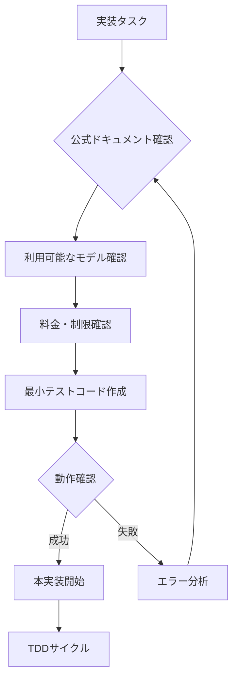

# AMS-IG-008: 実装ガイドライン - 正確な情報に基づく開発

## 1. 重要な実装原則

### 1.1 公式ドキュメントの確認（必須）

```python
"""
実装前に必ず以下の公式ドキュメントを確認すること：

1. Google AI Studio / Vertex AI の最新ドキュメント
2. 利用可能なモデル一覧と料金
3. APIの仕様とレート制限
4. 最新のベストプラクティス

古い情報や推測に基づく実装は厳禁
"""
```

### 1.2 実装前の確認事項

```python
# 実装開始前のチェックリスト
PRE_IMPLEMENTATION_CHECKLIST = [
    "公式ドキュメントで最新のモデル名を確認",
    "料金体系の確認（予算との整合性）",
    "API制限の確認（レート制限、トークン制限）",
    "サンプルコードの動作確認",
    "エラーハンドリングのパターン確認"
]
```

## 2. 設定仕様の修正

### 2.1 llm_model設定（autoを削除）

```python
@dataclass
class UserConfiguration:
    """ユーザーが制御可能な設定項目（修正版）"""
    
    # === 必須設定 ===
    article: str                    # 評価対象の記事
    
    # === LLM設定（明示的な指定のみ）===
    llm_provider: str = "gemini"    # "gemini" | "openai" | "anthropic"
    llm_model: str                  # 明示的なモデル名の指定が必須
    # 例: "gemini-1.5-flash", "gemini-1.5-pro" など
    # ※実装時に最新の利用可能モデルを確認すること
    
    llm_temperature: float = 0.7    # 創造性レベル（0.0-1.0）
    
    # その他の設定は変更なし...
```

### 2.2 設定例（正確なモデル名は実装時に確認）

```python
# 設定例（モデル名は仮）
config = UserConfiguration(
    article="評価対象の記事...",
    llm_provider="gemini",
    llm_model="gemini-1.5-flash",  # 実装時に正確な名前を確認
    population_size=30,
    simulation_steps=10
)
```

## 3. テスト駆動開発での実装手順

### 3.1 Step 1: 公式ドキュメントの確認

```python
# tests/test_llm_integration.py
import pytest
from google.generativeai import GenerativeModel  # 実際のインポートパスは要確認

class TestLLMIntegration:
    """LLM統合の基本テスト"""
    
    def test_available_models(self):
        """利用可能なモデルの確認テスト"""
        # 実装時に公式ドキュメントを確認して
        # 実際に利用可能なモデルをテスト
        pass
    
    def test_model_initialization(self):
        """モデル初期化のテスト"""
        # 実際のモデル名で初期化をテスト
        pass
```

### 3.2 Step 2: 最小限の動作確認

```python
def test_minimal_llm_call():
    """最小限のLLM呼び出しテスト"""
    # 1. 公式ドキュメントのサンプルコードを参考に
    # 2. 最新のAPIクライアントを使用
    # 3. 実在するモデル名を使用
    # 4. エラーハンドリングを含める
    pass
```

## 4. 実装時の注意事項

### 4.1 やってはいけないこと

```python
# ❌ 悪い例：推測に基づく実装
WRONG_APPROACH = [
    "存在しないモデル名の使用",
    "古い情報に基づくAPI呼び出し",
    "公式ドキュメントを確認せずに実装",
    "エラーメッセージを無視した実装"
]

# ✅ 良い例：確認に基づく実装
RIGHT_APPROACH = [
    "公式ドキュメントで最新情報を確認",
    "小さなテストコードで動作確認",
    "エラーメッセージから学習",
    "段階的な実装と検証"
]
```

### 4.2 実装フロー



## 5. ドキュメント管理

### 5.1 情報の鮮度管理

```python
# 各ドキュメントに情報の確認日を記載
DOCUMENT_METADATA = {
    "last_verified": "2024-XX-XX",  # 実装時の日付
    "verified_against": "公式ドキュメントURL",
    "model_versions": ["実際に確認したモデル名のリスト"],
    "api_version": "使用したAPIのバージョン"
}
```

### 5.2 更新プロセス

1. **定期的な確認**
   - 月1回は公式ドキュメントを確認
   - 新モデルのリリース情報をチェック
   - 料金変更の確認

2. **ドキュメント更新**
   - 変更があった場合は即座に更新
   - 更新履歴を明記
   - 影響範囲を記載

## 6. 今後の実装方針

### 6.1 モデル選択の簡素化

```python
# シンプルで明確な設定
class SimplifiedConfig:
    """簡素化された設定"""
    
    # ユーザーが明示的に選択
    llm_model: str  # "gemini-1.5-flash" or "gemini-1.5-pro" など
    
    # コスト vs 品質のトレードオフを明示
    # - 低コスト版: gemini-1.5-flash（仮）
    # - 高品質版: gemini-1.5-pro（仮）
    # ※実際のモデル名は実装時に確認
```

### 6.2 実装の透明性

```python
# ユーザーに対して透明性を保つ
def get_model_info(model_name: str) -> dict:
    """モデル情報を取得（実装時に正確な情報を設定）"""
    return {
        "name": model_name,
        "estimated_cost": "実装時に確認",
        "capabilities": "実装時に確認",
        "limitations": "実装時に確認"
    }
```

## 7. まとめ

1. **推測での実装は禁止** - 必ず公式ドキュメントを確認
2. **auto機能は削除** - ユーザーが明示的にモデルを選択
3. **最新情報の確認** - 実装時点での最新情報を使用
4. **透明性の確保** - 使用するモデルと制約を明確に

---

更新日: 2025-07-22
作成者: AMS Implementation Team

**重要**: このドキュメントの内容も、実装時には必ず最新の公式ドキュメントと照合してください。