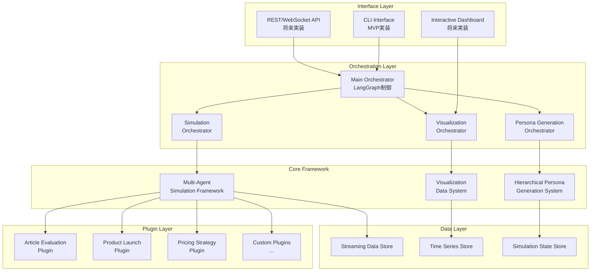
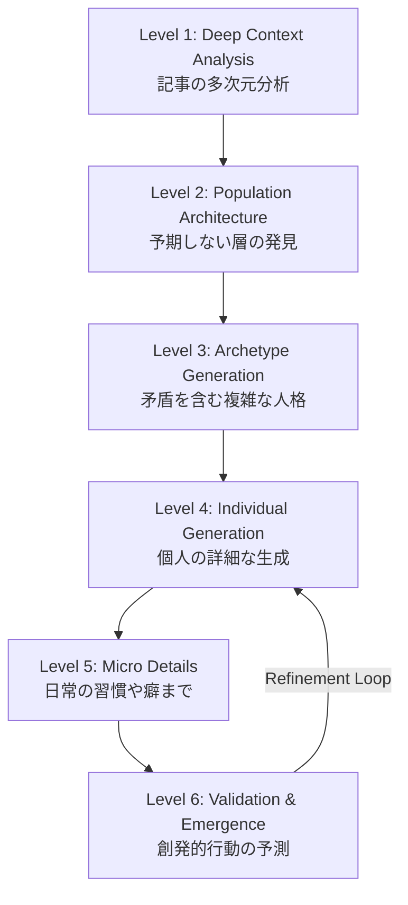

# Article Market Simulator 基本設計書

## 1. システム概要

### 1.1 目的とビジョン
本システムは、記事やコンテンツに対する市場反応を、**極めてリアルで高解像度な仮想ペルソナ群**によるマルチエージェントシミュレーションを通じて予測・評価するシステムです。

#### コアバリュー
- **信頼性**: 人間が想像しえない多様で具体的なペルソナによる信頼できるシミュレーション結果
- **洞察性**: 予期しない市場反応や隠れた機会の発見
- **拡張性**: 記事評価を超えて、あらゆる市場シミュレーションへの応用可能性
- **可視性**: リアルタイムで美しく、インタラクティブな可視化によるUX

### 1.2 設計思想
```
┌─────────────────────────────────────────────────────────────┐
│                    設計の3つの柱                              │
├─────────────────────────────────────────────────────────────┤
│                                                               │
│  1. 階層的高解像度ペルソナ生成                                │
│     └─ LLMの能力を最大限活用した段階的詳細化                  │
│                                                               │
│  2. 汎用マルチエージェントシミュレーションフレームワーク      │
│     └─ プラグイン型で拡張可能な抽象化設計                     │
│                                                               │
│  3. リアルタイム可視化中心のアーキテクチャ                    │
│     └─ ストリーミング対応のデータ構造と可視化パイプライン     │
│                                                               │
└─────────────────────────────────────────────────────────────┘
```

## 2. システムアーキテクチャ

### 2.1 全体構成


### 2.2 レイヤー設計
| レイヤー | 責務 | 主要コンポーネント |
|---------|------|------------------|
| **Interface** | ユーザーインタラクション | CLI, REST API, WebSocket, Dashboard |
| **Orchestration** | 処理フロー制御 | LangGraph, 並列処理管理, 状態管理 |
| **Core Framework** | コア機能提供 | ペルソナ生成, シミュレーション, 可視化 |
| **Plugin** | 特定ドメイン実装 | 記事評価, 製品投入, 価格戦略等 |
| **Data** | データ永続化・配信 | ストリーミング, 時系列, 状態管理 |

## 3. 階層的ペルソナ生成システム

### 3.1 6層階層モデル


### 3.2 段階的詳細化プロセス
```python
class HierarchicalPersonaGenerator:
    """階層的ペルソナ生成システム"""
    
    async def generate_population(self, article: str, size: int = 30) -> List[Persona]:
        # Level 1: 深層コンテキスト分析
        context = await self.deep_context_analyzer.analyze(article)
        
        # Level 2: 人口構成設計（予期しないセグメントを含む）
        architecture = await self.population_architect.design(
            context=context,
            size=size,
            creativity_level="maximum"  # LLMに創造的な層を生成させる
        )
        
        # Level 3: アーキタイプ生成（矛盾する特性を持つ）
        archetypes = await self.archetype_generator.create(
            architecture=architecture,
            complexity="paradoxical"  # 例：「不安な伝道者」「懐かしがる未来主義者」
        )
        
        # Level 4-6: 個体生成と詳細化
        personas = []
        for archetype in archetypes:
            # 並列生成（LangGraph Send API）
            persona = await self.generate_individual(archetype)
            refined = await self.progressive_refiner.refine(persona)
            validated = await self.validator.validate(refined)
            personas.append(validated)
        
        return personas
```

### 3.3 ペルソナデータ構造
```python
@dataclass
class DeepPersona:
    """高解像度ペルソナ"""
    # 基本属性
    id: str
    archetype: str
    
    # 階層的属性
    core_identity: CoreIdentity
    life_history: LifeHistory
    psychology: Psychology
    behaviors: BehaviorPatterns
    micro_details: MicroDetails
    
    # 動的状態
    current_state: EmotionalState
    social_network: NetworkPosition
    
    # 創発的特性
    emergent_behaviors: List[EmergentBehavior]
    contradiction_resolution: ContradictionPattern
```

## 4. 汎用マルチエージェントシミュレーションフレームワーク

### 4.1 抽象化設計
```python
# コアインターフェース
class IAgent(ABC):
    """すべてのエージェントの基底"""
    @abstractmethod
    async def perceive(self, environment: IEnvironment) -> Perception:
        pass
    
    @abstractmethod
    async def decide(self, perception: Perception) -> Decision:
        pass
    
    @abstractmethod
    async def act(self, decision: Decision) -> IAction:
        pass

class IEnvironment(ABC):
    """シミュレーション環境の基底"""
    @abstractmethod
    async def update(self, actions: List[IAction]) -> EnvironmentState:
        pass
    
    @abstractmethod
    def get_state(self) -> EnvironmentState:
        pass

class ISimulationPlugin(ABC):
    """シミュレーションタイプのプラグイン"""
    @abstractmethod
    def create_agents(self, config: Dict) -> List[IAgent]:
        pass
    
    @abstractmethod
    def create_environment(self, config: Dict) -> IEnvironment:
        pass
```

### 4.2 イベント駆動アーキテクチャ
```python
class SimulationEngine:
    """マルチエージェントシミュレーションエンジン"""
    
    def __init__(self):
        self.event_bus = EventBus()
        self.visualization_bridge = VisualizationBridge()
        
    async def run_simulation(self, plugin: ISimulationPlugin, config: Dict):
        # プラグインからエージェントと環境を生成
        agents = plugin.create_agents(config)
        environment = plugin.create_environment(config)
        
        # シミュレーションループ
        while not self.should_stop():
            # 並列知覚フェーズ
            perceptions = await asyncio.gather(*[
                agent.perceive(environment) for agent in agents
            ])
            
            # 並列意思決定フェーズ
            decisions = await asyncio.gather(*[
                agent.decide(perception) 
                for agent, perception in zip(agents, perceptions)
            ])
            
            # 並列行動フェーズ
            actions = await asyncio.gather(*[
                agent.act(decision)
                for agent, decision in zip(agents, decisions)
            ])
            
            # 環境更新
            new_state = await environment.update(actions)
            
            # イベント発火（可視化用）
            await self.event_bus.emit(SimulationTickEvent(
                tick=self.current_tick,
                state=new_state,
                actions=actions
            ))
            
            # 可視化ブリッジへストリーミング
            await self.visualization_bridge.stream_update(new_state)
```

### 4.3 プラグイン例
```python
class ArticleEvaluationPlugin(ISimulationPlugin):
    """記事評価シミュレーションプラグイン"""
    
    def create_agents(self, config: Dict) -> List[IAgent]:
        # 階層的ペルソナ生成システムを使用
        personas = HierarchicalPersonaGenerator().generate_population(
            article=config["article"],
            size=config["population_size"]
        )
        
        # PersonaをAgentにラップ
        return [PersonaAgent(persona) for persona in personas]
    
    def create_environment(self, config: Dict) -> IEnvironment:
        return ArticleEnvironment(
            article=config["article"],
            social_network=self.build_network(config["personas"])
        )
```

## 5. リアルタイム可視化システム

### 5.1 データストリーミング設計
```python
@dataclass
class StreamableState:
    """ストリーミング最適化された状態"""
    timestamp: float
    tick: int
    
    # スナップショットデータ
    snapshot: Optional[Dict] = None
    
    # 差分データ（帯域幅削減）
    delta: Optional[Dict] = None
    
    # 集約メトリクス
    metrics: Dict[str, float] = field(default_factory=dict)
    
    # 可視化ヒント
    viz_hints: Dict[str, Any] = field(default_factory=dict)

class VisualizationPipeline:
    """可視化データパイプライン"""
    
    async def process_state(self, state: SimulationState) -> StreamableState:
        # 状態を可視化用に変換
        streamable = StreamableState(
            timestamp=time.time(),
            tick=state.tick
        )
        
        # 差分計算
        if self.has_previous_state():
            streamable.delta = self.calculate_delta(state)
        else:
            streamable.snapshot = self.serialize_full_state(state)
        
        # メトリクス集約
        streamable.metrics = self.aggregate_metrics(state)
        
        # 可視化ヒント付与
        streamable.viz_hints = self.generate_viz_hints(state)
        
        return streamable
```

### 5.2 可視化ディメンション
```python
class VisualizationDimensions:
    """サポートする可視化次元"""
    
    # ネットワークグラフ（力学モデル）
    NETWORK_PROPAGATION = "network_propagation"
    
    # 時系列チャート
    TIME_SERIES_METRICS = "time_series_metrics"
    
    # ヒートマップ（セグメント×時間）
    SEGMENT_HEATMAP = "segment_heatmap"
    
    # サンキーダイアグラム（フロー可視化）
    INFLUENCE_FLOW = "influence_flow"
    
    # 3D空間（ペルソナ特性空間）
    PERSONA_SPACE = "persona_space"

class VisualizationServer:
    """WebSocketベースの可視化サーバー"""
    
    async def stream_visualization(self, client_id: str, dimensions: List[str]):
        async for state in self.state_stream:
            # クライアントが要求した次元のみ送信
            filtered_data = self.filter_by_dimensions(state, dimensions)
            
            # 適応的サンプリング（負荷に応じて）
            if self.should_sample(client_id):
                await self.send_to_client(client_id, filtered_data)
```

## 6. 実装計画（MVP）

### 6.1 フェーズ1: コア基盤（Week 1）
- [ ] 基本的なCLIインターフェース
- [ ] 抽象フレームワークの実装
- [ ] シンプルな階層的ペルソナ生成（3層）
- [ ] 基本的なシミュレーションループ

### 6.2 フェーズ2: 記事評価プラグイン（Week 2）
- [ ] ArticleEvaluationPlugin実装
- [ ] 個人の反応モデル
- [ ] ネットワーク伝播シミュレーション
- [ ] 基本的なメトリクス計算

### 6.3 フェーズ3: 可視化基盤（Week 3）
- [ ] ストリーミングデータ構造
- [ ] WebSocketサーバー
- [ ] 基本的な可視化次元（時系列、ネットワーク）
- [ ] Markdownレポート生成

### 6.4 フェーズ4: 品質と拡張（Week 4）
- [ ] テストスイート完成
- [ ] パフォーマンス最適化
- [ ] ドキュメント整備
- [ ] デモシナリオ作成

## 7. 技術スタック

### 7.1 コア技術
- **言語**: Python 3.11+
- **非同期処理**: asyncio + aiohttp
- **LLM統合**: LangChain + LangGraph
- **並列処理**: multiprocessing + Ray（オプション）

### 7.2 データ層
- **ストリーミング**: Redis Streams / Apache Kafka
- **時系列**: InfluxDB / TimescaleDB
- **状態管理**: PostgreSQL with JSONB

### 7.3 可視化
- **サーバー**: FastAPI + WebSocket
- **プロトコル**: JSON-RPC over WebSocket
- **クライアント**: React + D3.js（将来）

## 8. 品質保証

### 8.1 テスト戦略
```python
# テストピラミッド
UNIT_TESTS = "各コンポーネントの単体テスト"
INTEGRATION_TESTS = "プラグイン統合テスト"
SIMULATION_TESTS = "エンドツーエンドシミュレーションテスト"
PERFORMANCE_TESTS = "並列性能・スケーラビリティテスト"
```

### 8.2 検証項目
- ペルソナの現実性（専門家レビュー）
- シミュレーション結果の妥当性（過去事例との比較）
- パフォーマンス目標達成（50ペルソナ/10秒）
- 拡張性の確認（新規プラグイン追加の容易さ）

## 9. 今後の展望

### 9.1 短期目標（3ヶ月）
- MVP完成とユーザーフィードバック収集
- 3つの基本プラグイン実装
- 基本的なWeb UIプロトタイプ

### 9.2 中期目標（6ヶ月）
- プラグインマーケットプレイス
- AIによる自動プラグイン生成
- リアルタイム協調シミュレーション

### 9.3 長期ビジョン（1年）
- グローバル市場シミュレーションプラットフォーム
- 予測市場との統合
- 自己学習型シミュレーションモデル

## 10. まとめ

本基本設計は、以下の3つのイノベーションを実現します：

1. **階層的ペルソナ生成**: LLMの創造性を最大限活用し、人間が想像しえない高解像度なペルソナを生成
2. **汎用フレームワーク**: プラグイン型で、あらゆる市場シミュレーションに対応可能
3. **リアルタイム可視化**: ストリーミング対応で、シミュレーションの「今」を美しく表現

これにより、単なる記事評価ツールを超えて、**市場の未来を可視化する**プラットフォームを実現します。