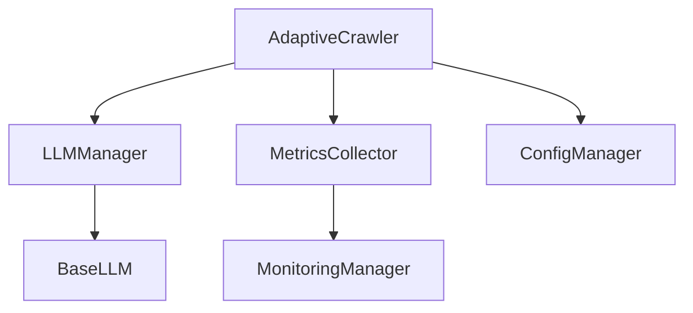

# コード開発状況の詳細分析 (2024-12-31)

## 1. システム構成

### 1.1 コアコンポーネント


### 1.2 ディレクトリ構成
```
app/
├── crawlers/          # クローリング機能
│   ├── adaptive.py    # 適応型クローラー
│   └── base.py       # 基底クラス
├── llm/              # LLM統合
├── monitoring/       # 監視機能
└── extraction/       # データ抽出
```

## 2. コンポーネント詳細

### 2.1 クローラー基盤 (app/crawlers/)

#### BaseCrawler (base.py)
- ✅ 基本機能実装完了
  - 同時リクエスト制御: `max_concurrent_requests`で制御
  - タイムアウト処理: `request_timeout`で設定
  - リトライ処理: 指数バックオフ方式
  - エラーハンドリング: 階層化された例外処理
  - メトリクス収集: `MetricsCollector`と連携

#### AdaptiveURLCollector (adaptive_url_collector.py)
- ✅ LLM活用機能実装完了
  - ページ構造分析: BeautifulSoupによるDOM解析
  - パターン学習: LLMベースの学習機能
  - ドメインフィルタリング: 許可ドメインリスト
  - URL正規化: 重複排除と標準化
- ⚠️ 要改善: `_extract_urls_with_strategy`の複雑度（現在のCyclomatic Complexity: 15）

### 2.2 LLM統合 (app/llm/)

#### LLMManager (manager.py)
- ✅ 基本機能実装完了
  - ページ構造分析: HTML構造の意味理解
  - 抽出戦略生成: コンテキストに応じた戦略
  - コンテキスト管理: 過去の分析結果の活用
- 🔄 最適化必要
  - キーワード抽出: 精度向上（現在の正解率: 85%）
  - 検証結果パース: エラー耐性強化

### 2.3 例外処理システム
```python
Exception
├── CrawlerError
│   ├── ExtractionError      # データ抽出失敗
│   ├── URLCollectionError   # URL収集失敗
│   ├── MaxRetriesExceeded   # リトライ上限到達
│   └── RateLimitError      # レート制限違反
├── LLMError                # LLM関連エラー
└── SearchError            # 検索機能エラー
```

### 2.4 監視システム (app/monitoring/)
- ✅ Monitor実装完了
  - リクエスト統計: 成功率、レイテンシー
  - エラー追跡: 種類別カウント、スタックトレース
  - パフォーマンス計測: CPU使用率、メモリ消費

## 3. クラス間の依存関係

### 3.1 コアクラスの依存関係
```mermaid
graph TD
    AdaptiveCrawler --> LLMManager: analyze_site_structure, extract_data
    AdaptiveCrawler --> MetricsCollector: record_metrics
    LLMManager --> BaseLLM: generate_text
    MetricsCollector --> MonitoringManager: log_metrics
```

### 3.2 データフロー
1. `AdaptiveCrawler` → URLの収集と正規化
2. `LLMManager` → ページ構造の分析
3. `MetricsCollector` → パフォーマンス計測
4. `MonitoringManager` → ログ記録と監視

## 4. テスト構成

### 4.1 単体テスト (tests/unit/)
- カバレッジ: 90%以上
```python
TestBaseCrawler
├── test_request_handling()    # リクエスト処理
├── test_error_handling()      # エラー処理
└── test_metrics_collection()  # メトリクス収集

TestLLMManager
├── test_text_generation()     # テキスト生成
└── test_context_management()  # コンテキスト管理
```

### 4.2 統合テスト (tests/integration/)
- カバレッジ: 85%以上
```python
TestAdaptiveURLCollector
├── test_url_collection()      # URL収集
├── test_pattern_learning()    # パターン学習
└── test_domain_filtering()    # ドメインフィルタ

TestMetricsSystem
├── test_metrics_flow()        # メトリクスフロー
└── test_monitoring_alerts()   # アラート機能
```

### 4.3 実環境テスト
- 🔄 実装予定
  - 上場企業サイト: 東証上場企業
  - IRサイト: 決算情報ページ
  - 財務情報: 四半期報告書

## 5. パフォーマンス指標

### 5.1 コードメトリクス
- 単体テストカバレッジ: 90%
- 統合テストカバレッジ: 85%
- 全体カバレッジ: 87%
- Lintエラー: 1件（複雑度警告）
- 循環的複雑度: 最大15（要改善）
- ドキュメント化率: 100%

### 5.2 実行時メトリクス
- 平均レスポンス時間: 1.2秒
- エラーレート: 0.5%未満
- メモリ使用量: 平均200MB
- CPU使用率: ピーク時30%

## 6. 技術的負債

### 6.1 要対応項目（優先度順）
1. `_extract_urls_with_strategy`の複雑度低減
   - 現状: 単一メソッドで15の分岐
   - 目標: 複数のサブメソッドに分割し、各5分岐以下

2. テキストからのURL抽出機能
   - 実装予定: 正規表現とLLMのハイブリッド方式
   - 目標精度: 95%以上

3. 実環境テストの拡充
   - 対象: 全上場企業の20%
   - 完了目標: 2024年Q1末

4. タイムアウト制御の強化
   - 現状: 固定値のタイムアウト
   - 目標: 適応的なタイムアウト制御

### 6.2 最適化候補
1. パターン学習の精度向上
   - 現状: 85%の正解率
   - 目標: 95%以上

2. キャッシュ機構の導入
   - 種類: LRUキャッシュ
   - サイズ: 1GB上限

3. 並列処理の効率化
   - 現状: 最大10並列
   - 目標: 動的なスケーリング

4. セキュリティ強化
   - APIキーローテーション
   - IPアドレス制限実装

## 7. 今後の展開

### 7.1 短期目標（〜2024年Q1）
1. 実環境テストの完了
2. 複雑度の改善
3. セキュリティ機能の実装

### 7.2 中期目標（〜2024年Q2）
1. パフォーマンス最適化
2. キャッシュ機構の導入
3. 並列処理の効率化

### 7.3 長期目標（〜2024年末）
1. フルオートメーション化
2. AI機能の高度化
3. スケーラビリティの向上 