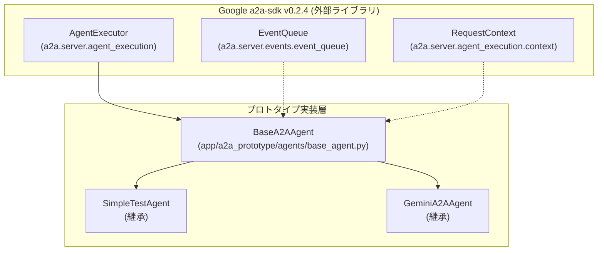
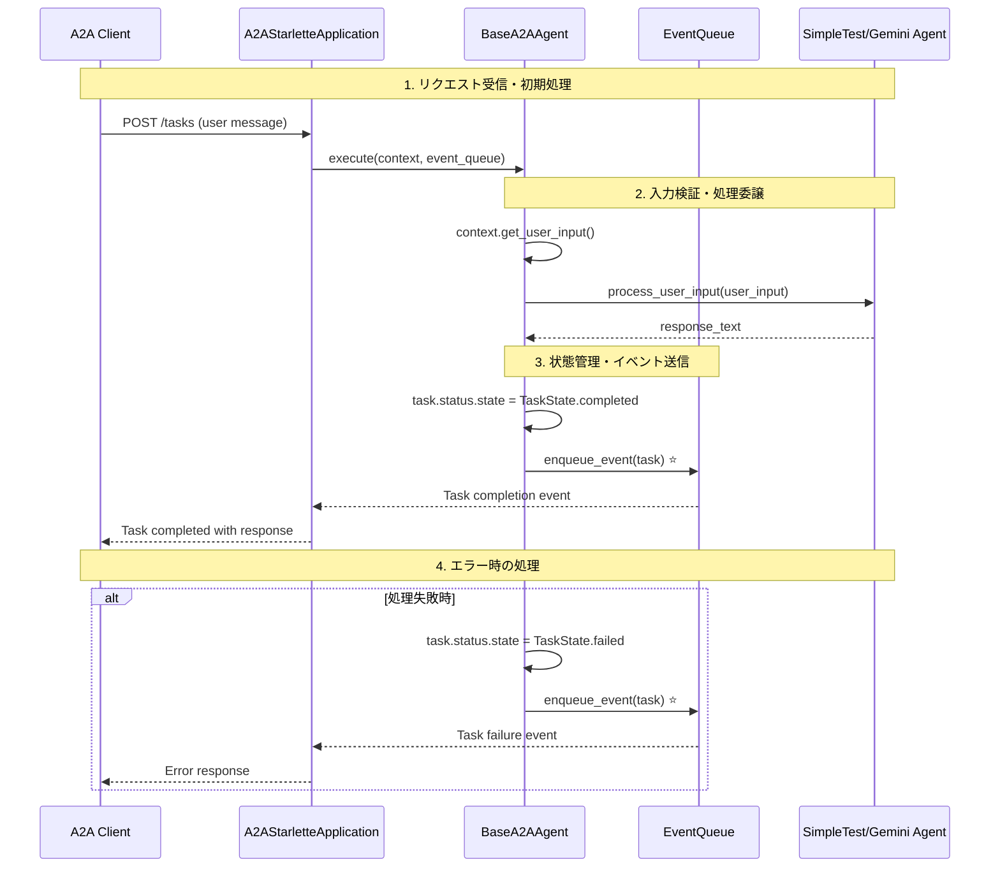

# EventQueue実装分析 - A2A Protocol Layer での位置と役割

## 🎯 概要

このドキュメントは、**アーキテクチャ概要のA2A Protocol LayerのEventQueue**が、プロトタイプではどこにどのように実装されているかを詳細に分析します。

---

## 📋 EventQueueの実装階層とプロトタイプでの位置

### **🏗️ アーキテクチャ概要との対応**

#### **理論的アーキテクチャ (設計図)**
```mermaid
graph TB
    subgraph "A2A Protocol Layer"
        A2A_App[A2AStarletteApplication]
        Agent_Card[AgentCard]
        Event_Queue[EventQueue] ⭐ 
        Task_State[TaskState]
    end
    
    subgraph "Gemini Agent Layer"
        Gemini_Agent[GeminiA2AAgent]
        Base_Agent[BaseA2AAgent]
    end
    
    Event_Queue -.-> A2A_App
    A2A_App --> Base_Agent
```

#### **実際のプロトタイプ実装構造**


---

## 🔍 EventQueue実装の詳細調査結果

### **1. EventQueueの実装場所**

#### **✅ Google a2a-sdk内の実装**
- **インポート元**: `from a2a.server.events.event_queue import EventQueue`
- **提供者**: Google公式a2a-sdk v0.2.4
- **種類**: 外部ライブラリが提供するクラス

#### **✅ プロトタイプ内での使用箇所**

| ファイル | 使用方法 | 説明 |
|---------|----------|------|
| **`examples/a2a_basic_check.py`** | 基本動作テスト | EventQueueの作成・クローズテスト |
| **`app/a2a_prototype/agents/base_agent.py`** | フレームワーク使用 | execute()とcancel()メソッドでEventQueueを受け取り |
| **テストファイル群** | モック作成 | EventQueueのモック・テスト用 |

---

## 🔧 プロトタイプでの実際の実装詳細

### **2. BaseA2AAgentでのEventQueue使用**

#### **実装場所**: `app/a2a_prototype/agents/base_agent.py`

```python
# EventQueueのインポート
from a2a.server.events.event_queue import EventQueue

class BaseA2AAgent(AgentExecutor, ABC):
    
    async def execute(self, context: RequestContext, event_queue: EventQueue):
        """タスクを実行する（A2A公式SDKのメソッド）"""
        try:
            # 1. ユーザー入力の取得
            user_input = context.get_user_input()
            
            if not user_input:
                # 2. 入力待ち状態の設定とイベント送信
                task = context.current_task
                task.status.state = TaskState.input_required
                await event_queue.enqueue_event(task) ⭐
                return
            
            # 3. 子クラスでの処理実行
            response_text = await self.process_user_input(user_input)
            
            # 4. 完了状態の設定とイベント送信
            task = context.current_task
            task.status.state = TaskState.completed
            task.history.append(agent_message)
            await event_queue.enqueue_event(task) ⭐
            
        except Exception as e:
            # 5. 失敗状態の設定とイベント送信
            task = context.current_task
            task.status.state = TaskState.failed
            await event_queue.enqueue_event(task) ⭐
    
    async def cancel(self, context: RequestContext, event_queue: EventQueue):
        """タスクをキャンセルする"""
        task = context.current_task
        task.status.state = TaskState.canceled
        await event_queue.enqueue_event(task) ⭐
```

#### **EventQueueの役割**:
1. **非同期イベント通知**: タスクの状態変化をクライアントに通知
2. **状態管理連携**: TaskStateと連動した状態遷移の伝達
3. **プロトコル準拠**: A2A標準に準拠したイベント駆動処理

---

### **3. 具体的なエージェントでの間接使用**

#### **SimpleTestAgent と GeminiA2AAgent**

```python
# SimpleTestAgent (app/a2a_prototype/agents/simple_agent.py)
class SimpleTestAgent(BaseA2AAgent):
    async def process_user_input(self, user_input: str) -> str:
        # EventQueueは直接使用しない
        # BaseA2AAgent.execute()が自動的に処理
        return f"Echo: {user_input}"

# GeminiA2AAgent (app/a2a_prototype/agents/gemini_agent.py)  
class GeminiA2AAgent(BaseA2AAgent):
    async def process_user_input(self, user_input: str) -> str:
        # EventQueueは直接使用しない
        # BaseA2AAgent.execute()が自動的に処理
        response = await self.gemini_client.generate_response(prompt)
        return response
```

**重要**: 具体的なエージェント実装では**EventQueueを直接操作しない**。全てBaseA2AAgentが自動処理。

---

## 📊 EventQueueの動作フロー (プロトタイプ実装)

### **4. 実際の動作シーケンス**



---

## 🎯 EventQueueの実装レベル分析

### **5. 実装の抽象化レベル**

#### **Level 1: SDK提供レベル (Google a2a-sdk)**
- **場所**: `a2a.server.events.event_queue.EventQueue`
- **役割**: A2Aプロトコル標準の非同期イベント処理
- **機能**: `enqueue_event()`, `close()`, `is_closed()` 等

#### **Level 2: フレームワークレベル (BaseA2AAgent)**
- **場所**: `app/a2a_prototype/agents/base_agent.py`
- **役割**: A2AプロトコルとEventQueueの統合・管理
- **機能**: TaskStateとEventQueueの自動連携

#### **Level 3: アプリケーションレベル (具体的エージェント)**
- **場所**: `SimpleTestAgent`, `GeminiA2AAgent`
- **役割**: ビジネスロジックの実装
- **機能**: `process_user_input()` - EventQueueは意識不要

---

## 📝 基本動作確認テスト

### **6. EventQueueの動作確認方法**

#### **基本テスト実行**:
```bash
# EventQueueの基本動作確認
cd /home/devuser/workspace
python examples/a2a_basic_check.py
```

#### **期待される出力**:
```
=== Testing EventQueue ===
✅ EventQueue created successfully
   Queue closed: False (作成直後 - まだ開いている)
   EventQueueをクローズしています...
   Queue closed after close(): True (正常にクローズされました)
```

#### **エージェント動作での確認**:
```bash
# SimpleTestAgentでEventQueueの実動作確認
python app/a2a_prototype/agents/simple_agent.py
# 別ターミナルで
curl -X POST http://localhost:8001/tasks -H "Content-Type: application/json" -d '{"message": "hello"}'
```

---

## 🔍 プロトタイプでの制約・特徴

### **7. 現在の実装における制約**

#### **✅ 実装済み機能**:
- EventQueueの基本的な作成・クローズ
- TaskStateとの連動した状態通知
- 基本的なエラーハンドリング時のイベント送信

#### **❌ 未実装・制約**:
- **カスタムイベント**: 独自イベントの定義・送信
- **イベントフィルタリング**: 特定イベントのみの処理
- **イベント履歴管理**: 過去のイベント履歴の保持・参照
- **複数EventQueue**: 複数のEventQueueインスタンスの管理

#### **🔧 プロトタイプレベルの特徴**:
- **SDK依存**: Google a2a-sdk v0.2.4の機能に完全依存
- **隠蔽化設計**: 具体的エージェントからEventQueueの詳細を隠蔽
- **学習・検証用**: プロトコル理解のための教育ツールとして設計

---

## 📚 関連ファイル・リソース

### **8. EventQueue関連の主要ファイル**

| ファイル種別 | ファイルパス | 役割 |
|-------------|-------------|------|
| **基本動作テスト** | `examples/a2a_basic_check.py` | EventQueueの基本動作確認 |
| **フレームワーク実装** | `app/a2a_prototype/agents/base_agent.py` | EventQueueの実用的な使用例 |
| **テスト・モック** | `tests/conftest.py` | EventQueueのモック・テスト用固定具 |
| **設計ドキュメント** | `docs/02.basic_design/gemini_a2a_basic_design.md` | アーキテクチャ設計でのEventQueue位置 |
| **技術分析** | `docs/technical_analysis_a2a_protocol_effectiveness.md` | EventQueueの技術的効果分析 |

---

## 🎯 まとめ: EventQueueの実装状況

### **アーキテクチャ概要との対応**:

1. **✅ EventQueueは実装済み**: Google a2a-sdk v0.2.4として外部ライブラリで提供
2. **✅ A2A Protocol Layerでの位置**: BaseA2AAgentレベルで適切に統合
3. **✅ 非同期イベント処理**: TaskStateと連動した状態通知が動作
4. **✅ プロトタイプでの検証**: 基本動作からエージェント実装まで確認済み

### **プロトタイプでの実装レベル**:
- **基盤**: Google a2a-sdk による標準実装
- **統合**: BaseA2AAgent での自動管理
- **応用**: 具体的エージェントでの透過的使用

**結論**: EventQueueは設計通りにA2A Protocol Layerに配置され、プロトタイプで実用的に動作しています。エージェント開発者はEventQueueの詳細を意識することなく、A2Aプロトコル準拠のエージェントを実装できる設計になっています。

---

**作成日**: 2025-01-XX  
**関連資料**: 
- [Gemini A2A基本設計書](02.basic_design/gemini_a2a_basic_design.md)
- [A2A実装ガイド](a2a_implementation_guide.md)
- [EventQueue基本動作テスト](../examples/a2a_basic_check.py) 