# Hierarchical Persona Generation System - Technical Design

## Executive Summary

This document presents a comprehensive design for a hierarchical persona generation system that creates extremely realistic, high-resolution personas through progressive refinement. The system leverages LLM capabilities to generate unexpected, trustworthy personas that provide valuable simulation insights.

## 1. System Architecture Overview

### 1.1 Core Design Principles

```python
# Core principles for hierarchical persona generation
DESIGN_PRINCIPLES = {
    "progressive_refinement": "Start broad, refine through multiple stages",
    "llm_creativity": "Maximize LLM's ability to generate unexpected personas",
    "validation_layers": "Multi-level consistency checks ensure realism",
    "emergence": "Allow complex behaviors to emerge from detailed attributes",
    "trustworthiness": "Generate personas so detailed they produce reliable predictions"
}
```

### 1.2 Hierarchical Generation Pipeline

```mermaid
graph TD
    subgraph "Level 0: Context Analysis"
        A[Article Input] --> B[Domain Extraction]
        B --> C[Cultural Context]
        C --> D[Temporal Context]
        D --> E[Base Context Model]
    end
    
    subgraph "Level 1: Population Architecture"
        E --> F[Population Segments]
        F --> G[Demographic Distribution]
        G --> H[Psychographic Clusters]
        H --> I[Social Network Topology]
    end
    
    subgraph "Level 2: Persona Archetypes"
        I --> J[Core Archetypes]
        J --> K[Hybrid Archetypes]
        K --> L[Edge Case Archetypes]
        L --> M[Archetype Relationships]
    end
    
    subgraph "Level 3: Individual Generation"
        M --> N[Base Attributes]
        N --> O[Life History]
        O --> P[Personality Depth]
        P --> Q[Behavioral Patterns]
    end
    
    subgraph "Level 4: Fine-Grained Details"
        Q --> R[Micro-behaviors]
        R --> S[Cognitive Biases]
        S --> T[Emotional Triggers]
        T --> U[Decision Heuristics]
    end
    
    subgraph "Level 5: Validation & Refinement"
        U --> V[Consistency Checks]
        V --> W[Realism Validation]
        W --> X[Interaction Testing]
        X --> Y[Final Personas]
    end
```



## 2. Multi-Stage Generation Pipeline

### 2.1 Stage 0: Deep Context Analysis

```python
class DeepContextAnalyzer:
    """Extract multi-dimensional context for persona generation"""
    
    async def analyze_article_context(self, article: str) -> Dict:
        """Extract deep contextual information from article"""
        
        # Multi-dimensional analysis prompt
        analysis_prompt = f"""
        Analyze this article across multiple dimensions:
        
        1. DOMAIN ANALYSIS:
           - Primary domain and sub-domains
           - Technical complexity level (1-10)
           - Required background knowledge
           - Industry/sector relevance
        
        2. CULTURAL DIMENSIONS:
           - Geographic relevance
           - Cultural sensitivities
           - Language nuances
           - Social context
        
        3. TEMPORAL ASPECTS:
           - Time sensitivity
           - Trend alignment
           - Historical context
           - Future implications
        
        4. EMOTIONAL LANDSCAPE:
           - Emotional triggers
           - Controversy potential
           - Inspirational elements
           - Fear/anxiety factors
        
        5. STAKEHOLDER MAPPING:
           - Who benefits from this information
           - Who might oppose it
           - Who needs to know about it
           - Who would share it
        
        Article: {article[:2000]}...
        
        Provide structured analysis with specific examples.
        """
        
        context_analysis = await self.llm.analyze(analysis_prompt)
        
        # Extract unexpected dimensions
        unexpected_dimensions = await self._discover_hidden_dimensions(
            article, context_analysis
        )
        
        return {
            "core_context": context_analysis,
            "hidden_dimensions": unexpected_dimensions,
            "complexity_score": self._calculate_complexity(context_analysis),
            "reach_potential": self._estimate_reach_potential(context_analysis)
        }
    
    async def _discover_hidden_dimensions(self, article: str, initial_analysis: Dict) -> Dict:
        """Use LLM to discover non-obvious contextual dimensions"""
        
        discovery_prompt = f"""
        Given this article and initial analysis:
        {initial_analysis}
        
        Identify UNEXPECTED or HIDDEN dimensions that might affect readership:
        
        1. Second-order effects (who is indirectly affected?)
        2. Cross-domain implications (unexpected fields this impacts)
        3. Generational perspectives (how different age groups interpret this)
        4. Subculture relevance (niche communities that care deeply)
        5. Contrarian viewpoints (who would read this critically?)
        6. Emotional projections (what personal experiences this triggers)
        
        Be creative and think beyond obvious connections.
        """
        
        return await self.llm.discover(discovery_prompt)
```

### 2.2 Stage 1: Population Architecture Design

```python
class PopulationArchitect:
    """Design the hierarchical structure of the persona population"""
    
    async def design_population_hierarchy(
        self, 
        context: Dict,
        target_size: int = 50
    ) -> Dict:
        """Create a hierarchical population structure"""
        
        # Level 1: Major segments
        major_segments = await self._design_major_segments(context)
        
        # Level 2: Sub-segments within each major segment
        sub_segments = {}
        for segment in major_segments:
            sub_segments[segment['id']] = await self._design_sub_segments(
                segment, context
            )
        
        # Level 3: Micro-clusters for nuanced behaviors
        micro_clusters = await self._design_micro_clusters(
            sub_segments, context
        )
        
        # Level 4: Individual persona slots with relationships
        persona_slots = await self._allocate_persona_slots(
            major_segments, sub_segments, micro_clusters, target_size
        )
        
        return {
            "hierarchy": {
                "major_segments": major_segments,
                "sub_segments": sub_segments,
                "micro_clusters": micro_clusters,
                "persona_slots": persona_slots
            },
            "network_topology": await self._design_network_topology(persona_slots),
            "influence_map": await self._design_influence_patterns(persona_slots)
        }
    
    async def _design_major_segments(self, context: Dict) -> List[Dict]:
        """Design major population segments based on context"""
        
        segment_prompt = f"""
        Context: {json.dumps(context, indent=2)}
        
        Design 3-5 major population segments for this article.
        Go beyond obvious categories. Consider:
        
        1. UNEXPECTED INTERSECTIONS:
           - People at the intersection of multiple interests
           - Those with contradictory positions
           - Bridge populations between communities
        
        2. TEMPORAL RELATIONSHIPS:
           - Early adopters vs late majority
           - Those who knew "before it was cool"
           - People waiting for this information
        
        3. EMOTIONAL STAKES:
           - High emotional investment
           - Professional stakes
           - Personal history connections
        
        4. COGNITIVE STYLES:
           - Analytical vs intuitive processors
           - Visual vs textual learners
           - Systems vs detail thinkers
        
        For each segment, provide:
        - Unique identifier and name
        - Population percentage
        - Key characteristics
        - Relationship to article content
        - Unexpected traits
        """
        
        return await self.llm.design_segments(segment_prompt)
```

### 2.3 Stage 2: Archetype Generation

```python
class ArchetypeGenerator:
    """Generate nuanced archetypes within each segment"""
    
    async def generate_archetypes(
        self, 
        segment: Dict,
        context: Dict,
        num_archetypes: int = 5
    ) -> List[Dict]:
        """Create detailed archetypes for a segment"""
        
        archetype_prompt = f"""
        Segment: {json.dumps(segment, indent=2)}
        Article Context: {json.dumps(context['core_context'], indent=2)}
        
        Create {num_archetypes} distinct archetypes within this segment.
        
        IMPORTANT: Avoid stereotypes. Create complex, contradictory personalities:
        
        1. THE PARADOX ARCHETYPE:
           - Combines seemingly incompatible traits
           - Example: "Tech-savvy luddite" or "Introverted influencer"
        
        2. THE THRESHOLD ARCHETYPE:
           - People at turning points in life
           - About to change careers/beliefs/lifestyles
        
        3. THE SHADOW ARCHETYPE:
           - Hidden aspects not immediately visible
           - Public persona vs private reality
        
        4. THE BRIDGE ARCHETYPE:
           - Connects different worlds
           - Code-switchers, cultural translators
        
        5. THE OUTLIER ARCHETYPE:
           - Statistical anomalies that still exist
           - Edge cases that break assumptions
        
        For each archetype:
        - Archetype name and description
        - Core contradictions/tensions
        - Information processing style
        - Social network position
        - Hidden motivations
        - Unexpected connections to article topic
        """
        
        archetypes = await self.llm.generate_archetypes(archetype_prompt)
        
        # Add emergent properties
        for archetype in archetypes:
            archetype['emergent_behaviors'] = await self._predict_emergent_behaviors(
                archetype, context
            )
        
        return archetypes
```

### 2.4 Stage 3: Individual Persona Generation

```python
class HierarchicalPersonaGenerator:
    """Generate individual personas with extreme detail"""
    
    async def generate_individual_persona(
        self,
        archetype: Dict,
        segment: Dict,
        context: Dict,
        network_position: Dict
    ) -> Dict:
        """Generate a highly detailed individual persona"""
        
        # Layer 1: Core Identity
        core_identity = await self._generate_core_identity(
            archetype, segment, context
        )
        
        # Layer 2: Life History
        life_history = await self._generate_life_history(
            core_identity, archetype, context
        )
        
        # Layer 3: Psychological Profile
        psych_profile = await self._generate_psychological_profile(
            core_identity, life_history, archetype
        )
        
        # Layer 4: Behavioral Patterns
        behaviors = await self._generate_behavioral_patterns(
            psych_profile, life_history, context
        )
        
        # Layer 5: Micro-details
        micro_details = await self._generate_micro_details(
            core_identity, psych_profile, behaviors
        )
        
        # Layer 6: Network Integration
        network_integration = await self._integrate_network_position(
            core_identity, network_position, behaviors
        )
        
        return {
            "id": self._generate_unique_id(),
            "archetype_id": archetype['id'],
            "segment_id": segment['id'],
            "layers": {
                "core_identity": core_identity,
                "life_history": life_history,
                "psychological_profile": psych_profile,
                "behavioral_patterns": behaviors,
                "micro_details": micro_details,
                "network_integration": network_integration
            },
            "article_relationship": await self._compute_article_relationship(
                core_identity, life_history, psych_profile, context
            ),
            "simulation_parameters": await self._generate_simulation_parameters(
                psych_profile, behaviors
            )
        }
    
    async def _generate_life_history(
        self, 
        core_identity: Dict,
        archetype: Dict,
        context: Dict
    ) -> Dict:
        """Generate detailed life history that explains current state"""
        
        history_prompt = f"""
        Core Identity: {json.dumps(core_identity, indent=2)}
        Archetype: {json.dumps(archetype, indent=2)}
        
        Generate a detailed life history that explains:
        
        1. FORMATIVE EXPERIENCES:
           - Specific events that shaped worldview
           - Turning points and epiphanies
           - Failures and recoveries
           - Unexpected life paths
        
        2. RELATIONSHIP HISTORY:
           - Key relationships and their impact
           - Mentors and anti-mentors
           - Betrayals and loyalties
           - Communities joined and left
        
        3. INFORMATION JOURNEY:
           - How they learned to process information
           - Past mistakes in judgment
           - Sources they trust and distrust
           - Evolution of media consumption
        
        4. HIDDEN TRAUMAS/JOYS:
           - Experiences they don't talk about
           - Secret successes
           - Private failures
           - Unresolved tensions
        
        5. CURRENT TRAJECTORY:
           - Where they're heading
           - What they're running from
           - Dreams vs. reality
           - Ticking clocks in their life
        
        Make it specific, nuanced, and explain their current information behaviors.
        """
        
        return await self.llm.generate_life_history(history_prompt)
```

### 2.5 Stage 4: Fine-Grained Detail Generation

```python
class FineGrainedDetailGenerator:
    """Add micro-level details that create emergent realism"""
    
    async def generate_micro_details(
        self,
        persona_base: Dict
    ) -> Dict:
        """Generate extremely fine-grained details"""
        
        # Cognitive quirks
        cognitive_quirks = await self._generate_cognitive_quirks(persona_base)
        
        # Daily routines that affect information consumption
        daily_routines = await self._generate_daily_routines(persona_base)
        
        # Specific triggers and associations
        triggers = await self._generate_triggers_and_associations(persona_base)
        
        # Language patterns and communication style
        language_patterns = await self._generate_language_patterns(persona_base)
        
        # Decision-making heuristics
        decision_heuristics = await self._generate_decision_heuristics(persona_base)
        
        # Attention patterns
        attention_patterns = await self._generate_attention_patterns(persona_base)
        
        return {
            "cognitive_quirks": cognitive_quirks,
            "daily_routines": daily_routines,
            "triggers_associations": triggers,
            "language_patterns": language_patterns,
            "decision_heuristics": decision_heuristics,
            "attention_patterns": attention_patterns,
            "micro_behaviors": await self._generate_micro_behaviors(
                cognitive_quirks, daily_routines, triggers
            )
        }
    
    async def _generate_cognitive_quirks(self, persona_base: Dict) -> Dict:
        """Generate unique cognitive processing patterns"""
        
        quirks_prompt = f"""
        Persona: {json.dumps(persona_base['psychological_profile'], indent=2)}
        
        Generate SPECIFIC cognitive quirks:
        
        1. INFORMATION PROCESSING BUGS:
           - Specific types of logical fallacies they're prone to
           - Pattern recognition failures
           - Overconfidence in certain domains
           - Blind spots based on experience
        
        2. MEMORY PATTERNS:
           - What they remember vs forget
           - False memories they maintain
           - Nostalgic distortions
           - Selective attention patterns
        
        3. ATTENTION QUIRKS:
           - What catches their eye
           - What they systematically ignore
           - Multitasking abilities/failures
           - Focus triggers and breakers
        
        4. DECISION SHORTCUTS:
           - Specific heuristics they use
           - Rules of thumb from experience
           - Superstitious thinking patterns
           - Risk assessment biases
        
        5. METACOGNITIVE AWARENESS:
           - What they know about their thinking
           - Blind spots about blind spots
           - Compensatory strategies
           - Self-deception patterns
        
        Be extremely specific with examples.
        """
        
        return await self.llm.generate_cognitive_quirks(quirks_prompt)
```

## 3. Data Structures for Hierarchical Generation

### 3.1 Hierarchical Persona Data Model

```python
from typing import Dict, List, Optional, Any
from dataclasses import dataclass, field
from datetime import datetime

@dataclass
class HierarchicalPersonaModel:
    """Complete hierarchical persona representation"""
    
    # Level 0: Identity
    id: str
    generation_timestamp: datetime
    
    # Level 1: Hierarchical Position
    hierarchy: Dict[str, Any] = field(default_factory=lambda: {
        "segment_id": None,
        "sub_segment_id": None,
        "archetype_id": None,
        "micro_cluster_id": None
    })
    
    # Level 2: Core Attributes
    core_attributes: Dict[str, Any] = field(default_factory=lambda: {
        "demographics": {},
        "psychographics": {},
        "life_stage": {},
        "social_position": {}
    })
    
    # Level 3: Deep Psychology
    psychological_layers: Dict[str, Any] = field(default_factory=lambda: {
        "conscious_beliefs": {},
        "unconscious_drives": {},
        "cognitive_patterns": {},
        "emotional_patterns": {},
        "defense_mechanisms": {}
    })
    
    # Level 4: Behavioral Patterns
    behavioral_model: Dict[str, Any] = field(default_factory=lambda: {
        "information_seeking": {},
        "decision_making": {},
        "social_interaction": {},
        "content_sharing": {},
        "influence_response": {}
    })
    
    # Level 5: Micro Details
    micro_details: Dict[str, Any] = field(default_factory=lambda: {
        "daily_routines": {},
        "quirks": {},
        "triggers": {},
        "language_patterns": {},
        "attention_patterns": {}
    })
    
    # Level 6: Network Position
    network_attributes: Dict[str, Any] = field(default_factory=lambda: {
        "connections": [],
        "influence_score": 0.0,
        "network_role": None,
        "information_paths": []
    })
    
    # Level 7: Simulation State
    simulation_state: Dict[str, Any] = field(default_factory=lambda: {
        "current_state": {},
        "history": [],
        "pending_actions": [],
        "influence_received": []
    })
    
    # Validation metadata
    validation_scores: Dict[str, float] = field(default_factory=dict)
    consistency_checks: List[Dict] = field(default_factory=list)
```

### 3.2 Progressive Refinement State

```python
class PersonaGenerationState(TypedDict):
    """State management for hierarchical generation process"""
    
    # Context layers
    article_context: Dict[str, Any]
    hidden_dimensions: Dict[str, Any]
    
    # Hierarchy design
    population_architecture: Dict[str, Any]
    segment_definitions: List[Dict]
    archetype_library: Dict[str, List[Dict]]
    
    # Generation progress
    generation_stage: str
    completed_personas: List[HierarchicalPersonaModel]
    pending_refinements: List[Dict]
    
    # Validation state
    consistency_matrix: Dict[str, Dict]
    realism_scores: Dict[str, float]
    interaction_test_results: List[Dict]
    
    # Network construction
    network_topology: Dict[str, Any]
    influence_paths: List[List[str]]
    community_structures: List[Dict]
    
    # Quality metrics
    diversity_scores: Dict[str, float]
    realism_metrics: Dict[str, float]
    emergence_indicators: Dict[str, Any]
```

### 3.3 Validation and Consistency Framework

```python
class PersonaValidationFramework:
    """Multi-level validation for generated personas"""
    
    async def validate_persona_hierarchy(
        self, 
        persona: HierarchicalPersonaModel,
        population_context: Dict
    ) -> Dict:
        """Perform hierarchical validation"""
        
        validation_results = {}
        
        # Level 1: Internal consistency
        internal_consistency = await self._check_internal_consistency(persona)
        validation_results['internal'] = internal_consistency
        
        # Level 2: Archetype alignment
        archetype_alignment = await self._check_archetype_alignment(
            persona, population_context['archetype_library']
        )
        validation_results['archetype'] = archetype_alignment
        
        # Level 3: Population distribution
        distribution_fit = await self._check_distribution_fit(
            persona, population_context['segment_definitions']
        )
        validation_results['distribution'] = distribution_fit
        
        # Level 4: Behavioral realism
        behavioral_realism = await self._check_behavioral_realism(persona)
        validation_results['behavioral'] = behavioral_realism
        
        # Level 5: Network feasibility
        network_feasibility = await self._check_network_feasibility(
            persona, population_context['network_topology']
        )
        validation_results['network'] = network_feasibility
        
        # Level 6: Emergent property validation
        emergent_validation = await self._validate_emergent_properties(persona)
        validation_results['emergent'] = emergent_validation
        
        return {
            "is_valid": all(r['score'] > 0.8 for r in validation_results.values()),
            "scores": validation_results,
            "recommendations": self._generate_refinement_recommendations(
                validation_results
            )
        }
    
    async def _check_internal_consistency(
        self, 
        persona: HierarchicalPersonaModel
    ) -> Dict:
        """Check for internal logical consistency"""
        
        consistency_prompt = f"""
        Analyze this persona for internal consistency:
        
        Demographics: {persona.core_attributes['demographics']}
        Psychology: {persona.psychological_layers}
        Behaviors: {persona.behavioral_model}
        Micro-details: {persona.micro_details}
        
        Check for:
        1. Logical contradictions
        2. Impossible combinations
        3. Unrealistic correlations
        4. Missing causal links
        5. Implausible trajectories
        
        Rate consistency (0-1) and list specific issues.
        """
        
        return await self.llm.analyze_consistency(consistency_prompt)
```

## 4. Progressive Refinement Process

### 4.1 Multi-Stage Refinement Pipeline

```python
class ProgressiveRefinementEngine:
    """Iteratively refine personas to increase realism"""
    
    async def refine_persona(
        self,
        persona: HierarchicalPersonaModel,
        refinement_depth: int = 3
    ) -> HierarchicalPersonaModel:
        """Progressive refinement through multiple passes"""
        
        refined_persona = persona
        
        for depth in range(refinement_depth):
            # Stage 1: Consistency refinement
            refined_persona = await self._refine_consistency(
                refined_persona, depth
            )
            
            # Stage 2: Realism enhancement
            refined_persona = await self._enhance_realism(
                refined_persona, depth
            )
            
            # Stage 3: Detail enrichment
            refined_persona = await self._enrich_details(
                refined_persona, depth
            )
            
            # Stage 4: Network integration
            refined_persona = await self._refine_network_integration(
                refined_persona, depth
            )
            
            # Stage 5: Emergent behavior prediction
            refined_persona = await self._predict_emergent_behaviors(
                refined_persona, depth
            )
            
            # Validation check
            validation = await self.validator.validate_persona_hierarchy(
                refined_persona, self.population_context
            )
            
            if validation['is_valid'] and validation['scores']['emergent']['score'] > 0.9:
                break
        
        return refined_persona
    
    async def _enhance_realism(
        self, 
        persona: HierarchicalPersonaModel,
        depth: int
    ) -> HierarchicalPersonaModel:
        """Add layers of realism through specific details"""
        
        enhancement_prompt = f"""
        Current persona depth: {depth}
        Persona summary: {self._summarize_persona(persona)}
        
        Add the next layer of realism:
        
        Depth {depth} focus areas:
        0: Add specific life events that explain current state
        1: Add daily micro-routines that affect information consumption  
        2: Add specific people in their life who influence decisions
        3: Add current life pressures and deadlines
        4: Add secret desires and hidden shames
        
        For depth {depth}, generate:
        - Specific, named details (not generic)
        - Causal connections to existing attributes
        - Unexpected but logical elements
        - Time-bound factors
        
        The goal is to make this person so real that their behavior 
        becomes predictable in novel situations.
        """
        
        enhancements = await self.llm.enhance_realism(enhancement_prompt)
        return self._apply_enhancements(persona, enhancements)
```

### 4.2 Emergent Behavior Prediction

```python
class EmergentBehaviorPredictor:
    """Predict complex behaviors from detailed attributes"""
    
    async def predict_emergent_behaviors(
        self,
        persona: HierarchicalPersonaModel,
        context: Dict
    ) -> Dict:
        """Predict behaviors that emerge from persona complexity"""
        
        # Analyze interaction between different layers
        layer_interactions = await self._analyze_layer_interactions(persona)
        
        # Predict unexpected behaviors
        unexpected_behaviors = await self._predict_unexpected_behaviors(
            persona, layer_interactions
        )
        
        # Predict context-specific responses
        contextual_responses = await self._predict_contextual_responses(
            persona, context, layer_interactions
        )
        
        # Predict long-term patterns
        long_term_patterns = await self._predict_long_term_patterns(
            persona, layer_interactions
        )
        
        return {
            "layer_interactions": layer_interactions,
            "unexpected_behaviors": unexpected_behaviors,
            "contextual_responses": contextual_responses,
            "long_term_patterns": long_term_patterns,
            "confidence_scores": await self._calculate_prediction_confidence(
                unexpected_behaviors, contextual_responses
            )
        }
    
    async def _predict_unexpected_behaviors(
        self,
        persona: HierarchicalPersonaModel,
        layer_interactions: Dict
    ) -> List[Dict]:
        """Predict non-obvious behaviors from attribute combinations"""
        
        prediction_prompt = f"""
        Persona layers:
        - Core: {persona.core_attributes}
        - Psychology: {persona.psychological_layers}
        - Behaviors: {persona.behavioral_model}
        - Micro-details: {persona.micro_details}
        
        Layer interactions: {layer_interactions}
        
        Predict UNEXPECTED but LOGICAL behaviors that would emerge:
        
        1. PARADOXICAL BEHAVIORS:
           - Actions that seem contradictory but make sense given their complexity
           - Example: Privacy advocate who overshares in specific contexts
        
        2. THRESHOLD BEHAVIORS:
           - Specific conditions that trigger mode switches
           - Tipping points for behavioral changes
        
        3. COMPENSATORY BEHAVIORS:
           - How they compensate for perceived weaknesses
           - Overcompensations that create new patterns
        
        4. SITUATIONAL INVERSIONS:
           - Contexts where they act opposite to their norm
           - Specific triggers for personality reversals
        
        5. EMERGENT STRATEGIES:
           - Complex strategies arising from simple rules
           - Unconscious optimization behaviors
        
        For each behavior:
        - Describe the specific behavior
        - Explain the emergence mechanism
        - Identify triggering conditions
        - Predict frequency and intensity
        """
        
        return await self.llm.predict_behaviors(prediction_prompt)
```

## 5. Integration with LangGraph

### 5.1 Hierarchical Generation Graph

```python
def build_hierarchical_persona_graph() -> CompiledGraph:
    """LangGraph workflow for hierarchical persona generation"""
    
    workflow = StateGraph(PersonaGenerationState)
    
    # Phase 1: Deep Context Analysis
    workflow.add_node("analyze_context", DeepContextAnalyzer())
    workflow.add_node("discover_hidden_dimensions", HiddenDimensionDiscovery())
    
    # Phase 2: Population Architecture
    workflow.add_node("design_population", PopulationArchitect())
    workflow.add_node("create_segments", SegmentDesigner())
    workflow.add_node("design_archetypes", ArchetypeGenerator())
    
    # Phase 3: Parallel Persona Generation
    workflow.add_node("generate_personas", hierarchical_persona_generator)
    workflow.add_node("add_micro_details", FineGrainedDetailGenerator())
    
    # Phase 4: Progressive Refinement
    workflow.add_node("refine_consistency", ConsistencyRefiner())
    workflow.add_node("enhance_realism", RealismEnhancer())
    workflow.add_node("predict_emergence", EmergentBehaviorPredictor())
    
    # Phase 5: Validation and Integration
    workflow.add_node("validate_personas", PersonaValidationFramework())
    workflow.add_node("build_network", NetworkBuilder())
    workflow.add_node("final_validation", FinalValidation())
    
    # Edge definitions
    workflow.add_edge(START, "analyze_context")
    workflow.add_edge("analyze_context", "discover_hidden_dimensions")
    workflow.add_edge("discover_hidden_dimensions", "design_population")
    workflow.add_edge("design_population", "create_segments")
    workflow.add_edge("create_segments", "design_archetypes")
    workflow.add_edge("design_archetypes", "generate_personas")
    
    # Parallel generation with Send API
    workflow.add_edge("generate_personas", "add_micro_details")
    workflow.add_edge("add_micro_details", "refine_consistency")
    
    # Refinement loop
    workflow.add_conditional_edges(
        "refine_consistency",
        check_refinement_needed,
        {
            "refine_more": "enhance_realism",
            "complete": "validate_personas"
        }
    )
    
    workflow.add_edge("enhance_realism", "predict_emergence")
    workflow.add_edge("predict_emergence", "refine_consistency")
    
    # Validation and completion
    workflow.add_edge("validate_personas", "build_network")
    workflow.add_conditional_edges(
        "build_network",
        check_validation_passed,
        {
            "regenerate": "generate_personas",
            "finalize": "final_validation"
        }
    )
    
    workflow.add_edge("final_validation", END)
    
    return workflow.compile()
```

### 5.2 Parallel Generation with Send API

```python
async def hierarchical_persona_generator(state: PersonaGenerationState) -> Dict:
    """Generate personas in parallel using Send API"""
    
    persona_specs = state["archetype_library"]
    context = state["article_context"]
    
    # Create parallel generation tasks
    sends = []
    for segment_id, archetypes in persona_specs.items():
        for archetype in archetypes:
            for i in range(archetype["count"]):
                sends.append(Send(
                    "generate_individual_persona",
                    {
                        "persona_id": f"{segment_id}_{archetype['id']}_{i}",
                        "segment": state["segment_definitions"][segment_id],
                        "archetype": archetype,
                        "context": context,
                        "network_position": calculate_network_position(i, archetype),
                        "generation_params": {
                            "detail_level": "extreme",
                            "consistency_checks": True,
                            "emergence_prediction": True
                        }
                    }
                ))
    
    return Command(
        goto="wait_for_personas",
        update={"pending_personas": sends, "generation_stage": "parallel_generation"}
    )

async def generate_individual_persona(inputs: Dict) -> Dict:
    """Generate a single hierarchical persona"""
    
    generator = HierarchicalPersonaGenerator()
    
    # Generate with full hierarchy
    persona = await generator.generate_individual_persona(
        archetype=inputs["archetype"],
        segment=inputs["segment"],
        context=inputs["context"],
        network_position=inputs["network_position"]
    )
    
    # Add fine-grained details
    detail_generator = FineGrainedDetailGenerator()
    persona["micro_details"] = await detail_generator.generate_micro_details(persona)
    
    # Predict emergent behaviors
    behavior_predictor = EmergentBehaviorPredictor()
    persona["emergent_behaviors"] = await behavior_predictor.predict_emergent_behaviors(
        persona, inputs["context"]
    )
    
    return {
        "persona_id": inputs["persona_id"],
        "persona": persona,
        "generation_metadata": {
            "timestamp": datetime.now(),
            "generation_params": inputs["generation_params"],
            "validation_pending": True
        }
    }
```

## 6. Validation and Consistency Checks

### 6.1 Multi-Level Validation System

```python
class HierarchicalValidationSystem:
    """Comprehensive validation across all hierarchy levels"""
    
    async def validate_population(
        self,
        personas: List[HierarchicalPersonaModel],
        context: Dict
    ) -> Dict:
        """Validate entire population for consistency and realism"""
        
        validation_results = {
            "individual_validity": [],
            "population_consistency": {},
            "network_feasibility": {},
            "emergence_potential": {},
            "realism_scores": {}
        }
        
        # Level 1: Individual persona validation
        for persona in personas:
            individual_result = await self.validate_individual(persona)
            validation_results["individual_validity"].append(individual_result)
        
        # Level 2: Population-level consistency
        validation_results["population_consistency"] = await self.validate_population_consistency(
            personas, context
        )
        
        # Level 3: Network relationship validation
        validation_results["network_feasibility"] = await self.validate_network_relationships(
            personas
        )
        
        # Level 4: Emergent behavior potential
        validation_results["emergence_potential"] = await self.assess_emergence_potential(
            personas
        )
        
        # Level 5: Overall realism assessment
        validation_results["realism_scores"] = await self.assess_population_realism(
            personas, context
        )
        
        return {
            "is_valid": self._determine_overall_validity(validation_results),
            "detailed_results": validation_results,
            "refinement_needed": self._identify_refinement_needs(validation_results),
            "quality_score": self._calculate_quality_score(validation_results)
        }
    
    async def validate_population_consistency(
        self,
        personas: List[HierarchicalPersonaModel],
        context: Dict
    ) -> Dict:
        """Check population-level consistency"""
        
        consistency_checks = {
            "demographic_distribution": await self._check_demographic_distribution(
                personas, context
            ),
            "archetype_balance": await self._check_archetype_balance(personas),
            "network_connectivity": await self._check_network_connectivity(personas),
            "behavioral_diversity": await self._check_behavioral_diversity(personas),
            "edge_case_coverage": await self._check_edge_case_coverage(personas)
        }
        
        return consistency_checks
```

## 7. Example Usage and Integration

### 7.1 Complete Generation Pipeline

```python
class MarketSimulatorPersonaGenerator:
    """High-level API for hierarchical persona generation"""
    
    def __init__(self):
        self.graph = build_hierarchical_persona_graph()
        self.validator = HierarchicalValidationSystem()
    
    async def generate_population(
        self,
        article: str,
        population_size: int = 50,
        quality_threshold: float = 0.85
    ) -> Dict:
        """Generate a complete persona population"""
        
        # Initialize state
        initial_state = {
            "article": article,
            "target_population_size": population_size,
            "quality_threshold": quality_threshold,
            "generation_stage": "initialization"
        }
        
        # Run hierarchical generation
        result = await self.graph.ainvoke(initial_state)
        
        # Extract generated personas
        personas = result["completed_personas"]
        
        # Final validation
        validation = await self.validator.validate_population(
            personas, result["article_context"]
        )
        
        if validation["quality_score"] < quality_threshold:
            # Trigger refinement
            refined_result = await self._refine_population(
                personas, validation["refinement_needed"]
            )
            personas = refined_result["personas"]
        
        return {
            "personas": personas,
            "population_metrics": self._calculate_population_metrics(personas),
            "network_topology": result["network_topology"],
            "validation_report": validation,
            "generation_metadata": {
                "article_context": result["article_context"],
                "hidden_dimensions": result["hidden_dimensions"],
                "generation_time": result["generation_time"],
                "refinement_iterations": result.get("refinement_count", 0)
            }
        }
    
    def _calculate_population_metrics(
        self, 
        personas: List[HierarchicalPersonaModel]
    ) -> Dict:
        """Calculate population-level metrics"""
        
        return {
            "total_count": len(personas),
            "segment_distribution": self._calculate_segment_distribution(personas),
            "archetype_coverage": self._calculate_archetype_coverage(personas),
            "network_metrics": self._calculate_network_metrics(personas),
            "diversity_indices": self._calculate_diversity_indices(personas),
            "realism_score": self._calculate_realism_score(personas)
        }
```

### 7.2 Integration with Market Simulator

```python
# Integration point in the market simulator
async def run_market_simulation(article: str, config: Dict) -> Dict:
    """Run complete market simulation with hierarchical personas"""
    
    # Generate hierarchical personas
    persona_generator = MarketSimulatorPersonaGenerator()
    persona_result = await persona_generator.generate_population(
        article=article,
        population_size=config.get("population_size", 50),
        quality_threshold=config.get("quality_threshold", 0.85)
    )
    
    # Extract personas for simulation
    personas = persona_result["personas"]
    network = persona_result["network_topology"]
    
    # Run market simulation with rich personas
    simulator = MarketReactionSimulator()
    simulation_result = await simulator.simulate(
        personas=personas,
        article=article,
        network=network,
        time_steps=config.get("time_steps", 10)
    )
    
    # Analyze results with persona depth
    analyzer = MarketResponseAnalyzer()
    analysis = await analyzer.analyze_with_persona_depth(
        simulation_result=simulation_result,
        persona_metadata=persona_result["generation_metadata"]
    )
    
    return {
        "simulation_results": simulation_result,
        "market_analysis": analysis,
        "persona_insights": extract_persona_insights(personas, simulation_result),
        "unexpected_findings": identify_unexpected_patterns(
            personas, simulation_result
        )
    }
```

## 8. Performance Optimization

### 8.1 Caching Strategy

```python
class HierarchicalGenerationCache:
    """Cache intermediate results for performance"""
    
    def __init__(self):
        self.context_cache = {}
        self.archetype_cache = {}
        self.validation_cache = {}
    
    async def get_or_generate_context(self, article_hash: str) -> Dict:
        """Cache article context analysis"""
        if article_hash in self.context_cache:
            return self.context_cache[article_hash]
        
        context = await DeepContextAnalyzer().analyze_article_context(article)
        self.context_cache[article_hash] = context
        return context
    
    async def get_or_generate_archetypes(
        self, 
        segment_id: str,
        context: Dict
    ) -> List[Dict]:
        """Cache archetype generation"""
        cache_key = f"{segment_id}_{hash(str(context))}"
        
        if cache_key in self.archetype_cache:
            return self.archetype_cache[cache_key]
        
        archetypes = await ArchetypeGenerator().generate_archetypes(
            segment_id, context
        )
        self.archetype_cache[cache_key] = archetypes
        return archetypes
```

### 8.2 Parallel Processing Optimization

```python
class OptimizedPersonaGenerator:
    """Optimized generation with batching and parallelism"""
    
    async def generate_population_optimized(
        self,
        specs: List[Dict],
        batch_size: int = 10
    ) -> List[HierarchicalPersonaModel]:
        """Generate personas in optimized batches"""
        
        personas = []
        
        # Process in batches
        for i in range(0, len(specs), batch_size):
            batch = specs[i:i + batch_size]
            
            # Parallel generation within batch
            batch_results = await asyncio.gather(*[
                self.generate_single_persona(spec)
                for spec in batch
            ])
            
            personas.extend(batch_results)
            
            # Progressive validation
            if len(personas) % 20 == 0:
                await self.progressive_validation(personas)
        
        return personas
```

## 9. Conclusion

This hierarchical persona generation system provides:

1. **Progressive Refinement**: Multi-stage generation from broad contexts to fine details
2. **Emergent Realism**: Complex behaviors emerge from detailed attributes
3. **LLM Maximization**: Leverages LLM creativity for unexpected personas
4. **Validation Layers**: Ensures consistency and realism at every level
5. **Trustworthy Output**: Personas detailed enough for reliable simulation

The system creates personas so realistic and nuanced that their behaviors become predictable in novel situations, providing valuable insights for market simulation that wouldn't be possible with simpler persona models.