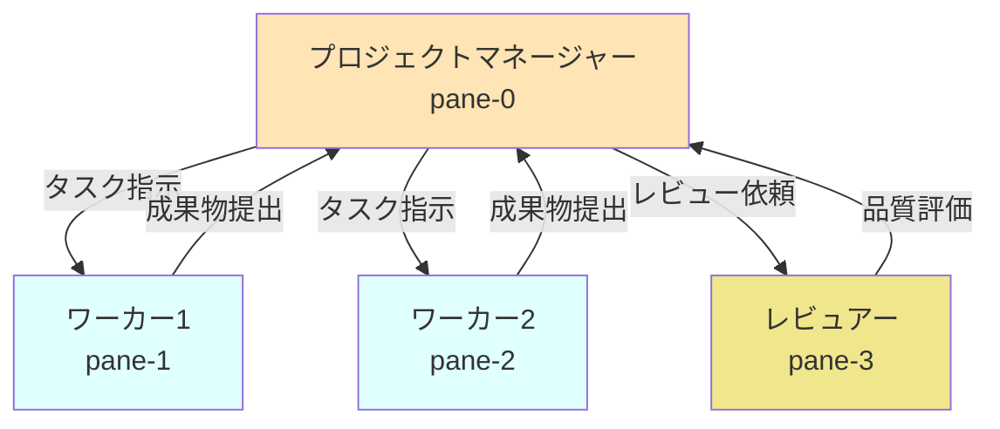
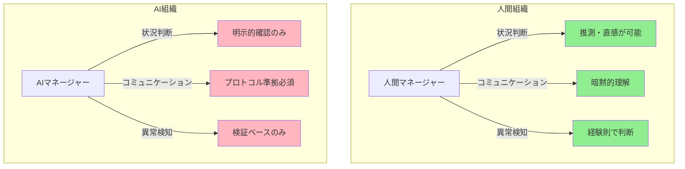
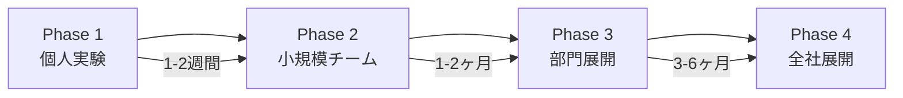

# AIエージェントによる自律的コンペ開発：tmux組織活動の実践ガイド

## はじめに：成功と失敗から学ぶAI協調開発

「複数のAIエージェントを競わせながら開発を進める」

この革新的な開発手法は、SF的な概念ではなく、今すぐ実践できる現実的なアプローチです。本記事では、tmuxを使った「AIエージェント組織化によるコンペ方式」について、実際の成功事例と失敗パターンの両面から解説します。

## 対象読者

- **エンジニアリングマネージャー、プロダクトマネージャー**：チーム生産性向上を目指す方
- **開発効率化に興味のある開発者**：AIツールの活用を検討している方
- **中級技術者**：基本的なAIツールは使えるが、組織的活用に課題を感じている方
- **システムアーキテクト**：分散AIシステムの設計に興味がある方

## 第1章：tmux組織活動の基礎理解

### 1.1 基本概念

tmux組織活動とは、ターミナルマルチプレクサー「tmux」を使用して、複数のAIエージェント（Claude、ChatGPT等）を同時に起動し、それぞれに異なる役割を与えて協調作業を行わせる開発手法です。



### 1.2 なぜtmuxなのか

tmuxを使用する最大の利点：
- **複数AIセッションの一元管理**：一つの画面で全てのAIエージェントを監視
- **リアルタイム連携**：ペイン間でのメッセージ送受信が可能
- **状態の可視化**：各エージェントの進捗を同時に確認

## 第2章：AI組織化の根本的課題と解決策

### 2.1 人間組織とAI組織の決定的な違い



### 2.2 実証された失敗パターンと対策

#### 失敗パターン1：ステートレス認知の罠
```bash
# ❌ 失敗例：推測に基づく状態報告
Manager: "3 Workers active" # AIの推測
Reality: "pane-1 completed, pane-2 idle, pane-3 error" # 実際の状態

# ✅ 成功例：実証ベースの確認
tmux capture-pane -t 1 -p | grep "Task completed"  # 実際の出力を確認
```

#### 失敗パターン2：コンテキスト分離の問題
```bash
# ❌ 失敗例：各AIが独立したコンテキストで動作
Worker1: "タスクAを実行中" # 他のWorkerの状況を知らない
Worker2: "タスクAを実行中" # 重複作業

# ✅ 成功例：共有コンテキストファイルの活用
cat /tmp/shared_context.md  # 全AIが参照する共通情報
```

## 第3章：実践的な実装手順

### 3.1 環境準備

#### Step 1: tmuxセッションの起動
```bash
# tmuxセッションを作成
tmux new-session -s ai-competition

# 画面を4分割（2x2のレイアウト）
tmux split-window -h
tmux split-window -v
tmux select-pane -t 0
tmux split-window -v
```

#### Step 2: 各ペインでAIエージェントを起動
```bash
# pane-0: Project Manager
claude -p "あなたはProject Managerです"

# pane-1: Worker 1
claude -p "あなたはTask Worker 1です"

# pane-2: Worker 2  
claude -p "あなたはTask Worker 2です"

# pane-3: Reviewer
claude -p "あなたはQuality Reviewerです"
```

### 3.2 実証済み5ステップ成功プロトコル

#### Step 0: 基盤準備
```bash
# 組織状態の開始
source organization_state_manager.sh
start_organization_state "team-$(date +%Y%m%d-%H%M%S)" 0

# 知識ロード
smart_knowledge_load "organization" "team-coordination"
```

#### Step 1: 包括的ブリーフィング
```bash
# 共有コンテキストファイルの作成
cat > /tmp/briefing_context.md << EOF
# 組織活動ブリーフィング
## タスク: [具体的なタスク内容]
## 役割分担:
- pane-0: Project Manager
- pane-1: Worker (実装担当)
- pane-2: Worker (競争実装)
- pane-3: Reviewer

## 必須ルール:
1. tmuxメッセージ送信時はEnterを別送信
2. 完了報告は必須
3. 実証ベースの確認のみ
EOF
```

### 3.3 コンペ方式の実装

#### 競争的開発の利点
1. **品質向上**：異なるアプローチの比較検討
2. **創造性**：多様な解決策の創出
3. **リスク分散**：単一障害点の回避

#### 実装例：記事作成タスク
```bash
# Worker 1への指示
tmux send-keys -t 1 'claude -p "実践的視点で記事を作成してください"'
tmux send-keys -t 1 Enter

# Worker 2への指示（競争）
tmux send-keys -t 2 'claude -p "理論的視点で記事を作成してください"'
tmux send-keys -t 2 Enter
```

## 第4章：人間とAIの役割分担

### 4.1 人間が実施すべきこと

#### 必須タスク
1. **初期設定とプロンプト作成**
   ```bash
   # スラッシュコマンドの作成
   cat > .claude/commands/team_setup.md << 'EOF'
   # チーム編成コマンド
   tmux new-session -s team
   # ... 設定内容
   EOF
   ```

2. **品質基準の定義**
   - レビューチェックリストの作成
   - 成功指標の設定

3. **最終判断と承認**
   - AIの提案を評価
   - ビジネス判断の実施

### 4.2 AIエージェントが自動化できること

#### 自動化可能なタスク
1. **コード生成と実装**
2. **テスト作成と実行**
3. **ドキュメント作成**
4. **相互レビューとフィードバック**

#### 自動化の限界
- **創造的な問題定義**：人間の洞察が必要
- **倫理的判断**：AIには判断基準がない
- **ステークホルダー調整**：人間関係の理解が必要

## 第5章：実践的なトラブルシューティング

### 5.1 よくある問題と対処法

#### 問題1：AIエージェントが応答しない
```bash
# 診断コマンド
tmux capture-pane -t [pane] -p | tail -20

# 対処法
tmux send-keys -t [pane] C-c  # 中断
tmux send-keys -t [pane] 'claude -p "続きから再開"' Enter
```

#### 問題2：タスクの重複実行
```bash
# 予防策：明確な役割分担
echo "Worker1: 機能A担当" >> /tmp/task_allocation.md
echo "Worker2: 機能B担当" >> /tmp/task_allocation.md
```

### 5.2 パフォーマンス最適化

#### リソース管理
```bash
# CPU使用率の監視
top -p $(pgrep -d, claude)

# メモリ使用量の確認
ps aux | grep claude | awk '{sum+=$6} END {print sum/1024 " MB"}'
```

## 第6章：組織導入のロードマップ

### 6.1 段階的導入計画



### 6.2 成功指標（KPI）

| フェーズ | 指標 | 目標値 |
|---------|------|--------|
| Phase 1 | タスク完了率 | 80%以上 |
| Phase 2 | 開発速度向上率 | 30%向上 |
| Phase 3 | 品質指標改善 | バグ率50%削減 |
| Phase 4 | ROI | 投資回収2年以内 |

## 第7章：実践チェックリスト

### 7.1 導入前チェックリスト

- [ ] tmuxの基本操作を理解している
- [ ] AIツール（Claude/ChatGPT）のアカウントがある
- [ ] セキュリティポリシーを確認した
- [ ] 試験的なタスクを準備した

### 7.2 実行時チェックリスト

- [ ] 共有コンテキストファイルを作成した
- [ ] 各AIエージェントにブリーフィングを送信した
- [ ] Enter別送信ルールを守っている
- [ ] 定期的に進捗を確認している

### 7.3 完了時チェックリスト

- [ ] 全ワーカーから完了報告を受信した
- [ ] 成果物の品質レビューを実施した
- [ ] 改善点を記録した
- [ ] 次回への知見を文書化した

## まとめ：AIエージェント組織化の未来

tmux組織活動によるコンペ方式は、以下の価値を提供します：

1. **即効性**：今すぐ始められる具体的な手法
2. **拡張性**：小規模から大規模まで適用可能
3. **実証済み**：成功事例に基づく確実なアプローチ

### 次のステップ

1. **今日できること**：tmuxで2つのAIエージェントを起動し、簡単なタスクを競争させてみる
2. **今週できること**：チームメンバーと小規模な実験を実施
3. **今月できること**：実プロジェクトへの部分的な導入

### 最後に

AIエージェントの組織化は、単なる技術的な挑戦ではありません。これは、人間とAIが協調する新しい働き方の探求です。失敗を恐れず、小さく始めて、継続的に改善していくことが成功への鍵となります。

---

**参考資料**
- tmux公式ドキュメント
- Claude API ドキュメント
- 実証実験レポート（2025年1月実施）

**著者について**
本記事は、AI組織活動の実践経験を持つ複数のエンジニアとAIエージェントの協働により作成されました。