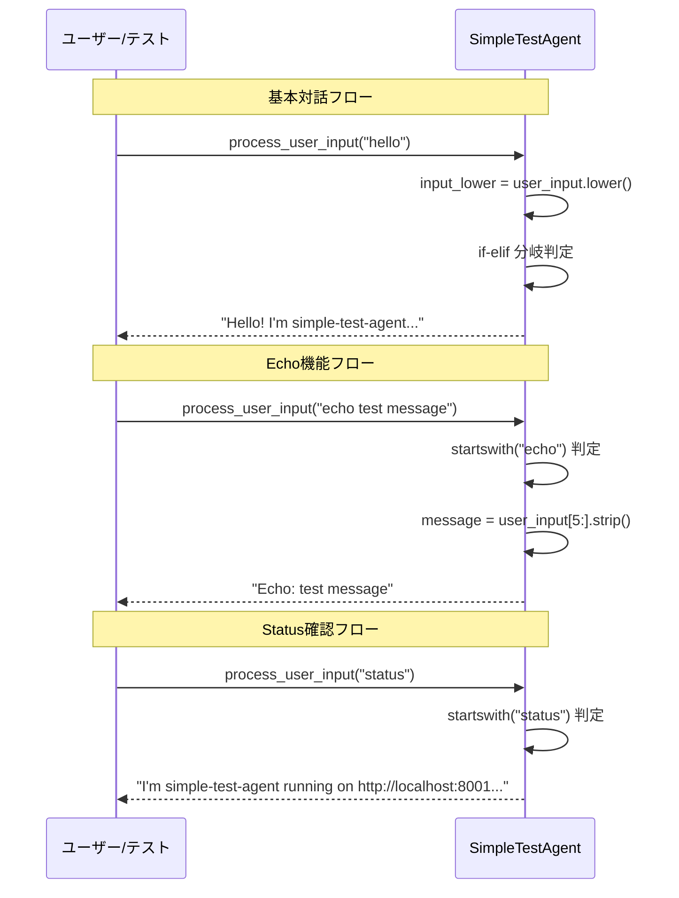
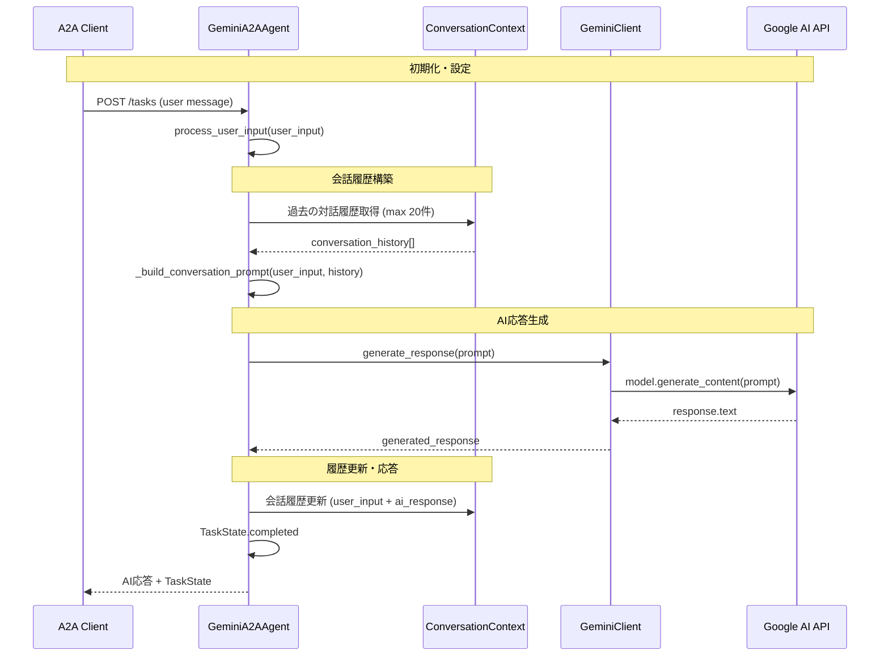

# サンプルコード実装フロー詳細 - 技術分析との対応関係

## 🎯 概要

このドキュメントは、[技術分析A2Aプロトコル効果分析](technical_analysis_a2a_protocol_effectiveness.md)で示された**理想的なAgent-to-Agent通信シーケンス**と、**実際に実装されたサンプルコード**の関係を明確にします。

---

## ⚠️ **重要: シーケンス図と実装の乖離**

### **技術分析ドキュメント vs 実装サンプルコード**

| 項目 | 技術分析ドキュメント | 実装サンプルコード | 状況 |
|------|---------------------|-------------------|------|
| **通信パターン** | Agent-to-Agent協調通信 | Client-to-Single-Agent | ❌ **不一致** |
| **エージェント数** | 複数エージェント (AgentA ↔ AgentB) | 単一エージェント | ❌ **不一致** |
| **協調処理** | POST /collaborate によるスキル連携 | 単一エージェント内処理 | ❌ **未実装** |
| **用途** | **理想的なA2A活用例** | **プロトコル学習・検証用** | ✅ **目的が異なる** |

---

## 🔧 実装済みサンプルコードの実際のフロー

### **1. Simple Test Agent フロー**

#### **目的**: A2Aプロトコルの基本構造理解・動作確認

#### **実装特徴**:
- **AI不使用**: 固定的なif-elif分岐処理
- **学習目的**: A2Aプロトコル構造の理解
- **実装ファイル**: `app/a2a_prototype/agents/simple_agent.py`

---

### **2. Gemini AI Agent フロー**

#### **目的**: 実用的AI対話システム（A2A準拠）

#### **実装特徴**:
- **Gemini 2.5 Pro統合**: 高度なAI対話機能
- **会話履歴管理**: 最大20メッセージ（10往復）保持
- **実用レベル**: プロダクション環境対応
- **実装ファイル**: `app/a2a_prototype/agents/gemini_agent.py`

---

## 📋 技術分析ドキュメントとの対応関係

### **技術分析ドキュメントの効果的な活用方法**

#### **✅ 適用可能な部分**:
1. **プロトコル構造理解**: AgentCard、AgentSkill、TaskState等の基本概念
2. **パフォーマンス指標**: レイテンシ削減・メモリ効率化の技術効果
3. **実装方針**: 非同期処理・エラーハンドリング等のベストプラクティス
4. **採用戦略**: 技術選択・適用領域の判断基準

#### **❌ 現在未実装の部分**:
1. **Agent-to-Agent通信**: 複数エージェント間の協調処理
2. **POST /collaborate**: エージェント間協調エンドポイント
3. **分散処理ワークフロー**: 並列タスク実行・エラー回復等

---

## 🎯 実装レベル別フロー対応表

### **Level 1: プロトコル学習レベル**
- **対象**: Simple Test Agent
- **フロー記載**: `app/a2a_prototype/README.md`
- **用途**: A2A基本構造の理解・動作確認

### **Level 2: 実用システムレベル**  
- **対象**: Gemini AI Agent
- **フロー記載**: `docs/02.basic_design/gemini_a2a_basic_design.md` (Line 164)
- **用途**: 実際のAI対話システム構築

### **Level 3: エンタープライズレベル** ⚠️ **未実装**
- **対象**: 複数エージェント協調システム
- **フロー記載**: `docs/technical_analysis_a2a_protocol_effectiveness.md` (理想例)
- **用途**: 大規模分散AIシステム

---

## 🔍 実装サンプルコードの検証ポイント

### **Simple Test Agent で検証できること**:
- ✅ A2Aプロトコル基本構造 (AgentCard, AgentSkill)
- ✅ TaskState状態管理
- ✅ JSON-RPC 2.0通信
- ✅ 基本的なエラーハンドリング

### **Gemini AI Agent で検証できること**:
- ✅ 実用的なAI対話システム
- ✅ 会話履歴管理・文脈理解
- ✅ 非同期処理・高パフォーマンス
- ✅ 高度なエラーハンドリング・API統合

### **現在検証できないこと** ⚠️:
- ❌ Agent間通信プロトコル
- ❌ 複数エージェント協調処理
- ❌ 分散ワークフロー管理
- ❌ エージェント発見・連携機能

---

## 📚 関連ドキュメント・実装ファイルマップ

### **実装フロー詳細記載場所**:

| エージェント | フロー記載ドキュメント | 実装ファイル | シーケンス図 |
|--------------|----------------------|-------------|-------------|
| **Simple Test** | `app/a2a_prototype/README.md` | `agents/simple_agent.py` | ❌ 未作成 |
| **Gemini AI** | `docs/02.basic_design/gemini_a2a_basic_design.md` | `agents/gemini_agent.py` | ✅ Line 164 |
| **Agent協調** ⚠️ | `docs/technical_analysis_a2a_protocol_effectiveness.md` | ❌ 未実装 | ✅ 理想例のみ |

### **技術分析ドキュメントの位置づけ**:
- **目的**: A2Aプロトコルの**技術的可能性・効果**の分析
- **スコープ**: **理想的な活用シナリオ**の提示
- **実装状況**: **概念実証レベル** (実際の複数エージェント協調は未実装)

---

## 🎯 まとめ: シーケンス図と実装の関係

### **現在の状況**:
1. **技術分析ドキュメント**: A2Aプロトコルの**理想的な活用例**を示す
2. **実装サンプルコード**: A2Aプロトコルの**基本構造学習・実用化検証**を提供
3. **目的の違い**: 理想像の提示 vs 実用的な学習・検証ツール

### **推奨活用方法**:
1. **学習段階**: Simple Test Agent で基本理解
2. **実用検証**: Gemini AI Agent で実際のシステム構築検証  
3. **将来拡張**: 技術分析の理想シーケンスを参考に複数エージェント協調を実装

**重要**: 現在のサンプルコードは**A2Aプロトコル学習・検証**に最適化されており、**Agent-to-Agent通信の実装例ではない**ことを理解することが重要です。

---

**作成日**: 2025-01-XX  
**関連資料**: 
- [技術分析A2Aプロトコル効果分析](technical_analysis_a2a_protocol_effectiveness.md)
- [A2A実装ガイド](a2a_implementation_guide.md)
- [Gemini基本設計書](02.basic_design/gemini_a2a_basic_design.md) 