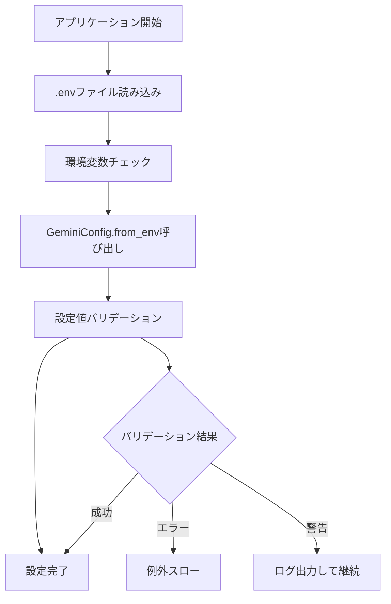

# 統合設定管理システム

## 📋 概要

プロジェクトの環境変数と設定ファイルが散在しないように、統一された設定管理システムを設計しています。

---

## 🏗️ 設定の優先順位

以下の優先順位で設定値が決定されます：

1. **環境変数** (最高優先度)
2. **`.env`ファイル**
3. **設定クラスのデフォルト値** (最低優先度)

---

## 📂 設定ファイル構成

### 核心設定ファイル
- `app/a2a_prototype/utils/gemini_config.py` - Gemini API設定管理
- `.env` - プロジェクト固有の環境変数（Git管理外）
- `.env.example` - 環境変数のサンプル設定

### ドキュメント
- `docs/setup/api_key_configuration.md` - APIキー設定ガイド
- `docs/setup/gemini_model_list.md` - 利用可能モデル一覧
- `docs/setup/unified_configuration.md` - 統合設定説明（このファイル）

---

## 🔧 設定項目一覧

### 必須設定（APIキー）
| 環境変数 | 必須 | デフォルト値 | 説明 |
|----------|------|-------------|------|
| `GEMINI_API_KEY` | ✅ | なし | Google Gemini APIキー |

### オプション設定（Gemini）
| 環境変数 | 必須 | デフォルト値 | 説明 |
|----------|------|-------------|------|
| `GEMINI_MODEL` | ❌ | `gemini-2.5-pro-preview-05-06` | 使用するGeminiモデル |
| `GEMINI_TEMPERATURE` | ❌ | `0.7` | 創造性パラメータ（0.0-1.0） |
| `GEMINI_MAX_TOKENS` | ❌ | `1000` | 最大出力トークン数 |

### オプション設定（A2Aエージェント）
| 環境変数 | 必須 | デフォルト値 | 説明 |
|----------|------|-------------|------|
| `A2A_AGENT_PORT` | ❌ | `8004` | エージェントサーバーポート |
| `DEBUG_MODE` | ❌ | `false` | デバッグモード |

---

## 🎯 推奨モデル選択

### 用途別推奨設定

#### 🚀 高性能・高精度重視
```bash
GEMINI_MODEL=gemini-2.5-pro-preview-05-06
GEMINI_TEMPERATURE=0.3
GEMINI_MAX_TOKENS=2000
```

#### ⚡ バランス重視（推奨）
```bash
GEMINI_MODEL=gemini-2.5-flash-preview-05-20
GEMINI_TEMPERATURE=0.7
GEMINI_MAX_TOKENS=1000
```

#### 💰 コスト重視
```bash
GEMINI_MODEL=gemini-2.0-flash-lite
GEMINI_TEMPERATURE=0.5
GEMINI_MAX_TOKENS=500
```

---

## 🔄 設定の読み込みフロー



---

## 📝 設定例

### .envファイル例
```bash
# 必須: Google Gemini API Key
GEMINI_API_KEY=AIzaSyD...your-actual-api-key-here

# オプション: Geminiモデル設定
GEMINI_MODEL=gemini-2.5-pro-preview-05-06
GEMINI_TEMPERATURE=0.7
GEMINI_MAX_TOKENS=1000

# オプション: A2Aエージェント設定
A2A_AGENT_PORT=8004

# オプション: 開発設定
DEBUG_MODE=false
```

### コード内での使用例
```python
from app.a2a_prototype.utils.gemini_config import GeminiConfig

# 環境変数から自動読み込み
config = GeminiConfig.from_env()

# 手動設定も可能
config = GeminiConfig(
    api_key="your-api-key",
    model="gemini-2.5-pro-preview-05-06",
    temperature=0.7,
    max_tokens=1000
)
```

---

## ⚠️ セキュリティ注意事項

### 🔒 機密情報の取り扱い
1. **`.env`ファイルはGit管理外**（`.gitignore`に追加済み）
2. **APIキーはマスキングして表示**（ログ出力時）
3. **環境変数で機密情報を渡す**（本番環境）

### 🚫 やってはいけないこと
- APIキーをコードに直接記述
- `.env`ファイルをGitにコミット
- ログにAPIキー全体を出力

---

## 🧪 テスト環境での設定

### テスト用環境変数
```bash
# テスト専用のダミーAPIキー
GEMINI_API_KEY=test-api-key-12345678

# テスト用モデル設定
GEMINI_MODEL=gemini-2.5-pro-preview-05-06
GEMINI_TEMPERATURE=0.5
GEMINI_MAX_TOKENS=500
```

### テスト設定ファイル
- `tests/fixtures/gemini_fixtures.py` - テスト用固定設定
- 実際のAPIは呼び出さず、モックを使用

---

## 🔄 設定の更新・メンテナンス

### 新しいモデルが追加された場合
1. `docs/setup/gemini_model_list.md` を更新
2. `app/a2a_prototype/utils/gemini_config.py` の `valid_models` リストを更新
3. `.env.example` の推奨設定を見直し

### 環境変数を追加する場合
1. `GeminiConfig` データクラスにフィールド追加
2. `from_env` メソッドを更新
3. バリデーションロジックを追加
4. ドキュメント更新

---

## 🔗 関連ドキュメント

- [APIキー設定ガイド](api_key_configuration.md)
- [Geminiモデル一覧](gemini_model_list.md)
- [プロジェクトルール](../../.cursor/rules/project.mdc)

---

*この設定システムにより、環境間での設定の一貫性と管理の容易さを実現しています。* 