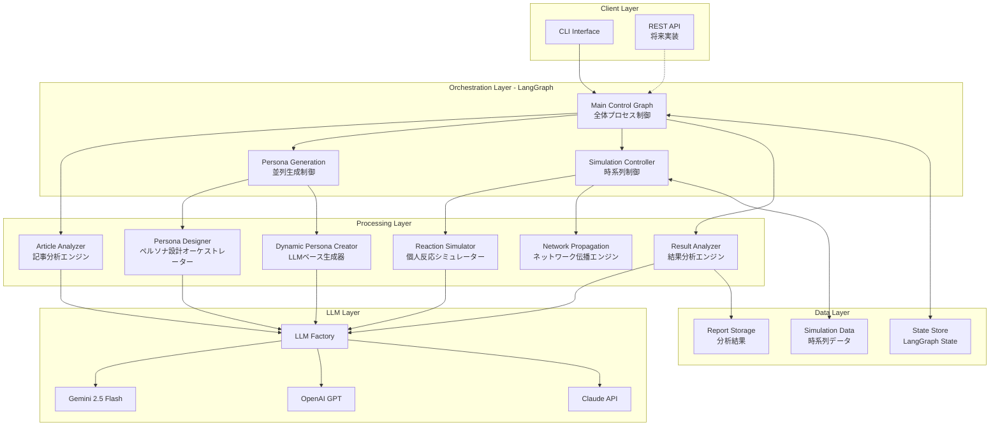
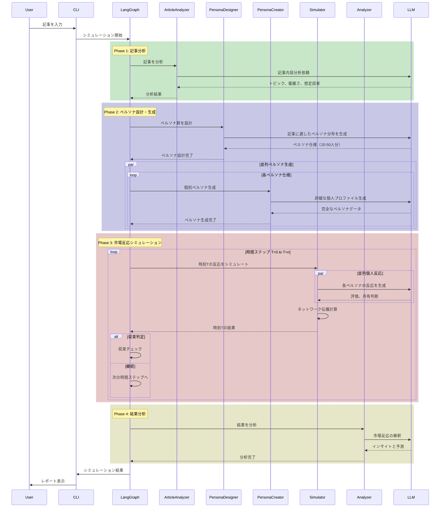
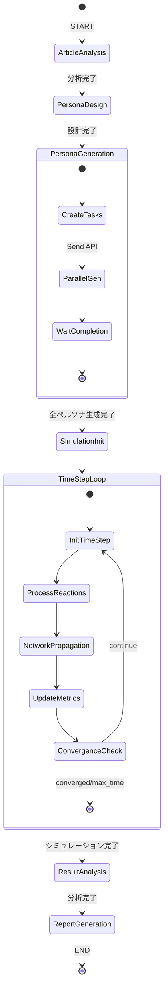
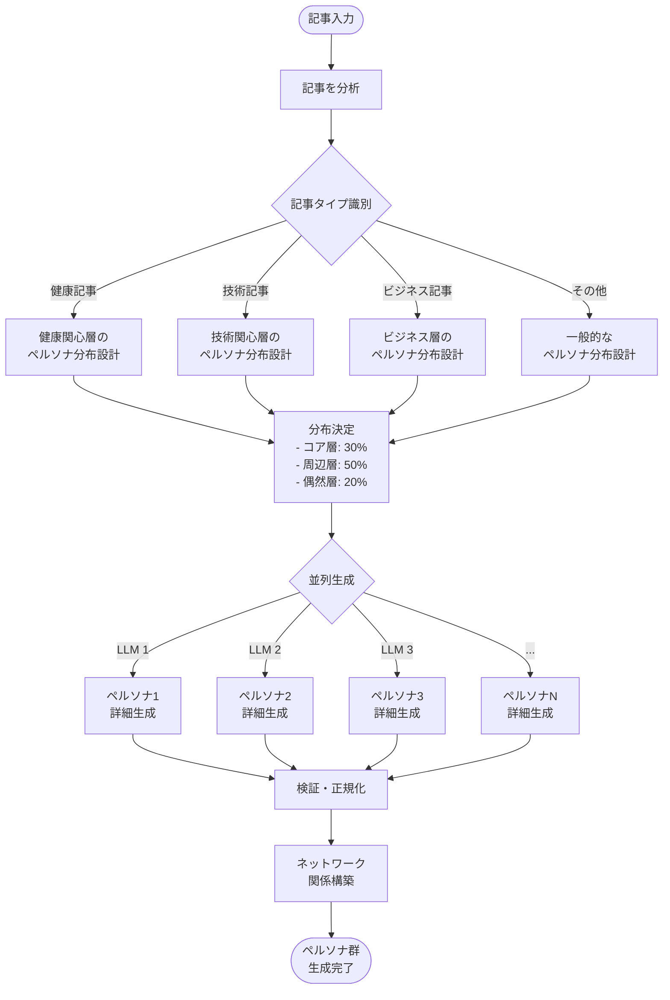
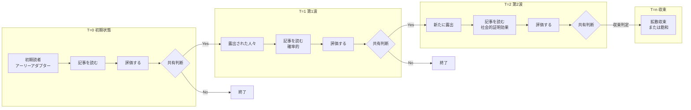
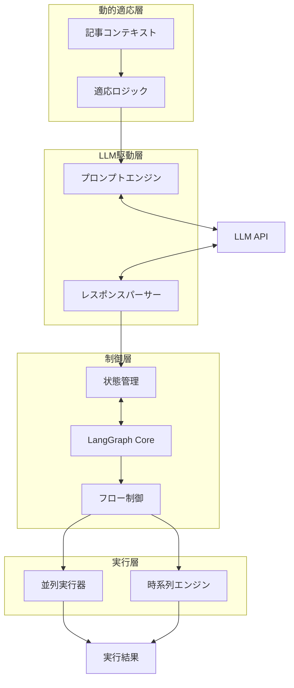
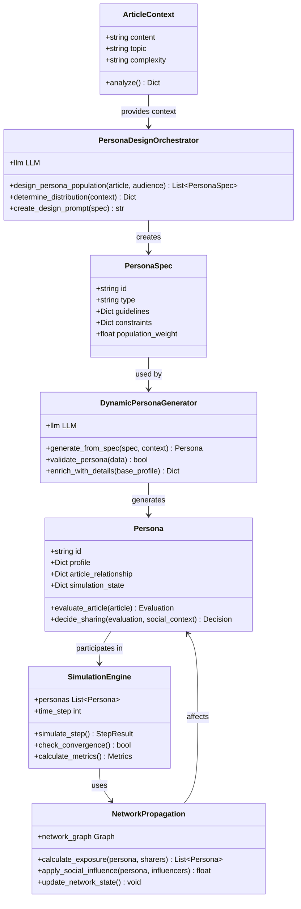

# システム設計図 - 動的ペルソナ生成による市場反応シミュレーション

## 1. システム構成図



## 2. 処理シーケンス図



## 3. LangGraphフロー図



## 4. データフロー図

```mermaid
graph LR
    subgraph "Input"
        Article[記事テキスト]
        Config[設定パラメータ]
    end
    
    subgraph "Phase 1: Analysis"
        ArticleData[記事分析データ]
        Audience[想定読者プロファイル]
    end
    
    subgraph "Phase 2: Generation"
        PersonaSpecs[ペルソナ仕様<br/>20-50件]
        Personas[生成済みペルソナ<br/>詳細プロファイル]
        Network[ソーシャルネットワーク<br/>関係性マップ]
    end
    
    subgraph "Phase 3: Simulation"
        Timeline[時系列データ]
        Interactions[相互作用ログ]
        Propagation[伝播パターン]
    end
    
    subgraph "Phase 4: Output"
        Metrics[評価指標]
        Insights[市場インサイト]
        Report[最終レポート]
    end
    
    Article --> ArticleData
    Config --> ArticleData
    
    ArticleData --> Audience
    Audience --> PersonaSpecs
    
    PersonaSpecs -->|LLM並列生成| Personas
    Personas --> Network
    
    Network --> Timeline
    Timeline -->|時間発展| Interactions
    Interactions --> Propagation
    
    Propagation --> Metrics
    Metrics --> Insights
    Insights --> Report
```



## 5. ペルソナ生成の詳細フロー



## 6. 時系列シミュレーションフロー



## 7. システム全体のコンポーネント相互作用



## 8. データモデル関係図

```mermaid
erDiagram
    Article ||--|| ArticleAnalysis : has
    ArticleAnalysis ||--|| TargetAudience : identifies
    TargetAudience ||--|{ PersonaSpecification : generates
    
    PersonaSpecification ||--|| GeneratedPersona : creates
    GeneratedPersona ||--o{ PersonaAttribute : has
    GeneratedPersona ||--|| SimulationState : maintains
    GeneratedPersona }o--o{ GeneratedPersona : influences
    
    SimulationState ||--|{ TimeStepData : records
    TimeStepData ||--|{ InteractionEvent : contains
    InteractionEvent ||--|| PersonaDecision : represents
    
    PersonaDecision ||--o| SharingAction : may_result_in
    SharingAction ||--|{ NetworkPropagation : triggers
    
    NetworkPropagation ||--|| MarketMetrics : produces
    MarketMetrics ||--|| FinalReport : summarized_in
    
    Article {
        string id PK
        string content
        string title
        datetime created_at
        json metadata
    }
    
    ArticleAnalysis {
        string id PK
        string article_id FK
        json topics
        string complexity_level
        json target_keywords
        string tone
        float estimated_reading_time
    }
    
    TargetAudience {
        string id PK
        string analysis_id FK
        json primary_segments
        json secondary_segments
        int estimated_size
        json characteristics
    }
    
    PersonaSpecification {
        string id PK
        string audience_id FK
        string persona_type
        json design_guidelines
        json target_attributes
        float weight_in_population
    }
    
    GeneratedPersona {
        string id PK
        string spec_id FK
        json profile
        json demographics
        json psychographics
        json behavior_patterns
        float influence_score
    }
    
    PersonaAttribute {
        string id PK
        string persona_id FK
        string attribute_type
        string attribute_name
        json attribute_value
    }
    
    SimulationState {
        string persona_id PK_FK
        boolean has_read
        json evaluation
        json sharing_decision
        int influenced_by_count
        datetime last_updated
    }
    
    TimeStepData {
        int time_step PK
        string simulation_id PK
        int new_readers
        int new_sharers
        float viral_coefficient
        json network_snapshot
    }
    
    InteractionEvent {
        string id PK
        int time_step FK
        string actor_persona_id FK
        string action_type
        json action_details
        datetime timestamp
    }
```

## 9. 動的ペルソナ生成の概念モデル



## 10. LangGraphステート遷移の詳細

```mermaid
stateDiagram-v2
    [*] --> Initialize: START
    
    state Initialize {
        [*] --> LoadArticle
        LoadArticle --> ValidateInput
        ValidateInput --> [*]
    }
    
    Initialize --> ArticleAnalysis: Valid Input
    
    state ArticleAnalysis {
        [*] --> ExtractTopics
        ExtractTopics --> AnalyzeComplexity
        AnalyzeComplexity --> IdentifyAudience
        IdentifyAudience --> [*]
    }
    
    ArticleAnalysis --> PersonaDesign: Analysis Complete
    
    state PersonaDesign {
        [*] --> DetermineDistribution
        DetermineDistribution --> CreateSpecifications
        CreateSpecifications --> ValidateSpecs
        ValidateSpecs --> [*]
    }
    
    PersonaDesign --> PersonaGeneration: Specs Ready
    
    state PersonaGeneration {
        [*] --> BatchPersonas
        BatchPersonas --> ParallelGeneration
        
        state ParallelGeneration {
            [*] --> GenerateP1
            [*] --> GenerateP2
            [*] --> GenerateP3
            [*] --> GeneratePN
            
            GenerateP1 --> [*]
            GenerateP2 --> [*]
            GenerateP3 --> [*]
            GeneratePN --> [*]
        }
        
        ParallelGeneration --> ValidatePersonas
        ValidatePersonas --> BuildNetwork
        BuildNetwork --> [*]
    }
    
    PersonaGeneration --> Simulation: Personas Ready
    
    state Simulation {
        [*] --> T0_Initial
        
        state T0_Initial {
            [*] --> IdentifyEarlyAdopters
            IdentifyEarlyAdopters --> InitialReactions
            InitialReactions --> [*]
        }
        
        T0_Initial --> TimeLoop
        
        state TimeLoop {
            [*] --> ProcessExposure
            ProcessExposure --> EvaluateContent
            EvaluateContent --> MakeSharingDecision
            MakeSharingDecision --> UpdateNetwork
            UpdateNetwork --> CheckConvergence
            
            CheckConvergence --> ProcessExposure: Continue
            CheckConvergence --> [*]: Converged
        }
        
        TimeLoop --> [*]
    }
    
    Simulation --> Analysis: Simulation Complete
    
    state Analysis {
        [*] --> AggregateMetrics
        AggregateMetrics --> IdentifyPatterns
        IdentifyPatterns --> GenerateInsights
        GenerateInsights --> [*]
    }
    
    Analysis --> Reporting: Analysis Complete
    
    state Reporting {
        [*] --> FormatResults
        FormatResults --> CreateVisualizations
        CreateVisualizations --> GenerateReport
        GenerateReport --> [*]
    }
    
    Reporting --> [*]: END
```



これらの図は、現在の動的ペルソナ生成システムの設計を包括的に表現しています。