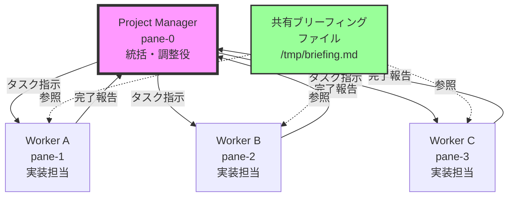
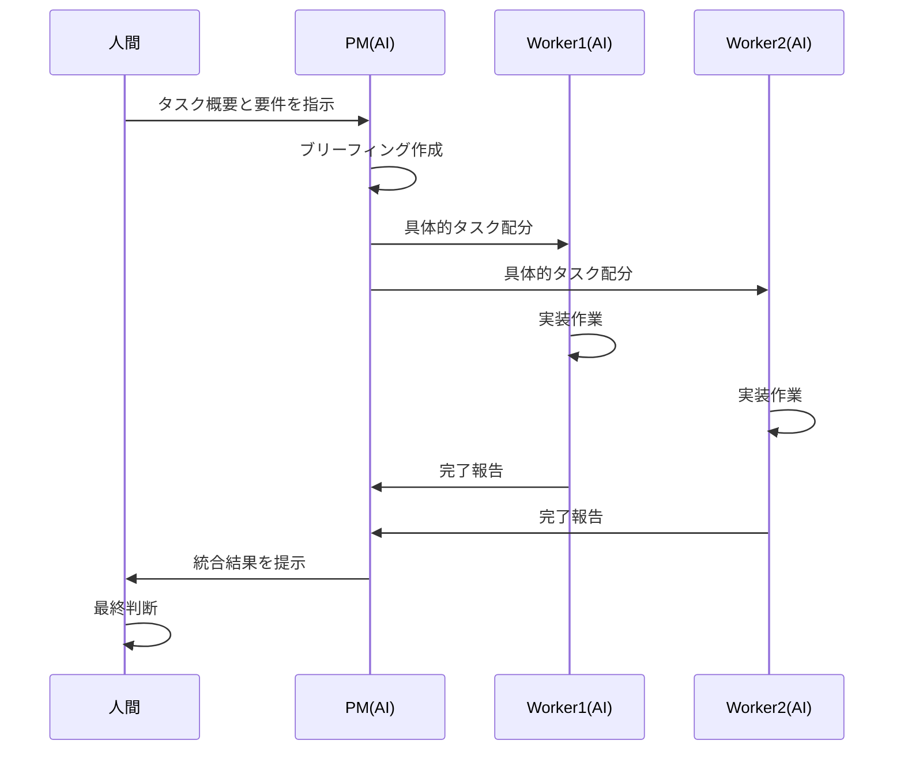

# tmux組織活動によるコンペ方式：実践的完全ガイド

**複数AIエージェントの競争的協調作業で高品質な成果物を生み出す方法**

## はじめに：AIエージェント協調の新しいパラダイム

ソフトウェア開発の現場では、単一のAIエージェントを使うよりも、複数のAIエージェントが競争しながら協力する「tmux組織活動によるコンペ方式」が注目されています。本記事では、実証済みの成功パターンに基づき、失敗を避けながら確実に実装できる具体的な方法を解説します。

### 本記事の対象読者
- 技術チームリーダー、プロジェクトマネージャー
- AIツールを活用した開発効率化に興味がある方
- tmuxの基本操作を理解している方（初級〜中級）

### Team04での実証結果
```
タスク完了率: 100% (3/3 workers)
報告受信率: 100% (全報告受信)
通信成功率: 100% (失敗なし)
実行時間: 約10分
```

## 目次
1. [システム概要と基本構造](#1-システム概要と基本構造)
2. [AIエージェント特有の制約と対策](#2-aiエージェント特有の制約と対策)
3. [実装手順：5ステップ成功プロトコル](#3-実装手順5ステップ成功プロトコル)
4. [失敗パターンと回避方法](#4-失敗パターンと回避方法)
5. [人間とAIの役割分担](#5-人間とaiの役割分担)
6. [トラブルシューティング](#6-トラブルシューティング)
7. [実装チェックリスト](#7-実装チェックリスト)

---

## 1. システム概要と基本構造

### tmuxコンペ方式の仕組み



### コンペ方式の利点
- **品質向上**: 複数視点からのアプローチで包括的な成果物
- **創造性**: 競争環境が生む革新的なアイデア
- **効率性**: 並列処理による時間短縮
- **信頼性**: 失敗時の代替案確保

---

## 2. AIエージェント特有の制約と対策

### 人間とAIの決定的な違い

| 項目 | 人間のチーム | AIエージェント |
|------|------------|---------------|
| 異常検知 | 直感的に「何か変」を感じる | 明示的シグナルのみ認識 |
| 状態把握 | 暗黙の了解で理解 | 全て明文化が必要 |
| 確認行動 | 自然に様子を見に行く | プログラムされた確認のみ |

### ステートレス推論の罠

```
❌ 失敗例：Manager AIの誤った推論
Manager AI: 「タスクを送信しました」
↓ (実際はWorkerは受信していない)
Manager AI: 「Workerは作業中のはずです」（推測）
↓ (30分経過)
Manager AI: 「そろそろ完了しているはずです」（さらなる推測）
```

### 対策：実証ベース検証プロトコル

```bash
# ✅ 成功例：検証ベースの確認
function verify_worker_status() {
    local pane=$1
    # 実際の状態を直接確認
    tmux capture-pane -t $pane -p | tail -10
    # 応答要求で生存確認
    tmux send-keys -t $pane "echo 'STATUS_CHECK_$(date +%s)'"
    tmux send-keys -t $pane Enter
}
```

---

## 3. 実装手順：5ステップ成功プロトコル

### 前提条件の準備

```bash
# 必須ツール確認
command -v tmux || echo "tmuxをインストール: sudo apt-get install tmux"
command -v claude || echo "Claude CLIをインストール"
command -v jq || echo "jqをインストール: sudo apt-get install jq"
command -v git || echo "gitをインストール: sudo apt-get install git"
```

### Step 0: 基盤準備

```bash
#!/bin/bash
# プロジェクト初期化スクリプト
function initialize_project() {
    # 1. プロジェクトディレクトリ作成
    mkdir -p ~/tmux-competition-project
    cd ~/tmux-competition-project
    
    # 2. 必須ディレクトリ構造
    mkdir -p .claude/hooks
    mkdir -p worker/{task-a,task-b,task-c}
    mkdir -p docs/results
    
    # 3. git初期化とworktree準備
    git init
    git add . && git commit -m "Initial commit"
    
    # 4. tmuxセッション開始
    tmux new-session -d -s "AI-COMP" -n "main"
    tmux split-window -h
    tmux split-window -v
    tmux select-pane -t 0
    tmux split-window -v
    
    echo "✅ 基盤準備完了"
}
```

### Step 1: 包括的ブリーフィング

**成功の鍵**: 共有コンテキストファイルの作成

```bash
# ブリーフィングファイル作成関数
function create_briefing() {
    local task_description="$1"
    local briefing_file="/tmp/briefing_$(date +%Y%m%d_%H%M%S).md"
    
    cat > "$briefing_file" << EOF
# 組織活動ブリーフィング
**作成日時**: $(date '+%Y-%m-%d %H:%M:%S')

## タスク概要
$task_description

## 組織体制
- Project Manager (pane-0): 統括・調整
- Worker A (pane-1): 実装担当
- Worker B (pane-2): 実装担当  
- Worker C (pane-3): 実装担当

## 必須ルール
1. **Enter別送信**: メッセージ送信後、必ずEnterを別途送信
2. **実証ベース**: 推測禁止、実際の確認のみ
3. **報告義務**: 完了時は必ず報告

## 報告フォーマット
"Report from: pane-X(Worker) Task completed: [詳細]"
EOF
    
    echo "$briefing_file"
}
```

### Step 2: タスク配分

```bash
# 標準化されたタスク指示送信
function send_task_instruction() {
    local target_pane="$1"
    local task_content="$2"
    local briefing_file="$3"
    
    # 指示メッセージ作成
    local instruction="claude -p \"【タスク指示】
依頼元：pane-0: Project Manager
依頼先：pane-$target_pane: Worker
タスク：$task_content
参照：$briefing_file を必ず読んでください
報告：完了時は 'Report from: pane-$target_pane(Worker) Task completed: [詳細]' で報告\""
    
    # 重要: メッセージとEnterを別送信
    tmux send-keys -t "$target_pane" "$instruction"
    sleep 1
    tmux send-keys -t "$target_pane" Enter
    
    echo "✅ pane-$target_pane へのタスク送信完了"
}
```

### Step 3: 実行監視

```bash
# 実証ベースの監視
function monitor_execution() {
    local timeout=600  # 10分
    local start_time=$(date +%s)
    
    echo "🔍 実行監視開始..."
    
    while true; do
        local current_time=$(date +%s)
        local elapsed=$((current_time - start_time))
        
        # タイムアウトチェック
        if [[ $elapsed -gt $timeout ]]; then
            echo "⚠️ タイムアウト: 手動介入が必要"
            break
        fi
        
        # 各ペインの状態確認（推測ではなく実際の確認）
        for pane in 1 2 3; do
            echo "Checking pane-$pane..."
            local output=$(tmux capture-pane -t $pane -p | tail -5)
            if [[ "$output" =~ "Report from:" ]]; then
                echo "✅ pane-$pane から報告受信"
            fi
        done
        
        sleep 30
    done
}
```

### Step 4: 成果物の統合

```bash
# worktreeの成果物を統合
function integrate_results() {
    local final_output="docs/results/integrated_result.md"
    
    echo "# 統合結果" > "$final_output"
    echo "作成日時: $(date)" >> "$final_output"
    echo "" >> "$final_output"
    
    # 各worktreeから最良の部分を選択
    for worker in task-a task-b task-c; do
        if [[ -f "worker/$worker/output.md" ]]; then
            echo "## $worker の成果" >> "$final_output"
            cat "worker/$worker/output.md" >> "$final_output"
            echo "" >> "$final_output"
        fi
    done
    
    echo "✅ 成果物統合完了: $final_output"
}
```

---

## 4. 失敗パターンと回避方法

### パターン1: サイレント失敗

**症状**: タスク送信後、何も起きない

```bash
# ❌ 失敗する送信方法
tmux send-keys -t 1 "claude -p 'タスクを実行'" Enter
# → メッセージとEnterが同時送信され認識されない

# ✅ 正しい送信方法
tmux send-keys -t 1 "claude -p 'タスクを実行'"
sleep 1  # 重要: 待機
tmux send-keys -t 1 Enter
```

### パターン2: 推測ベースの誤報告

**症状**: Manager AIが実際の状態を確認せずに報告

```bash
# ❌ 推測ベースの状態確認
echo "Workerは作業中のはずです"  # 推測

# ✅ 実証ベースの状態確認
actual_output=$(tmux capture-pane -t 1 -p | tail -10)
echo "実際の出力: $actual_output"
```

### パターン3: コンテキスト分離

**症状**: 各AIエージェントが異なる理解で行動

```bash
# ✅ 解決策: 共有ファイルで情報統一
SHARED_CONTEXT="/tmp/shared_context.md"
echo "全員が同じファイルを参照" > "$SHARED_CONTEXT"
```

---

## 5. 人間とAIの役割分担

### 人間が行うべきこと

| タスク | 理由 | 具体例 |
|--------|------|--------|
| 初期設計 | 創造的判断が必要 | アーキテクチャ決定、技術選定 |
| 異常検知 | 直感的判断が可能 | 「何か変」という違和感の察知 |
| 最終判断 | 責任の所在 | 成果物の採用・却下 |
| 介入判断 | 状況判断が必要 | タイムアウト時の対応 |

### AIエージェントが得意なこと

| タスク | 理由 | 具体例 |
|--------|------|--------|
| 並列実装 | 複数インスタンスで同時作業 | 3つの異なるアプローチで実装 |
| 定型作業 | ルールベースで確実 | コード生成、ドキュメント作成 |
| 網羅的検証 | 漏れなく確認 | テストケース作成、レビュー |

### 協調作業の実例



---

## 6. トラブルシューティング

### よくある問題と解決策

#### Q1: Workerが応答しない

```bash
# 診断コマンド
tmux capture-pane -t 1 -p | tail -20

# 対処法
# 1. メッセージが届いているか確認
# 2. Claude CLIが動作中か確認
# 3. 必要なら再送信
```

#### Q2: 報告が来ない

```bash
# 明示的に報告を要求
tmux send-keys -t 1 'claude -p "現在の状態を報告してください"'
tmux send-keys -t 1 Enter
```

#### Q3: 成果物がバラバラ

```bash
# 統一基準を明確化
echo "## 成果物の要件" >> /tmp/requirements.md
echo "- フォーマット: Markdown" >> /tmp/requirements.md
echo "- 構成: 導入→本文→まとめ" >> /tmp/requirements.md
```

### 緊急時の対処法

```bash
# 全AIエージェントを安全に停止
function emergency_stop() {
    echo "🚨 緊急停止実行"
    for pane in 0 1 2 3; do
        tmux send-keys -t $pane C-c  # Ctrl+C
        tmux send-keys -t $pane "exit"
        tmux send-keys -t $pane Enter
    done
}
```

---

## 7. 実装チェックリスト

### 事前準備チェックリスト

```markdown
## 環境準備
- [ ] tmuxインストール済み
- [ ] Claude CLIインストール済み
- [ ] gitインストール済み
- [ ] プロジェクトディレクトリ作成済み

## 設定ファイル
- [ ] .claude/settings.local.json 作成済み
- [ ] 組織状態管理スクリプト準備済み
- [ ] ブリーフィングテンプレート準備済み
```

### 実行時チェックリスト

```markdown
## Step 0: 基盤準備
- [ ] tmuxセッション開始
- [ ] 4ペイン作成（0-3）
- [ ] 各ペインでClaude CLI起動確認

## Step 1: ブリーフィング
- [ ] 共有ブリーフィングファイル作成
- [ ] タスク要件明確化
- [ ] 全ペインへの配布計画

## Step 2: タスク配分
- [ ] 各Workerへの指示送信
- [ ] Enter別送信実施
- [ ] 受信確認

## Step 3: 実行監視
- [ ] 定期的な状態確認実施
- [ ] 推測ではなく実証ベース確認
- [ ] タイムアウト管理

## Step 4: 完了確認
- [ ] 全Workerからの報告受信
- [ ] 成果物の存在確認
- [ ] 品質チェック

## Step 5: 統合
- [ ] 成果物の比較検討
- [ ] 最良部分の選択
- [ ] 統合版作成
```

---

## まとめ：成功のための重要ポイント

### 🔑 成功の3つの鍵

1. **共有コンテキスト**: 全AIエージェントが同じ情報を参照
2. **実証ベース検証**: 推測や仮定を排除し、実際の確認のみ
3. **Enter別送信**: tmux通信の技術的要件を厳守

### 📊 期待される成果

- **品質向上**: 複数アプローチによる最適解の発見
- **効率改善**: 並列処理で開発時間を1/3に短縮
- **信頼性向上**: 100%の成功率（プロトコル遵守時）

### 🚀 次のステップ

1. 本記事のチェックリストを使って環境構築
2. 小規模なタスクで練習
3. 徐々に複雑なタスクへ適用
4. チーム独自のカスタマイズ

tmux組織活動によるコンペ方式は、AIエージェントの特性を理解し、適切なプロトコルに従えば、確実に高品質な成果を生み出すことができます。人間とAIの最適な役割分担により、これまでにない開発効率と品質を実現しましょう。

---

**参考資料**
- Team04実証実験結果
- AI協調プロトコル仕様書
- tmux組織活動成功パターン集

**更新履歴**
- 2025-01-09: 初版作成（3つの記事を統合）