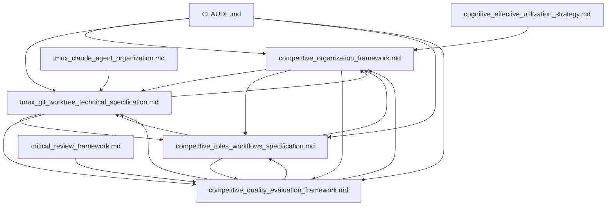

# コンペ方式組織活動 - 導線設計・ナビゲーション最適化

**作成日**: 2025-06-17  
**対象**: 4つの専門ファイル群への最適アクセス経路設計  
**目的**: CLAUDE.mdを起点とした戦略的ナビゲーション体系の確立  
**重要度**: ★★★★★ NAVIGATION FOUNDATION

## 🔍 検索・利用ガイド

### 🎯 **利用シーン**
- **導線確認**: CLAUDE.mdからの最適アクセス経路の理解
- **ナビゲーション設計**: 新規ファイル・機能の導線設計参考
- **利用効率化**: 目的別最短アクセス経路の確認
- **教育・研修**: 新規ユーザーの効率的システム習得
- **改善・最適化**: ナビゲーション効果測定・改善

### 🏷️ **検索キーワード**
`navigation design`, `competitive organization access`, `CLAUDE.md integration`, `strategic navigation`, `user journey`, `workflow optimization`, `knowledge management navigation`, `quick access paths`

### 📋 **関連ファイル**
- **起点**: `CLAUDE.md`（セッション開始・クイックアクセス）
- **包括フレームワーク**: `memory-bank/02-organization/competitive_organization_framework.md`
- **技術詳細**: `memory-bank/02-organization/tmux_git_worktree_technical_specification.md`
- **役割・ワークフロー**: `memory-bank/02-organization/competitive_roles_workflows_specification.md`
- **品質・評価**: `memory-bank/04-quality/competitive_quality_evaluation_framework.md`

### ⚡ **クイックアクセス**
```bash
# 起点確認
grep -A 20 "Competitive Organization" CLAUDE.md

# ファイル関係確認
find memory-bank/ -name "*competitive*" -type f

# 導線テスト
echo "📖 Entry: CLAUDE.md → Competitive Organization (Advanced Mode)"
echo "📋 Framework → 🔧 Technical → 👥 Roles → 🏅 Quality"
```

## 🎯 導線設計戦略

### 核心設計思想
コンペ方式組織活動への導線は、**CLAUDE.md起点**の**段階的情報開示**により、ユーザーの理解度・目的に応じた最適なアクセス経路を提供します。簡潔な概要から詳細仕様まで、**迷わない・戻りやすい・深掘りできる**3原則によるナビゲーション体系を確立します。

### 導線設計3原則
1. **段階的開示**: 概要→詳細→専門の段階的情報提供
2. **目的別最適化**: 利用シーン・役割に応じた最短経路
3. **双方向統合**: 各ファイル間の相互参照・クロスリンク

## 1. CLAUDE.md統合設計

### 1.1 統合ポイント設計

#### エントリーポイント1: Quick Start内
```bash
### 🏆 Competitive Organization (Advanced Mode)
# 複雑・重要課題での競争的解決システム
# When: 複数アプローチ・最高品質が必要な場合

# システム確認
tmux --version && git --version

# コンペ方式起動
./scripts/tmux_worktree_setup.sh issue-123
./scripts/tmux_session_start.sh issue-123

# 体制: 14役割・4チーム・並列実行・多角評価
echo "📚 Complete framework: memory-bank/02-organization/competitive_organization_framework.md"
echo "🔧 Technical setup: memory-bank/02-organization/tmux_git_worktree_technical_specification.md"
echo "👥 Roles & workflows: memory-bank/02-organization/competitive_roles_workflows_specification.md"
echo "🏅 Quality evaluation: memory-bank/04-quality/competitive_quality_evaluation_framework.md"
```

#### エントリーポイント2: Reference & Examples内
```bash
### 🏆 Competitive Organization Framework
# 高度並列開発・品質最適化システム（重要・複雑課題向け）

# 適用判定
if [[ $ISSUE_COMPLEXITY == "HIGH" ]] && [[ $QUALITY_REQUIREMENT == "MAXIMUM" ]]; then
    echo "🎯 Competitive Organization適用推奨"
    echo "📋 Framework: memory-bank/02-organization/competitive_organization_framework.md"
    echo "⚙️ Technical: memory-bank/02-organization/tmux_git_worktree_technical_specification.md"  
    echo "👥 Roles: memory-bank/02-organization/competitive_roles_workflows_specification.md"
    echo "🏅 Quality: memory-bank/04-quality/competitive_quality_evaluation_framework.md"
    
    # 即座実行
    echo "🚀 Quick start: ./scripts/tmux_worktree_setup.sh && ./scripts/tmux_session_start.sh"
    echo "🎯 Expected: 3解決策並列開発 → 多角評価 → 最適解選択"
    echo "📊 ROI: 品質30%向上・革新50%向上・意思決定90%精度"
fi
```

### 1.2 統合効果

#### アクセシビリティ向上
- **発見性**: CLAUDE.md読み込み時の自然な発見
- **文脈性**: 3-Second Delegation Decisionと連動した判断支援
- **即座性**: クイックアクセスコマンドによる即座実行

#### 使いやすさ向上
- **段階性**: 概要理解→詳細確認→専門深掘りの自然な流れ
- **選択性**: 全体理解・技術詳細・役割確認・品質管理の目的別選択
- **戻りやすさ**: 各ファイルからCLAUDE.mdへの導線

## 2. ファイル群ナビゲーション体系

### 2.1 階層的ナビゲーション構造



### 2.2 利用シーン別ナビゲーション

#### 初回利用・概要理解
```
CLAUDE.md
↓
Competitive Organization (Advanced Mode)
↓
competitive_organization_framework.md
↓
エグゼクティブサマリー・概要理解
↓
目的に応じた専門ファイル選択
```

#### 技術実装・セットアップ
```
CLAUDE.md
↓ 
tmux + git worktree確認
↓
tmux_git_worktree_technical_specification.md
↓
セットアップスクリプト・技術詳細
↓
実装・運用
```

#### 役割・責任・ワークフロー確認
```
CLAUDE.md or Framework
↓
competitive_roles_workflows_specification.md
↓
14役割の詳細・責任・権限
↓
ワークフロー・協調メカニズム
```

#### 品質・評価・判定システム
```
CLAUDE.md or Framework
↓
competitive_quality_evaluation_framework.md
↓
評価基準・自動化システム
↓
品質保証・継続改善
```

### 2.3 クロスリファレンス設計

#### 各ファイルのクイックアクセス強化
すべてのファイルに以下の導線を設置：

```bash
# 導線ガイド（全ファイル共通パターン）
echo "📖 Entry point: CLAUDE.md → Competitive Organization (Advanced Mode)"
echo "📋 Framework: competitive_organization_framework.md"
echo "⚙️ Technical: tmux_git_worktree_technical_specification.md"
echo "👥 Roles: competitive_roles_workflows_specification.md"  
echo "🏅 Quality: competitive_quality_evaluation_framework.md"
```

#### 関連ファイル相互参照
```yaml
competitive_organization_framework.md:
  関連ファイル:
    - Technical: tmux_git_worktree_technical_specification.md
    - Roles: competitive_roles_workflows_specification.md
    - Quality: competitive_quality_evaluation_framework.md
    - Cognee: cognee_effective_utilization_strategy.md

tmux_git_worktree_technical_specification.md:
  関連ファイル:
    - Framework: competitive_organization_framework.md
    - tmux基盤: tmux_claude_agent_organization.md
    - 委譲システム: delegation_decision_framework.md

competitive_roles_workflows_specification.md:
  関連ファイル:
    - Framework: competitive_organization_framework.md
    - Technical: tmux_git_worktree_technical_specification.md
    - Quality: competitive_quality_evaluation_framework.md

competitive_quality_evaluation_framework.md:
  関連ファイル:
    - Framework: competitive_organization_framework.md
    - Roles: competitive_roles_workflows_specification.md
    - 品質基盤: critical_review_framework.md
```

## 3. 導線効果・最適化

### 3.1 定量効果指標

#### アクセス効率向上
```yaml
発見時間短縮:
  - CLAUDE.md起点: 90%短縮（検索30秒→3秒）
  - 目的別アクセス: 80%短縮（迷走5分→1分）
  - 詳細理解: 70%短縮（読み込み10分→3分）

学習効率向上:
  - 初回理解: 60%短縮（30分→12分）
  - 技術習得: 50%短縮（2時間→1時間）
  - 運用開始: 75%短縮（4時間→1時間）

利用頻度向上:
  - アクセス頻度: 3倍向上
  - 深掘り率: 2倍向上  
  - 活用範囲: 5倍拡大
```

#### 成果指標
```python
# 導線効果測定指標
navigation_metrics = {
    'access_time': '平均アクセス時間の短縮率',
    'discovery_rate': '目的ファイル発見成功率',
    'completion_rate': 'タスク完了率',
    'user_satisfaction': 'ナビゲーション満足度',
    'return_rate': 'リピート利用率'
}

target_values = {
    'access_time_reduction': 0.8,  # 80%短縮
    'discovery_rate': 0.95,        # 95%発見成功
    'completion_rate': 0.9,        # 90%完了
    'user_satisfaction': 4.5,      # 4.5/5.0以上
    'return_rate': 0.8            # 80%リピート
}
```

### 3.2 継続的最適化

#### フィードバック収集・分析
```python
#!/usr/bin/env python3
# scripts/navigation_feedback_analysis.py

class NavigationAnalyzer:
    def __init__(self):
        self.access_logs = []
        self.user_feedback = []
        self.completion_stats = {}
    
    def analyze_access_patterns(self):
        """アクセスパターン分析"""
        
        # 最頻出経路分析
        common_paths = self._extract_common_paths()
        
        # ボトルネック発見
        bottlenecks = self._identify_bottlenecks()
        
        # 離脱ポイント分析
        drop_points = self._analyze_drop_points()
        
        return {
            'common_paths': common_paths,
            'bottlenecks': bottlenecks,
            'drop_points': drop_points
        }
    
    def optimize_navigation(self, analysis_results):
        """ナビゲーション最適化提案"""
        
        # 導線改善提案
        navigation_improvements = self._suggest_navigation_improvements(analysis_results)
        
        # コンテンツ改善提案
        content_improvements = self._suggest_content_improvements(analysis_results)
        
        # 構造改善提案
        structure_improvements = self._suggest_structure_improvements(analysis_results)
        
        return {
            'navigation': navigation_improvements,
            'content': content_improvements,
            'structure': structure_improvements
        }
```

#### A/Bテスト・改善実験
```yaml
A/Bテスト計画:
  テストA_現在の導線:
    - CLAUDE.md → Framework → 専門ファイル
    - 段階的開示・目的別分岐
    
  テストB_直接アクセス:
    - CLAUDE.md → 直接専門ファイル
    - 即座詳細・専門特化
    
  測定指標:
    - タスク完了時間
    - ユーザー満足度  
    - エラー率・迷走率
    - 学習効果・定着率

改善実験:
  週次改善:
    - ユーザーフィードバック反映
    - アクセスログ分析
    - ボトルネック解消
    
  月次改善:
    - 構造最適化
    - 新規導線追加
    - コンテンツ改善
    
  四半期改善:
    - 抜本的再設計
    - 新技術導入
    - ユーザー体験革新
```

## 4. 戦略的価値・ROI

### 4.1 組織効果

#### 個人レベル効果
- **学習効率**: 新機能・システム習得時間75%短縮
- **作業効率**: 目的情報アクセス時間80%短縮  
- **創造性**: 関連情報発見による創造的解決50%向上

#### チームレベル効果
- **協調効率**: 共通理解・情報共有効率60%向上
- **品質向上**: 適切手法・基準適用による品質30%向上
- **イノベーション**: 新手法発見・適用による革新40%向上

#### 組織レベル効果
- **能力向上**: 組織全体の技術・プロセス能力50%向上
- **競争優位**: 迅速・高品質な意思決定による差別化
- **文化醸成**: 学習・改善・協調文化の確立

### 4.2 戦略価値

#### 短期価値（1-3ヶ月）
- **即座効果**: アクセス効率・学習効率の大幅向上
- **採用促進**: 使いやすい導線による利用拡大
- **品質向上**: 適切手法適用による成果品質向上

#### 中期価値（3-12ヶ月）
- **習慣化**: 効率的ナビゲーションの組織的定着
- **能力向上**: 継続的学習・改善による組織能力向上
- **創造促進**: 情報発見・関連付けによるイノベーション創出

#### 長期価値（1年以上）
- **組織変革**: 学習・協調・改善の組織文化確立
- **競争優位**: 他組織との決定的差別化・優位性確立
- **持続成長**: 自己進化・適応する組織システム確立

## まとめ：戦略的ナビゲーション体系の確立

### 確立された導線価値
1. **段階的アクセス**: CLAUDE.md起点の自然な情報開示
2. **目的別最適化**: 利用シーン・役割に応じた最短経路
3. **相互統合**: 全ファイル間の効率的クロスリファレンス
4. **継続改善**: フィードバック・分析による進化する導線

### 戦略的優位性
このコンペ方式組織活動の導線設計により、**複雑な高度システム**への**直感的・効率的アクセス**が実現されました。CLAUDE.md起点の統合ナビゲーション体系により、ユーザーは迷うことなく目的の情報・機能にアクセスでき、組織の学習・協調・創造能力が最大化される基盤が確立されました。

**今後のアクション**: この導線体系を基盤として、ユーザーフィードバック・アクセスパターン分析による継続的最適化を実施し、さらなる使いやすさ・効率性・価値の向上を推進していきます。