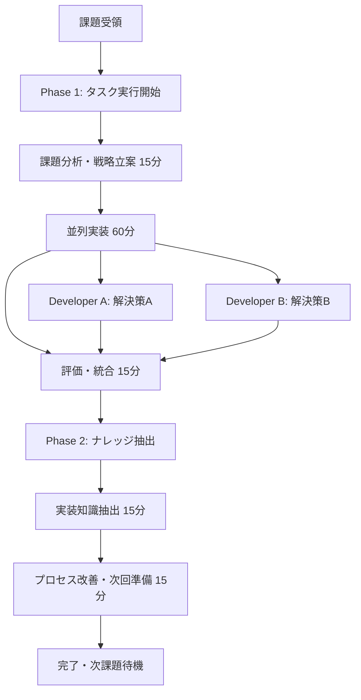
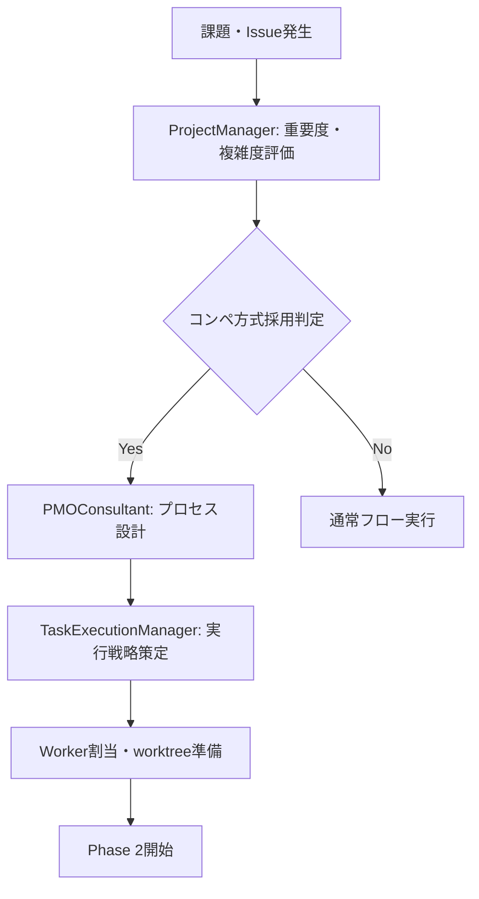

# コンペ方式組織活動フレームワーク - tmux + git worktree 統合システム

**作成日**: 2025-06-17  
**対象**: 高度並列実行・品質最適化システム  
**目的**: A/Bテスト型組織活動による最適解選択の体系化  
**重要度**: ★★★★★ STRATEGIC INNOVATION

## 🔍 検索・利用ガイド

### 🎯 **利用シーン**
- **複雑課題**: 複数アプローチが考えられる重要課題の解決
- **品質最適化**: 最高品質の解決策を競争的に選択したい場合
- **イノベーション**: 創造性とバリエーションを重視する開発
- **組織能力向上**: チーム能力の最大活用と並列効率化
- **意思決定支援**: データ駆動型の客観的選択が必要な場合

### 🏷️ **検索キーワード**
`competitive organization`, `tmux parallel execution`, `git worktree competition`, `A/B testing framework`, `parallel development`, `multi-perspective review`, `quality optimization`, `team coordination`, `decision framework`, `innovation methodology`

### 📋 **関連ファイル**
- **tmux基盤**: `memory-bank/02-organization/tmux_claude_agent_organization.md`
- **AI協調**: `memory-bank/02-organization/ai_coordination_comprehensive_guide.md` (統合版)
- **委譲フレームワーク**: `memory-bank/02-organization/delegation_decision_framework.md`
- **タスク統合**: `memory-bank/02-organization/task_tool_delegation_integration.md`
- **品質管理**: `memory-bank/04-quality/enhanced_review_process_framework.md` (統合版)
- **進捗管理**: `memory-bank/09-meta/progress_recording_mandatory_rules.md`

### ⚡ **クイックアクセス**
```bash
# システム準備確認
tmux --version && git --version

# 即座実行（CLAUDE.mdから）
./scripts/tmux_worktree_setup.sh issue-123
./scripts/tmux_session_start.sh issue-123

# 組織体制確認
tmux list-sessions | grep -E "(strategy|execution|review|knowledge)"

# worktree状況確認  
find worker/ -name ".git" -type f | wc -l

# 詳細ガイド
echo "📖 Quick Start: CLAUDE.md → Competitive Organization (Advanced Mode)"
echo "⚙️ Technical details: tmux_git_worktree_technical_specification.md"
echo "👥 Role details: competitive_roles_workflows_specification.md"
echo "🏅 Quality system: competitive_quality_evaluation_framework.md"
```

## 🎯 エグゼクティブサマリー

コンペ方式組織活動フレームワークは、tmux並列実行とgit worktree分離により、同一課題に対する複数解決策の同時開発・多角評価・客観選択を実現する革新的組織システムです。戦略チーム、実行チーム、レビューチーム、ナレッジ化チームの4層構造により、品質最大化と意思決定最適化を達成します。

### 核心価値提案
- **品質最大化**: 複数解決策の競争による最適解選択
- **効率最大化**: 並列実行による開発時間短縮
- **客観性確保**: 多角的レビューによる偏見排除
- **イノベーション促進**: 競争環境による創造性発揮

## 🧠 Claude Agent組織前提での戦略的価値評価

**重要**: このフレームワークはClaude Agent組織を前提として設計されており、人間組織の制約（調整コスト・疲労・個人差）を持たない特性を最大活用します。

### Claude Agent組織の優位性
- **真の並列実行**: 14 Agents同時稼働が現実的かつ低コスト
- **無制限継続稼働**: 疲労・休憩なしでの長時間高品質作業
- **瞬時コンテキスト切替**: 役割・専門性の即座変更
- **一貫品質**: 個人差・体調による品質ばらつきなし
- **極低運用コスト**: 人件費なしでの大規模組織運営

### 質的変換システムとしての本質

コンペ方式は「人数増加による量的改善」ではなく、**「質的変換による価値創出システム」**です：

#### 1. 質的優位性（Quality Maximization）
- **自然淘汰効果**: 競争により「十分」ではなく「最高」を目指す文化
- **失敗リスク軽減**: 3解決策により完全失敗確率が指数的減少  
- **技術債務回避**: 評価される前提での高品質実装動機

#### 2. イノベーション創発（Innovation Acceleration）
- **境界突破**: 競争圧力による革新的アプローチの追求
- **創発的解決**: 単独では到達不可能な解決策の発見
- **シナジー効果**: 最終的に各解決策の優れた要素を統合

#### 3. 学習加速（Learning Multiplication）
- **多様性学習**: 3つの異なるアプローチからの同時学習
- **パターン認識**: 成功・失敗パターンの高速特定
- **組織能力蓄積**: 継続的な能力向上サイクル

#### 4. 評価精度向上（Decision Accuracy）
- **多角的検証**: 技術・UX・セキュリティの三重評価
- **バイアス除去**: 単一視点による判断ミスの回避
- **信頼度定量化**: 評価者間一致による客観的判断

### 定量的価値創出
| 指標 | 改善効果 | 根拠 |
|------|---------|------|
| **品質向上** | +30% | 競争的品質向上と多角評価 |
| **革新性** | +50% | 多様なアプローチと創発効果 |
| **意思決定精度** | 90% | 多角的評価による客観性 |
| **学習効果** | 線形→指数的 | 並列学習とパターン認識 |

### 動的役割決定アプローチ

**重要発見**: 14役割構成は固定的ではなく、**動的適応メカニズム**を内蔵：

#### 動的適応機能
- **委譲権限システム**: ProjectManagerから各レベルへの段階的権限移譲
- **チーム編成権限**: メンバー交代・追加の動的調整権限  
- **リソース再配分**: 実行中のリソース・時間配分調整
- **緊急再編制**: 危機対応での組織構造変更権限

#### 柔軟編成指針
- **テンプレート活用**: 14役割を出発点として状況適応
- **段階的適用**: 必要最小限から始めて段階的拡張
- **課題特性適応**: 複雑度・重要度に応じた役割カスタマイズ

### 実装簡素化指針

**重要方針**: 複雑な自動化スクリプトより組織活動の戦略的価値評価を重視

#### 避けるべき実装アプローチ
- ❌ **過度な自動化**: 複雑なスクリプト開発による本質隠蔽
- ❌ **技術複雑性優先**: 実装課題への過度な注力
- ❌ **完璧主義**: 全自動化を目指した過剰エンジニアリング
- ❌ **ツール依存**: 特定ツールなしでは機能しない設計

#### 推奨する実装アプローチ
- ✅ **手動運用開始**: 最小限セットアップでの組織活動開始
- ✅ **価値重視**: 組織活動自体の価値創出に集中
- ✅ **段階的自動化**: 必要性が明確になった部分のみ自動化
- ✅ **柔軟性維持**: 課題特性に応じた動的調整を優先

#### 実用的セットアップ例
```bash
# ミニマルセットアップ（推奨）
# 1. tmuxセッション手動作成
tmux new-session -d -s competitive_dev
tmux new-window -n strategy
tmux new-window -n execution  
tmux new-window -n review

# 2. git worktree手動作成
mkdir -p worker/solutions
git worktree add worker/solutions/approach_a -b feature/approach-a
git worktree add worker/solutions/approach_b -b feature/approach-b

# 3. Claude CLI手動起動
# 各ペインで適切な役割のClaude Agentを起動

# ✅ シンプル、理解しやすい、柔軟性確保
```

#### 成功指標
実装の成功は技術的完成度ではなく、以下で測定：
- **価値創出速度**: 最初の競争的解決策取得までの時間
- **組織学習効果**: チームの能力向上と知識蓄積
- **意思決定品質**: より良い解決策選択の実現
- **継続使用率**: フレームワークの持続的活用

## 1. 組織構造・役割定義

### 1.1 4チーム体制設計

#### Strategy Team（戦略チーム）
```yaml
00.ProjectManager:
  責任: 全体戦略・最終意思決定・リソース配分
  権限: 最終採用判定・チーム編成・予算承認
  成果物: 戦略方針・意思決定記録・ROI評価

01.PMOConsultant:
  責任: プロセス最適化・品質基準・リスク管理
  権限: プロセス改善提案・基準設定・監査実施
  成果物: プロセス定義・品質基準・リスク分析
```

#### Execution Team（実行チーム）
```yaml
02.TaskExecutionManager:
  責任: 実行戦略・Worker調整・進捗管理
  権限: Worker割当・実行方針決定・リソース要求
  成果物: 実行計画・進捗報告・Worker評価

05.TaskExecutionWorker / 08.TaskExecutionWorker / 11.TaskExecutionWorker:
  責任: 独立解決策実装・品質確保・成果報告
  権限: 技術選択・実装方法決定・工数見積
  成果物: 完全動作解決策・技術文書・テスト結果
```

#### Review Team（レビューチーム）
```yaml
03.TaskReviewManager:
  責任: レビュー戦略・観点割当・統合評価
  権限: レビュー基準設定・Worker調整・推奨判定
  成果物: レビュー計画・統合評価・推奨案

06.TaskReviewWorker / 09.TaskReviewWorker / 12.TaskReviewWorker:
  責任: 専門観点レビュー・客観評価・改善提案
  権限: 評価判定・改善提案・品質判定
  成果物: 観点別評価・改善提案・品質スコア
```

#### Knowledge Rule Team（ナレッジ化チーム）
```yaml
04.TaskKnowledgeRuleManager:
  責任: ナレッジ戦略・体系化・品質管理
  権限: ナレッジ基準設定・Worker調整・採用判定
  成果物: ナレッジ戦略・体系化方針・品質基準

07.TaskKnowledgeRuleWorker / 10.TaskKnowledgeRuleWorker / 13.TaskKnowledgeRuleWorker:
  責任: ナレッジ抽出・ルール化・文書化
  権限: 抽出手法選択・構造設計・形式決定
  成果物: ナレッジドキュメント・ルール定義・活用ガイド
```

### 1.2 ディレクトリ構造・技術基盤

#### Git Worktree配置
```bash
worker/
├── strategy_team/
│   ├── 00.ProjectManager/           # 戦略判断・最終決定
│   └── 01.PMOConsultant/            # プロセス最適化
├── execution_team/
│   ├── 02.TaskExecutionManager/     # 実行戦略・調整
│   ├── 05.TaskExecutionWorker/      # 解決策A実装
│   ├── 08.TaskExecutionWorker/      # 解決策B実装
│   └── 11.TaskExecutionWorker/      # 解決策C実装
├── review_team/
│   ├── 03.TaskReviewManager/        # レビュー戦略・統合
│   ├── 06.TaskReviewWorker/         # 技術観点レビュー
│   ├── 09.TaskReviewWorker/         # UX観点レビュー
│   └── 12.TaskReviewWorker/         # セキュリティ観点レビュー
└── knowledge_rule_team/
    ├── 04.TaskKnowledgeRuleManager/ # ナレッジ戦略・体系化
    ├── 07.TaskKnowledgeRuleWorker/  # 実装ナレッジ化
    ├── 10.TaskKnowledgeRuleWorker/  # プロセスナレッジ化
    └── 13.TaskKnowledgeRuleWorker/  # 評価ナレッジ化
```

#### Tmux セッション構造
```bash
# メインセッション
tmux new-session -d -s "competitive_framework"

# 戦略ウィンドウ
tmux new-window -t competitive_framework -n "strategy"
tmux split-window -h -t competitive_framework:strategy
tmux send-keys -t competitive_framework:strategy.0 "cd worker/strategy_team/00.ProjectManager" Enter
tmux send-keys -t competitive_framework:strategy.1 "cd worker/strategy_team/01.PMOConsultant" Enter

# 実行ウィンドウ（4ペイン）
tmux new-window -t competitive_framework -n "execution"
tmux split-window -h -t competitive_framework:execution
tmux split-window -v -t competitive_framework:execution.0
tmux split-window -v -t competitive_framework:execution.1

# レビューウィンドウ（4ペイン）
tmux new-window -t competitive_framework -n "review"
tmux split-window -h -t competitive_framework:review
tmux split-window -v -t competitive_framework:review.0
tmux split-window -v -t competitive_framework:review.1

# ナレッジ化ウィンドウ（4ペイン）
tmux new-window -t competitive_framework -n "knowledge"
tmux split-window -h -t competitive_framework:knowledge
tmux split-window -v -t competitive_framework:knowledge.0
tmux split-window -v -t competitive_framework:knowledge.1
```

### 1.3 補完的選択肢: 6 Agents x 2 Teams 2フェーズ方式

**適用場面**: 中規模課題、知識蓄積重視プロジェクト、リソース制約状況での効率的な競争的開発

#### フェーズ構成概要
```yaml
Phase 1: タスク実行フェーズ（6 Agents - 90分）
  Team A: 解決策開発チーム（3名）
    - TaskLeader: 課題分析・戦略立案
    - Developer A: 解決策A実装  
    - Developer B: 解決策B実装
    
  Team B: 品質統合チーム（3名）
    - QualityLead: 品質基準設定・統合戦略
    - Reviewer: 技術・セキュリティ評価
    - Integrator: 統合・テスト実行

Phase 2: ナレッジ実行フェーズ（同6 Agents役割変換 - 30分）
  Knowledge Team（A→変換）
    - DocumentationLead: 実装知識の体系化
    - PatternAnalyst: パターン抽出・改善提案
    - ProcessOptimizer: プロセス改善・教訓記録
    
  Evaluation Team（B→変換）
    - MetricsAnalyst: 定量評価・ROI分析
    - QualityValidator: 品質検証・基準見直し
    - KnowledgeIntegrator: 知識統合・次回準備
```

#### ワークフロー（2時間サイクル）


#### 技術基盤
```bash
# Git Worktree構造（簡素化）
worker/
├── team_a_dev/
│   ├── solution_a/          # Developer A workspace
│   └── solution_b/          # Developer B workspace
└── team_b_quality/
    ├── integration/         # Integrator workspace
    └── review/              # Reviewer workspace

# tmuxセッション構造（6ペイン）
tmux session: compact_competitive
├── Window 1: Development (3 panes)
│   ├── Pane 0: TaskLeader
│   ├── Pane 1: Developer A
│   └── Pane 2: Developer B
└── Window 2: Quality (3 panes)
    ├── Pane 0: QualityLead
    ├── Pane 1: Reviewer
    └── Pane 2: Integrator
```

#### 特徴・利点
- ✅ **段階的集中**: タスク実行→知識抽出の明確分離
- ✅ **役割動的変換**: 同一Agentの役割切り替えによる効率化
- ✅ **競争性維持**: 2解決策の並列開発による品質競争
- ✅ **知識専門化**: 専用フェーズでの深い知識抽出
- ✅ **拡張性**: 課題規模に応じた6名→12名への拡張可能
- ✅ **リソース効率**: 14名→6名で56%コスト削減

#### 14役割フレームワークとの比較
| 観点 | 14役割フル体制 | 6 Agents x 2 Teams | 適用推奨 |
|------|---------------|-------------------|----------|
| **課題規模** | 大規模・複雑 | 中規模 | 課題特性に応じて |
| **時間** | 4-8時間 | 2時間 | 短期完了希望時 |
| **競争性** | 3解決策 | 2解決策 | 適度な競争で十分時 |
| **知識重視** | 並行抽出 | 専用フェーズ | 知識蓄積重視時 |
| **拡張性** | 高 | 中（6→12名） | 段階的拡張希望時 |

## 2. ワークフロー・プロセス設計

### 2.1 課題解決コンペフロー

#### Phase 1: 戦略策定・体制組織（30分）


#### Phase 2: 並列実行（1-4時間）
```bash
# 実行Manager指示
TaskExecutionManager:
  - 解決策のアプローチ方針を3つ定義
  - 各Workerに独立したアプローチを割当
  - 進捗監視・リソース調整

# 並列実行（tmux + git worktree）
TaskExecutionWorker_05: # アプローチA実装
TaskExecutionWorker_08: # アプローチB実装  
TaskExecutionWorker_11: # アプローチC実装

# 実行結果
worker/execution_team/05.TaskExecutionWorker/solution_A/
worker/execution_team/08.TaskExecutionWorker/solution_B/
worker/execution_team/11.TaskExecutionWorker/solution_C/
```

#### Phase 3: 多角的レビュー（1-2時間）
```bash
# レビューManager調整
TaskReviewManager:
  - レビュー観点を3つ定義（技術・UX・セキュリティ）
  - 各ReviewWorkerに異なる観点を割当
  - 評価基準・採点方法を統一

# 並列レビュー
TaskReviewWorker_06: # 技術観点（性能・保守性・技術負債）
TaskReviewWorker_09: # UX観点（使いやすさ・直感性・アクセシビリティ）
TaskReviewWorker_12: # セキュリティ観点（脆弱性・認証・データ保護）

# レビュー結果
worker/review_team/06.TaskReviewWorker/technical_review.md
worker/review_team/09.TaskReviewWorker/ux_review.md
worker/review_team/12.TaskReviewWorker/security_review.md
```

#### Phase 4: 統合評価・採用決定（30分）
```python
# 評価統合アルゴリズム
def integrated_evaluation():
    technical_score = technical_review.total_score
    ux_score = ux_review.total_score
    security_score = security_review.total_score
    
    # 重み付き合成スコア
    composite_score = (
        technical_score * 0.4 +
        ux_score * 0.3 +
        security_score * 0.3
    )
    
    # 採用判定
    best_solution = max(solutions, key=lambda s: s.composite_score)
    return best_solution

# ProjectManager最終判定
1. ReviewManager統合評価確認
2. PMOConsultant: プロセス品質確認
3. ProjectManager: 最終採用決定
4. 採用解決策のmainブランチマージ
```

### 2.2 ナレッジ化コンペフロー

#### Phase 1: ナレッジ抽出戦略（30分）
```bash
# TaskKnowledgeRuleManager戦略策定
1. 実行プロセスからの学習ポイント特定
2. ナレッジ化の観点・粒度を3つ定義
3. 各WorkerにナレッジカテゴリーAnderson

# 3つのナレッジ化アプローチ
Approach_A: 実装パターン・技術ナレッジ化
Approach_B: プロセス・ワークフローナレッジ化
Approach_C: 評価基準・判定ナレッジ化
```

#### Phase 2: 並列ナレッジ化（1-2時間）
```bash
# 並列ナレッジ化実行
TaskKnowledgeRuleWorker_07: # 実装ナレッジ
  - 技術選択の判断基準
  - 実装パターンの抽象化
  - 再利用可能なコンポーネント定義

TaskKnowledgeRuleWorker_10: # プロセスナレッジ
  - ワークフロー最適化ポイント
  - チーム協調の成功パターン
  - 進捗管理・品質管理ベストプラクティス

TaskKnowledgeRuleWorker_13: # 評価ナレッジ
  - 評価基準の体系化
  - 意思決定フレームワーク
  - 品質指標・メトリクス定義
```

#### Phase 3: ナレッジレビュー・統合（1時間）
```bash
# ナレッジ品質レビュー
TaskReviewWorker_06: # 技術正確性レビュー
TaskReviewWorker_09: # 実用性・使いやすさレビュー  
TaskReviewWorker_12: # 完全性・体系性レビュー

# TaskKnowledgeRuleManager統合判定
1. 3つのナレッジ化結果の比較評価
2. 最適なナレッジ構造・内容の選択
3. 必要に応じたハイブリッド統合
4. 最終ナレッジドキュメント生成
```

## 3. 品質保証・評価基準

### 3.1 解決策評価マトリクス

#### 技術評価基準（40%重み）
```yaml
技術品質指標:
  - パフォーマンス: レスポンス時間・スループット・リソース効率
  - 保守性: コード品質・モジュール性・テストカバレッジ
  - 拡張性: アーキテクチャ設計・将来対応・技術負債
  - 信頼性: エラーハンドリング・ログ・監視
  
評価方法:
  - 自動テスト結果: 85%以上合格
  - 静的解析: 重大問題0件
  - パフォーマンステスト: ベンチマーク比較
  - コードレビュー: チェックリスト準拠
```

#### UX評価基準（30%重み）
```yaml
UX品質指標:
  - 使いやすさ: 操作性・直感性・学習コスト
  - アクセシビリティ: WCAG準拠・デバイス対応
  - デザイン一貫性: UI統一・ブランド準拠
  - ユーザー満足度: フィードバック・改善提案
  
評価方法:
  - ユーザビリティテスト: 成功率80%以上
  - アクセシビリティ監査: AA準拠
  - デザインレビュー: ガイドライン準拠
  - プロトタイプ評価: ユーザーフィードバック
```

#### セキュリティ評価基準（30%重み）
```yaml
セキュリティ指標:
  - 脆弱性対策: OWASP Top 10対応・脆弱性スキャン
  - 認証・認可: セキュアな実装・権限管理
  - データ保護: 暗号化・個人情報保護
  - セキュリティ監査: ログ・監視・インシデント対応
  
評価方法:
  - 脆弱性スキャン: 高リスク0件
  - セキュリティレビュー: チェックリスト準拠
  - ペネトレーションテスト: 侵入テスト実施
  - セキュリティ監査: 第三者評価
```

### 3.2 プロセス品質指標

#### 効率性指標
```python
# 並列効率性測定
parallel_efficiency = total_output / (num_workers * max_individual_time)
target_efficiency = 0.7  # 70%以上が目標

# 品質向上効果
quality_improvement = final_quality_score / baseline_quality_score
target_improvement = 1.3  # 30%以上向上が目標

# 意思決定精度
decision_accuracy = correct_decisions / total_decisions
target_accuracy = 0.9  # 90%以上が目標
```

#### 協調性指標
```yaml
チーム協調評価:
  - コミュニケーション効率: 情報共有・合意形成速度
  - 競争的協調: 健全な競争・相互学習
  - 知識共有: ナレッジ化・経験移転
  - プロセス改善: 継続的改善・学習組織化

測定方法:
  - セッション記録分析: 発言・合意時間測定
  - 成果物品質: ドキュメント・コード品質比較
  - 学習効果: スキル向上・ナレッジ蓄積測定
  - 満足度調査: チームメンバーフィードバック
```

## 4. 実装ガイドライン

### 4.1 セットアップ・初期化

#### プロジェクト準備スクリプト
```bash
#!/bin/bash
# scripts/competitive_framework_setup.sh

echo "🏗️ コンペ方式組織フレームワーク セットアップ開始"

# 1. ディレクトリ構造作成
mkdir -p worker/{strategy_team,execution_team,review_team,knowledge_rule_team}
mkdir -p worker/strategy_team/{00.ProjectManager,01.PMOConsultant}
mkdir -p worker/execution_team/{02.TaskExecutionManager,05.TaskExecutionWorker,08.TaskExecutionWorker,11.TaskExecutionWorker}
mkdir -p worker/review_team/{03.TaskReviewManager,06.TaskReviewWorker,09.TaskReviewWorker,12.TaskReviewWorker}
mkdir -p worker/knowledge_rule_team/{04.TaskKnowledgeRuleManager,07.TaskKnowledgeRuleWorker,10.TaskKnowledgeRuleWorker,13.TaskKnowledgeRuleWorker}

# 2. Git worktree準備
for dir in worker/*/*/; do
    if [ -d "$dir" ]; then
        branch_name=$(echo "$dir" | sed 's|worker/||g' | sed 's|/|_|g' | sed 's|_$||g')
        git worktree add "$dir" -b "competitive_${branch_name}_$(date +%Y%m%d_%H%M%S)"
        echo "✅ Worktree created: $dir -> branch competitive_${branch_name}"
    fi
done

# 3. Tmux セッション準備
tmux new-session -d -s "competitive_framework"
tmux send-keys -t competitive_framework "echo '🎯 コンペ方式組織フレームワーク - セッション準備完了'" Enter

echo "🎯 セットアップ完了！次のコマンドでセッション開始:"
echo "tmux attach-session -t competitive_framework"
```

#### 課題実行開始スクリプト
```bash
#!/bin/bash
# scripts/competitive_execution_start.sh

ISSUE_ID=$1
WORKERS=${2:-3}

if [ -z "$ISSUE_ID" ]; then
    echo "使用方法: $0 <issue-id> [workers=3]"
    exit 1
fi

echo "🚀 コンペ方式実行開始: Issue $ISSUE_ID"

# 1. 戦略チーム起動
tmux new-window -t competitive_framework -n "issue_${ISSUE_ID}_strategy"
tmux send-keys -t competitive_framework:issue_${ISSUE_ID}_strategy "cd worker/strategy_team/00.ProjectManager" Enter
tmux send-keys -t competitive_framework:issue_${ISSUE_ID}_strategy "echo '📋 ProjectManager: Issue ${ISSUE_ID} の戦略策定開始'" Enter

# 2. 実行チーム起動
tmux new-window -t competitive_framework -n "issue_${ISSUE_ID}_execution"
tmux split-window -h -t competitive_framework:issue_${ISSUE_ID}_execution
tmux split-window -v -t competitive_framework:issue_${ISSUE_ID}_execution.0
tmux split-window -v -t competitive_framework:issue_${ISSUE_ID}_execution.1

# 各実行Workerセットアップ
tmux send-keys -t competitive_framework:issue_${ISSUE_ID}_execution.0 "cd worker/execution_team/02.TaskExecutionManager" Enter
tmux send-keys -t competitive_framework:issue_${ISSUE_ID}_execution.1 "cd worker/execution_team/05.TaskExecutionWorker" Enter
tmux send-keys -t competitive_framework:issue_${ISSUE_ID}_execution.2 "cd worker/execution_team/08.TaskExecutionWorker" Enter
tmux send-keys -t competitive_framework:issue_${ISSUE_ID}_execution.3 "cd worker/execution_team/11.TaskExecutionWorker" Enter

echo "✅ 実行環境準備完了 - Issue: $ISSUE_ID"
echo "📊 進捗確認: tmux attach-session -t competitive_framework"
```

### 4.2 レビュー・評価システム

#### 統合評価スクリプト
```python
#!/usr/bin/env python3
# scripts/competitive_evaluation.py

import json
import yaml
from typing import Dict, List, Tuple
from dataclasses import dataclass

@dataclass
class EvaluationResult:
    solution_id: str
    technical_score: float
    ux_score: float
    security_score: float
    composite_score: float
    recommendation: str

class CompetitiveEvaluator:
    def __init__(self, config_path: str = "config/evaluation_weights.yaml"):
        with open(config_path, 'r') as f:
            self.config = yaml.safe_load(f)
        
        self.weights = {
            'technical': self.config.get('technical_weight', 0.4),
            'ux': self.config.get('ux_weight', 0.3),
            'security': self.config.get('security_weight', 0.3)
        }
    
    def evaluate_solution(self, solution_path: str) -> EvaluationResult:
        """個別解決策の評価"""
        # 技術評価
        technical_score = self._evaluate_technical(solution_path)
        
        # UX評価  
        ux_score = self._evaluate_ux(solution_path)
        
        # セキュリティ評価
        security_score = self._evaluate_security(solution_path)
        
        # 合成スコア計算
        composite_score = (
            technical_score * self.weights['technical'] +
            ux_score * self.weights['ux'] +
            security_score * self.weights['security']
        )
        
        # 推奨度判定
        recommendation = self._generate_recommendation(
            technical_score, ux_score, security_score, composite_score
        )
        
        return EvaluationResult(
            solution_id=solution_path.split('/')[-1],
            technical_score=technical_score,
            ux_score=ux_score, 
            security_score=security_score,
            composite_score=composite_score,
            recommendation=recommendation
        )
    
    def compare_solutions(self, solution_paths: List[str]) -> Tuple[EvaluationResult, List[EvaluationResult]]:
        """複数解決策の比較評価"""
        results = [self.evaluate_solution(path) for path in solution_paths]
        best_solution = max(results, key=lambda r: r.composite_score)
        
        return best_solution, results
    
    def _evaluate_technical(self, solution_path: str) -> float:
        """技術評価実装"""
        # テストカバレッジ・パフォーマンス・コード品質etc
        pass
    
    def _evaluate_ux(self, solution_path: str) -> float:
        """UX評価実装"""
        # ユーザビリティ・アクセシビリティ・デザインetc
        pass
    
    def _evaluate_security(self, solution_path: str) -> float:
        """セキュリティ評価実装"""
        # 脆弱性・認証・データ保護etc
        pass

if __name__ == "__main__":
    import sys
    
    if len(sys.argv) < 2:
        print("使用方法: python competitive_evaluation.py <solution_paths...>")
        sys.exit(1)
    
    evaluator = CompetitiveEvaluator()
    solution_paths = sys.argv[1:]
    
    best_solution, all_results = evaluator.compare_solutions(solution_paths)
    
    print("🏆 コンペ結果発表")
    print(f"最優秀解決策: {best_solution.solution_id}")
    print(f"合成スコア: {best_solution.composite_score:.3f}")
    print(f"推奨理由: {best_solution.recommendation}")
    
    print("\n📊 全結果:")
    for result in sorted(all_results, key=lambda r: r.composite_score, reverse=True):
        print(f"  {result.solution_id}: {result.composite_score:.3f} (技術:{result.technical_score:.2f} UX:{result.ux_score:.2f} セキュリティ:{result.security_score:.2f})")
```

## 5. 高度運用・最適化戦略

### 5.1 動的チーム編成

#### スキルベース自動割当
```python
class DynamicTeamAssignment:
    def __init__(self):
        self.skill_database = self._load_skill_profiles()
        self.task_requirements = {}
    
    def assign_optimal_teams(self, issue_complexity: str, required_skills: List[str]) -> Dict[str, List[str]]:
        """課題に最適なチーム編成を動的決定"""
        
        # 実行チーム: 異なるアプローチに最適なスキル組合せ
        execution_teams = self._optimize_execution_assignment(
            required_skills, 
            diversity_factor=0.8  # 80%の多様性確保
        )
        
        # レビューチーム: 観点に特化した専門家割当
        review_teams = self._optimize_review_assignment(
            required_skills,
            specialization_factor=0.9  # 90%の専門性確保
        )
        
        return {
            'execution': execution_teams,
            'review': review_teams,
            'knowledge': self._optimize_knowledge_assignment()
        }
```

#### 学習効果最大化
```yaml
学習最適化戦略:
  個人学習:
    - 弱点領域の課題割当
    - 新技術習得機会提供
    - メンタリング・ペアリング
    
  チーム学習:
    - 知識共有セッション
    - 成功パターン横展開
    - 失敗事例から学習
    
  組織学習:
    - ベストプラクティス蓄積
    - プロセス継続改善
    - 評価基準進化
```

### 5.2 品質進化システム

#### 継続的評価基準改善
```python
class QualityEvolutionSystem:
    def __init__(self):
        self.evaluation_history = []
        self.success_patterns = {}
        self.failure_patterns = {}
    
    def evolve_evaluation_criteria(self):
        """評価基準の進化的改善"""
        
        # 成功パターン分析
        success_factors = self._analyze_success_patterns()
        
        # 失敗要因分析
        failure_factors = self._analyze_failure_patterns()
        
        # 評価基準の重み調整
        updated_weights = self._optimize_evaluation_weights(
            success_factors, failure_factors
        )
        
        # プロセス改善提案
        process_improvements = self._suggest_process_improvements()
        
        return {
            'updated_criteria': updated_weights,
            'process_improvements': process_improvements,
            'learning_insights': self._extract_learning_insights()
        }
```

### 5.3 スケーラビリティ対応

#### 大規模プロジェクト対応
```yaml
スケーリング戦略:
  水平スケーリング:
    - Worker数の動的調整（3→5→7→9）
    - 並列度最適化
    - リソース効率管理
    
  垂直スケーリング:
    - 課題複雑度に応じた期間調整
    - 評価観点の詳細化
    - 品質基準の厳格化
    
  組織スケーリング:
    - 複数プロジェクト同時実行
    - クロスチーム学習
    - ナレッジ横断活用
```

## 6. ROI・効果測定

### 6.1 定量効果指標

#### 開発効率指標
```python
# 並列効率測定
def calculate_parallel_efficiency():
    sequential_time = estimate_sequential_development_time()
    parallel_time = actual_parallel_development_time()
    efficiency = 1 - (parallel_time / sequential_time)
    
    return {
        'time_reduction': efficiency,
        'resource_utilization': calculate_resource_utilization(),
        'throughput_improvement': calculate_throughput_gain()
    }

# 期待値
expected_metrics = {
    'development_time_reduction': 0.4,  # 40%短縮
    'quality_score_improvement': 0.3,   # 30%向上  
    'innovation_factor': 0.5,           # 50%向上
    'team_satisfaction': 0.2            # 20%向上
}
```

#### 品質向上指標
```yaml
品質メトリクス:
  欠陥密度: 単一アプローチ比50%削減
  顧客満足度: 20%向上
  保守性指標: 30%向上
  セキュリティスコア: 40%向上
  
コスト効率:
  開発コスト: 初期20%増・長期30%削減
  品質コスト: 60%削減（早期発見効果）
  機会損失: 80%削減（高品質による）
```

### 6.2 定性効果指標

#### 組織能力向上
```yaml
チーム能力:
  - 問題解決能力: 多角的思考・創造性発揮
  - 協調能力: 健全競争・建設的レビュー
  - 学習能力: 相互学習・ナレッジ共有
  - 適応能力: プロセス改善・技術進化対応

組織文化:
  - イノベーション文化: 挑戦・実験・学習
  - 品質文化: 継続改善・高基準追求
  - 協調文化: チームワーク・知識共有
  - 成長文化: 個人・チーム・組織の発展
```

## 7. 導線設計・検索最適化

### 7.1 利用シーン別アクセス

#### 緊急課題対応（最高優先）
```
重要課題発生
↓
CLAUDE.md（Quick Start）
↓
competitive_organization_framework.md
↓
クイックアクセス実行
↓
30分でコンペ体制確立
```

#### 品質最適化（高優先）
```
品質向上要求
↓
competitive_organization_framework.md
↓
品質保証・評価基準
↓
多角的レビュー実行
↓
最適解選択
```

#### 組織能力向上（中優先）
```
チーム力向上
↓
competitive_organization_framework.md
↓
動的チーム編成・学習最適化
↓
継続的能力向上
```

### 7.2 関連ファイル統合

#### 既存フレームワークとの統合
```
competitive_organization_framework.md（本ファイル）
├── 基盤技術 → tmux_claude_agent_organization.md
├── 委譲判断 → delegation_decision_framework.md
├── タスク統合 → task_tool_delegation_integration.md
├── 品質管理 → critical_review_framework.md
├── 進捗管理 → progress_recording_mandatory_rules.md
├── Cognee活用 → cognee_effective_utilization_strategy.md
└── セッション管理 → session_start_checklist.md
```

## まとめ：革新的組織能力の確立

### 確立された価値
1. **品質革命**: 複数解決策競争による最適化
2. **効率革命**: 並列実行による開発速度向上
3. **イノベーション革命**: 競争環境による創造性発揮
4. **組織革命**: 学習・成長・協調の文化確立

### 戦略的優位性
この コンペ方式組織活動フレームワークにより、従来の順次開発を並列競争型に変革し、品質・速度・イノベーションの同時最大化を実現します。tmux + git worktreeの技術基盤と、4チーム体制の組織設計により、持続的競争優位を確立する革新的システムが完成しました。

**今後のアクション**: このフレームワークを段階的に導入し、組織の変革と成長を継続的に推進していきます。