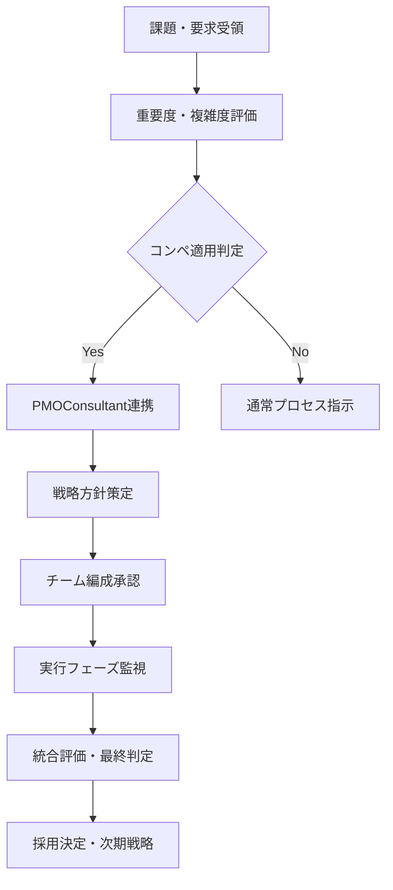
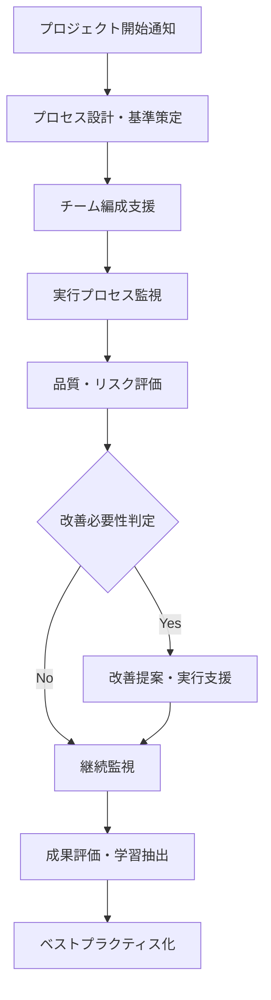
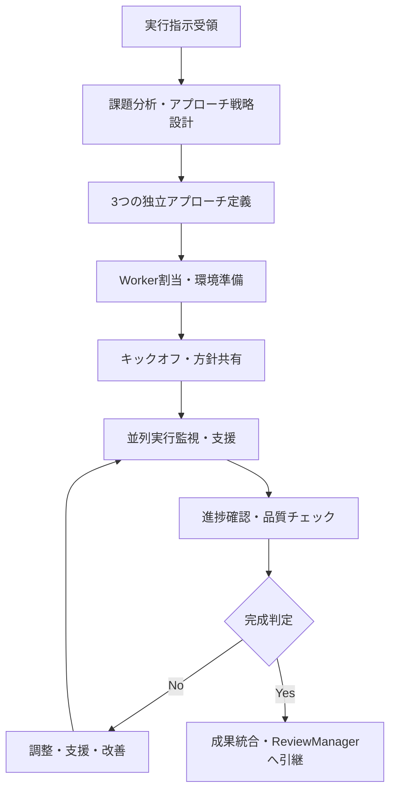
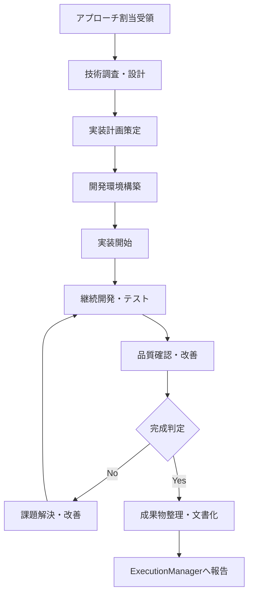
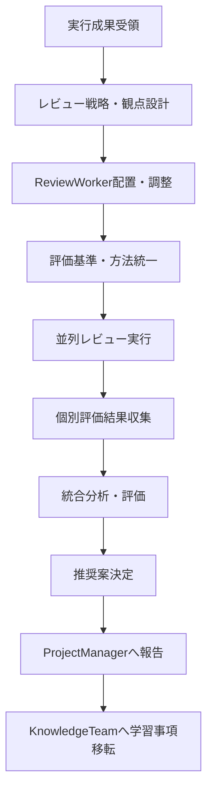
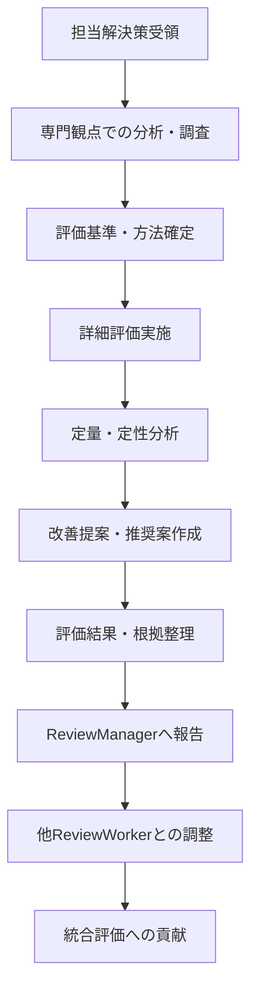
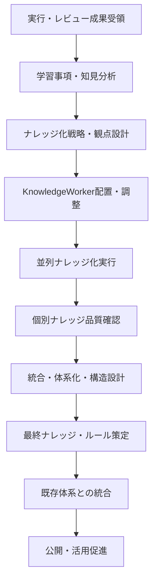
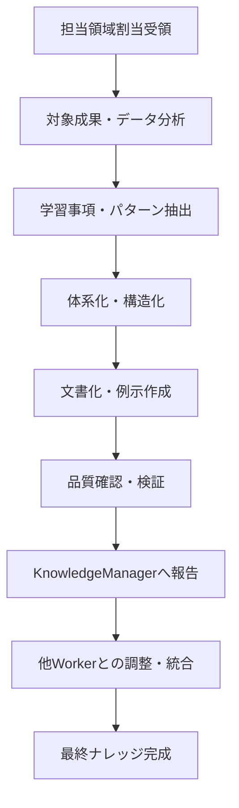

# コンペ方式組織 - 役割・権限・ワークフロー仕様書

**作成日**: 2025-06-17  
**対象**: 14役割の詳細責任・権限・ワークフロー定義  
**目的**: 競争的組織活動における明確な役割分担と効率的協調の実現  
**重要度**: ★★★★★ ORGANIZATIONAL FOUNDATION

## 🔍 検索・利用ガイド

### 🎯 **利用シーン**
- **役割理解**: 各ポジションの責任・権限の明確化
- **チーム編成**: 最適なメンバー配置・スキル要件確認
- **ワークフロー設計**: プロセス最適化・効率化
- **紛争解決**: 責任範囲・意思決定権の明確化
- **評価設計**: 成果指標・評価基準の設定

### 🏷️ **検索キーワード**
`role specification`, `responsibility matrix`, `authority levels`, `workflow definition`, `team coordination`, `decision framework`, `accountability`, `performance metrics`, `collaboration rules`, `organizational design`

### 📋 **関連ファイル**
- **組織フレームワーク**: `memory-bank/02-organization/competitive_organization_framework.md`
- **技術基盤**: `memory-bank/02-organization/tmux_git_worktree_technical_specification.md`
- **品質管理**: `memory-bank/04-quality/critical_review_framework.md`
- **委譲フレームワーク**: `memory-bank/02-organization/delegation_decision_framework.md`

### ⚡ **クイックアクセス**
```bash
# 役割確認
grep -A 10 "^### " competitive_roles_workflows_specification.md

# 権限マトリクス表示
grep -A 5 "権限レベル" competitive_roles_workflows_specification.md

# ワークフロー確認
grep -A 15 "ワークフロー" competitive_roles_workflows_specification.md
```

## 🎯 組織設計原則

### 核心設計思想
競争的組織活動は**明確な責任分離**と**効率的協調**の両立により、品質最大化と意思決定最適化を実現します。14の特化役割による**分業と協調のハイブリッド**により、個人の専門性を活かしながら組織としての総合力を発揮します。

### 組織設計4原則
1. **責任明確化**: 重複のない明確な責任範囲
2. **権限適正化**: 責任に見合った意思決定権限
3. **協調最適化**: 効率的な情報共有・合意形成
4. **成果最大化**: 個人・チーム・組織の成果の統合

## 1. Strategy Team（戦略チーム）

### 1.1 ProjectManager（00番）

#### 責任範囲（Responsibility）
```yaml
戦略責任:
  - プロジェクト全体の戦略方針決定
  - リソース配分・優先順位設定
  - 重要課題のコンペ適用判定
  - 最終成果の採用・却下決定

組織責任:
  - チーム編成・役割割当の承認
  - 予算・スケジュール・品質目標設定
  - 組織間調整・利害関係者管理
  - 危機管理・エスカレーション対応

成果責任:
  - プロジェクト目標達成
  - ROI・ビジネス価値の最大化
  - ステークホルダー満足度
  - 組織能力・文化の向上
```

#### 権限レベル（Authority）
```yaml
意思決定権限:
  - 最終採用解決策の決定（拒否権含む）
  - プロジェクト開始・停止・方向転換
  - 予算承認・リソース配分変更
  - チームメンバー交代・追加

承認権限:
  - 重要な技術選択・アーキテクチャ決定
  - 品質基準・評価基準の設定・変更
  - プロセス改善提案の採用・却下
  - 外部連携・調達の承認

委譲権限:
  - 日常的実行判断 → ExecutionManager
  - 技術詳細判断 → 各Worker
  - プロセス詳細 → PMOConsultant
  - 品質詳細 → ReviewManager
```

#### ワークフロー（Workflow）


#### 成果指標（KPI）
```yaml
戦略成果:
  - プロジェクト目標達成率: 95%以上
  - ROI達成率: 目標比120%以上
  - 重要判定精度: 90%以上（コンペ適用判定）

組織成果:
  - チーム満足度: 4.5/5.0以上
  - 意思決定速度: 従来比50%向上
  - 組織学習効果: 定量測定で30%向上

ビジネス成果:
  - ステークホルダー満足度: 4.0/5.0以上
  - 市場競争力: 業界上位20%
  - イノベーション創出: 年間3件以上
```

### 1.2 PMOConsultant（01番）

#### 責任範囲（Responsibility）
```yaml
プロセス責任:
  - 競争的組織プロセスの設計・最適化
  - 品質基準・評価基準の策定
  - リスク管理・問題解決支援
  - 継続的改善の推進・実行

監査責任:
  - プロセス遵守状況の監視・評価
  - 品質水準の維持・向上
  - コンプライアンス・ガバナンス確保
  - ベストプラクティスの発見・横展開

支援責任:
  - ProjectManagerの戦略決定支援
  - 各チームのプロセス改善支援
  - 教育・研修・スキル向上支援
  - 組織変革・文化醸成支援
```

#### 権限レベル（Authority）
```yaml
プロセス権限:
  - プロセス基準・手順の策定・変更
  - 品質基準・評価基準の設定・調整
  - 監査実施・改善指示
  - プロセス違反の警告・エスカレーション

推奨権限:
  - ProjectManagerへの戦略提案
  - チーム編成・スキル配置の提案
  - プロセス改善・効率化の提案
  - 組織構造・制度改善の提案

調整権限:
  - チーム間調整・紛争解決支援
  - リソース競合の調整支援
  - 情報共有・コミュニケーション促進
  - 教育・研修の企画・実施
```

#### ワークフロー（Workflow）


#### 成果指標（KPI）
```yaml
プロセス成果:
  - プロセス遵守率: 95%以上
  - 品質基準達成率: 90%以上  
  - リスク予防効果: 重大問題0件

改善成果:
  - プロセス効率向上: 四半期20%向上
  - 品質指標改善: 継続的向上
  - チーム満足度向上: 定期測定で向上

支援成果:
  - ProjectManager支援効果: 意思決定精度向上
  - チーム能力向上: スキル評価で定量測定
  - 組織学習促進: ナレッジ蓄積・活用率向上
```

## 2. Execution Team（実行チーム）

### 2.1 TaskExecutionManager（02番）

#### 責任範囲（Responsibility）
```yaml
実行戦略責任:
  - 複数解決策アプローチの戦略設計
  - Worker割当・役割分担決定
  - 技術方針・アーキテクチャ指針設定
  - 実行進捗・品質管理

調整責任:
  - Worker間の調整・競争環境維持
  - リソース配分・技術支援
  - ブロッカー解決・エスカレーション
  - Strategy/Reviewチームとの連携

成果責任:
  - 3つの独立解決策の完成
  - 品質水準・期限の遵守
  - 技術革新・創造性の促進
  - チーム学習・スキル向上
```

#### 権限レベル（Authority）
```yaml
実行権限:
  - Worker配置・アプローチ割当決定
  - 技術選択・ツール選択承認
  - 実行計画・スケジュール設定
  - 品質基準・完成判定基準設定

調整権限:
  - Worker間リソース調整
  - 技術支援・メンタリング提供
  - 外部技術者・専門家への相談
  - 実行方針の変更・調整

エスカレーション権限:
  - ProjectManagerへの重要判定要求
  - ReviewManagerとの品質基準調整
  - PMOConsultantへのプロセス改善提案
  - 追加リソース・時間の要求
```

#### ワークフロー（Workflow）


#### 成果指標（KPI）
```yaml
実行成果:
  - 解決策完成率: 100%（3/3）
  - 期限遵守率: 95%以上
  - 品質基準達成率: 90%以上

競争成果:
  - アプローチ多様性: 技術選択・設計パターンの差別化
  - 革新性評価: 新規性・創造性の定量評価
  - Worker満足度: 競争環境での満足度4.0/5.0以上

管理成果:
  - リソース効率: 予定比90-110%の範囲
  - 問題解決速度: ブロッカー24時間以内解決
  - チーム協調効果: 健全競争の維持
```

### 2.2 TaskExecutionWorker（05番・08番・11番）

#### 責任範囲（Responsibility）
```yaml
実装責任:
  - 割り当てられたアプローチの完全実装
  - 独立性・創造性を活かした解決策開発
  - コード品質・テスト・文書化
  - 技術的負債・保守性への配慮

競争責任:
  - 他Workerとの健全な競争環境維持
  - 最高品質・最適解の追求
  - 技術的挑戦・革新の実践
  - 期限内完成・成果最大化

学習責任:
  - 新技術・手法の習得・適用
  - 実装過程での学習・発見記録
  - 他Workerからの学習・相互啓発
  - ナレッジ・経験の共有準備
```

#### 権限レベル（Authority）
```yaml
技術権限:
  - 実装手法・技術選択の決定
  - ライブラリ・フレームワーク選択
  - アーキテクチャ詳細設計
  - テスト戦略・品質基準設定

実行権限:
  - 作業計画・スケジュール設定
  - worktree・ブランチ管理
  - 外部リソース・ツール利用
  - 技術調査・プロトタイピング

相談権限:
  - ExecutionManagerへの技術相談
  - 専門家・有識者への相談
  - オープンソース・コミュニティ活用
  - 書籍・資料・オンライン学習
```

#### ワークフロー（Workflow）


#### 成果指標（KPI）
```yaml
実装成果:
  - 機能完成度: 要求仕様100%達成
  - 品質指標: テストカバレッジ85%以上
  - 性能指標: ベンチマーク目標達成

技術成果:
  - 革新性評価: 新規技術・手法の適用
  - 効率性評価: 開発効率・実行効率
  - 保守性評価: コード品質・文書化水準

競争成果:
  - 独自性評価: 他Worker解決策との差別化
  - 優秀性評価: 総合評価での優位性
  - 学習効果: スキル向上・知識獲得
```

## 3. Review Team（レビューチーム）

### 3.1 TaskReviewManager（03番）

#### 責任範囲（Responsibility）
```yaml
レビュー戦略責任:
  - 多角的レビュー観点の設計・配分
  - 評価基準・評価方法の統一・調整
  - ReviewWorker調整・品質確保
  - 統合評価・推奨判定

評価責任:
  - 客観的・公正な評価の確保
  - バイアス排除・多様性考慮
  - 統計的分析・定量評価
  - 改善提案・価値向上支援

連携責任:
  - ExecutionTeamとの評価基準調整
  - ProjectManagerへの推奨案提示
  - 評価結果の明確な根拠提示
  - KnowledgeTeamへの学習事項提供
```

#### 権限レベル（Authority）
```yaml
評価権限:
  - レビュー観点・評価基準設定
  - ReviewWorker配置・専門性活用
  - 評価方法・採点システム決定
  - 統合評価・ランキング決定

判定権限:
  - 品質水準合格・不合格判定
  - 改善要求・追加作業指示
  - 評価やり直し・基準調整
  - ProjectManagerへの推奨提示

調整権限:
  - ExecutionManagerとの基準調整
  - ReviewWorker間の評価調整
  - 外部専門家・レビュアー招聘
  - 評価ツール・システム選択
```

#### ワークフロー（Workflow）


#### 成果指標（KPI）
```yaml
評価成果:
  - 評価精度: 事後検証で90%以上の妥当性
  - 評価一貫性: ReviewWorker間評価の統一性
  - 評価完全性: 全観点・全基準での評価実施

判定成果:
  - 推奨精度: ProjectManager採用率90%以上
  - 改善効果: 推奨案による価値向上測定
  - 客観性確保: バイアス排除・多様性考慮

協調成果:
  - チーム連携: ExecutionTeamとの円滑連携
  - 学習促進: KnowledgeTeamへの効果的移転
  - プロセス改善: レビュープロセスの継続改善
```

### 3.2 TaskReviewWorker（06番・09番・12番）

#### 専門観点配置
```yaml
06番_技術観点レビュー:
  専門領域: アーキテクチャ・性能・保守性・技術負債
  評価項目:
    - コード品質・設計パターン適用
    - 性能・スケーラビリティ・リソース効率
    - テスト品質・カバレッジ・自動化
    - 保守性・拡張性・技術負債管理

09番_UX観点レビュー:
  専門領域: ユーザビリティ・アクセシビリティ・デザイン
  評価項目:
    - 使いやすさ・操作性・学習コスト
    - UI/UX統一性・デザインシステム準拠
    - アクセシビリティ・WCAG準拠
    - ユーザー満足度・フィードバック反映

12番_セキュリティ観点レビュー:
  専門領域: 脆弱性・認証・データ保護・コンプライアンス
  評価項目:
    - OWASP Top 10対応・脆弱性対策
    - 認証・認可・アクセス制御
    - データ暗号化・個人情報保護
    - セキュリティログ・監査証跡
```

#### 責任範囲（Responsibility）
```yaml
専門評価責任:
  - 担当観点での深度ある専門評価
  - 評価基準の具体化・詳細化
  - 定量・定性評価の実施・分析
  - 改善提案・ベストプラクティス提示

客観性責任:
  - バイアス排除・公正な評価
  - 根拠明確化・評価理由説明
  - 他観点との整合性確保
  - 継続的評価基準改善

協調責任:
  - 他ReviewWorkerとの評価調整
  - ReviewManagerとの密接連携
  - ExecutionWorkerへの建設的フィードバック
  - 専門知識・スキルの共有
```

#### 権限レベル（Authority）
```yaml
評価権限:
  - 担当観点での評価点数・判定
  - 評価基準の詳細化・調整
  - 専門ツール・手法の選択・適用
  - 外部専門家・有識者への相談

提案権限:
  - 改善提案・代替案提示
  - ベストプラクティス推奨
  - 評価基準・方法の改善提案
  - 専門領域でのガイドライン策定

学習権限:
  - 専門領域での最新技術習得
  - 業界動向・トレンド調査
  - 専門コミュニティ・イベント参加
  - 継続的専門性向上
```

#### ワークフロー（Workflow）


#### 成果指標（KPI）
```yaml
専門成果:
  - 評価深度: 専門領域での詳細・包括評価
  - 評価正確性: 専門知識による高精度評価
  - 改善提案価値: 実用的・効果的提案

協調成果:
  - 評価整合性: 他Worker評価との調和
  - 建設的フィードバック: ExecutionWorkerの受容度
  - 専門知識共有: チーム全体のスキル向上貢献

継続成果:
  - 専門性向上: 継続的な専門スキル向上
  - 評価基準改善: 評価方法・基準の進化
  - 業界貢献: 専門領域でのベストプラクティス創出
```

## 4. Knowledge Rule Team（ナレッジ化チーム）

### 4.1 TaskKnowledgeRuleManager（04番）

#### 責任範囲（Responsibility）
```yaml
ナレッジ戦略責任:
  - 学習事項・知見の体系的抽出戦略
  - ナレッジ化観点・粒度・構造設計
  - KnowledgeWorker調整・品質管理
  - 統合ナレッジ・ルール策定

体系化責任:
  - ナレッジ分類・階層化・関連付け
  - ルール化・標準化・再利用促進
  - 既存ナレッジとの統合・整理
  - 検索性・活用性向上

品質責任:
  - ナレッジ正確性・完全性確保
  - 実用性・適用可能性検証
  - 持続性・メンテナンス性確保
  - 価値・ROI最大化
```

#### 権限レベル（Authority）
```yaml
ナレッジ権限:
  - ナレッジ化方針・観点設定
  - KnowledgeWorker配置・調整
  - ナレッジ構造・分類体系決定
  - 最終ナレッジ・ルール承認

統合権限:
  - 複数ナレッジの統合・整理
  - 既存ナレッジとの統合判定
  - ナレッジ優先順位・重要度決定
  - 廃止・更新・維持判定

品質権限:
  - ナレッジ品質基準設定
  - 正確性・有用性検証
  - 改善・修正指示
  - 公開・非公開判定
```

#### ワークフロー（Workflow）


#### 成果指標（KPI）
```yaml
ナレッジ成果:
  - 抽出完全性: 重要学習事項100%抽出
  - 体系化効果: 検索性・活用性向上
  - 統合効果: 既存ナレッジとの整合性

品質成果:
  - 正確性確保: 事実確認・検証済み
  - 実用性確保: 実際の適用・活用測定
  - 持続性確保: メンテナンス・更新計画

価値成果:
  - 活用頻度: ナレッジアクセス・利用統計
  - 価値創出: ナレッジ活用による効果測定
  - ROI達成: ナレッジ化投資対効果
```

### 4.2 TaskKnowledgeRuleWorker（07番・10番・13番）

#### 専門観点配置
```yaml
07番_実装ナレッジ化:
  専門領域: 技術実装・パターン・ベストプラクティス
  抽出対象:
    - 技術選択判断基準・トレードオフ
    - 実装パターン・設計パターン適用
    - パフォーマンス最適化・チューニング
    - エラーハンドリング・例外処理

10番_プロセスナレッジ化:
  専門領域: ワークフロー・プロセス・チーム協調
  抽出対象:
    - 効率的ワークフロー・プロセス改善
    - チーム協調・コミュニケーション手法
    - 並列作業・競争環境管理
    - 進捗管理・品質管理手法

13番_評価ナレッジ化:
  専門領域: 評価基準・判定フレームワーク・意思決定
  抽出対象:
    - 評価基準・指標・メトリクス
    - 意思決定フレームワーク・判定ロジック
    - 品質基準・合格判定基準
    - バイアス排除・客観性確保手法
```

#### 責任範囲（Responsibility）
```yaml
抽出責任:
  - 担当領域での学習事項・知見抽出
  - パターン・法則・原則の発見・整理
  - ベストプラクティス・アンチパターン特定
  - 再利用可能知識・ルールの構造化

文書責任:
  - 明確・具体的・実用的な文書化
  - 検索性・アクセス性・理解性確保
  - 例示・事例・適用方法明示
  - メンテナンス・更新方針設定

品質責任:
  - 正確性・完全性・一貫性確保
  - 実証性・検証可能性確保
  - 適用範囲・制約・注意事項明示
  - 継続的改善・進化への対応
```

#### 権限レベル（Authority）
```yaml
抽出権限:
  - 担当領域でのナレッジ抽出・分析
  - 構造化・体系化手法選択
  - 優先順位・重要度判定
  - 詳細度・粒度調整

文書権限:
  - 文書構造・形式決定
  - 例示・事例選択・作成
  - 関連ナレッジ・参照リンク設定
  - 公開範囲・アクセス権設定

学習権限:
  - 関連分野・技術の調査・学習
  - 外部情報・事例の収集・活用
  - 専門家・有識者への相談
  - 継続的スキル・知識向上
```

#### ワークフロー（Workflow）


#### 成果指標（KPI）
```yaml
抽出成果:
  - 網羅性: 担当領域での重要事項100%抽出
  - 深度: 表面的でない本質的知見抽出
  - 独自性: 既存にない新規知見・パターン

文書成果:
  - 明確性: 理解しやすい・誤解のない記述
  - 実用性: 実際に適用・活用可能
  - 検索性: 必要時に発見・アクセス可能

品質成果:
  - 正確性: 事実確認・検証済み
  - 完全性: 必要情報の過不足ない記載
  - 持続性: 継続的価値・メンテナンス可能性
```

## 5. 協調・調整メカニズム

### 5.1 意思決定階層

```yaml
レベル1_戦略意思決定:
  責任者: ProjectManager
  権限: 最終採用・方向転換・中止判定
  対象: プロジェクト全体・リソース配分・重要方針
  プロセス: PMOConsultant連携・ステークホルダー調整

レベル2_運用意思決定:
  責任者: 各Manager（Execution/Review/Knowledge）
  権限: チーム運用・手法選択・品質基準
  対象: チーム内調整・専門判断・プロセス改善
  プロセス: ProjectManager報告・他Manager連携

レベル3_実行意思決定:
  責任者: 各Worker
  権限: 技術選択・実装手法・詳細設計
  対象: 個人作業・専門領域・創意工夫
  プロセス: Manager相談・チーム内情報共有
```

### 5.2 情報共有・コミュニケーション

#### 定期コミュニケーション
```yaml
日次_進捗共有:
  参加者: 全チーム
  時間: 15分
  内容: 進捗・ブロッカー・支援要求
  形式: tmux broadcast + 簡潔報告

週次_戦略調整:
  参加者: ProjectManager + 各Manager
  時間: 60分  
  内容: 戦略・方針・リソース・課題
  形式: 対面・オンライン会議

月次_成果評価:
  参加者: 全メンバー
  時間: 120分
  内容: 成果評価・学習・改善・次期計画
  形式: 成果発表・ディスカッション・改善計画
```

#### 緊急コミュニケーション
```bash
# tmux broadcast system
tmux_emergency_broadcast() {
    local message="$1"
    local priority="$2"  # HIGH/MEDIUM/LOW
    
    for session in $(tmux list-sessions | grep competitive_ | cut -d: -f1); do
        tmux send-keys -t "$session" "echo '🚨 [$priority] $message'" Enter
    done
    
    # ログ記録
    echo "$(date): [$priority] $message" >> logs/emergency_communications.log
}
```

### 5.3 競争・協調バランス

#### 健全競争維持
```yaml
競争促進要素:
  - 独立ワークスペース（git worktree分離）
  - 異なるアプローチ・手法推奨
  - 成果の客観的比較・評価
  - 優秀者・チームの表彰・認知

協調促進要素:
  - 共通目標・ビジョン共有
  - 知識・学習の相互共有
  - 建設的フィードバック・レビュー
  - チーム全体の成功追求

バランス維持:
  - 過度競争防止（ストレス・関係悪化回避）
  - 協調不足防止（情報断絶・サイロ化回避）
  - 定期的チーム状況確認・調整
  - 文化・価値観の継続的醸成
```

## まとめ：組織能力の最大化

### 確立された組織価値
1. **明確な役割分担**: 14役割の責任・権限・成果の明確化
2. **効率的協調**: 競争と協調の最適バランス
3. **継続的改善**: 学習・成長・進化する組織システム
4. **価値最大化**: 個人・チーム・組織の総合力発揮

### 運用上の優位性
この役割・ワークフロー仕様により、コンペ方式組織活動における**人材の最適配置**と**能力の最大発揮**が実現されます。明確な責任分離と効率的協調により、品質・速度・イノベーションの同時最大化を達成する組織システムが確立されました。