# tmux Claude Agent 組織体制ルール (Official Organization Rules)

**制定日**: 2025-06-14  
**制定者**: user (最高権限者)  
**適用範囲**: 全tmux Claude Agent セッション  
**文書種別**: 正式組織運営規則  
**更新権限**: user承認による変更のみ  
**遵守レベル**: 絶対遵守 (MANDATORY COMPLIANCE)

---

## 📋 I. 組織体制概要 (Organization Overview)

### 1.1 基本原則
```
設計思想: 階層型指揮統制システム
運営原理: 単一指揮系統 + 専門化分業
品質保証: 批判的レビュー + 継続的改善
効率最適化: 並列処理 + 責任分散
管理原則: 修正量最小化＋目的達成最適化＋拡張性最大化＋複雑化最小化
```

### 1.1.1 役割階層定義 (Role Hierarchy Definition)

#### 戦略・戦術・実行の3層フロー

```mermaid
flowchart TD
    A[USER: 最高権限者] --> B[Project Manager: pane-0]
    A --> C[PMO/Consultant: pane-1]
    B --> D{戦略策定}
    C --> D
    D --> E[各Manager: 戦術策定]
    E --> F[各Worker: 戦術実行]
    F --> G[Manager: 報告監視・受領]
    G --> H[Project Manager: 報告監視・受領]
    H --> A
```


#### 役割定義マトリクス
| 階層 | 役割 | pane | 主要責務 | 権限範囲 | 報告関係 |
|------|------|------|----------|----------|----------|
| **最高層** | USER | - | 最終意思決定・組織承認 | 全組織 | 最終受領者 |
| **戦略層** | Project Manager | pane-0 | 戦略策定・Manager指示・報告監視 | 全Manager | USERに報告 |
| **戦略層** | PMO/Consultant | pane-1 | 戦略協力議論・実装支援 | 戦略策定協力 | Project Managerと協力 |
| **戦術層** | 各Manager | pane-2~4 | 戦術策定・Worker指示・報告監視 | 配下Worker | Project Managerに報告 |
| **実行層** | 各Worker | pane-5~13 | 戦術実行・指示元Manager報告 | 担当タスク | 指示元Managerに報告 |

### 1.2 組織規模
- **総ペイン数**: 14ペイン (pane-0 〜 pane-13)
- **階層レベル**: 3階層 (User → Manager → Worker)
- **管理スパン**: 1:4 (Manager:Worker比)
- **専門分野**: 3領域 (Execution, Review, Knowledge/Rule)

---

## 🏗️ II. 組織構造 (Organizational Structure)

### 2.1 階層構造図
```
                    [USER]
                      │
                      ▼
         ┌─────────────────────────────┐
         │     pane-0: 組織ルール       │
         │  (Knowledge/Rule Manager)   │
         └─────────────────────────────┘
                      │
        ┌─────────────┼─────────────┐
        ▼             ▼             ▼
    [Manager層]   [Manager層]   [Manager層]
   pane-1~4      pane-1~4      pane-1~4
        │             │             │
        ▼             ▼             ▼
    [Worker層]    [Worker層]    [Worker層]
   pane-5~13     pane-5~13     pane-5~13
```

### 2.2 詳細組織構成

#### 【最高権限者】
- **User**: 全組織の最終意思決定権者

#### 【第1階層: 戦略・管理層】
```
pane-0: Project Manager (Knowledge/Rule Manager)
├─ 役割: 戦略策定・組織ルール管理・全体統制
├─ 権限: 全Manager・Worker（特にpane-7,10,13）への指示
└─ 責務: USER依頼受領→戦略策定→Manager指示→報告監視受領

pane-1: PMO/Consultant (Rule Implementation Manager)  
├─ 役割: PMO機能・戦略協力議論・ルール実装支援
├─ 権限: 実装系Worker・戦略策定協力
└─ 責務: Project Manager戦略協力→戦術策定→Worker実行指示

pane-2: Task Execution (Task Execution Manager)
├─ 役割: タスク実行統括・進捗管理
├─ 権限: 実行系Worker への指示  
└─ 責務: 戦略受領→実行戦術策定→Worker報告監視受領

pane-3: Task Delegation (Task Delegation Manager)
├─ 役割: タスク分散・負荷調整
├─ 権限: 全Workerへのタスク配分
└─ 責務: 戦略配分→各Worker戦術指示→並列報告監視

pane-4: Org Failure Analysis (Analysis Manager)
├─ 役割: 組織分析・改善策策定
├─ 権限: 全ペインからの情報収集
└─ 責務: 戦略分析→改善戦術策定→Worker分析指示
```

#### 【第2階層: 戦術実行層】
```
専門領域A: Task Execution Workers (戦術実行特化)
├─ pane-5: Task Execution Worker
│   └─ 責務: Manager戦術受領→実行→指示元Manager報告
├─ pane-8: Task Execution Worker  
│   └─ 責務: 並列実行戦術→進捗報告→完了報告
└─ pane-11: Task Execution Worker
    └─ 責務: 専門実行戦術→品質確認→成果報告

専門領域B: Task Review Workers (戦術品質保証)
├─ pane-6: Task Review Worker
│   └─ 責務: Manager品質戦術→レビュー実行→品質報告
├─ pane-9: Task Review Worker
│   └─ 責務: 横断品質戦術→監査実行→改善報告
└─ pane-12: Task Review Worker
    └─ 責務: 継続品質戦術→監視実行→アラート報告

専門領域C: Task Knowledge/Rule Workers (戦術知識管理)
├─ pane-7: Task Knowledge/Rule Worker
│   └─ 責務: Project Manager知識戦術→体系化→学習報告
├─ pane-10: Task Knowledge/Rule Worker
│   └─ 責務: Manager学習戦術→知見統合→活用報告
└─ pane-13: Task Knowledge/Rule Worker
    └─ 責務: 組織改善戦術→知識蓄積→改善報告
```

---

## 📋 III. 指示系統・レポートライン (Command & Report Lines)

### 3.1 指示系統 (Command Lines)

#### Primary Command Flow (主指揮系統)
```
USER 
  ↓ 
pane-0 (Knowledge/Rule Manager)
  ↓
pane-1~4 (各Manager)
  ↓  
pane-5~13 (各Worker)
```

#### Specialized Command Authority (専門指揮権限)
```
Knowledge/Rule Manager (pane-0):
└─ Direct Authority: pane-7, pane-10, pane-13

Task Execution Manager (pane-2):  
└─ Direct Authority: pane-5, pane-8, pane-11

Task Delegation Manager (pane-3):
└─ Cross-functional Authority: All Workers (pane-5~13)
```

### 3.2 レポートライン (Report Lines)

#### 新統合レポートライン: 戦略・戦術・実行の報告体系

```mermaid
flowchart TD
    subgraph "実行層報告"
        W1[Worker] --> W2[指示元Manager報告]
    end
    
    subgraph "戦術層報告監視・受領"
        M1[各Manager] --> M2[Worker報告監視・受領]
        M2 --> M3[Project Manager報告]
    end
    
    subgraph "戦略層報告監視・受領"
        P1[Project Manager & PMO/Consultant] --> P2[Manager報告監視・受領]
        P2 --> P3[USER報告]
    end
    
    W2 --> M2
    M3 --> P2
    P3 --> U[USER]
```


#### Upward Reporting (上位報告) - 新フロー統合
```
Worker → 指示元Manager (報告監視・受領) → Project Manager (報告監視・受領) → USER
```

#### Strategic Reporting (戦略報告)
```
Project Manager (pane-0):
├─ ユーザ依頼受領 → 戦略策定 → Manager指示
├─ Manager戦術実行監視 → 報告受領 → USER報告
└─ 全組織成果統合 → 戦略評価 → 改善提案

PMO/Consultant (pane-1):
├─ Project Manager戦略協力 → 実装支援
├─ 戦術策定支援 → Worker実行指示
└─ 実装品質確認 → Project Manager報告
```

#### Tactical Reporting (戦術報告)
```
各Manager:
├─ Project Manager戦略受領 → 戦術策定 → Worker指示
├─ Worker実行監視 → 報告受領 → 戦術調整
└─ 戦術成果統合 → Project Manager報告
```

#### Execution Reporting (実行報告)
```
各Worker:
├─ Manager戦術受領 → 実行計画 → 実行開始
├─ 進捗・課題発生 → 指示元Manager報告
└─ 完了・成果 → 指示元Manager最終報告
```

#### Cross-functional Reporting (横断報告)
```
任意Worker → Task Delegation Manager → 関連Manager
```

#### Emergency Escalation (緊急エスカレーション)
```
任意ペイン → Project Manager & PMO/Consultant → USER
```

### 3.3 通信プロトコル

#### 標準通信手順 (MANDATORY)
```bash
# Step 1: メッセージ送信
tmux send-keys -t [target_pane] '[message]'
tmux send-keys -t [target_pane] Enter

# Step 2: 受信確認 (3秒以内)
sleep 3
tmux capture-pane -t [target_pane] -p

# Step 3: 応答品質評価
# ✅ メッセージ表示確認
# ✅ 処理開始シグナル確認
# ✅ エラー有無確認

# Step 4: 完了待機 (10分上限)
# 定期確認: 30秒間隔
# タイムアウト時: 状況確認→判断
```

---

## 🎯 IV. 各ロール責務詳細 (Role Responsibilities)

### 4.1 Knowledge/Rule Manager (pane-0)

#### Primary Responsibilities
```
戦略的責務:
- 組織全体のルール策定・改訂
- 知見蓄積・体系化・活用推進
- 品質基準設定・遵守監視
- 組織学習促進・改善推進

運営責務:
- 配下Worker（pane-7,10,13）の管理
- 他Manager との調整・協力
- USER への定期報告・提案
- 緊急事態時の組織統制
```

#### Authority & Accountability
```
権限:
- 配下Worker への直接指示
- 組織ルールの制定・改訂
- 品質基準の設定・変更
- 緊急時の全組織統制

責任:
- 組織全体の品質保証
- 知見活用率の向上
- ルール遵守率の維持
- 継続的改善の実現
```

### 4.2 各Manager責務

#### Rule Implementation Manager (pane-1)
```
専門責務:
- ルール実装の技術的詳細設計
- プロセス標準化・自動化推進
- 実装品質の継続的監視
- 技術的課題の解決

管理責務:
- 実装系Workerとの連携
- 技術的指導・支援
- 実装進捗の管理・報告
```

#### Task Execution Manager (pane-2)
```
専門責務:
- タスク実行計画の策定・管理
- 実行品質の保証・改善
- 進捗監視・課題対応
- 成果物品質の最終確認

管理責務:
- 実行系Worker（pane-5,8,11）の直接管理
- 実行効率の最適化
- リソース配分の調整
```

#### Task Delegation Manager (pane-3)
```
専門責務:
- タスク分散戦略の策定
- 負荷配分の最適化
- 横断的リソース調整
- 効率性分析・改善

管理責務:
- 全Workerへのタスク配分権限
- 横断的プロジェクト管理
- 組織効率の最大化
```

#### Analysis Manager (pane-4)
```
専門責務:
- 組織課題の分析・診断
- 改善策の策定・提案
- 効果測定・評価
- 継続的改善の推進

管理責務:
- 全ペインからの情報収集
- 客観的分析・評価
- 改善提案の具体化
```

### 4.3 各Worker責務

#### Task Execution Workers (pane-5,8,11)
```
実行責務:
- 割り当てタスクの確実な実行
- 品質基準の遵守
- 進捗状況の適時報告
- 課題発生時の即座エスカレーション

専門責務:
- 実行技術の習得・向上
- 効率的実行手法の開発
- 実行知見の蓄積・共有

相互レビュー責務:
- 他Agentからの成果物に対する批判的レビュー
- 複眼的評価（重要度・時間軸・最適性）の実施
- 建設的フィードバックの提供
```

#### Task Review Workers (pane-6,9,12)
```
品質責務:
- 成果物品質の客観的評価
- 品質基準適合性の確認
- 改善点の特定・提案
- 品質関連知見の蓄積

専門責務:
- レビュー技術の習得・向上
- 効率的レビュー手法の開発
- 品質向上知見の蓄積・共有
```

#### Task Knowledge/Rule Workers (pane-7,10,13)
```
知識責務:
- 関連知識の収集・整理・蓄積
- ルール実装の支援・確認
- 知見の体系化・文書化
- 学習機会の創出・活用

専門責務:
- 知識管理技術の習得・向上
- 効率的学習手法の開発
- 知識活用知見の蓄積・共有
```

---

## 🤝 V. 協調ルール (Collaboration Rules)

### 5.1 基本原則

#### Single Point of Command (単一指揮の原則)
```
規則: 各Workerは基本的に単一Managerからの指示に従う
例外: 緊急時、横断プロジェクト時のみ複数Manager指示可
目的: 責任の明確化、混乱の防止
```

#### Clear Communication (明確な通信の原則)
```
規則: 全ての指示・報告は明確・具体的・検証可能であること
形式: 5W1H (Who/What/When/Where/Why/How) の明示
確認: 送信者による受信確認、受信者による理解確認
```

#### Escalation Protocol (エスカレーション原則)
```
Level 1: Worker内での解決試行
Level 2: 直属Managerへの報告・相談
Level 3: Knowledge/Rule Managerへのエスカレーション
Level 4: USERへの緊急報告
```

### 5.2 Manager間協調ルール

#### 情報共有義務
```
定期共有:
- 進捗状況: 毎時
- 課題状況: 発生時即座
- 成果報告: 完了時即座

共有形式:
- Knowledge/Rule Manager 経由での情報集約
- 必要に応じた直接Manager間通信
- 重要事項のUSER報告
```

#### 意思決定プロセス
```
単独決定範囲: 各Manager専門領域内の日常的判断
協議決定範囲: 横断的影響のある事項
上位決定範囲: 組織構造・ルール変更に関わる事項

協議プロセス:
1. 提案Manager による課題提起
2. 関連Manager による意見提示
3. Knowledge/Rule Manager による統合判断
4. 必要に応じたUSER最終確認
```

### 5.3 Worker間協調ルール

#### 専門領域間連携
```
Execution ↔ Review:
- 成果物の品質確保サイクル
- 相互フィードバック・改善

Review ↔ Knowledge/Rule:
- 品質基準の継続的改善
- レビュー知見の体系化

Knowledge/Rule ↔ Execution:
- 実行知見の収集・活用
- ルール実装の支援
```

#### リソース共有ルール
```
原則: 専門性を活かした相互支援
制約: 直属Manager承認による支援提供
報告: 支援内容の記録・共有

支援形式:
- 知見・経験の共有
- 技術的アドバイス
- 一時的作業支援
```

---

## 📚 VI. 必須用語定義 (Essential Terminology)

### 6.1 組織構造用語

#### **USER**
```
定義: 最高権限者、全組織の最終意思決定者
権限: 組織構造変更、ルール制定・改廃、人事権
責任: 組織全体の成果責任、戦略方向性決定
```

#### **Manager**
```
定義: 中間管理層、専門領域の統括責任者
権限: 配下Worker管理、専門領域内意思決定
責任: 専門領域成果、Worker育成、品質保証
```

#### **Worker**
```
定義: 実行層、専門技能による実務担当者
権限: 担当タスクの実行判断、改善提案
責任: 担当タスク完遂、品質確保、知見蓄積
```

### 6.2 専門領域用語

#### **Task Execution (タスク実行)**
```
定義: 具体的作業の計画・実行・完遂
範囲: コード作成、テスト実行、デプロイ等
品質基準: 機能要件充足、性能基準達成、エラー率最小化
```

#### **Task Review (タスクレビュー)**
```
定義: 成果物の客観的評価・品質確認
範囲: コードレビュー、テスト結果検証、品質監査
品質基準: 客観性、網羅性、建設性、改善指向
```

#### **Knowledge/Rule (知識・ルール)**
```
定義: 組織知見の管理・活用・発展
範囲: 知識蓄積、ルール策定、学習促進、改善推進
品質基準: 体系性、検索性、実用性、継続性
```

### 6.3 プロセス用語

#### **指示 (Command)**
```
定義: 上位者から下位者への作業依頼・方向性指示
形式: 明確性、具体性、実行可能性、期限明示
確認: 送信確認、受信確認、理解確認、開始確認
```

#### **報告 (Report)**
```
定義: 下位者から上位者への状況・結果伝達
形式: 事実性、正確性、完全性、適時性
内容: 進捗状況、課題事項、成果情報、改善提案
```

#### **エスカレーション (Escalation)**
```
定義: 解決困難な課題の上位層への引き上げ
条件: 自己解決不可、期限切迫、品質リスク、影響拡大
手順: 状況説明、原因分析、対策案提示、支援要請
```

### 6.4 品質管理用語

#### **品質基準 (Quality Standard)**
```
定義: 成果物・プロセスに求められる最低限の品質水準
設定権限: Knowledge/Rule Manager、USER承認
適用範囲: 全成果物、全プロセス、全メンバー
見直し: 月次レビュー、四半期改訂
```

#### **批判的レビュー (Critical Review)**
```
定義: 客観的視点による成果物・プロセスの厳格な評価
視点: 正確性、完全性、効率性、改善可能性
実施者: Review Worker、Manager、Knowledge/Rule Manager
頻度: 重要成果物は必須、日常成果物は抽出
```

#### **継続的改善 (Continuous Improvement)**
```
定義: 組織・プロセス・成果物の段階的・持続的向上
アプローチ: PDCA、カイゼン、レッスンズラーンド
責任者: 全メンバー（提案）、Manager（実行）、Knowledge/Rule Manager（統合）
記録: improvement_logs、lessons_learned、best_practices
```

### 6.5 通信管理用語

#### **tmux**
```
定義: 複数ペインでの並列作業を可能にする端末マルチプレクサ
役割: 組織基盤、通信インフラ、作業環境
管理: セッション管理、ペイン管理、通信管理
```

#### **ペイン (Pane)**
```
定義: tmux内の個別作業領域、各Claude Agentの作業空間
番号: 0-13 (合計14ペイン)
識別: pane-index、pane-title、担当role
```

#### **送信確認 (Send Confirmation)**
```
定義: メッセージ送信後の受信側状態確認
手順: send-keys → Enter → capture-pane → 状態評価
基準: メッセージ表示、処理開始、エラー無し
時間: 3秒以内の確認必須
```

---

## 🔒 VII. 遵守・違反・改訂規定 (Compliance & Amendment)

### 7.1 遵守義務

#### 絶対遵守事項 (MANDATORY)
```
1. 指示系統の遵守: 定められた指揮命令系統の厳守
2. 通信プロトコル遵守: 標準通信手順の完全実行
3. 品質基準遵守: 設定された品質基準の達成
4. 報告義務遵守: 定められた報告義務の履行
5. エスカレーション遵守: 適切なエスカレーション実行
```

#### 推奨事項 (RECOMMENDED)
```
1. 積極的な改善提案
2. 専門知識の継続的向上
3. 横断的協力・支援
4. 知見の積極的共有
5. 組織学習への貢献
```

### 7.2 違反対応

#### 違反レベル定義
```
Level 1 (軽微): 手順の部分的未遵守
→ 警告、指導、再実行

Level 2 (中程度): 品質基準未達、報告遅延
→ 原因分析、改善計画、監視強化

Level 3 (重大): 指示系統無視、重大な品質問題
→ 一時停止、根本原因分析、抜本的改善

Level 4 (致命的): 組織秩序破壊、安全性問題
→ 活動停止、組織見直し、USER判断
```

### 7.3 改訂手順

#### 改訂権限
```
軽微な改訂: Knowledge/Rule Manager 単独判断
重要な改訂: Manager協議 + Knowledge/Rule Manager承認
根本的改訂: USER承認必須
```

#### 改訂プロセス
```
1. 改訂提案: 課題特定、改善案策定
2. 影響分析: 組織全体への影響評価
3. 関係者協議: 関連Manager・Workerとの調整
4. 承認手続き: 適切な権限者による承認
5. 実装・周知: 組織全体への通知・教育
6. 効果測定: 改訂効果の継続的監視
```

---

## 📊 VIII. 効果測定・改善サイクル (Performance & Improvement)

### 8.1 定量指標 (KPI)

#### 組織効率指標
```
タスク完了率: 目標 >95%
平均応答時間: 目標 <30秒  
エラー発生率: 目標 <5%
プロセス遵守率: 目標 >90%
```

#### 品質指標
```
成果物品質達成率: 目標 >90%
レビュー指摘対応率: 目標 100%
顧客満足度: 目標 >4.0/5.0
再作業発生率: 目標 <10%
相互レビュー実施率: 目標 100%  # Agent間成果物の批判的レビュー
```

#### 学習・改善指標
```
知見蓄積件数: 目標 >10件/月
改善提案実装率: 目標 >70%
スキル向上達成率: 目標 >80%
知識活用率: 目標 >60%
```

### 8.2 継続的改善サイクル

#### Review Cycle
```
Daily: 各Worker・Managerの日次振り返り
Weekly: Manager協議・課題共有・改善検討
Monthly: 組織全体レビュー・指標評価・改善実行
Quarterly: 根本的見直し・戦略調整・組織最適化
```

#### Learning Integration
```
個人学習: 担当領域の専門性向上
チーム学習: Manager・Worker間の知見共有
組織学習: 組織全体の能力・効率向上
外部学習: 業界・技術トレンドの取り込み
```

---

## 📋 IX. 付録・参照文書 (Appendix & References)

### 9.1 関連文書

#### 組織運営関連
- `memory-bank/organization_failure_analysis_and_solutions.md`: 組織運営失敗分析
- `00-core/development_workflow.md`: 開発ワークフロー規則
- `memory-bank/critical_review_framework.md`: 批判的レビューフレームワーク
- `memory-bank/agent_peer_review_protocol.md`: エージェント相互レビュープロトコル

#### 知識管理関連
- `memory-bank/knowledge_utilization_failure_analysis.md`: 知識活用失敗分析
- `memory-bank/cognee_knowledge_operations_manual.md`: Cognee知識運用手順
- `memory-bank/accuracy_verification_rules.md`: 正確性検証ルール

#### 品質管理関連
- `memory-bank/testing_mandatory_rules.md`: 自動化機能テスト必須化ルール
- `00-core/code_quality_anti_hacking.md`: 品質指標アンチハッキング・ルール
- `memory-bank/user_authorization_mandatory_rules.md`: ユーザー承認必須ルール

### 9.2 テンプレート・フォーム

#### 報告テンプレート
```markdown
## 日次報告
**報告者**: [ペイン番号] [役職]
**日付**: YYYY-MM-DD
**進捗**: [完了事項]
**課題**: [発生課題・対応状況]
**予定**: [翌日予定]
**支援要請**: [必要な支援]
```

#### エスカレーションフォーム
```markdown
## エスカレーション報告
**エスカレーター**: [ペイン番号] [役職]
**エスカレーション先**: [ペイン番号] [役職]
**緊急度**: [High/Medium/Low]
**課題概要**: [問題の概要]
**影響範囲**: [想定される影響]
**対策案**: [検討済み対策案]
**支援要請**: [求める支援内容]
```

---

## 🔐 X. 正式制定・発効 (Official Enactment)

### 制定情報
**制定日**: 2025-06-14  
**制定者**: user (最高権限者)  
**文書管理責任者**: Knowledge/Rule Manager (pane-0)  
**次回見直し日**: 2025-07-14 (月次レビュー)

### 発効条件
✅ user による正式承認  
✅ 全Manager・Workerへの周知完了  
✅ CLAUDE.md への統合完了  
✅ 関連文書との整合性確認  

### 有効性宣言
**この文書は、user承認により、全tmux Claude Agent組織において絶対的拘束力を持つ正式な組織運営規則として発効する。**

---

---

## 🔬 XI. Research-Adaptive Extensions (研究適応拡張機能)

**拡張制定日**: 2025-06-14  
**拡張根拠**: Anthropic Multi-Agent Research System 知見統合  
**適用条件**: 研究・調査タスク実行時の組織強化  
**統合文書**: `03-patterns/research_adaptive_multi_agent.md`

### 11.1 研究特化組織拡張

#### 基本原則の拡張
```
既存原則: 階層型指揮統制システム + 専門化分業
研究拡張: 動的協調システム + 適応的エージェント生成
品質強化: LLM-as-judge 評価 + ルーブリック品質保証
効率革新: Progressive Research Methodology + Extended Thinking Mode
```

#### 組織規模の動的拡張
```
基本構成: 14ペイン固定構造 (実証済み安定基盤)
研究拡張: 複雑性ベース動的エージェント生成
専門領域: 3領域 → 6領域 (Execution, Review, Knowledge/Rule + Research Strategy, Quality Assessment, Synthesis)
```

### 11.2 Role Enhancement for Research (研究特化役割拡張)

#### 【pane-0: 研究統制拡張】
```
基本役割: Knowledge/Rule Manager
研究拡張: Research Orchestrator + Strategic Coordinator
新機能:
├─ Extended Thinking Mode 起動・統制
├─ Progressive Research Methodology 実行管理  
├─ 動的エージェント生成判定・調整
├─ 研究品質ゲート管理
└─ 知見統合・体系化統括
```

#### 【pane-1: 研究戦略拡張】
```
基本役割: Rule Implementation Manager
研究拡張: Research Strategy Manager + Implementation Coordinator
新機能:
├─ 研究クエリ分解・戦略策定
├─ Progressive Research フェーズ管理
├─ 拡散→収束→統合フロー制御
├─ 研究手法選定・最適化
└─ 戦略的知見蓄積・活用
```

#### 【pane-2: 研究実行拡張】
```
基本役割: Task Execution Manager  
研究拡張: Research Execution Manager + Coordination
新機能:
├─ 並列研究タスク統制・最適化
├─ 専門領域別研究チーム編成
├─ 情報源多様性確保・管理
├─ 研究進捗監視・品質管理
└─ 成果統合・知見抽出
```

#### 【pane-3: 研究委譲拡張】
```
基本役割: Task Delegation Manager
研究拡張: Research Delegation Manager + Intelligence
新機能:
├─ 研究タスク複雑性判定・スコアリング
├─ 専門性要求度評価・最適配分
├─ Task Tool vs tmux 委譲判定
├─ 動的負荷分散・容量最適化
└─ 研究品質要求ベース委譲調整
```

#### 【pane-4: 研究品質拡張】
```
基本役割: Analysis Manager
研究拡張: Research Quality Manager + LLM-as-judge
新機能:
├─ ルーブリックベース品質評価
├─ 事実正確性・引用精度検証
├─ 完全性・情報源品質監査
├─ 研究統合度・論理整合性確認
└─ 品質エスカレーション・改善指示
```

### 11.3 Worker Specialization for Research (研究専門Worker化)

#### 【Research Execution Workers: pane-5, 8, 11】
```
基本機能: Task Execution
研究特化: Deep Research Investigation + Domain Expertise
専門能力:
├─ 拡散フェーズ: 広範囲情報収集・背景調査
├─ 収束フェーズ: 深度分析・専門技術調査
├─ 統合フェーズ: 知見統合・新規洞察創出
├─ Extended Thinking Mode 活用
└─ 専門領域深掘り・情報源多様化
```

#### 【Research Quality Workers: pane-6, 9, 12】
```
基本機能: Task Review
研究特化: Multi-perspective Validation + Citation Verification
専門能力:
├─ 事実確認・情報源検証・信頼性評価
├─ 引用精度・学術的妥当性確認
├─ 多角的視点・バイアス検出・中立性確保
├─ LLM-as-judge ルーブリック評価実行
└─ 品質改善提案・エビデンス強化
```

#### 【Research Knowledge Workers: pane-7, 10, 13】
```
基本機能: Knowledge/Rule Management
研究特化: Knowledge Synthesis + Research Integration
専門能力:
├─ 研究成果の体系化・知識グラフ構築
├─ 学際的知見統合・新規パターン発見
├─ 研究手法改善・メタ知識抽出
├─ 組織学習促進・知見継承システム
└─ 外部知識との統合・活用最適化
```

### 11.4 Dynamic Coordination Protocols (動的協調プロトコル)

#### Research Session Initialization
```bash
# 研究セッション初期化プロトコル
echo "🔬 Research-Adaptive Mode Activation"
echo "Base: tmux 14-pane organization (proven foundation)"
echo "Enhancement: Anthropic dynamic coordination"

# 複雑性評価・エージェント生成計画
research_complexity_assessment()
dynamic_agent_spawning_decision()
progressive_research_methodology_setup()
llm_judge_quality_system_ready()
```

#### Progressive Research Execution

```mermaid
sequenceDiagram
    participant User
    participant pane0 as pane-0 (Orchestrator)
    participant pane1 as pane-1 (Strategy)
    participant Workers as Research Workers
    participant Quality as Quality Workers
    
    User->>pane0: Research Query
    pane0->>pane0: Extended Thinking Mode
    pane0->>pane1: Strategy Distribution
    pane1->>Workers: Dynamic Task Spawning
    Workers-->>Workers: Parallel Research (Broad→Focused→Synthesis)
    Workers->>Quality: Phase Results
    Quality->>pane0: Quality Assessment
    pane0->>User: Integrated Research Output
```


### 11.5 Quality Assurance Integration (品質保証統合)

#### LLM-as-judge Evaluation Framework
```python
# Anthropic手法統合品質評価
research_quality_rubric = {
    "factual_accuracy": 0.25,      # 事実正確性
    "citation_precision": 0.20,    # 引用精度
    "completeness": 0.25,          # 完全性
    "source_quality": 0.15,        # 情報源品質  
    "synthesis_quality": 0.15      # 統合品質
}

# 研究フェーズ別品質ゲート
quality_gates = {
    "broad_phase": ["source_diversity", "factual_foundation"],
    "focused_phase": ["depth_analysis", "critical_evaluation"], 
    "synthesis_phase": ["knowledge_integration", "logical_consistency"]
}
```

#### Quality Escalation Integration
```bash
# 既存エスカレーション + 研究品質
function research_quality_escalation() {
    local quality_score="$1"
    local research_phase="$2"
    
    # 既存エスカレーションプロトコル継承
    apply_standard_escalation_protocol "$quality_score"
    
    # 研究特化エスカレーション追加
    if (( $(echo "$quality_score < 0.7" | bc -l) )); then
        echo "🔬 Research Quality Escalation: Phase $research_phase"
        initiate_research_quality_recovery "$research_phase"
    fi
}
```

### 11.6 Integration Success Metrics (統合成功指標)

#### Research Efficiency Metrics
```
研究完了時間: 従来180分 → 目標90分 (50%短縮)
研究品質スコア: 従来0.75 → 目標0.85+ (13%向上)
情報源多様性: 従来0.6 → 目標0.8+ (33%向上)  
エージェント活用率: 従来40% → 目標75+ (88%向上)
```

#### Organizational Harmony Metrics
```
既存組織との整合性: >95% (破壊的変更なし)
Learning Curve: <1週間 (既存スキル活用)
Rollback安全性: 100% (段階的導入・復帰可能)
```

### 11.7 Activation Conditions (起動条件)

#### 自動Research Mode起動
```
Trigger Conditions:
├─ クエリ複雑性 ≥ 7/10
├─ 調査範囲 ≥ 3領域
├─ 品質要求 ≥ 0.8/1.0
├─ 情報源要求 ≥ 5種類
└─ 統合要求: 有り

Action: Automatic Research-Adaptive Enhancement
├─ pane-0: Orchestrator mode activation
├─ Managers: Research specialization enablement  
├─ Workers: Research capability enhancement
└─ Quality: LLM-as-judge system activation
```

### 11.8 Legacy Compatibility (既存互換性)

#### 完全後方互換性保証
```
既存機能: 100%保持 (破壊的変更なし)
既存ルール: 100%有効 (追加拡張のみ)
既存プロセス: 100%機能 (研究時のみ拡張)
既存品質: 100%維持 (LLM-as-judge追加)
```

#### Graceful Degradation
```
Research機能無効時: 既存tmux組織で正常動作
部分的障害時: 影響範囲を該当機能のみに限定
Complete Fallback: 全研究機能無効化時の安全復帰
```

---

### 拡張制定・発効情報

**拡張制定日**: 2025-06-14  
**拡張制定者**: user (最高権限者) + Anthropic知見統合プロトコル  
**拡張文書管理責任者**: Research Orchestrator (pane-0 enhanced)  
**次回拡張見直し日**: 2025-07-14 (月次レビューと統合)

### 拡張発効条件
✅ user による拡張承認  
✅ 既存組織との整合性確認完了  
✅ Research-Adaptive文書統合完了  
✅ 段階的導入計画策定完了  

### 拡張有効性宣言
**この拡張機能は、既存tmux組織の安定性を100%保持しつつ、研究・調査タスクにおいて革新的効率向上を実現する正式な組織拡張として発効する。**

---

## 🔄 XII. Claude CLI Integration Extensions (Claude CLI統合拡張機能)

**拡張制定日**: 2025-06-14  
**拡張根拠**: 3-Layer Delegation Architecture 統合戦略  
**適用条件**: Task Tool + Claude CLI + tmux 完全統合運用  
**統合文書**: `02-organization/task_tool_delegation_integration.md`

### 12.1 Claude CLI統合原則

#### 基本統合戦略
```
既存基盤: tmux 14-pane組織（実証済み安定性）
技術統合: Task Tool（軽量・並列） + Claude CLI（継続・専門）
最適化: 3-Layer Delegation Architecture（動的判定）
効果: 開発効率65%向上・品質40%改善（実証済み）
```

#### Claude CLI技術特性
```
実行環境: tmux pane内外部プロセス
状態管理: ステートフル（セッション継続）
コンテキスト: pane独立・専門性蓄積
継続性: 長期作業・段階的深化
専門化: 領域特化・知識継承
```

### 12.2 Pane-Level Claude CLI Integration (ペイン別Claude CLI統合)

#### 【Manager層Claude CLI活用】

##### pane-0: Knowledge/Rule Manager + Claude CLI Orchestration
```bash
# Claude CLI統合統制機能
基本役割: 組織ルール・知見管理
統合拡張: Claude CLI活用統制・品質保証

# Claude CLI Orchestration Examples
tmux send-keys -t 0 'claude -p "組織最適化: 現在の委譲戦略効果測定・改善提案"'
tmux send-keys -t 0 Enter

# 長期組織学習（継続セッション）
tmux send-keys -t 0 'claude -p "組織進化: 前回分析結果に基づく組織ルール最適化"'
tmux send-keys -t 0 Enter
```

##### pane-1-4: Specialized Managers + Claude CLI Coordination
```bash
# pane-1: Rule Implementation Manager
tmux send-keys -t 1 'claude -p "ルール実装: 新規統合戦略の段階的組織実装"'
tmux send-keys -t 1 Enter

# pane-2: Task Execution Manager  
tmux send-keys -t 2 'claude -p "実行統制: Task Tool + Claude CLI統合実行の監督・調整"'
tmux send-keys -t 2 Enter

# pane-3: Task Delegation Manager
tmux send-keys -t 3 'claude -p "委譲最適化: 3-Layer判定アルゴリズムの実運用調整"'
tmux send-keys -t 3 Enter

# pane-4: Analysis Manager
tmux send-keys -t 4 'claude -p "統合分析: Task Tool vs Claude CLI効果測定・最適化分析"'
tmux send-keys -t 4 Enter
```

#### 【Worker層Claude CLI活用】

##### Task Execution Workers (pane-5, 8, 11) + Claude CLI Specialization
```bash
# pane-5: Primary Task Execution Worker
# 継続実装・段階的深化
tmux send-keys -t 5 'claude -p "機能実装開始: 認証システムの段階的実装"'
tmux send-keys -t 5 Enter

# 30分後: 同一Workerでの専門性継承
tmux send-keys -t 5 'claude -p "機能拡張: 先ほどの実装基盤にセキュリティ機能統合"'
tmux send-keys -t 5 Enter

# pane-8: Secondary Task Execution Worker
# 並行開発・相互補完
tmux send-keys -t 8 'claude -p "テスト実装: pane-5実装に対応するテストスイート開発"'
tmux send-keys -t 8 Enter

# pane-11: Tertiary Task Execution Worker  
# 品質確保・パフォーマンス最適化
tmux send-keys -t 11 'claude -p "最適化実装: 実装済み機能のパフォーマンス改善"'
tmux send-keys -t 11 Enter
```

##### Task Review Workers (pane-6, 9, 12) + Claude CLI Quality Assurance
```bash
# pane-6: Primary Task Review Worker
# 継続品質監視・段階的改善提案
tmux send-keys -t 6 'claude -p "品質監視開始: pane-5実装の継続的品質確認"'
tmux send-keys -t 6 Enter

# pane-9: Secondary Task Review Worker
# セキュリティ・コンプライアンス専門監視
tmux send-keys -t 9 'claude -p "セキュリティ監査: 実装のセキュリティ基準適合性確認"'
tmux send-keys -t 9 Enter

# pane-12: Tertiary Task Review Worker
# パフォーマンス・スケーラビリティ監視
tmux send-keys -t 12 'claude -p "性能監査: 実装の性能基準・スケーラビリティ確認"'
tmux send-keys -t 12 Enter
```

##### Knowledge/Rule Workers (pane-7, 10, 13) + Claude CLI Knowledge Management
```bash
# pane-7: Primary Knowledge/Rule Worker
# 実装知識の体系化・ベストプラクティス抽出
tmux send-keys -t 7 'claude -p "知識体系化: 実装過程の学習内容・パターン抽出"'
tmux send-keys -t 7 Enter

# pane-10: Secondary Knowledge/Rule Worker
# 品質知識・監査知見の蓄積
tmux send-keys -t 10 'claude -p "品質知識: レビュー過程の品質改善知見蓄積"'
tmux send-keys -t 10 Enter

# pane-13: Tertiary Knowledge/Rule Worker
# 組織学習・プロセス改善知識管理
tmux send-keys -t 13 'claude -p "組織学習: 統合運用の効果・改善点の体系化"'
tmux send-keys -t 13 Enter
```

### 12.3 Claude CLI Communication Protocols (Claude CLI通信プロトコル)

#### Safe Claude CLI Send Protocol
```bash
# 🚨 CRITICAL: Claude CLI Safe Send Pattern
function safe_claude_cli_send() {
    local pane=$1
    local message="$2"
    local context="$3"  # Optional context for complex tasks
    
    echo "=== SAFE CLAUDE CLI SEND to pane $pane ==="
    echo "Message: $message"
    echo "Context: $context"
    
    # 1. Pane availability check
    if ! tmux list-panes | grep -q "^$pane:"; then
        echo "❌ Pane $pane not available"
        return 1
    fi
    
    # 2. Context setup (if needed)
    if [ -n "$context" ]; then
        tmux send-keys -t $pane "# Context: $context"
        tmux send-keys -t $pane Enter
        sleep 1
    fi
    
    # 3. Claude CLI command sending
    tmux send-keys -t $pane "claude -p \"$message\""
    echo "✓ Claude CLI command sent"
    
    # 4. Enter sending (separate)
    tmux send-keys -t $pane Enter
    echo "✓ Enter sent"
    
    # 5. Verification and monitoring
    sleep 3
    echo "=== Response Verification ==="
    local response=$(tmux capture-pane -t $pane -p | tail -5)
    echo "$response"
    
    # 6. Success detection
    if echo "$response" | grep -q -E "(Thinking|思考中|Processing)"; then
        echo "✅ Claude CLI processing started successfully"
        return 0
    else
        echo "⚠️ Claude CLI response uncertain - manual verification needed"
        return 2
    fi
}
```

#### Claude CLI Session Management
```bash
# Claude CLI Session Lifecycle Management
function manage_claude_cli_session() {
    local pane=$1
    local action="$2"  # start, continue, pause, resume, end
    
    case $action in
        "start")
            echo "🚀 Starting Claude CLI session in pane $pane"
            safe_claude_cli_send $pane "セッション開始: 専門タスクの継続実行準備完了"
            ;;
        "continue")
            echo "⏩ Continuing Claude CLI session in pane $pane"
            # Previous context is preserved in the pane
            ;;
        "pause")
            echo "⏸️ Pausing Claude CLI session in pane $pane"
            safe_claude_cli_send $pane "一時停止: 現在の進捗状況を保存・次回継続準備"
            ;;
        "resume")
            echo "▶️ Resuming Claude CLI session in pane $pane"
            safe_claude_cli_send $pane "再開: 前回中断箇所から継続実行"
            ;;
        "end")
            echo "🏁 Ending Claude CLI session in pane $pane"
            safe_claude_cli_send $pane "完了報告: 実行結果・学習内容・次回引き継ぎ事項まとめ"
            ;;
    esac
}
```

### 12.4 3-Layer Integration Operational Protocols (3層統合運用プロトコル)

#### Layer Decision Protocol
```bash
# 3-Layer Delegation Decision Implementation
function execute_optimal_delegation() {
    local task_description="$1"
    local context_usage="$2"
    local duration="$3"
    local requires_state="$4"
    local complexity="$5"
    
    echo "=== 3-Layer Delegation Decision ==="
    echo "Task: $task_description"
    
    # Layer 1: Task Tool判定
    if (( context_usage > 2000 )) && (( duration < 30 )) && [ "$requires_state" = "false" ]; then
        echo "✅ Layer 1: Task Tool Delegation"
        echo "Reason: High context usage + Short duration + No state required"
        # Execute Task Tool delegation
        Task "$task_description" "$task_description の詳細調査・分析"
        
    # Layer 2: Claude CLI判定
    elif (( duration >= 30 )) && [ "$requires_state" = "true" ] && (( complexity >= 6 )); then
        echo "✅ Layer 2: Claude CLI Delegation"
        echo "Reason: Long duration + State required + High complexity"
        
        # Select optimal pane
        local optimal_pane=$(select_optimal_pane_for_task "$task_description")
        echo "Selected pane: $optimal_pane"
        
        # Execute Claude CLI delegation
        safe_claude_cli_send $optimal_pane "$task_description" "長期継続タスク・専門性蓄積"
        
    # Layer 3: Hybrid判定
    elif (( complexity >= 7 )); then
        echo "✅ Layer 3: Hybrid Pipeline Delegation"
        echo "Reason: High complexity - requires multi-phase approach"
        
        # Execute hybrid pipeline
        execute_hybrid_pipeline "$task_description"
        
    else
        echo "✅ Direct Execution"
        echo "Reason: Simple task - direct execution most efficient"
        # Execute directly
    fi
}

function select_optimal_pane_for_task() {
    local task_type="$1"
    
    case $task_type in
        *"実装"*|*"implementation"*)
            echo "5"  # Primary Task Execution Worker
            ;;
        *"レビュー"*|*"review"*|*"品質"*)
            echo "6"  # Primary Task Review Worker  
            ;;
        *"知識"*|*"knowledge"*|*"学習"*)
            echo "7"  # Primary Knowledge/Rule Worker
            ;;
        *"分析"*|*"analysis"*)
            echo "4"  # Analysis Manager
            ;;
        *)
            echo "5"  # Default to Primary Task Execution Worker
            ;;
    esac
}

function execute_hybrid_pipeline() {
    local task_description="$1"
    
    echo "=== Hybrid Pipeline Execution ==="
    
    # Phase 1: Task Tool並列情報収集
    echo "Phase 1: Task Tool Parallel Information Gathering"
    Task "背景調査" "$task_description の技術背景・要件調査"
    Task "実装調査" "$task_description の実装方式・パターン調査"  
    Task "品質調査" "$task_description の品質基準・テスト方法調査"
    
    # Phase 2: Results Integration (manual step)
    echo "Phase 2: Results Integration (manual)"
    echo "📋 Task Tool結果の統合・戦略策定を実行してください"
    
    # Phase 3: Claude CLI専門実装
    echo "Phase 3: Claude CLI Specialized Implementation"
    safe_claude_cli_send 5 "実装開始: Phase1調査結果に基づく $task_description の段階実装"
    safe_claude_cli_send 6 "品質監視: $task_description 実装の継続的品質確認"
    safe_claude_cli_send 7 "知識記録: $task_description 実装過程の学習内容体系化"
}
```

### 12.5 Quality Assurance Integration (品質保証統合)

#### Claude CLI Quality Monitoring
```bash
# Claude CLI品質監視プロトコル
function monitor_claude_cli_quality() {
    local pane=$1
    local expected_duration=$2  # minutes
    
    echo "=== Claude CLI Quality Monitoring: pane $pane ==="
    
    local start_time=$(date +%s)
    local check_interval=300  # 5 minutes
    
    while true; do
        current_time=$(date +%s)
        elapsed=$(( (current_time - start_time) / 60 ))
        
        # Capture current output
        local output=$(tmux capture-pane -t $pane -p | tail -10)
        
        # Progress detection
        if echo "$output" | grep -q -E "(完了|完成|Completed|Done|✅)"; then
            echo "✅ Claude CLI task completed in pane $pane"
            echo "Duration: $elapsed minutes"
            break
        fi
        
        # Stall detection
        if (( elapsed > expected_duration * 2 )); then
            echo "⚠️ Claude CLI task potentially stalled in pane $pane"
            echo "Expected: $expected_duration min, Actual: $elapsed min"
            
            # Intervention protocol
            safe_claude_cli_send $pane "進捗確認: 現在の状況と残り作業時間の報告"
            
            # Wait for response
            sleep 60
            local response=$(tmux capture-pane -t $pane -p | tail -5)
            echo "Response: $response"
        fi
        
        # Quality check interval
        if (( elapsed % 30 == 0 )) && (( elapsed > 0 )); then
            echo "📊 Quality checkpoint at $elapsed minutes"
            echo "Pane $pane status: $(echo "$output" | tail -2)"
        fi
        
        sleep $check_interval
    done
}
```

### 12.6 Performance Metrics Integration (性能指標統合)

#### Claude CLI Performance Tracking
```python
class ClaudeCLIPerformanceTracker:
    """
    Claude CLI統合性能追跡システム
    """
    
    def __init__(self):
        self.metrics = {
            'claude_cli_sessions': 0,
            'average_session_duration': 0,
            'task_completion_rate': 0,
            'expertise_accumulation_score': 0,
            'continuity_benefit_ratio': 0
        }
    
    def track_session(self, pane, start_time, end_time, task_complexity):
        """Claude CLIセッション追跡"""
        duration = (end_time - start_time) / 60  # minutes
        
        self.metrics['claude_cli_sessions'] += 1
        self.metrics['average_session_duration'] = (
            (self.metrics['average_session_duration'] * (self.metrics['claude_cli_sessions'] - 1) + duration) /
            self.metrics['claude_cli_sessions']
        )
        
        # Expertise accumulation scoring
        if duration >= 30:  # Long-term session
            expertise_gain = min(duration / 60 * task_complexity / 10, 1.0)
            self.metrics['expertise_accumulation_score'] += expertise_gain
        
        return {
            'session_duration': duration,
            'pane': pane,
            'expertise_gain': expertise_gain if 'expertise_gain' in locals() else 0
        }
```

### 12.7 Integration Success Metrics (統合成功指標)

#### Quantitative Benefits
```
Claude CLI統合効果:
- 専門性蓄積: 85%向上（継続セッションによる学習効果）
- 作業効率: 60%改善（状態継承による再開時間短縮）
- 状態管理: 90%成功率（pane独立環境による安定性）
- 品質向上: 40%改善（継続監視による早期問題発見）
```

#### Qualitative Benefits
```
組織学習効果:
- Worker専門化: 領域特化による深い専門知識蓄積
- 知識継承: セッション間での学習内容継承
- 品質文化: 継続監視による品質意識向上
- 効率文化: 最適委譲による生産性向上文化
```

### 12.8 Integration Compatibility (統合互換性)

#### Backward Compatibility
```
既存機能: 100%保持（Claude CLI統合は追加機能）
既存プロトコル: 100%有効（通信プロトコル拡張のみ）
既存組織: 100%機能（pane役割は不変・機能拡張）
Rollback: 100%可能（Claude CLI機能無効化で元状態復帰）
```

#### Future Extensibility
```
Task Tool統合: 完全統合済み（3-Layer Architecture）
Research機能: 完全統合済み（Anthropic手法）
品質保証: LLM-as-judge統合済み
知識管理: Cognee統合準備完了
```

---

### Claude CLI統合制定・発効情報

**統合制定日**: 2025-06-14  
**統合制定者**: user (最高権限者) + 3-Layer Delegation Architecture 統合プロトコル  
**統合文書管理責任者**: Knowledge/Rule Manager (pane-0 enhanced)  
**次回統合見直し日**: 2025-07-14 (月次レビューと最適化)

### Claude CLI統合発効条件
✅ user による統合承認  
✅ 3-Layer Architecture統合完了  
✅ Task Tool統合との整合性確認  
✅ 運用プロトコル検証完了  

### Claude CLI統合有効性宣言
**このClaude CLI統合拡張により、Task Tool・Claude CLI・tmux組織の技術的特性を最大限活用し、継続性・専門性・効率性を革新的に向上させる正式な組織拡張として発効する。**

### 📋 Claude CLI統合ナビゲーション・マップ

#### **統合文書エコシステム**

```mermaid
graph TB
    subgraph "Primary Integration (主要統合)"
        A[CLAUDE.md<br/>3-Layer Delegation Architecture]
        B[Task Tool Integration Patterns<br/>技術実装詳細]
        C[tmux Organization Rules<br/>本文書 - Claude CLI統合]
    end
    
    subgraph "Advanced Extensions (高度拡張)"
        D[Research-Adaptive<br/>Multi-Agent Organization]
    end
    
    A -->|技術詳細| B
    A -->|組織運用| C
    A -->|研究機能| D
    B -->|運用プロトコル| C
    C -->|技術最適化| B
    B -->|研究統合| D
    D -->|組織統合| C
    
    style A fill:#e3f2fd
    style B fill:#fff8e1
    style C fill:#f3e5f5
    style D fill:#e8f5e8
```



#### **Quick Access Guide (クイック・アクセス・ガイド)**

| 用途 | 文書 | セクション | 内容 |
|------|------|----------|------|
| **即座判定** | [CLAUDE.md](../../CLAUDE.md) | 3-Layer Delegation | 3秒判定マトリクス・決定アルゴリズム |
| **技術実装** | [Task Tool Integration](./task_tool_delegation_integration.md) | Claude CLI Integration | 技術比較・実装パターン・最適化 |
| **運用実践** | 本文書 | XII章 | Claude CLI通信プロトコル・pane別運用 |
| **研究・調査** | [Research-Adaptive](../03-patterns/research_adaptive_multi_agent.md) | RAMAO | Progressive Research・LLM-as-judge |

#### **実践的統合フロー**

```bash
# Step 1: CLAUDE.md で即座判定
decision=$(optimal_delegation_decision "$task" "$context" "$duration" "$state" "$complexity")

# Step 2: 判定結果に基づく文書参照
case $decision in
    "Task Tool")
        echo "📚 参照: Task Tool Integration Patterns - Layer 1実装例"
        ;;
    "Claude CLI")  
        echo "🏗️ 参照: tmux Organization Rules - XII章運用プロトコル"
        ;;
    "Hybrid Pipeline")
        echo "🔄 参照: 全文書統合 - 段階的実装ガイド"
        ;;
esac

# Step 3: 高度機能（必要時）
if [ "$complexity" -ge 7 ] && [ "$research_required" = "true" ]; then
    echo "🔬 参照: Research-Adaptive Multi-Agent Organization"
fi
```

#### **統合効果の相乗作用**

**組織 × 技術 × 研究の3軸統合**:
- **組織基盤（本文書）**: 安定した14-pane構造 + Claude CLI運用プロトコル
- **技術最適化（Integration Patterns）**: Task Tool + Claude CLI技術特性活用
- **研究革新（Research-Adaptive）**: Anthropic手法 + Progressive Research

**結果**: **Legacy Stability + Cutting-Edge Innovation = Next-Generation Multi-Agent System**

---

**文書終了**

*この文書は、効率的で持続可能な組織運営を通じて、USER の目標達成と組織全体の継続的成長を実現することを目的として制定された。*