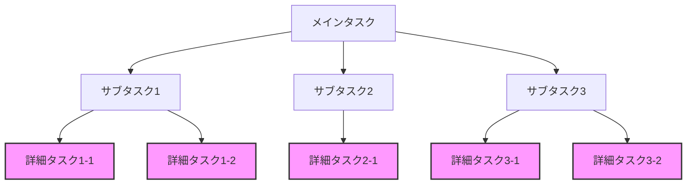

# AIエージェント委託パターン / AI Agent Delegation Patterns

最終更新: 2025-06-06

## 📋 概要 / Overview

複雑なタスクを実行する際に、サブタスクを別のAIエージェントに委託するパターンと実行方法についてのナレッジ。特に多階層のタスク分解において、適切な部分タスクを効率的に処理するための手法を記載。

This document describes patterns and methods for delegating subtasks to other AI agents when executing complex tasks, particularly for efficient processing of appropriate subtasks in multi-layered task decomposition.

## ⚠️ 前提条件 / Prerequisites

- Claude CLI がインストール済み（`claude --version` で確認）
- 適切なAPIキーが設定済み（環境変数またはclaude設定）
- APIレート制限とコスト影響を理解していること

**関連ドキュメント**:
- [operational_patterns.md](./operational_patterns.md) - 運用パターン全般
- [security_patterns.md](security_patterns.md) - セキュリティ考慮事項

## 🎯 基本原則

### タスク委託の判断基準

#### 委託が推奨されるケース
1. **複雑なサブタスク**: 独立した複雑な処理が必要な場合
2. **専門性が必要**: 特定のドメイン知識や技術が必要な場合
3. **並列処理可能**: 他のタスクと独立して実行できる場合
4. **繰り返し処理**: 同様のパターンで複数回実行が必要な場合

#### 直接実行が推奨されるケース
1. **単純なタスク**: 1-2ステップで完了する作業
2. **コンテキスト依存**: 現在の文脈に強く依存する作業
3. **即時性が必要**: リアルタイムのフィードバックが必要な場合
4. **小規模な処理**: オーバーヘッドが処理時間を上回る場合

## 🔧 実行方法

### 基本的な委託パターン

#### 1. シンプルな委託
```bash
# 基本形式（注：実際のCLI仕様に準拠）
claude --print "{依頼タスクのプロンプト}"
# または短縮形
claude -p "{依頼タスクのプロンプト}"
```

**使用例**:
```bash
# ドキュメントの生成
claude -p "READMEファイルにプロジェクトの概要セクションを追加してください"

# コードレビュー（出力形式指定）
claude -p "src/main.pyのセキュリティ観点でのレビューを実施してください" --output-format markdown

# テストケースの作成（モデル指定）
claude -p "UserServiceクラスの単体テストを作成してください" --model claude-3-sonnet
```

#### 2. コンテキスト付き委託
```bash
# パイプを使用したコンテキスト注入
echo "{コンテキストorルールorシステムプロンプト}" | claude -p "{依頼タスクのプロンプト}"

# ファイルからのコンテキスト読み込み
cat context.txt | claude -p "{依頼タスクのプロンプト}"
```

**使用例**:
```bash
# プロジェクト固有のルールを含めた実装
echo "このプロジェクトではPEP8準拠とtype hintsが必須です" | claude -p "新しいユーティリティ関数を実装してください"

# 特定のフォーマットでの出力（エラーハンドリング付き）
if echo "出力はMarkdown形式で、セクションは###を使用すること" | claude -p "APIドキュメントを生成してください"; then
    echo "ドキュメント生成成功"
else
    echo "エラー: ドキュメント生成に失敗しました"
    exit 1
fi

# ドメイン知識を含めた分析（出力をファイルに保存）
echo "このシステムは金融取引を扱うため、ACID特性が重要です" | \
    claude -p "データベーストランザクションの設計をレビューしてください" > review_result.md
```

## 📊 タスク分解パターン

### 階層的タスク分解



ピンク色のノードが委託候補のタスク

### 実装例: 機能追加タスク

```python
class TaskDelegator:
    """タスク委託を管理するクラス"""
    
    def __init__(self):
        self.delegatable_patterns = {
            "test_creation": "テストケースの作成",
            "documentation": "ドキュメントの生成",
            "code_review": "コードレビュー",
            "refactoring": "リファクタリング提案",
            "security_check": "セキュリティ監査"
        }
    
    def should_delegate(self, task_type: str, complexity: int) -> bool:
        """委託すべきかどうかを判断"""
        # 複雑度が高く、委託可能なパターンに該当する場合
        return (
            complexity > 3 and 
            task_type in self.delegatable_patterns
        )
    
    def delegate_task(self, task_type: str, context: str, prompt: str) -> str:
        """タスクを委託実行"""
        if context:
            command = f'echo "{context}" | claude -p "{prompt}"'
        else:
            command = f'claude -p "{prompt}"'
        
        # 実際の実行（擬似コード）
        return execute_command(command)
```

## 🎨 実践的な使用例

### 1. 大規模リファクタリング

```bash
# メインエージェントが全体計画を立案
# サブタスクを個別に委託

# ステップ1: 影響分析
claude -p "src/ディレクトリ内でUserクラスを使用している全ファイルをリストアップし、影響範囲を分析してください"

# ステップ2: テスト作成
echo "既存の機能を保証するテストを作成" | claude -p "Userクラスの現在の振る舞いを網羅するテストスイートを作成してください"

# ステップ3: リファクタリング実施
echo "後方互換性を維持しながら実施" | claude -p "UserクラスをUser, UserProfile, UserSettingsに分割してください"
```

### 2. ドキュメント生成プロジェクト

```bash
# 各モジュールのドキュメントを並列で生成

# API仕様書
claude -p "OpenAPI 3.0形式でREST APIの仕様書を生成してください"

# アーキテクチャ図
echo "PlantUML形式で出力" | claude -p "システムアーキテクチャ図を作成してください"

# 運用手順書
echo "運用チーム向けに具体的な手順を含める" | claude -p "本番環境へのデプロイ手順書を作成してください"
```

### 3. セキュリティ監査

```bash
# 異なる観点からの監査を並列実行

# OWASP Top 10チェック
echo "OWASP Top 10 2021に基づく" | claude -p "Webアプリケーションのセキュリティ脆弱性をチェックしてください"

# 依存関係の脆弱性
claude -p "package.jsonとpackage-lock.jsonから既知の脆弱性を持つパッケージを特定してください"

# 認証・認可の確認
echo "JWTトークンベースの認証を使用" | claude -p "認証・認可の実装をレビューしてください"
```

## ⚡ パフォーマンス考慮事項

### オーバーヘッドの評価

```python
import subprocess
import time
from typing import Optional, Tuple

def calculate_delegation_overhead(
    task_complexity: int, 
    estimated_duration: float,
    complexity_threshold: int = 5  # 実証的に決定すべき値
) -> bool:
    """委託のオーバーヘッドを評価
    
    Args:
        task_complexity: タスクの複雑度（1-10）
        estimated_duration: 推定実行時間（秒）
        complexity_threshold: 委託を検討する複雑度の閾値
    
    Returns:
        bool: 委託すべきかどうか
    """
    # API呼び出しのオーバーヘッド（実測値に基づく）
    API_LATENCY = 1.5  # 実際の環境で測定
    PROCESSING_OVERHEAD = 0.5
    
    total_overhead = API_LATENCY + PROCESSING_OVERHEAD
    
    # 単純なタスクは直接実行
    if task_complexity < complexity_threshold:
        return False
    
    # 実行時間がオーバーヘッドの3倍未満なら直接実行
    if estimated_duration < total_overhead * 3:
        return False
    
    return True

def execute_claude_task(prompt: str, context: Optional[str] = None) -> Tuple[bool, str]:
    """Claude CLIを使用してタスクを実行
    
    Args:
        prompt: 実行するプロンプト
        context: オプションのコンテキスト
    
    Returns:
        Tuple[bool, str]: (成功フラグ, 結果またはエラーメッセージ)
    """
    try:
        if context:
            # コンテキスト付き実行
            process = subprocess.Popen(
                ['claude', '-p', prompt],
                stdin=subprocess.PIPE,
                stdout=subprocess.PIPE,
                stderr=subprocess.PIPE,
                text=True
            )
            stdout, stderr = process.communicate(input=context)
        else:
            # シンプル実行
            result = subprocess.run(
                ['claude', '-p', prompt],
                capture_output=True,
                text=True,
                timeout=300  # 5分のタイムアウト
            )
            stdout, stderr = result.stdout, result.stderr
        
        if stderr:
            return False, f"Error: {stderr}"
        
        return True, stdout
        
    except subprocess.TimeoutExpired:
        return False, "Timeout: Task took too long"
    except Exception as e:
        return False, f"Exception: {str(e)}"
```

## 💰 コストとレート制限

### API使用料の考慮

```python
class CostCalculator:
    """API使用コストの計算"""
    
    # 料金は仮定値（実際のAPIプランに応じて調整）
    COST_PER_1K_TOKENS = {
        'claude-3-opus': 0.015,
        'claude-3-sonnet': 0.003,
        'claude-3-haiku': 0.00025
    }
    
    @staticmethod
    def estimate_cost(prompt: str, model: str = 'claude-3-sonnet') -> float:
        """プロンプトのコストを推定
        
        注: トークン数の推定は概算（実際のトークナイザーを使用すべき）
        """
        # 簡易的な推定: 1トークン ≈ 4文字
        estimated_tokens = len(prompt) / 4
        
        cost_per_token = CostCalculator.COST_PER_1K_TOKENS.get(model, 0.003) / 1000
        return estimated_tokens * cost_per_token
```

### レート制限の管理

```python
import time
from collections import deque
from datetime import datetime, timedelta

class RateLimiter:
    """APIレート制限の管理"""
    
    def __init__(self, max_requests: int = 50, window_minutes: int = 1):
        self.max_requests = max_requests
        self.window = timedelta(minutes=window_minutes)
        self.requests = deque()
    
    def can_make_request(self) -> bool:
        """リクエストが可能かチェック"""
        now = datetime.now()
        
        # 古いリクエストを削除
        while self.requests and self.requests[0] < now - self.window:
            self.requests.popleft()
        
        return len(self.requests) < self.max_requests
    
    def add_request(self):
        """リクエストを記録"""
        self.requests.append(datetime.now())
    
    def wait_if_needed(self):
        """必要に応じて待機"""
        if not self.can_make_request():
            # 最も古いリクエストが期限切れになるまで待機
            wait_time = (self.requests[0] + self.window - datetime.now()).total_seconds()
            if wait_time > 0:
                print(f"Rate limit reached. Waiting {wait_time:.1f} seconds...")
                time.sleep(wait_time + 1)
```

### 並列実行の活用

```bash
# 独立したタスクを並列で実行
(
    claude -p "コンポーネントAのテストを作成" &
    claude -p "コンポーネントBのテストを作成" &
    claude -p "コンポーネントCのテストを作成" &
    wait
)
```

## 🔒 セキュリティ考慮事項

### 機密情報の取り扱い

```bash
# ❌ 危険：機密情報を直接含める（絶対禁止）
# claude -p "APIキーsk-ant-xxxを使用してください"  # 実行してはいけない

# ✅ 推奨：プレースホルダーと環境変数を使用
claude -p "環境変数ANTHROPIC_API_KEYを読み込むconfig.jsの設定を作成してください"
```

### 入力のサニタイゼーション

```bash
# ユーザー入力を含む場合は必ず検証
user_input="$1"
# 危険な文字をエスケープ
sanitized_input=$(echo "$user_input" | sed 's/[;<>&|`$]//g')
claude -p "次のタスクを実行: $sanitized_input"
```

### プロンプトインジェクション対策

```bash
# コンテキストとプロンプトを明確に分離
context="プロジェクトルール: PEP8準拠必須"
prompt="関数を実装してください"
echo "$context" | claude -p "$prompt"
```

### セキュリティチェックの実行

```bash
# プロジェクトのセキュリティチェックスクリプトを活用
python scripts/security_check.py
```

**参照**: [security_patterns.md](security_patterns.md) でより詳細なセキュリティパターンを確認

## 📈 効果測定

### メトリクス収集

```python
import json
from datetime import datetime
from pathlib import Path

class DelegationMetrics:
    """委託実行のメトリクス収集"""
    
    def __init__(self, metrics_file: str = "delegation_metrics.json"):
        self.metrics_file = Path(metrics_file)
        self.metrics = self._load_metrics()
    
    def _load_metrics(self) -> dict:
        """既存メトリクスを読み込み"""
        if self.metrics_file.exists():
            with open(self.metrics_file, 'r') as f:
                return json.load(f)
        return {"tasks": []}
    
    def record_task(self, task_type: str, delegated: bool, 
                   duration: float, success: bool, complexity: int):
        """タスク実行を記録"""
        self.metrics["tasks"].append({
            "timestamp": datetime.now().isoformat(),
            "task_type": task_type,
            "delegated": delegated,
            "duration": duration,
            "success": success,
            "complexity": complexity
        })
        self._save_metrics()
    
    def _save_metrics(self):
        """メトリクスを保存"""
        with open(self.metrics_file, 'w') as f:
            json.dump(self.metrics, f, indent=2)
    
    def analyze_effectiveness(self) -> dict:
        """委託の効果を分析"""
        delegated = [t for t in self.metrics["tasks"] if t["delegated"]]
        direct = [t for t in self.metrics["tasks"] if not t["delegated"]]
        
        if not delegated or not direct:
            return {"message": "データ不足"}
        
        return {
            "average_time_reduction": self._avg_duration(direct) - self._avg_duration(delegated),
            "success_rate_improvement": self._success_rate(delegated) - self._success_rate(direct),
            "complexity_threshold": self._find_optimal_threshold()
        }
    
    def _avg_duration(self, tasks: list) -> float:
        """平均実行時間を計算"""
        return sum(t["duration"] for t in tasks) / len(tasks)
    
    def _success_rate(self, tasks: list) -> float:
        """成功率を計算"""
        return sum(1 for t in tasks if t["success"]) / len(tasks)
    
    def _find_optimal_threshold(self) -> int:
        """最適な複雑度閾値を発見"""
        # 実装は実際のデータ分析に基づく
        return 5
```

## 🧪 テストパターン

### AI委託コードのテスト

```python
import unittest
from unittest.mock import patch, MagicMock

class TestAIDelegation(unittest.TestCase):
    """AI委託機能のテスト"""
    
    @patch('subprocess.run')
    def test_simple_delegation(self, mock_run):
        """シンプルな委託のテスト"""
        # モックの設定
        mock_run.return_value = MagicMock(
            stdout="テスト完了",
            stderr="",
            returncode=0
        )
        
        # 実行
        success, result = execute_claude_task("テストプロンプト")
        
        # 検証
        self.assertTrue(success)
        self.assertEqual(result, "テスト完了")
        mock_run.assert_called_once_with(
            ['claude', '-p', 'テストプロンプト'],
            capture_output=True,
            text=True,
            timeout=300
        )
    
    @patch('subprocess.Popen')
    def test_context_delegation(self, mock_popen):
        """コンテキスト付き委託のテスト"""
        # モックプロセスの設定
        mock_process = MagicMock()
        mock_process.communicate.return_value = ("成功", "")
        mock_popen.return_value = mock_process
        
        # 実行
        success, result = execute_claude_task("プロンプト", "コンテキスト")
        
        # 検証
        self.assertTrue(success)
        mock_process.communicate.assert_called_once_with(input="コンテキスト")
    
    def test_complexity_threshold(self):
        """複雑度閾値のテスト"""
        # 単純なタスクは委託しない
        self.assertFalse(calculate_delegation_overhead(3, 10.0))
        
        # 複雑なタスクは委託する
        self.assertTrue(calculate_delegation_overhead(8, 60.0))
        
        # 短時間タスクは委託しない
        self.assertFalse(calculate_delegation_overhead(7, 5.0))
```

## 🚀 ベストプラクティス

### 1. 明確な指示
- 期待する出力形式を明示
- 制約条件を具体的に記述
- サンプル出力を提供

### 2. 適切な粒度
- タスクが大きすぎず小さすぎない
- 独立性の高い単位で分割
- 依存関係を最小化

### 3. エラーハンドリング
```bash
# 委託結果の検証を含める
result=$(claude -p "実装タスク")
if [ $? -ne 0 ]; then
    echo "タスク実行に失敗しました"
    # フォールバック処理
fi
```

### 4. フィードバックループ
- 委託結果をレビュー
- 必要に応じて追加指示
- パターンを継続的に改善

## 🔄 継続的改善

### 委託パターンの最適化

1. **実行ログの分析**
   - 委託頻度の高いタスクを特定
   - 成功率の低いパターンを改善

2. **テンプレート化**
   - よく使うプロンプトをテンプレート化
   - コンテキストの標準化

3. **自動化の推進**
   - 定型的な委託をスクリプト化
   - CI/CDパイプラインへの組み込み

## 🛡️ フォールバック戦略

### エラー時の対処

```bash
#!/bin/bash
# fallback_delegation.sh

execute_with_fallback() {
    local prompt="$1"
    local max_retries=3
    local retry_count=0
    
    while [ $retry_count -lt $max_retries ]; do
        if claude -p "$prompt" > result.txt 2>error.log; then
            cat result.txt
            rm -f result.txt error.log
            return 0
        fi
        
        retry_count=$((retry_count + 1))
        echo "Attempt $retry_count failed. Retrying..." >&2
        sleep $((retry_count * 2))  # 指数バックオフ
    done
    
    # 全試行失敗時のフォールバック
    echo "All attempts failed. Error log:" >&2
    cat error.log >&2
    
    # 代替処理または手動介入を促す
    echo "Please handle this task manually or try alternative approach" >&2
    return 1
}
```

### 代替実行パス

```python
class DelegationStrategy:
    """委託戦略とフォールバック"""
    
    def execute_task(self, task: dict) -> dict:
        """タスク実行（フォールバック付き）"""
        
        # 1. AI委託を試行
        if self.should_delegate(task):
            result = self.try_delegation(task)
            if result["success"]:
                return result
        
        # 2. ローカル実行を試行
        if self.can_execute_locally(task):
            return self.execute_locally(task)
        
        # 3. 簡略化バージョンを実行
        simplified = self.simplify_task(task)
        if simplified:
            return self.execute_task(simplified)
        
        # 4. 手動介入を要求
        return {
            "success": False,
            "action_required": "manual",
            "message": "Task requires manual intervention"
        }
```

## 🔧 プロジェクトへの統合

### Makefile統合例

```makefile
# AI委託タスク
.PHONY: ai-review ai-docs ai-test

ai-review:
	@echo "Running AI code review..."
	@claude -p "Review code changes in git diff for security and quality issues"

ai-docs:
	@echo "Generating documentation..."
	@find ./src -name "*.py" -exec echo {} \; | \
		xargs -I {} claude -p "Generate docstring for functions in {}"

ai-test:
	@echo "Generating test cases..."
	@claude -p "Create unit tests for new functions added in the last commit"
```

### GitHub Actions統合

```yaml
# .github/workflows/ai-assist.yml
name: AI Assisted Development

on:
  pull_request:
    types: [opened, synchronize]

jobs:
  ai-review:
    runs-on: ubuntu-latest
    steps:
      - uses: actions/checkout@v3
      
      - name: Setup Claude CLI
        run: |
          # Claude CLIのセットアップ（仮定）
          npm install -g @anthropic/claude-cli
          
      - name: AI Code Review
        env:
          ANTHROPIC_API_KEY: ${{ secrets.ANTHROPIC_API_KEY }}
        run: |
          git diff origin/main..HEAD > changes.diff
          cat changes.diff | claude -p "Review these changes for bugs and improvements" > review.md
          
      - name: Post Review Comment
        uses: actions/github-script@v6
        with:
          script: |
            const review = require('fs').readFileSync('review.md', 'utf8');
            github.rest.issues.createComment({
              ...context.repo,
              issue_number: context.issue.number,
              body: '## AI Review\n\n' + review
            });
```

---

**重要な注意事項**:

1. このドキュメントのコマンド例は概念的なものです。実際のClaude CLI仕様を確認してください。
2. APIキーは必ず環境変数で管理し、コードに直接記載しないでください。
3. 組織のセキュリティポリシーとAPI利用規約を遵守してください。
4. コスト管理とレート制限を適切に実装してください。

**Version**: 1.0.0  
**Last Updated**: 2025-06-06  
**Status**: 実装前の検証が必要