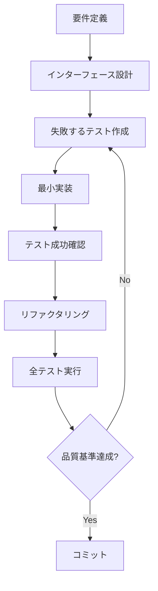

# 汎用的なTDDパターンとプラクティス

## 🎯 このドキュメントの目的

A2A MVPプロジェクトで実証されたTDDパターンを、**任意のプロジェクトに適用可能な汎用的な形**で整理します。

## 📊 汎用性の指標

| パターン | 汎用性 | 適用条件 | 制約事項 |
|---------|--------|----------|----------|
| Red-Green-Refactorサイクル | ★★★★★ | なし | なし |
| 層構造アーキテクチャ | ★★★★☆ | 中規模以上 | マイクロサービスでは要調整 |
| アクションマップパターン | ★★★★☆ | 多分岐処理 | 動的アクションでは不適 |
| 結果型エラーハンドリング | ★★★★★ | なし | 言語により実装方法が異なる |
| フィクスチャ戦略 | ★★★★☆ | pytest使用時 | 他のテストフレームワークでは要調整 |

## 🏗️ 汎用的なプロジェクト構造

### 基本構造テンプレート

```
<project-name>/
├── src/                      # ソースコード
│   └── <package-name>/       # メインパッケージ
│       ├── domain/           # ドメインモデル（依存なし）
│       ├── infrastructure/   # 外部システムとの接続
│       ├── application/      # アプリケーションロジック
│       └── presentation/     # UI/API層
├── tests/                    # テストコード
│   ├── unit/                # ユニットテスト
│   ├── integration/         # 統合テスト
│   └── e2e/                # E2Eテスト
├── scripts/                 # ユーティリティスクリプト
├── docs/                    # ドキュメント
└── .github/                 # CI/CD設定
```

### プロジェクトタイプ別カスタマイズ

#### Webアプリケーション
```
presentation/ → api/, web/, cli/
infrastructure/ → database/, cache/, messaging/
```

#### CLIツール
```
presentation/ → commands/, formatters/
infrastructure/ → filesystem/, network/
```

#### ライブラリ
```
最小構成：domain/ + public API in __init__.py
```

## 🔄 汎用的なTDDワークフロー

### 1. 機能実装フロー



### 2. テスト設計パターン

#### Given-When-Thenパターン（汎用）
```python
def test_feature_behavior():
    """機能の振る舞いをテスト"""
    # Given: 前提条件
    initial_state = create_test_state()
    
    # When: アクション実行
    result = perform_action(initial_state)
    
    # Then: 期待結果を検証
    assert result.is_successful()
    assert result.value == expected_value
```

#### Arrange-Act-Assertパターン（代替）
```python
def test_calculation():
    # Arrange
    calculator = Calculator()
    
    # Act
    result = calculator.add(2, 3)
    
    # Assert
    assert result == 5
```

## 🎨 汎用的な実装パターン

### 1. 結果型パターン（言語非依存）

**Python実装**:
```python
from typing import Union, Optional, Dict, Any

class Result:
    def __init__(self, success: bool, value: Any = None, error: str = None):
        self.success = success
        self.value = value
        self.error = error
    
    @classmethod
    def ok(cls, value: Any) -> 'Result':
        return cls(True, value=value)
    
    @classmethod
    def fail(cls, error: str) -> 'Result':
        return cls(False, error=error)

# 使用例
def divide(a: float, b: float) -> Result:
    if b == 0:
        return Result.fail("Division by zero")
    return Result.ok(a / b)
```

**TypeScript実装**:
```typescript
type Result<T, E = string> = 
  | { success: true; value: T }
  | { success: false; error: E };

function divide(a: number, b: number): Result<number> {
  if (b === 0) {
    return { success: false, error: "Division by zero" };
  }
  return { success: true, value: a / b };
}
```

### 2. 依存性注入パターン

**コンストラクタ注入（推奨）**:
```python
class Service:
    def __init__(self, repository: RepositoryInterface):
        self._repository = repository  # テスト時にモック可能
    
    def process(self, data):
        return self._repository.save(data)
```

**ファクトリパターン（代替）**:
```python
class ServiceFactory:
    @staticmethod
    def create(test_mode: bool = False) -> Service:
        if test_mode:
            return Service(MockRepository())
        return Service(RealRepository())
```

### 3. 複雑度削減パターン

**ストラテジーパターン（10分岐以上）**:
```python
class ActionHandler:
    def __init__(self):
        self._strategies = {
            'create': CreateStrategy(),
            'update': UpdateStrategy(),
            'delete': DeleteStrategy(),
        }
    
    def handle(self, action: str, data: Any) -> Result:
        strategy = self._strategies.get(action)
        if not strategy:
            return Result.fail(f"Unknown action: {action}")
        return strategy.execute(data)
```

**チェーン・オブ・レスポンシビリティ（条件分岐）**:
```python
class ValidationChain:
    def __init__(self):
        self._validators = [
            RequiredFieldValidator(),
            LengthValidator(),
            FormatValidator(),
        ]
    
    def validate(self, data: Dict) -> Result:
        for validator in self._validators:
            result = validator.validate(data)
            if not result.success:
                return result
        return Result.ok(data)
```

## 📋 汎用的な品質基準

### カバレッジ目標（プロジェクトタイプ別）

| プロジェクトタイプ | 全体 | コアロジック | インフラ層 | UI層 |
|------------------|------|-------------|-----------|------|
| ビジネスアプリ | 85% | 95% | 80% | 70% |
| ライブラリ | 90% | 100% | 85% | - |
| プロトタイプ | 70% | 85% | 60% | 50% |
| ユーティリティ | 80% | 90% | 75% | 60% |

### コード品質メトリクス

```yaml
# 汎用的な品質設定
quality_metrics:
  complexity:
    max_cyclomatic: 10      # 関数の複雑度
    max_cognitive: 15       # 認知的複雑度
  
  size:
    max_file_lines: 500     # ファイルサイズ
    max_function_lines: 50  # 関数サイズ
    max_class_lines: 200    # クラスサイズ
  
  naming:
    min_name_length: 2      # 変数名の最小長
    max_name_length: 40     # 変数名の最大長
  
  documentation:
    public_api_coverage: 100%  # 公開APIのドキュメント率
    complex_logic_coverage: 80% # 複雑なロジックの説明率
```

## 🔧 言語別の実装ガイド

### Python
```python
# pyproject.toml
[tool.pytest.ini_options]
testpaths = ["tests"]
python_files = ["test_*.py", "*_test.py"]

[tool.coverage.run]
source = ["src"]
omit = ["*/tests/*", "*/__pycache__/*"]

[tool.black]
line-length = 88  # プロジェクトに応じて調整

[tool.flake8]
max-complexity = 10
```

### JavaScript/TypeScript
```json
// package.json
{
  "scripts": {
    "test": "jest --coverage",
    "lint": "eslint src/",
    "format": "prettier --write src/"
  },
  "jest": {
    "coverageThreshold": {
      "global": {
        "branches": 85,
        "functions": 85,
        "lines": 85
      }
    }
  }
}
```

### Java
```xml
<!-- pom.xml -->
<properties>
  <jacoco.coverage.minimum>0.85</jacoco.coverage.minimum>
  <sonar.coverage.exclusions>
    **/model/**,**/config/**
  </sonar.coverage.exclusions>
</properties>
```

## 📊 プロジェクト評価チェックリスト

### 汎用性評価

- [ ] **依存性**: 特定のフレームワーク/ライブラリへの依存は最小限か？
- [ ] **移植性**: 他の言語/環境に移植可能な設計か？
- [ ] **拡張性**: 新機能追加時の影響範囲は限定的か？
- [ ] **テスト**: テストは実装に依存せず仕様を表現しているか？
- [ ] **文書化**: ドメイン知識なしで理解可能か？

### 適用可能性マトリクス

| 要素 | Web API | CLI | Library | Mobile | Desktop |
|-----|---------|-----|---------|--------|---------|
| 層構造 | ✅ | ✅ | ⚠️ | ✅ | ✅ |
| TDDサイクル | ✅ | ✅ | ✅ | ✅ | ✅ |
| CI/CD | ✅ | ✅ | ✅ | ⚠️ | ⚠️ |
| 結果型 | ✅ | ✅ | ✅ | ✅ | ✅ |

## 🚀 導入ステップ

### 新規プロジェクトへの適用

1. **プロジェクトタイプの特定**
   ```bash
   # プロジェクトタイプ別テンプレートを選択
   project-type: [web-api|cli|library|full-stack]
   ```

2. **品質基準の調整**
   ```yaml
   # project-quality.yml
   coverage:
     target: 85  # プロジェクトに応じて調整
     core: 95
   complexity:
     max: 10
   ```

3. **CI/CDテンプレートの適用**
   ```bash
   # 汎用CI/CDテンプレートをコピー
   cp templates/ci/${project-type}.yml .github/workflows/ci.yml
   ```

### 既存プロジェクトへの適用

1. **現状分析**
   ```bash
   # カバレッジ測定
   # 複雑度分析
   # 依存関係分析
   ```

2. **段階的導入計画**
   - Phase 1: 新機能からTDD適用
   - Phase 2: 既存コードのテスト追加
   - Phase 3: リファクタリング

3. **品質ゲートの段階的強化**
   ```yaml
   # 3ヶ月計画
   month_1: coverage >= 60%
   month_2: coverage >= 75%
   month_3: coverage >= 85%
   ```

## 📝 アンチパターンと対策

### 1. 過度な汎用化
**問題**: すべてを汎用化しようとして複雑化
**対策**: YAGNI原則の適用、3回ルール（3回目で汎用化）

### 2. テストの重複
**問題**: 同じロジックを異なるレベルでテスト
**対策**: テストピラミッドの遵守、責任の明確化

### 3. モックの乱用
**問題**: すべてをモック化してテストの価値が低下
**対策**: 統合テストとのバランス、実装に近いモック

---

*このドキュメントは、特定のプロジェクトに依存しない汎用的なパターンを提供します。プロジェクトの特性に応じて適切にカスタマイズしてください。*