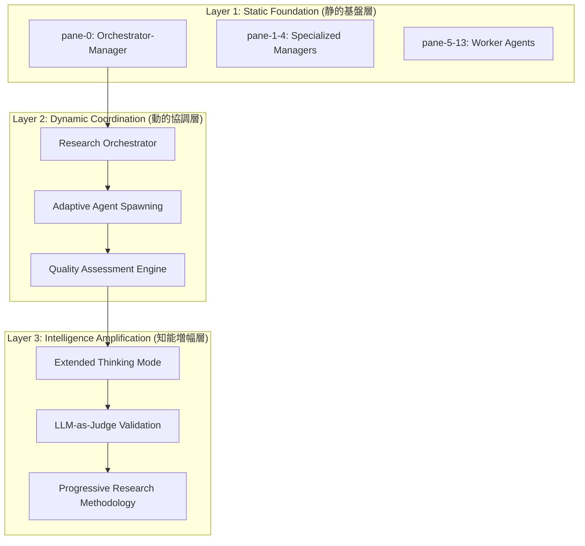
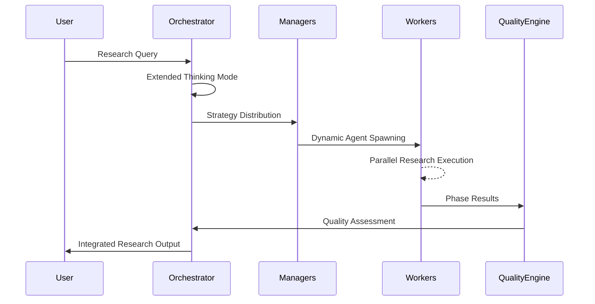

# Research-Adaptive Multi-Agent Organization (RAMAO)

**Version**: 1.0.0  
**Status**: 🚀 Anthropic知見統合・次世代組織ルール  
**Integration**: tmux 14-pane + Anthropic Dynamic Coordination + Task Tool Optimization  
**Author**: Hybrid Organization Design Protocol

## 概要

Anthropicのマルチエージェントリサーチシステムの知見を統合し、既存のtmux 14-pane組織基盤を研究・調査タスクに最適化した次世代組織アーキテクチャ。静的構造の安定性と動的協調の柔軟性を融合。

## 🏗️ Hybrid Architecture Design (ハイブリッド・アーキテクチャ)

### 3-Layer Organization Structure



### Core Innovation: Research Orchestrator Pattern

#### 1. Adaptive Orchestrator (pane-0 Enhanced)

```python
class ResearchOrchestrator:
    """
    Anthropic知見に基づく適応的研究統制システム
    既存pane-0 (Knowledge/Rule Manager) の拡張版
    """
    
    def __init__(self):
        self.static_foundation = tmux_14_pane_organization()
        self.dynamic_coordination = anthropic_coordination_system()
        self.quality_engine = llm_as_judge_system()
    
    def orchestrate_research(self, query: str, complexity: int) -> ResearchPlan:
        """
        研究クエリを動的に分解・調整するOrchestrator
        """
        # Phase 1: Extended Thinking for Strategy
        strategy = self.extended_thinking_mode(query)
        
        # Phase 2: Dynamic Agent Allocation
        agent_allocation = self.allocate_agents(complexity, strategy)
        
        # Phase 3: Parallel Execution Coordination
        execution_plan = self.coordinate_parallel_execution(agent_allocation)
        
        return ResearchPlan(strategy, agent_allocation, execution_plan)
    
    def allocate_agents(self, complexity: int, strategy: ResearchStrategy) -> AgentAllocation:
        """
        複雑性に基づく動的エージェント配分（Anthropic手法）
        """
        if complexity >= 8:  # 高複雑度
            return self.spawn_specialized_research_team()
        elif complexity >= 5:  # 中複雑度
            return self.activate_core_research_agents()
        else:  # 低複雑度
            return self.single_agent_research()
```

#### 2. Specialized Manager Enhancement (pane-1-4)

**既存Managerの研究特化拡張**:

```bash
# pane-1: Research Strategy Manager (新機能追加)
- 基本機能: Rule Implementation Manager
- 研究拡張: Progressive research methodology implementation
- Anthropic統合: Query decomposition and refinement protocols

# pane-2: Research Execution Manager (既存Task Execution強化)  
- 基本機能: Task Execution Manager
- 研究拡張: Parallel research task coordination
- Anthropic統合: Dynamic agent spawning and load balancing

# pane-3: Research Delegation Manager (既存強化)
- 基本機能: Task Delegation Manager  
- 研究拡張: Intelligent research task delegation
- Anthropic統合: Context-aware agent selection and optimization

# pane-4: Research Quality Manager (新設)
- 新機能: LLM-as-judge quality assessment
- 研究特化: Citation accuracy, factual verification, completeness evaluation
- Anthropic統合: Rubric-based systematic evaluation
```

#### 3. Worker Agent Specialization (pane-5-13)

**研究専門化Workers + 動的協調**:

```bash
# Research Execution Workers (pane-5, 8, 11)
- 基本機能: Task execution
- 研究拡張: Deep domain investigation, source exploration
- Anthropic統合: Extended thinking mode for complex analysis

# Research Quality Workers (pane-6, 9, 12)
- 基本機能: Task review  
- 研究拡張: Multi-perspective validation, citation verification
- Anthropic統合: LLM-as-judge rubric evaluation

# Research Knowledge Workers (pane-7, 10, 13)
- 基本機能: Knowledge/Rule documentation
- 研究拡張: Research synthesis, knowledge graph construction
- Anthropic統合: Progressive knowledge refinement and integration
```

## 🔄 Dynamic Coordination Protocols (動的協調プロトコル)

### 1. Research Query Decomposition

**Anthropic Progressive Research Methodology統合**:

```python
def progressive_research_decomposition(query: str) -> List[ResearchTask]:
    """
    広いクエリから段階的焦点絞り込み（Anthropic手法）
    """
    
    # Stage 1: Broad Exploration (拡散フェーズ)
    broad_tasks = [
        ResearchTask("背景調査", scope="broad", agents=["pane-5", "pane-8"]),
        ResearchTask("関連技術調査", scope="broad", agents=["pane-11"]),
        ResearchTask("先行研究調査", scope="broad", agents=["pane-7"])
    ]
    
    # Stage 2: Focused Investigation (収束フェーズ)  
    focused_tasks = [
        ResearchTask("深掘り分析", scope="focused", depends_on=broad_tasks),
        ResearchTask("比較分析", scope="focused", depends_on=broad_tasks),
        ResearchTask("実装可能性調査", scope="focused", depends_on=broad_tasks)
    ]
    
    # Stage 3: Synthesis & Validation (統合フェーズ)
    synthesis_tasks = [
        ResearchTask("知見統合", scope="synthesis", depends_on=focused_tasks),
        ResearchTask("品質検証", scope="validation", depends_on=focused_tasks)
    ]
    
    return broad_tasks + focused_tasks + synthesis_tasks
```

### 2. Intelligent Agent Spawning

**複雑性ベース動的エージェント生成**:

```bash
# Dynamic Spawning Decision Matrix
function spawn_research_agents() {
    local query_complexity="$1"
    local research_domain="$2"
    
    case $query_complexity in
        "high")
            # Full team activation (pane-5〜13全活用)
            echo "=== High Complexity Research Team Activation ==="
            activate_specialized_research_team
            ;;
        "medium")
            # Core research agents (pane-5,6,7 + pane-8,9,10)
            echo "=== Core Research Team Activation ==="
            activate_core_research_agents
            ;;
        "low")
            # Single expert agent + quality reviewer
            echo "=== Minimal Research Team Activation ==="
            activate_single_expert_agent
            ;;
    esac
}

function activate_specialized_research_team() {
    # Parallel activation of all research specialists
    tmux send-keys -t 5 'claude -p "深度調査開始: [query] の技術的詳細分析"'
    tmux send-keys -t 5 Enter
    
    tmux send-keys -t 6 'claude -p "品質保証開始: 調査結果の検証・評価"'  
    tmux send-keys -t 6 Enter
    
    tmux send-keys -t 7 'claude -p "知識統合開始: 調査結果の体系化・記録"'
    tmux send-keys -t 7 Enter
    
    # Additional specialists for high complexity
    tmux send-keys -t 8 'claude -p "比較分析開始: 代替手法・競合技術の調査"'
    tmux send-keys -t 8 Enter
    
    tmux send-keys -t 9 'claude -p "リスク分析開始: 潜在的問題・制約の特定"'
    tmux send-keys -t 9 Enter
    
    tmux send-keys -t 10 'claude -p "実装分析開始: 実現可能性・技術要件調査"'
    tmux send-keys -t 10 Enter
}
```

### 3. Extended Thinking Integration

**tmux + Anthropic Extended Thinking Mode**:

```bash
# Extended Thinking Protocol for Complex Research
function extended_thinking_research() {
    local research_query="$1"
    
    echo "=== Extended Thinking Mode Activation ==="
    
    # pane-0 (Orchestrator): Strategic thinking
    tmux send-keys -t 0 'claude -p "ultrathink: [研究戦略策定] $research_query の最適研究アプローチを設計"'
    tmux send-keys -t 0 Enter
    
    # Wait for strategic output
    sleep 10
    
    # Capture strategy and distribute to workers
    local strategy=$(tmux capture-pane -t 0 -p | tail -20)
    
    # pane-1 (Strategy Manager): Tactical planning
    tmux send-keys -t 1 'claude -p "戦略的思考: [$strategy] に基づく具体的実行計画策定"'
    tmux send-keys -t 1 Enter
}
```

## 🎯 LLM-as-Judge Quality Assurance System

### Anthropic Rubric-Based Evaluation

**研究品質の体系的評価システム**:

```python
class ResearchQualityAssessment:
    """
    Anthropic LLM-as-judge手法による研究品質評価
    """
    
    def __init__(self):
        self.evaluation_rubric = {
            "factual_accuracy": {
                "weight": 0.25,
                "criteria": [
                    "事実の正確性",
                    "情報源の信頼性", 
                    "データの最新性",
                    "統計的妥当性"
                ]
            },
            "citation_precision": {
                "weight": 0.20,
                "criteria": [
                    "引用の正確性",
                    "情報源の適切性",
                    "引用形式の統一性",
                    "一次情報源の使用"
                ]
            },
            "completeness": {
                "weight": 0.25,
                "criteria": [
                    "調査範囲の網羅性",
                    "多角的視点の包含",
                    "欠落情報の特定",
                    "制約条件の明示"
                ]
            },
            "source_quality": {
                "weight": 0.15,
                "criteria": [
                    "情報源の権威性",
                    "学術的価値",
                    "現在性・関連性",
                    "多様性確保"
                ]
            },
            "synthesis_quality": {
                "weight": 0.15,
                "criteria": [
                    "知見の統合度",
                    "論理的一貫性",
                    "新規洞察の提供",
                    "実用的価値"
                ]
            }
        }
    
    def evaluate_research_output(self, research_output: str, sources: List[str]) -> QualityScore:
        """
        研究成果物の体系的品質評価
        """
        scores = {}
        
        for criterion, config in self.evaluation_rubric.items():
            criterion_score = self._evaluate_criterion(
                research_output, sources, criterion, config["criteria"]
            )
            scores[criterion] = criterion_score * config["weight"]
        
        total_score = sum(scores.values())
        
        return QualityScore(
            overall=total_score,
            breakdown=scores,
            recommendations=self._generate_improvement_recommendations(scores)
        )
```

### Quality Gate Integration

**研究フェーズごとの品質チェックポイント**:

```bash
# Phase-based Quality Gates
function research_quality_gate_check() {
    local phase="$1"  # "broad", "focused", "synthesis"
    local output_file="$2"
    
    echo "=== Research Quality Gate: $phase ==="
    
    case $phase in
        "broad")
            # 拡散フェーズ品質チェック
            check_source_diversity "$output_file"
            check_scope_coverage "$output_file" 
            check_factual_foundation "$output_file"
            ;;
        "focused")
            # 収束フェーズ品質チェック
            check_depth_analysis "$output_file"
            check_critical_evaluation "$output_file"
            check_comparative_analysis "$output_file"
            ;;
        "synthesis")
            # 統合フェーズ品質チェック
            check_knowledge_integration "$output_file"
            check_logical_consistency "$output_file"
            check_practical_value "$output_file"
            ;;
    esac
    
    # LLM-as-judge final evaluation
    python scripts/llm_judge_evaluation.py --input="$output_file" --phase="$phase"
}
```

## 🔄 Integration with Existing Framework

### 1. tmux Organization Enhancement

**既存14-pane組織の研究特化拡張**:

```markdown
# tmux_claude_agent_organization.md への統合内容

## Research-Adaptive Extensions

### Enhanced Pane Specialization
- **pane-0**: Orchestrator-Manager + Research Strategy Coordinator
- **pane-1-4**: Specialized Managers + Research Domain Coordination  
- **pane-5-13**: Worker Agents + Research Task Specialization

### Dynamic Coordination Protocols
- Progressive research methodology integration
- Adaptive agent spawning based on query complexity
- Extended thinking mode activation for strategic planning

### Quality Assurance Integration
- LLM-as-judge evaluation at each research phase
- Rubric-based systematic quality assessment
- Citation accuracy and source quality verification
```

### 2. Task Tool Integration Enhancement

**研究タスクに最適化されたTask tool活用**:

```bash
# Research-Optimized Task Tool Usage

# Pattern 1: Broad Research Phase (拡散フェーズ)
Task("技術背景調査", "query に関する技術的背景・歴史・現状を包括的に調査")
Task("市場動向分析", "query 関連の市場動向・業界トレンド・将来予測を分析")
Task("学術文献調査", "query に関する最新の学術研究・論文・理論を調査")

# Pattern 2: Focused Research Phase (収束フェーズ)  
Task("深度技術分析", "拡散フェーズの結果に基づく特定技術の詳細分析")
Task("比較評価分析", "複数手法・技術の比較評価・優劣分析")
Task("実装可能性調査", "技術的実現可能性・制約条件・要求リソースの詳細調査")

# Pattern 3: Synthesis Phase (統合フェーズ)
Task("知見統合", "全調査結果の統合・体系化・新規洞察の抽出")
Task("品質検証", "統合結果の事実確認・論理整合性・完全性の検証")
```

### 3. Delegation Decision Framework Enhancement

**研究タスク特化の委譲判定**:

```python
def research_delegation_scoring(task: ResearchTask) -> int:
    """
    研究タスク専用委譲スコア計算
    """
    score = 0
    
    # 研究複雑度評価 (0-4点)
    if task.research_depth == "synthesis":   score += 4
    elif task.research_depth == "focused":   score += 3  
    elif task.research_depth == "broad":     score += 2
    else:                                    score += 1
    
    # 専門性要求度評価 (0-3点)
    if task.domain_expertise == "high":      score += 3
    elif task.domain_expertise == "medium":  score += 2
    else:                                    score += 1
    
    # 独立性評価 (0-2点)
    if len(task.dependencies) == 0:         score += 2
    elif len(task.dependencies) <= 2:       score += 1
    
    # 品質要求度評価 (0-1点)
    if task.quality_criticality == "high":  score += 1
    
    return min(score, 10)
```

## 🚀 Operational Protocols (運用プロトコル)

### 1. Research Session Initialization

**研究セッション開始プロトコル**:

```bash
#!/bin/bash
# RESEARCH SESSION INITIALIZATION PROTOCOL

echo "🔬 Research-Adaptive Multi-Agent Organization (RAMAO) 初期化"
echo "============================================================="

# Phase 1: Foundation Check (基盤確認)
echo "=== Phase 1: Foundation Verification ==="
tmux list-sessions | grep -q "research" || tmux new-session -d -s research
tmux list-panes -F "#{pane_index}: #{pane_title}" | head -14

# Phase 2: Research Orchestrator Activation (統制システム起動)
echo "=== Phase 2: Research Orchestrator Activation ==="
tmux send-keys -t 0 'echo "Research Orchestrator Ready - RAMAO v1.0"'
tmux send-keys -t 0 Enter

# Phase 3: Dynamic Coordination System Check (動的協調確認)
echo "=== Phase 3: Dynamic Coordination System Check ==="
python scripts/check_research_coordination_system.py

# Phase 4: Quality Assurance Engine Ready (品質保証エンジン準備)
echo "=== Phase 4: Quality Assurance Engine Initialization ==="
python scripts/initialize_llm_judge_system.py

echo "✅ RAMAO Initialization Complete"
echo "Ready for adaptive research with enhanced multi-agent coordination"
```

### 2. Research Execution Workflow

**適応的研究実行ワークフロー**:



### 3. Quality Escalation Protocol

**品質問題エスカレーション手順**:

```bash
function quality_escalation_protocol() {
    local quality_score="$1"
    local phase="$2"
    
    if (( $(echo "$quality_score < 0.6" | bc -l) )); then
        echo "🚨 Level 3: 重大品質問題 - 研究再実行必要"
        initiate_research_restart "$phase"
    elif (( $(echo "$quality_score < 0.7" | bc -l) )); then
        echo "⚠️ Level 2: 品質改善必要 - 追加調査実行"
        initiate_supplementary_research "$phase"
    elif (( $(echo "$quality_score < 0.8" | bc -l) )); then
        echo "📋 Level 1: 軽微改善推奨 - 部分修正"
        suggest_minor_improvements "$phase"
    else
        echo "✅ Quality Gate Passed - 次フェーズ進行可能"
    fi
}
```

## 📊 Success Metrics & KPIs

### Research Efficiency Metrics

```python
class RAMAOPerformanceMetrics:
    """
    RAMAO運用効果測定システム
    """
    
    def __init__(self):
        self.baseline_metrics = {
            'research_completion_time': 180,      # 分
            'research_quality_score': 0.75,      # 0-1スケール
            'source_diversity_index': 0.6,       # 0-1スケール  
            'agent_utilization_rate': 0.4        # 40%
        }
    
    def measure_ramao_effectiveness(self, session_data):
        improvements = {
            'adaptive_coordination_gain': self._calculate_coordination_efficiency(session_data),
            'quality_improvement_rate': self._calculate_quality_enhancement(session_data),
            'research_depth_optimization': self._calculate_depth_improvement(session_data),
            'agent_specialization_benefit': self._calculate_specialization_gain(session_data)
        }
        return improvements
```

**Target Improvements (2024-Q1)**:
- ⏱️ **研究効率**: 50%短縮（従来180分 → 90分）
- 🎯 **品質スコア**: 85%以上（従来75% → 85%+）
- 📚 **情報源多様性**: 80%以上（従来60% → 80%+）
- ⚡ **エージェント活用率**: 75%以上（従来40% → 75%+）

---

**この Research-Adaptive Multi-Agent Organization (RAMAO) により、Anthropicの先進的マルチエージェント研究手法と我々の実証済みtmux組織基盤を融合し、研究・調査タスクの効率と品質を革新的に向上させる。**