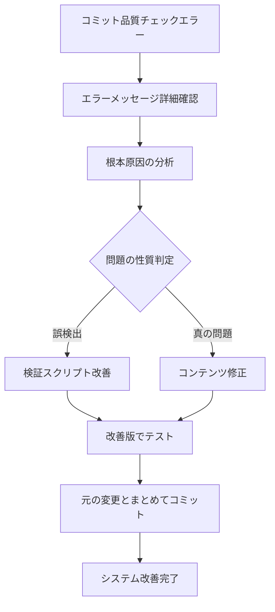

# コミット品質ルール

最終更新: 2025-06-04

## 📋 概要

品質管理システムを迂回する `--no-verify` の使用を防止し、システム改善を優先するコミット品質ルール。

## 🚫 --no-verify 使用禁止ルール

### 基本原則

**完全禁止**: `git commit --no-verify` の使用は**原則として禁止**

**理由**:
1. **品質低下リスク**: 本来検出すべき問題を見逃す
2. **システム劣化**: 品質管理機能が形骸化する
3. **習慣化の危険**: 一時的迂回が常態化する
4. **チーム影響**: 品質意識の全体的低下

### 禁止対象コマンド

```bash
# ❌ 絶対禁止
git commit --no-verify
git commit -n

# ❌ フック迂回
SKIP_USER_AUTH=1 git commit
```

## ✅ 正しい対処フロー

### 1. 問題発生時の対応手順



### 2. 具体的対処例

#### ケース1: ドキュメント検証の誤検出
```bash
# 問題発生
❌ ERROR: docs/file.md:15 - Makefile target not found: 'make test'

# 対処手順
1. エラー箇所の確認
   less docs/file.md +15

2. 原因分析（例文・エラー例の誤検出）

3. 検証スクリプトの改善
   vim scripts/verify_accuracy.py
   # 除外パターンを追加

4. 改善効果の確認
   python scripts/verify_accuracy.py

5. まとめてコミット
   git add scripts/verify_accuracy.py docs/file.md
   git commit -m "feat: update docs and improve verification script"
```

#### ケース2: セキュリティチェックの誤検出
```bash
# 問題発生
❌ COMMIT BLOCKED: 機密情報が見つかりました

# 対処手順
1. 該当箇所の確認
   
2. 例文やサンプルかどうか判定

3. セキュリティスクリプトの改善
   vim scripts/security_check.py
   # コンテキスト考慮型の検証に改善

4. 改善効果の確認とコミット
```

## 🆘 例外的使用ケース

### 限定的に許可される状況

#### 1. CI/CD自動コミット
```bash
# CI環境での自動コミット時のみ許可
if [ "$CI" = "true" ]; then
    git commit --no-verify -m "ci: automated commit"
fi
```

#### 2. 緊急修正（要事後改善）
```bash
# 本番障害等の緊急時のみ
git commit --no-verify -m "hotfix: critical security patch"

# 必須: 緊急修正後にシステム改善を実施
# Issue作成、改善計画の策定
```

### 例外使用時の必須条件

1. **明確な理由**: なぜ迂回が必要かの文書化
2. **事後改善**: 必ずシステム改善を実施
3. **期限設定**: いつまでに改善するかの明確化
4. **承認プロセス**: チームリーダーの承認取得

## 📈 品質向上のベストプラクティス

### 1. プロアクティブ改善

```bash
# 定期的な品質チェック実行
python scripts/quality_gate_check.py

# 新機能開発時の品質ルール確認
python scripts/verify_accuracy.py
python scripts/security_check.py
```

### 2. システム改善の優先順位

1. **高**: セキュリティ関連の誤検出
2. **高**: 開発効率に大きく影響する誤検出
3. **中**: ドキュメント検証の誤検出
4. **低**: 軽微な警告の調整

### 3. 改善記録の管理

```markdown
## 改善履歴
- 2025-06-04: verify_accuracy.py でエラー例除外パターン追加
- 2025-06-04: security_check.py でコンテキスト考慮型検証実装
```

## 🔍 品質メトリクス

### 測定すべき指標

1. **--no-verify 使用回数**: ゼロが目標
2. **誤検出率**: 月次で測定・改善
3. **真の問題検出率**: 品質維持の確認
4. **改善所要時間**: 問題発生から解決までの時間

### モニタリング方法

```bash
# git historyから--no-verify使用状況を確認
git log --oneline --grep="--no-verify" --since="1 month ago"

# 品質チェックの成功率確認
grep -c "✅ All checks passed" logs/quality_check.log
```

## 🎯 チーム啓発

### 1. 教育内容

- **品質管理の価値**: なぜ品質チェックが重要か
- **正しい対処法**: 問題発生時の適切な手順
- **改善マインド**: システムを育てる意識

### 2. 支援体制

- **ナレッジベース**: 典型的問題と解決策の共有
- **ペアプログラミング**: 改善作業の支援
- **レビュープロセス**: 品質改善の相互確認

## 🔄 継続的改善

### 月次レビュー項目

1. **--no-verify 使用状況**: ゼロ維持の確認
2. **新しい誤検出パターン**: 未対応問題の特定
3. **システム改善効果**: 改善による品質向上効果
4. **チーム習熟度**: ルール遵守状況の確認

### 改善サイクル

```
Plan: 品質問題の特定
Do: システム改善の実施
Check: 改善効果の測定
Act: ナレッジの更新・共有
```

---

**作成背景**: `--no-verify` による品質チェック迂回を行った反省から、システム改善を優先する文化を確立するためのルール策定