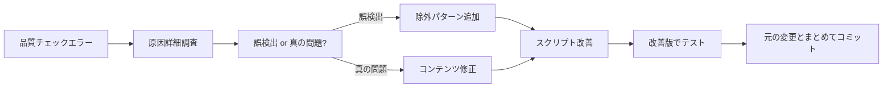

# 品質管理システム改善ナレッジ

最終更新: 2025-06-04

## 📋 概要

検証スクリプトが意図しない例文やエラー例を検証対象として誤検出する問題と、その改善手法をまとめたナレッジ。

## 🚨 中核原則

### 1. --no-verify 使用禁止ルール

**基本方針**: `git commit --no-verify` は品質管理システムを迂回するため**原則禁止**

**理由**:
- 品質チェックの無効化により、真の問題を見逃すリスク
- チーム全体の品質水準低下
- 一時的な迂回が常態化する危険性

**正しいアプローチ**:
1. エラーの根本原因を詳細調査
2. 検証スクリプトの改善で問題解決
3. 改善したスクリプトと元の変更をまとめてコミット

## 🔧 検証スクリプト改善パターン

### 問題の典型例

**症状**: ドキュメント内のエラー例やサンプルコードが検証対象になる
```bash
❌ ERROR: docs/setup.md:15 - Makefile target not found: 'make test'
```

**原因**: スクリプトがドキュメント内の例文とサンプルコードを区別できない

### 標準的な除外パターン

#### 1. エラー表示マーカー
```python
error_markers = [
    '❌ ERROR', '⚠️ WARNING', '# Note:', 'エラー例',
    'Makefile target not found', '存在しないターゲット',
    'ERROR:', 'WARNING:', '実行結果例', '以下は存在しない'
]
```

#### 2. 例文・サンプルマーカー
```python
example_markers = [
    '# 例:', '# Example:', '# サンプル:', '修正前', '悪い例',
    '例文', 'サンプル', 'for example', 'e.g.',
    '```', '<!-- example', '<!-- sample'
]
```

#### 3. 廃止パス・設定
```python
deprecated_patterns = [
    'a2a_prototype', 'a2a_mvp',  # 旧プロジェクト構造
    'utils.helper', 'utils.config',  # 廃止されたモジュール
]
```

### 改善実装例

#### Makefileターゲット検証の改善
```python
def _check_make_commands(self, doc_path: Path, content: str, lines: List[str]) -> None:
    """Makeコマンドの検証（改善版）"""
    
    # コードブロック内のmakeコマンドを検索（例外パターンを除外）
    code_blocks = re.findall(r'```.*?\n(.*?)```', content, re.DOTALL)
    make_commands = []
    
    for block in code_blocks:
        # エラー例やサンプルコードは除外
        if any(marker in block for marker in [
            '❌ ERROR', '⚠️ WARNING', '# Note:', 'エラー例',
            'Makefile target not found', '存在しないターゲット',
            '実行結果例', '以下は存在しない', 'ERROR:', 'WARNING:'
        ]):
            continue
        commands = re.findall(r'make\s+([a-zA-Z0-9_-]+)', block)
        make_commands.extend(commands)
```

#### Pythonインポート検証の改善
```python
def _check_python_imports(self, doc_path: Path, content: str, lines: List[str]) -> None:
    """Pythonインポートの検証（改善版）"""
    
    for block in python_blocks:
        # 例文やエラー例のブロックは除外
        if any(marker in block for marker in [
            '# 例:', '# Example:', '# サンプル:', '修正前', '悪い例',
            'a2a_prototype', 'a2a_mvp', 'utils.helper', 'utils.config',
            '❌', '⚠️', 'ERROR', 'WARNING', '例文', 'エラー例'
        ]):
            continue
        # 実際の検証ロジック...
```

## 📝 改善プロセス

### 1. エラー検出時の対応フロー


### 2. 具体的な改善手順

#### ステップ1: 問題分析
```bash
# エラーログの詳細確認
python scripts/verify_accuracy.py 2>&1 | grep -A5 -B5 "ERROR"

# 該当ファイルの内容確認
less docs/target_file.md
```

#### ステップ2: 除外パターンの特定
```python
# 問題の行を含むセクションの特徴を分析
# 例: "実行結果例"、"❌ ERROR"、"修正前" など
```

#### ステップ3: スクリプト改善
```python
# 既存の除外パターン配列に追加
if any(marker in block for marker in [
    '既存パターン1', '既存パターン2',
    '新しいパターン1', '新しいパターン2'  # 追加
]):
    continue
```

#### ステップ4: 検証とコミット
```bash
# 改善版のテスト
python scripts/verify_accuracy.py

# すべてチェックをパスすることを確認してコミット
git add scripts/verify_accuracy.py target_file
git commit -m "fix: improve verification and update content"
```

## 🎯 除外パターン設計原則

### 1. 具体性の原則
- 汎用的すぎる除外は避ける
- 具体的なマーカーを優先
- 文脈を考慮した判定

### 2. 保守性の原則
- パターンリストは配列で管理
- コメントで追加理由を明記
- 定期的な見直しと整理

### 3. バランスの原則
- 過度な除外で真の問題を見逃さない
- 適切な粒度での除外パターン
- 誤検出と見逃しのバランス

## 📊 改善効果の測定

### 改善前後の比較
```bash
# 改善前
❌ ERROR: docs/git_hooks_specification.md: 'make test' は存在しないターゲットです
⚠️ WARNING: 5件の誤検出

# 改善後
✅ All checks passed! No inaccuracies found.
```

### 継続的改善指標
- 誤検出率の低下
- 真の問題の検出精度維持
- チームの `--no-verify` 使用率削減

## 🔄 継続的改善

### 新パターンの追加基準
1. **再現性**: 同様の問題が複数箇所で発生
2. **影響度**: 多くのファイルに影響する
3. **妥当性**: 除外が論理的に正当

### 定期見直し項目
- 除外パターンの有効性
- 新しい誤検出パターンの発見
- スクリプトパフォーマンスの影響

### 記録すべき情報
- 改善日時
- 問題の詳細
- 追加したパターン
- 改善の効果

---

**作成背景**: `make test` 誤検出問題を `--no-verify` で迂回した反省から、品質管理システム自体の改善を優先する方針をナレッジ化