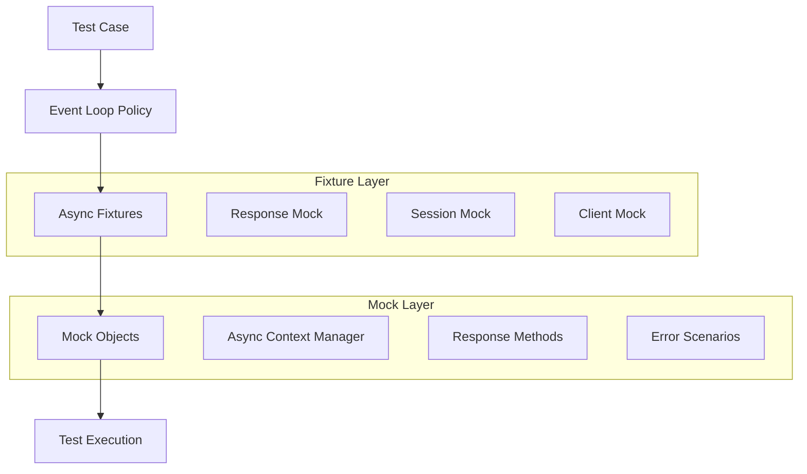
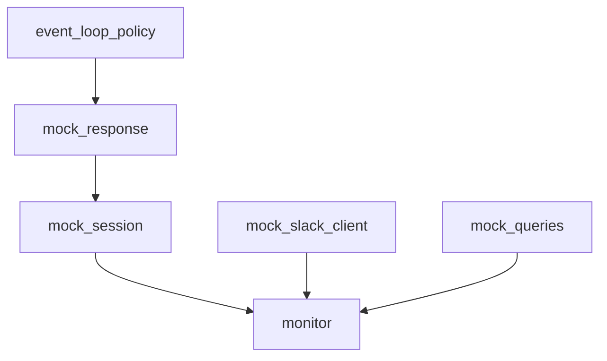
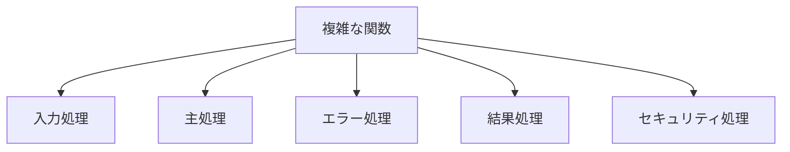
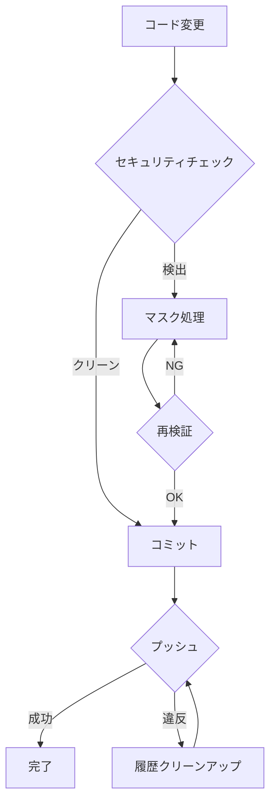

# システムパターン

## アーキテクチャ概要
(システムの高レベルなアーキテクチャ図や説明。例: レイヤードアーキテクチャ、マイクロサービスなど)

## 主要コンポーネントと責務
*   **コンポーネントA:** (責務の説明)
*   **コンポーネントB:** (責務の説明)
*   ...

## 主要な技術的決定
*   (採用した主要な技術やフレームワーク、その理由など)
*   ...

## デザインパターン
*   (プロジェクト全体で採用されている共通のデザインパターン。例: Singleton, Factory, Observerなど)
*   ...

## アーキテクチャ
- A2Aプロトコルベースのエージェント間連携システム
- モジュラー設計による拡張性の確保
- セキュリティファーストの設計思想
- 非同期処理による高効率通信

## 技術的決定事項
1. A2Aプロトコル採用
   - Google公式a2a-sdkの使用
   - JSON-RPC 2.0 over HTTPによる通信
   - エージェントカードによるメタデータ管理

2. エラーハンドリング
   - カスタム例外クラスの使用
   - 詳細なエラーログ（機密情報の除外）
   - 段階的エラー回復メカニズム

3. 設定管理
   - 環境変数による設定
   - デフォルト値の提供
   - 設定値の検証

4. セキュリティ管理
   - 機密情報の自動検出
   - マスク処理の自動化
   - Git履歴の保護

## コンポーネント関係
1. A2Aエージェント
   - エージェント間通信の管理
   - タスク実行の管理
   - エラーハンドリング

2. 調査・検証システム
   - プロトコル仕様分析
   - 実装パターン検証
   - パフォーマンス評価

## アーキテクチャパターン
1. クリーンアーキテクチャ
   - ビジネスロジックの分離
   - 依存関係の方向性の制御

2. リポジトリパターン
   - データアクセスの抽象化
   - 設定ファイルの管理

## デザインパターン
1. ファクトリーパターン
   - クライアントインスタンスの生成
   - セッション管理

2. ストラテジーパターン
   - クエリ実行戦略
   - 通知戦略

## エラーハンドリングパターン

### 標準エラーハンドリング
1. エラー階層
   - A2AProtocolError: A2Aプロトコル関連のエラー
   - AgentConnectionError: エージェント接続関連のエラー
   - TaskExecutionError: タスク実行関連のエラー

2. リトライ戦略
   - 最大3回のリトライ
   - 指数バックオフによる待機時間の調整
   - エラー種別に応じた適切なリトライ判断

3. エラー通知
   - エラー種別に応じた適切な分類
   - エラーコンテキストの明確な提示
   - エラー発生箇所の特定が容易な情報提供

### テストパターン

1. 非同期テスト
   - イベントループの適切な管理
   - テストケースごとの独立したイベントループ
   - クリーンアップの確実な実行

2. モックパターン
   - A2Aエージェントのモック
   - 非同期コンテキストマネージャーの適切なモック
   - エラーケースの網羅的なモック

3. テストケース設計
   - 正常系と異常系の明確な分離
   - エッジケースの網羅的なカバー
   - 環境依存の最小化

## ロギングパターン
1. ログローテーション
   - ファイルサイズ制限
   - バックアップ管理

2. ログレベル管理
   - エラー情報の詳細化
   - 実行状況の記録

## テストパターン
1. モックパターン
   - 外部依存の分離
   - テストの独立性確保

2. フィクスチャパターン
   - テストデータの管理
   - テスト環境の設定

## Testing Patterns

### Async Testing Architecture



### Mock Implementation Patterns

1. Response Mocking
```python
@pytest_asyncio.fixture
async def mock_response():
    response = AsyncMock()
    response.status = 200
    response.json.return_value = {"answer": "テスト結果"}
    response.raise_for_status = AsyncMock()
    return response
```

2. Session Mocking
```python
@pytest_asyncio.fixture
async def mock_session(mock_response):
    session = AsyncMock(spec=aiohttp.ClientSession)
    cm = AsyncMock()
    cm.__aenter__.return_value = mock_response
    cm.__aexit__.return_value = None
    session.post.return_value = cm
    return session
```

### Error Handling Patterns

1. API Error Pattern
```python
mock_session.post.side_effect = aiohttp.ClientError("APIエラー")
```

2. Multiple Notification Pattern
```python
assert mock_slack_client.chat_postMessage.call_count == 2
calls = mock_slack_client.chat_postMessage.call_args_list
assert calls[0].kwargs["channel"] == "errors"
assert calls[1].kwargs["channel"] == "test_channel"
```

## Test Configuration Patterns

### pytest.ini Structure
```ini
[pytest]
# テスト設定
python_files = test_*.py
python_classes = Test*
python_functions = test_*

# 非同期設定
asyncio_mode = strict
asyncio_default_fixture_loop_scope = function

# 警告設定
filterwarnings =
    ignore::RuntimeWarning:app.query_monitor
```

### Fixture Dependencies



## Best Practices

1. Fixture Organization
   - Separate concerns (response, session, client)
   - Clear dependency chain
   - Proper scope management

2. Error Testing
   - Test both success and failure paths
   - Verify error notifications
   - Check message content and order

3. Configuration Management
   - Centralized pytest.ini
   - Explicit warning handling
   - Clear test organization

## 設定管理パターン

### 環境変数による設定
1. 必須設定
   - 必須の環境変数が未設定の場合はエラーを発生
   - 起動時に検証を実施

2. オプション設定
   - デフォルト値を提供
   - 環境変数が設定されている場合はそちらを優先
   - 例: `DIFY_HOST`の設定

### 外部サービス設定
1. APIエンドポイント
   - ベースURLを環境変数で設定可能
   - デフォルト値を提供（標準的なエンドポイント）
   - パスは定数として管理

## コード複雑性の低減パターン

### 関数分割パターン


1. 責務ごとの分離
   - 設定読み込み専用関数: `load_config()`
   - 実行ループ専用関数: `execute_all_queries()`
   - エラーハンドリング専用関数: `handle_error()`

2. メイン関数のシンプル化
   - 概要レベルの処理フローのみを記述
   - 詳細ロジックは専用関数に委譲
   - エラーハンドリングの集約

3. 実装例
```python
# 改善前：複雑なメイン関数
async def main():
    # 環境変数の読み込み
    load_dotenv()
    api_key = os.getenv("API_KEY")
    token = os.getenv("TOKEN")
    
    # バリデーション
    if not all([api_key, token]):
        raise ValueError("Required vars not set")
    
    # 処理実行
    async with Client(api_key, token) as client:
        for item in items:
            try:
                await client.process(item)
            except Error as e:
                handle_error(e)
```

```python
# 改善後：シンプルなメイン関数と分割された処理
def load_config():
    """設定の読み込みと検証"""
    load_dotenv()
    api_key = os.getenv("API_KEY")
    token = os.getenv("TOKEN")
    
    if not all([api_key, token]):
        raise ValueError("Required vars not set")
    
    return api_key, token

async def execute_all_items(client, items):
    """全アイテムの処理"""
    for item in items:
        try:
            await client.process(item)
        except Error as e:
            handle_error(e)

async def main():
    try:
        # 設定読み込み
        api_key, token = load_config()
        
        # 処理実行
        async with Client(api_key, token) as client:
            await execute_all_items(client, items)
    except ValueError as e:
        logger.error("Config error: %s", e)
    except Exception as e:
        logger.error("Unexpected error: %s", e)
```

### 主な利点
1. 可読性向上: 各関数が単一の責務を持つ
2. テスト容易性: 小さな関数は個別テストが容易
3. 再利用性: 共通処理を複数箇所から呼び出し可能
4. 保守性: 変更影響範囲が限定的になる

### タイムアウト処理
- 3回のリトライ処理を実装
- 指数バックオフによる再試行間隔の調整
- 環境変数による柔軟なタイムアウト設定

### 非同期処理パターン
- aiohttp ClientSessionによる非同期HTTP通信
- 長時間実行に対する適切なタイムアウト設定

## セキュリティパターン

### 機密情報保護


### 実装パターン
1. 検出システム
   ```python
   class SecurityChecker:
       PATTERNS = [
           ("APIキー", r'(?i)(api[_-]?key|apikey)'),
           ("トークン", r'(?i)(token|secret)'),
           # ... 他のパターン
       ]
   ```

2. マスク処理
   ```python
   def mask_sensitive_info(content):
       for pattern_name, pattern, mask in PATTERNS:
           content = re.sub(pattern, mask, content)
       return content
   ```

3. Git保護
   ```bash
   git filter-branch --force --index-filter \
       "git rm --cached --ignore-unmatch FILE" \
       --prune-empty --tag-name-filter cat -- --all
   ```
