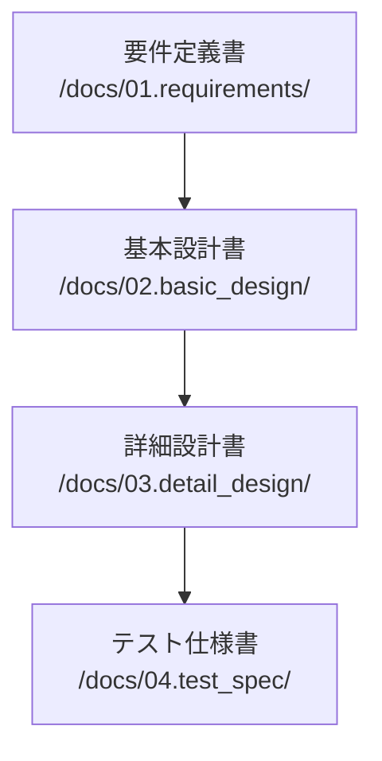

# ドキュメンテーション戦略

## 全体方針
*   [project.mdc](mdc:.cursor/rules/project.mdc) の「ドキュメント要件」に従い、機能変更時には関連ドキュメント (`/docs` 内) と `README.md` を更新する。
*   Memory Bank ([rules.mdc](mdc:.cursor/rules/rules.mdc) 参照) を常に最新の状態に保つ。
*   主要なアーキテクチャ変更や技術決定は ADR ([project.mdc](mdc:.cursor/rules/project.mdc) 参照) として記録する。

## 各ドキュメントの目的
*   **README.md:** プロジェクト概要、セットアップ手順、主要な利用方法。
*   **memory-bank/\*.md:** AIアシスタントのコンテキスト維持、プロジェクトの進行管理、学習記録。
*   **docs/01.requirements/:** 要件定義。
*   **docs/02.basic_design/:** 基本設計（外部設計）。
*   **docs/03.detail_design/:** 詳細設計（内部設計）、API仕様、データモデルなど。
*   **docs/adr/:** アーキテクチャ決定記録。
*   **docs/11.errors/, docs/12.fixes/:** エラー情報と修正記録。
*   **docs/31.progress/:** (より詳細な)進捗記録 (任意)。
*   **docs/91.notes/:** メモ、議事録など。
*   **knowledge/:** AIアシスタントが学習した汎用的な知識 ([global.mdc](mdc:.cursor/rules/global.mdc) 参照)。

## 更新タイミング
*   機能追加・変更・削除時
*   設計変更時
*   Memory Bank の更新ルール ([rules.mdc](mdc:.cursor/rules/rules.mdc)) に従うタイミング
*   ADR 作成が必要な変更時
*   **ファイル構成やルール間の参照関係に変更があった場合は、 `.cursor/rules/overview.mdc` の Mermaid 図を更新する。**
*   **記事作成・更新時は必ずターゲット層ドキュメント（`/docs/01.requirements/target_personas.md`）を参照する（セクション6参照）**

## 1. ドキュメント階層構造

### 1.1 必須ドキュメント（Must Have）


#### 1.1.1 要件定義書（/docs/01.requirements/）
- requirements.md：プロジェクト全体の要件
- functional_requirements/：機能要件
- non_functional_requirements/：非機能要件
- constraints.md：制約条件

#### 1.1.2 基本設計書（/docs/02.basic_design/）
- architecture.md：システムアーキテクチャ
- data_model.md：データモデル
- component_design.md：コンポーネント設計
- interface_design.md：インターフェース設計

#### 1.1.3 詳細設計書（/docs/03.detail_design/）
- module_specs/：モジュール仕様
- api_specs/：API仕様
- database_specs/：データベース仕様
- security_specs/：セキュリティ仕様

#### 1.1.4 テスト仕様書（/docs/04.test_spec/）
- test_cases/：テストケース
- test_data/：テストデータ
- test_results/：テスト結果

### 1.2 補助ドキュメント（Should Have）
- /docs/11.errors/：エラー記録
- /docs/12.fixes/：修正記録
- /docs/31.progress/：進捗報告
- /docs/91.notes/：作業メモ

## 2. ドキュメントテンプレート

### 2.1 要件定義書テンプレート
```markdown
# 要件定義書

## 1. 概要
### 1.1 目的
### 1.2 スコープ
### 1.3 用語定義

## 2. 機能要件
### 2.1 必須機能（Must Have）
### 2.2 重要機能（Should Have）
### 2.3 追加機能（Could Have）

## 3. 非機能要件
### 3.1 性能要件
### 3.2 セキュリティ要件
### 3.3 運用要件

## 4. 制約条件
### 4.1 技術的制約
### 4.2 ビジネス制約
### 4.3 法的制約
```

### 2.2 設計書テンプレート
```markdown
# 設計書

## 1. 設計概要
### 1.1 目的
### 1.2 スコープ
### 1.3 前提条件

## 2. 設計詳細
### 2.1 構造
### 2.2 動作
### 2.3 インターフェース

## 3. 考慮事項
### 3.1 セキュリティ
### 3.2 パフォーマンス
### 3.3 保守性

## 4. 依存関係
### 4.1 外部依存
### 4.2 内部依存
```

## 3. ドキュメント更新ルール

### 3.1 更新が必要なケース
1. コードの変更を伴う場合（必須）
   - 機能追加
   - バグ修正
   - リファクタリング

2. 設計変更を伴う場合（必須）
   - アーキテクチャの変更
   - インターフェースの変更
   - データモデルの変更

3. 要件変更を伴う場合（必須）
   - 機能要件の変更
   - 非機能要件の変更
   - 制約条件の変更

### 3.2 更新手順
1. 変更影響範囲の特定
2. 関連ドキュメントの特定
3. ドキュメント更新案の作成
4. レビュー依頼
5. 承認取得
6. 更新実施
7. 変更履歴の記録

### 3.3 変更履歴の記録形式
```markdown
## 変更履歴

| 日付 | 版数 | 変更内容 | 変更理由 | 承認者 |
|------|------|----------|----------|---------|
| YYYY-MM-DD | x.y.z | 変更内容 | 変更理由 | 承認者名 |
```

## 4. ドキュメント間の依存関係管理

### 4.1 依存関係の記録
```markdown
## 関連ドキュメント

| ドキュメント名 | 関係性 | 影響度 | 更新要否 |
|----------------|---------|---------|----------|
| doc_name | 参照/被参照 | 高/中/低 | 要/否 |
```

### 4.2 相互参照の記述
```markdown
参照：[ドキュメント名](#関連文書)
```

## 5. 品質基準

### 5.1 必須要件
- 日本語として正しい
- 技術的に正確
- 最新の状態を維持
- 相互参照が有効
- 変更履歴が記録されている

### 5.2 レビュー基準
```markdown
## ドキュメントレビューチェックリスト

### 形式
- [ ] テンプレートに準拠している
- [ ] 目次が正しい
- [ ] 章立てが適切
- [ ] 図表番号が正しい

### 内容
- [ ] 技術的に正確
- [ ] 用語の使用が一貫
- [ ] 説明が明確
- [ ] 必要な情報が揃っている

### 相互参照
- [ ] リンクが有効
- [ ] 参照先が適切
- [ ] 依存関係が明確

### 変更管理
- [ ] 変更履歴が記録されている
- [ ] 承認が得られている
- [ ] 影響範囲が評価されている
```

## 6. 記事作成・更新時の必須ルール

### 6.1 ターゲット層の参照（必須）
記事を作成または更新する際は、**必ず** `/docs/01.requirements/target_personas.md` のターゲット層ドキュメントを参照し、以下を確認すること：

1. **対象ペルソナの特定**
   - 記事がどのペルソナ（田中太郎/山田花子/佐藤健）を主対象とするか明確にする
   - 複数のペルソナを対象とする場合は、それぞれに適した内容を含める

2. **ペルソナ別の留意点の確認**
   - 対象ペルソナの技術背景、目的、課題を理解する
   - ペルソナごとの記事執筆時の留意点を遵守する

3. **レベル設定の確認**
   - Level 1（入門）: 佐藤健向け
   - Level 2（実践）: 田中太郎向け
   - Level 3（応用）: 山田花子向け

4. **記事冒頭での明記**
   記事の冒頭に以下の形式で対象読者を明記すること：
   ```markdown
   ## 対象読者
   本記事は[ペルソナ名]（[レベル]）を主な対象としています。
   ```

### 6.2 記事作成時のチェックリスト
- [ ] `/docs/01.requirements/target_personas.md` を確認した
- [ ] 対象ペルソナを特定した
- [ ] ペルソナの技術背景を考慮した内容になっている
- [ ] ペルソナの課題に対する解決策を含んでいる
- [ ] 適切なレベル設定がされている
- [ ] 記事冒頭に対象読者を明記した

## 7. メンテナンス

### 7.1 定期レビュー
- 週次：進捗報告書
- 月次：設計書、テスト仕様書
- 四半期：要件定義書、全体アーキテクチャ

### 7.2 アーカイブ基準
- 2世代前のドキュメントはアーカイブ
- アーカイブは/docs/archive/YYYY-MM/に保存
- アーカイブ時は索引を更新

### 7.3 アーカイブ索引
```markdown
## ドキュメントアーカイブ索引

| アーカイブ日 | 元の場所 | アーカイブ場所 | 理由 |
|--------------|----------|----------------|------|
| YYYY-MM-DD | /original/path | /archive/path | 理由 |
```

## ドキュメント運用ガイドライン (技術調査・評価プロセス関連)

### 1. 研究・評価段階の技術調査記録の保管場所
- 採用未決定の外部技術やプロトコルに関する初期調査・評価の記録は、プロジェクトの現行フェーズを考慮し、`memory-bank/research/` ディレクトリ配下に専用のMarkdownファイルとして格納します。
    - **理由**: 構想・評価フェーズにおいては、具体的実装を前提としない探索的な情報を集約するため。

### 2. 技術調査ファイルの命名規則
- `memory-bank/research/` 配下の調査ファイル名は、調査対象の技術名を明確に含み、ファイルの性質を示す接尾辞（例: `_evaluation.md`, `_notes.md`, `_research.md`）を付与することを推奨します。
    - **例**: `a2a_protocol_evaluation.md`, `new_database_research.md`

### 3. 技術調査・評価ドキュメントの標準構成
- `memory-bank/research/` 内に作成する技術調査・評価ドキュメントは、以下の標準的な構成要素を含めることを推奨します。これにより、情報の網羅性と比較可能性を高めます。
    1.  **調査目的**: プロジェクトの現行フェーズや課題と、この調査の関連性。
    2.  **技術・プロトコルの概要**: 主要な概念、機能、利点、制約など。
    3.  **具体的な事例やサンプル分析**: (もしあれば) 実際の使用例、公開されているサンプルコードの分析。
    4.  **主要な学習ポイントと自プロジェクトへの考察**: この技術が自プロジェクトにもたらしうる価値、潜在的な課題、適合可能性、代替案との比較など。
    5.  **参考資料リンク集**: 公式ドキュメント、解説記事、関連リポジトリなど。
    6.  **今後の検討事項**: この評価を受けて、プロジェクトとして次に取るべきアクション（追加調査、プロトタイピング、採用見送り判断など）。
    - (テンプレートとして `memory-bank/templates/research_evaluation_template.md` を作成・参照することも有効です)

### 4. `techContext.md` と詳細調査ノートの連携
- `memory-bank/techContext.md` には、プロジェクトに関連する技術スタックや検討中の技術のサマリーを記載します。
- 調査・評価中の技術について `techContext.md` に言及する際は、その詳細な評価が記録されている `memory-bank/research/` 配下の該当ファイルへ必ずMarkdownリンク (`[表示テキスト](mdc:path/to/note.md)`) を設定します。
    - **セクション例**: `techContext.md` 内に「技術調査」や「検討中の技術」といったセクションを設ける。

### 5. Memory Bank運用とプロジェクトフェーズの適応
- Memory Bank全体のディレクトリ構造、ドキュメントの分類方法、および使用する用語は、プロジェクトの進行フェーズ（構想、要件定義、設計、実装、運用など）に応じて、チームで見直し、適応させていくことを基本方針とします。
- 特に、初期の構想・調査段階では探索的で一般的な用語を用い、プロジェクトの具体性が増すにつれて、より専門的で確定的な用語や構造へと洗練させていくことを意識します。

この体系化により：
1. ドキュメントの必須/任意が明確になる
2. 更新プロセスが標準化される
3. 品質基準が明確になる
4. メンテナンス手順が確立される
