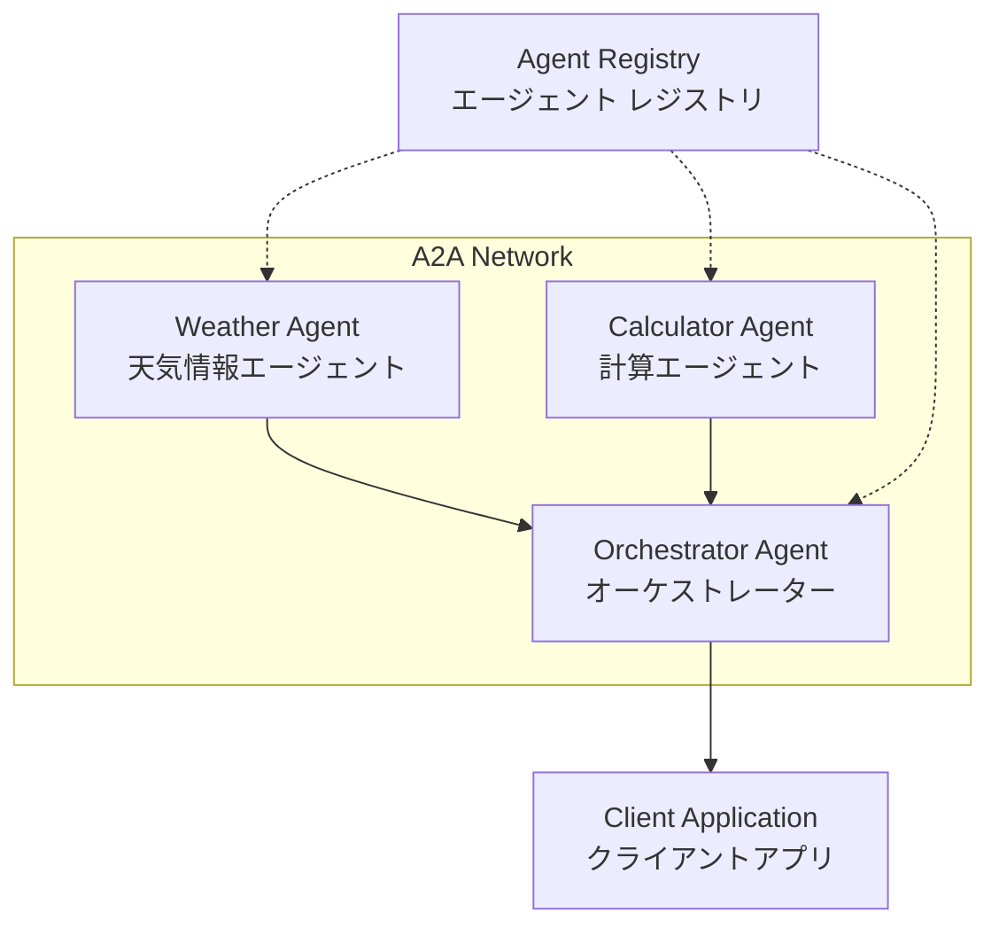

# A2Aプロトコル プロトタイプ実装計画書

**作成日**: 2024年5月15日  
**ステータス**: **実装開始**  
**目標**: 人が実行・確認可能なA2Aエージェント間連携のプロトタイプ実装

## 🎯 実装目標

### 主目標
**動作するA2Aエージェント間連携システムの構築**

### 副目標
1. **実証的検証**: 調査結果の実装での確認
2. **学習基盤**: A2A技術の実践的理解
3. **拡張可能性**: 本格運用への発展可能性確認

## 📋 実装仕様

### 実装するエージェント構成



### 1. Weather Agent（天気情報エージェント）
- **機能**: 指定地域の天気情報提供（モック）
- **エンドポイント**: `http://localhost:8001`
- **Skills**: `get_weather`, `get_forecast`

### 2. Calculator Agent（計算エージェント）
- **機能**: 数学計算の実行
- **エンドポイント**: `http://localhost:8002`
- **Skills**: `calculate`, `solve_equation`

### 3. Orchestrator Agent（オーケストレーター）
- **機能**: 複数エージェントの調整・連携
- **エンドポイント**: `http://localhost:8003`
- **Skills**: `multi_agent_query`, `workflow_execution`

### 4. Agent Registry（エージェントレジストリ）
- **機能**: エージェント発見・管理
- **エンドポイント**: `http://localhost:8000`

## 🛠️ 技術スタック

### Core Dependencies
```toml
[tool.poetry.dependencies]
python = "^3.10"
fastapi = "^0.104.0"
uvicorn = "^0.24.0"
httpx = "^0.25.0"
pydantic = "^2.4.0"
python-multipart = "^0.0.6"
```

### A2A Integration
- **Option 1**: 公式 `a2a-sdk` (pip install a2a-sdk)
- **Option 2**: `python-a2a` (pip install python-a2a) - より高機能
- **最終選択**: 実装時に両方をテストして決定

## 📂 プロジェクト構造

```
src/cursor_dev/a2a_prototype/
├── agents/
│   ├── __init__.py
│   ├── base_agent.py           # A2A基底クラス
│   ├── weather_agent.py        # 天気エージェント
│   ├── calculator_agent.py     # 計算エージェント
│   └── orchestrator_agent.py   # オーケストレーター
├── registry/
│   ├── __init__.py
│   └── agent_registry.py       # エージェント発見機能
├── clients/
│   ├── __init__.py
│   └── demo_client.py          # デモクライアント
├── utils/
│   ├── __init__.py
│   ├── a2a_helpers.py          # A2Aユーティリティ
│   └── config.py               # 設定管理
├── tests/
│   ├── __init__.py
│   ├── test_agents.py          # エージェント単体テスト
│   └── test_integration.py     # 連携テスト
└── scripts/
    ├── start_all.py            # 全エージェント起動
    ├── demo_workflow.py        # デモワークフロー
    └── health_check.py         # ヘルスチェック
```

## 🚀 実装フェーズ

### Phase 1: 基盤実装（優先度: 高）
- [x] **フェーズ計画策定** ✅
- [ ] **A2A SDK選定・検証**
- [ ] **基底クラス実装**
- [ ] **最小構成エージェント実装**

### Phase 2: 基本機能実装（優先度: 高）
- [ ] **Weather Agent実装**
- [ ] **Calculator Agent実装**
- [ ] **エージェント発見機能**
- [ ] **基本的な通信テスト**

### Phase 3: 連携機能実装（優先度: 中）
- [ ] **Orchestrator Agent実装**
- [ ] **マルチエージェント ワークフロー**
- [ ] **エラーハンドリング強化**
- [ ] **ログ・モニタリング機能**

### Phase 4: デモ・検証（優先度: 中）
- [ ] **統合デモ作成**
- [ ] **実行手順書作成**
- [ ] **トラブルシューティング**
- [ ] **パフォーマンス測定**

## 📝 実装の詳細仕様

### A2Aエージェントカード仕様

```json
{
  "name": "weather_agent",
  "description": "天気情報を提供するA2Aエージェント",
  "url": "http://localhost:8001",
  "version": "1.0.0",
  "capabilities": {
    "streaming": false,
    "pushNotifications": false,
    "stateTransitionHistory": false
  },
  "authentication": {
    "schemes": ["Bearer"]
  },
  "defaultInputModes": ["text", "text/plain"],
  "defaultOutputModes": ["text", "text/plain"],
  "skills": [
    {
      "id": "get_weather",
      "name": "天気情報取得",
      "description": "指定された場所の現在の天気を取得",
      "tags": ["weather", "current"],
      "examples": ["東京の天気を教えて", "大阪の天気はどう？"]
    },
    {
      "id": "get_forecast",
      "name": "天気予報取得", 
      "description": "指定された場所の天気予報を取得",
      "tags": ["weather", "forecast"],
      "examples": ["明日の東京の天気予報", "週末の天気はどう？"]
    }
  ]
}
```

### JSONRPCメッセージフォーマット

```python
# タスク送信例
task_request = {
    "jsonrpc": "2.0",
    "method": "tasks/send",
    "params": {
        "id": "task_001",
        "sessionId": "session_123",
        "message": {
            "role": "user",
            "parts": [
                {
                    "type": "text",
                    "text": "東京の今日の天気を教えてください"
                }
            ]
        },
        "acceptedOutputModes": ["text", "text/plain"]
    },
    "id": "req_001"
}
```

## 🧪 テスト戦略

### 単体テスト
- エージェント個別機能テスト
- エージェントカード生成テスト
- A2A準拠性テスト

### 統合テスト
- エージェント発見テスト
- エージェント間通信テスト
- マルチエージェント ワークフローテスト

### 実証テスト
- 実際のユースケースシナリオ
- パフォーマンス・レイテンシ測定
- エラーハンドリング検証

## 📋 実行確認手順（人が実行可能）

### 1. 環境セットアップ
```bash
# 依存関係インストール
poetry install

# A2A SDKインストール（選定後）
poetry add a2a-sdk  # または python-a2a
```

### 2. エージェント起動
```bash
# 各エージェントを個別に起動
python -m cursor_dev.a2a_prototype.agents.weather_agent
python -m cursor_dev.a2a_prototype.agents.calculator_agent
python -m cursor_dev.a2a_prototype.agents.orchestrator_agent

# または一括起動
python -m cursor_dev.a2a_prototype.scripts.start_all
```

### 3. 動作確認
```bash
# ヘルスチェック
python -m cursor_dev.a2a_prototype.scripts.health_check

# デモワークフロー実行
python -m cursor_dev.a2a_prototype.scripts.demo_workflow
```

### 4. 期待される結果
- 各エージェントが正常起動
- エージェントカードが `/.well-known/agent.json` で取得可能
- エージェント間で正常な通信・タスク実行
- 複数エージェントを使ったワークフローが動作

## 🔧 トラブルシューティング

### よくある問題
1. **ポート競合**: 8001-8003ポートが使用中
2. **依存関係エラー**: A2A SDKのインストール失敗
3. **通信エラー**: エージェント間のHTTP通信失敗

### 解決方法
- ポート変更: `config.py`で設定変更
- 依存関係: `poetry install --verbose`で詳細確認
- 通信確認: `curl`でエンドポイント手動テスト

## 📈 成功基準

### 最小成功基準
- [x] 実装計画完成
- [ ] 単体エージェントが正常動作
- [ ] エージェント発見が動作
- [ ] 基本的なエージェント間通信が成功

### 理想的成功基準
- [ ] 複数エージェント連携ワークフローが動作
- [ ] エラーハンドリングが適切に機能
- [ ] パフォーマンスが実用レベル
- [ ] 拡張性のある設計

---

**次のアクション**: Phase 1基盤実装の開始 🚀 