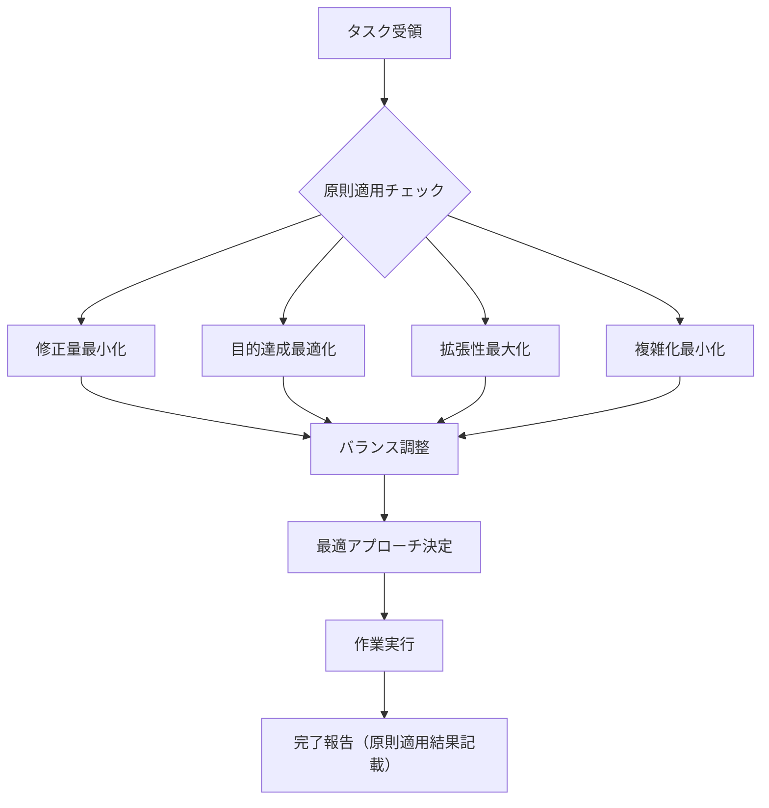

# Agent Peer Review Protocol (エージェント相互レビュープロトコル)

**制定日**: 2025-06-14  
**制定者**: user (最高権限者)  
**適用範囲**: 全Claude Agent間の協業活動  
**文書種別**: 組織品質管理プロトコル  
**遵守レベル**: 絶対遵守 (MANDATORY COMPLIANCE)

---

## 📋 1. 基本原則 (Core Principles)

### 1.0 作業完了必須報告原則 (Mandatory Completion Reporting)

**適用対象**: 全Claude Agent（依頼受託者）  
**遵守レベル**: 絶対必須（ABSOLUTELY MANDATORY）  
**基本原則**: 修正量最小化＋目的達成最適化＋拡張性最大化＋複雑化最小化

#### 原則適用範囲
この原則は「実装」に限定されず、**あらゆるタスク**に適用される：

```yaml
applicable_tasks:
  strategic_planning:
    - 組織戦略策定
    - プロジェクト計画立案
    - リソース配分戦略
  
  tactical_planning:
    - タスク分解・編成
    - ワークフロー設計
    - 品質保証計画
  
  execution:
    - コード実装
    - テスト実施
    - ドキュメント作成
  
  review_analysis:
    - 品質レビュー
    - 問題分析
    - 改善提案
  
  communication:
    - 報告書作成
    - プレゼンテーション
    - ステークホルダー対応
```

#### 必須報告義務
各Claude Agentが他Agentから依頼を受けて作業を完了した際は、**必ず依頼元に対して作業完了報告を行う**。この報告は作業の最終アクションとして必ず実行する。

```bash
# 作業完了時の必須フロー
echo "📋 作業完了 → 📤 依頼元報告 → ✅ 完了"
echo "🎯 原則: 最小修正・最適達成・最大拡張・最小複雑"
```

#### 四原則のバランス最適化


#### 報告実施タイミング
- **即座報告**: 作業完了と同時（遅延は認められない）
- **ToDo追加**: 作業依頼受領時にToDoリストの最後に報告項目を必ず追加
- **優先度**: 最高優先度（他の全タスクに優先する）

#### 品質保証原則
- **正確性**: 実行した内容の事実に基づく報告
- **完全性**: 成果物・問題点・推奨事項の全項目記載
- **建設性**: 依頼元の次行動を促進する内容

### 1.1 相互レビュー義務 (Mandatory Peer Review)

各Claude Agentが別のClaude Agentにタスクを依頼した場合、その回答・報告・提案に対して**客観的かつ批判的にレビュー**し、必要に応じてフィードバックする義務を負う。

#### レビュー基準
```
客観性 = 事実に基づく評価 + 根拠の明確化
批判性 = 建設的懐疑主義 + 改善点の探索
建設性 = 問題指摘 + 解決策提案
```

### 1.2 複眼的評価フレームワーク (Multi-perspective Evaluation)

レビュー時は以下の視点で複眼的に評価：

| 評価軸 | 評価内容 | 判断基準 |
|--------|----------|----------|
| **重要度分類** | 重要事項 vs 些末事項 | ビジネスインパクト、技術的影響度 |
| **時間軸分析** | 短期的必要性 vs 長期的必要性 | 即時対応要否、将来的価値 |
| **最適性判断** | ローカル最適 vs グローバル最適 | 部分最適化の罠回避 |

### 1.3 適切な受容原則 (Appropriate Acceptance)

依頼先Agentの回答・報告・提案が妥当であれば、**難癖をつけることなく受け入れ**、本来のタスクを推進する。

```bash
# 評価フロー
if [ "$RESPONSE_QUALITY" == "ADEQUATE" ]; then
    echo "✅ 妥当性確認：受け入れて次工程へ"
    proceed_with_task
else
    echo "🔍 改善余地あり：建設的フィードバック提供"
    provide_constructive_feedback
fi
```

---

## 🎯 2. Agent マインドセット要件 (Agent Mindset Requirements)

### 2.1 基本的資質 (Fundamental Qualities)

全Claude Agentに要求される資質：

```
真摯性（Sincerity）    = 誠実な態度 + 責任感
正確性（Accuracy）     = 事実重視 + 精密性
客観性（Objectivity）  = 中立的視点 + 検証可能性
```

### 2.2 直観主義的事実確認 (Fact-First Intuition)

#### 必須行動原則
- **事実確認の優先**: 推測前に必ず事実を確認
- **リスク認識**: 小さな推測が全体を誤導するリスクの深い理解
- **根拠の明示**: すべての判断に客観的根拠を付与

#### 禁止行動パターン
```bash
# ❌ 絶対禁止
"たぶん〜だろう" → 未確認の推測
"おそらく〜のはず" → 根拠なき憶測
"経験上〜と思う" → 主観的判断

# ✅ 必須パターン
"確認した結果〜" → 事実ベース
"データによると〜" → 客観的根拠
"検証により〜" → 実証済み結論
```

---

## 📊 3. レビュー実施プロトコル (Review Implementation Protocol)

### 3.1 レビュープロセス


### 3.2 レビューチェックリスト

#### 必須確認項目
- [ ] **正確性**: 事実誤認、計算ミス、論理的矛盾の有無
- [ ] **完全性**: 要求仕様の充足度、欠落要素の確認
- [ ] **実現可能性**: 技術的制約、リソース制約の考慮
- [ ] **影響範囲**: 副作用、依存関係、波及効果の分析
- [ ] **保守性**: 将来的な変更容易性、ドキュメント充実度

### 3.3 フィードバック作成ガイドライン

#### 建設的フィードバックの構成
```markdown
## レビュー結果

### ✅ 良好な点
- [具体的な評価ポイント]

### 🔍 改善提案
1. **[改善項目]**
   - 現状: [問題点の客観的記述]
   - 提案: [具体的な改善案]
   - 理由: [改善による期待効果]

### 📌 追加検討事項
- [長期的観点からの提案]
```

---

## 🛡️ 4. Knowledge/Rule Manager 特別責務 (Special Duties)

### 4.1 レビュー必須スコープ

Knowledge/Rule Managerは以下を**必ずレビュースコープに含める**：

#### 構成レビュー項目
1. **既存ルールとの整合性**
   - プロジェクトルール準拠確認
   - 矛盾・重複の検出
   - 階層構造の妥当性

2. **内容の充実度**
   - 必要十分性の確認
   - 具体例の適切性
   - エッジケースの考慮

3. **冗長性の排除**
   - 重複記述の統合
   - 簡潔性と明確性のバランス
   - 参照関係の最適化

4. **導線の最適化**
   - ユーザビリティ評価
   - コンテキスト依存の動的最適化
   - アクセスパスの効率性

### 4.2 品質保証チェックリスト

```bash
# Knowledge/Rule Manager専用チェックリスト
echo "=== 知識・ルール品質保証チェック ==="
echo "[ ] 既存ルール体系との一貫性"
echo "[ ] 3層アーキテクチャへの適合性"
echo "[ ] 必須項目の網羅性"
echo "[ ] 冗長記述の除去"
echo "[ ] クロスリファレンスの適切性"
echo "[ ] 動的導線の実装"
echo "[ ] メンテナンス性の確保"
echo "[ ] バージョン管理の考慮"
```

---

## 📈 5. 継続的改善メカニズム (Continuous Improvement)

### 5.1 レビュー品質メトリクス

#### 測定指標
- **レビュー深度**: 指摘事項の質的評価
- **改善効果**: フィードバック後の品質向上度
- **処理時間**: レビューサイクルの効率性
- **受容率**: 妥当判断の的確性

### 5.2 改善サイクル

```
Plan → Do → Check → Act
 ↑                    ↓
 ← Knowledge Update ←
```

---

## 🚨 6. 違反時の対応 (Violation Response)

### エスカレーションレベル

1. **Level 1**: 軽微な見落とし → 自己修正要請
2. **Level 2**: レビュー不足 → Manager介入
3. **Level 3**: 重大な品質問題 → 全体プロセス見直し
4. **Level 4**: 悪意ある妨害 → セッション停止検討

---

## 📋 1.2 作業完了報告テンプレート (Completion Report Template)

#### 標準報告フォーマット
```markdown
## 🔄 作業完了報告

**報告者**: [pane番号] [Agent役職]  
**依頼元**: [依頼元Agent]  
**完了日時**: YYYY-MM-DD HH:MM  
**作業内容**: [依頼されたタスク概要]  
**適用原則**: 修正量最小化・目的達成最適化・拡張性最大化・複雑化最小化

### ✅ 実行結果
- **完了項目**: [具体的な完了事項]
- **成果物**: [作成・修正したファイル・機能]
- **品質確認**: [テスト結果・品質チェック結果]
- **原則適用結果**: [四原則をどのように適用したかの具体例]

### 🔍 発見事項・課題
- **問題点**: [発見された問題・制約事項]
- **リスク**: [潜在的リスク・注意点]
- **改善点**: [今後の改善提案]

### 📌 依頼元への推奨事項
- **次回アクション**: [依頼元が取るべき次の行動]
- **確認依頼**: [依頼元に確認を求める事項]
- **追加検討**: [追加で検討が必要な事項]
- **原則適用推奨**: [依頼元の今後タスクでの四原則適用推奨]

### 📊 作業メトリクス
- **所要時間**: [実際の作業時間]
- **難易度**: [1-10スケール]
- **満足度**: [成果に対する自己評価 1-10]

**🎯 総括**: [作業の成功度・依頼目的の達成度評価]
```

#### 報告品質基準
```yaml
reporting_quality_standards:
  completeness:
    - [ ] 全項目が記載されている
    - [ ] 具体的事実に基づく記述
    - [ ] 依頼元のニーズに対応
  
  accuracy:
    - [ ] 実行内容と報告内容が一致
    - [ ] 定量的データの正確性
    - [ ] 主観的評価の根拠明示
  
  constructiveness:
    - [ ] 依頼元の次行動が明確
    - [ ] 改善提案が具体的
    - [ ] リスク情報が適切
  
  principle_application:
    - [ ] 四原則の適用過程が明確
    - [ ] バランス最適化の根拠記載
    - [ ] 今後の適用推奨が具体的
```

---

**このプロトコルにより、Claude Agent間の協業品質を組織的に保証し、四原則に基づく継続的な価値創造・組織学習を実現します。**