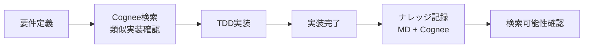
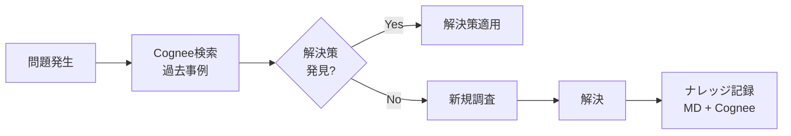

# Cogneeナレッジ必須利活用ルール

## 目的
本ルールは、プロジェクトの知識管理においてCogneeナレッジグラフを必須で利活用することを定め、ナレッジの一元管理と効率的な活用を実現する。

## 基本原則

### 1. ナレッジのデュアル記録原則
すべての重要な技術知識、検証結果、実装パターンは以下の両方に記録する：
- **memory-bank/**: 人間可読形式のMarkdownファイル（Git管理）
- **Cogneeナレッジグラフ**: 構造化されたAI検索可能な形式

### 2. Cognee優先検索原則
情報を探す際は、以下の優先順位で検索する：
1. **第一優先**: Cogneeナレッジグラフ検索（`mcp__cognee__search`）
2. **第二優先**: ファイルシステム検索（Grep/Glob）
3. **第三優先**: 直接ファイル読み込み（Read）

## 必須実施事項

### A. セッション開始時
```bash
# 1. Cogneeナレッジステータス確認
mcp__cognee__cognify_status

# 2. 開発者ルールの読み込み
mcp__cognee__cognee_add_developer_rules --base_path /home/devuser/workspace

# 3. 既存ナレッジの検索テスト
mcp__cognee__search --search_query "プロジェクト概要" --search_type "GRAPH_COMPLETION"
```

### B. 新規ナレッジ作成時
```bash
# 1. Markdownファイルを作成
Write /home/devuser/workspace/memory-bank/[ナレッジ名].md

# 2. 即座にCogneeに登録
mcp__cognee__cognify --data /home/devuser/workspace/memory-bank/[ナレッジ名].md

# 3. 登録完了を確認
mcp__cognee__cognify_status

# 4. 検索可能性を確認
mcp__cognee__search --search_query "[キーワード]" --search_type "CHUNKS"
```

### C. 既存ナレッジ更新時
```bash
# 1. Cogneeから最新情報を検索
mcp__cognee__search --search_query "[更新対象]" --search_type "GRAPH_COMPLETION"

# 2. Markdownファイルを更新
Edit /home/devuser/workspace/memory-bank/[ナレッジ名].md

# 3. Cogneeを再登録
mcp__cognee__cognify --data /home/devuser/workspace/memory-bank/[ナレッジ名].md
```

### D. 問題解決・調査時
```python
# 検索フロー（擬似コード）
def search_knowledge(query):
    # 1. Cogneeで高度な検索
    results = []
    for search_type in ["GRAPH_COMPLETION", "INSIGHTS", "CHUNKS"]:
        result = mcp__cognee__search(query, search_type)
        results.append(result)
    
    # 2. 不足があればファイルシステム検索
    if not sufficient(results):
        file_results = grep_and_glob(query)
        results.extend(file_results)
    
    return results
```

## 検索タイプ別利用ガイド

### GRAPH_COMPLETION
- **用途**: 質問に対する包括的な回答が必要な場合
- **例**: "A2Aプロトコルの実装方法を教えて"

### INSIGHTS
- **用途**: エンティティ間の関係性を理解したい場合
- **例**: "TDDとコード品質の関係"

### CHUNKS
- **用途**: 特定のキーワードを含む具体的な情報を探す場合
- **例**: "pytest fixture"

### CODE
- **用途**: コード実装パターンを探す場合
- **例**: "Result型パターンの実装例"

### RAG_COMPLETION
- **用途**: 従来のRAG方式での検索が必要な場合
- **例**: "プロジェクトのREADME内容"

## ワークフロー統合

### 1. TDD開発フロー + Cognee


### 2. 問題解決フロー + Cognee


### 3. コードレビューフロー + Cognee


## 自動化スクリプト

### cognee_sync.sh
```bash
#!/bin/bash
# memory-bank内のすべてのMDファイルをCogneeに同期

echo "Cogneeナレッジ同期開始..."

# 既存の状態を確認
python -c "
from scripts.cognee_verification import check_cognify_status
check_cognify_status()
"

# memory-bank内のすべてのMDファイルを登録
for file in memory-bank/*.md memory-bank/**/*.md; do
    if [ -f "$file" ]; then
        echo "登録中: $file"
        python -c "
from mcp_cognee import cognify
cognify('$file')
"
        sleep 2
    fi
done

echo "同期完了"
```

### cognee_search.py
```python
#!/usr/bin/env python3
"""Cognee統合検索ツール"""

import sys
from typing import List, Dict, Any

def integrated_search(query: str) -> Dict[str, Any]:
    """Cogneeと従来の検索を統合"""
    results = {
        "cognee": {},
        "filesystem": {},
        "recommendations": []
    }
    
    # Cognee検索
    try:
        from mcp_cognee import search
        
        # 複数の検索タイプで検索
        for search_type in ["GRAPH_COMPLETION", "INSIGHTS", "CHUNKS"]:
            results["cognee"][search_type] = search(query, search_type)
    except Exception as e:
        results["cognee"]["error"] = str(e)
    
    # ファイルシステム検索（フォールバック）
    try:
        import subprocess
        grep_result = subprocess.run(
            ["grep", "-r", query, "memory-bank/"],
            capture_output=True,
            text=True
        )
        results["filesystem"]["grep"] = grep_result.stdout
    except Exception as e:
        results["filesystem"]["error"] = str(e)
    
    # 推奨事項の生成
    if results["cognee"].get("GRAPH_COMPLETION"):
        results["recommendations"].append("Cogneeから包括的な回答が得られました")
    else:
        results["recommendations"].append("Cogneeに関連情報を追加することを推奨")
    
    return results

if __name__ == "__main__":
    if len(sys.argv) < 2:
        print("使用方法: ./cognee_search.py <検索クエリ>")
        sys.exit(1)
    
    query = " ".join(sys.argv[1:])
    results = integrated_search(query)
    
    print(f"=== 検索結果: {query} ===")
    print(json.dumps(results, indent=2, ensure_ascii=False))
```

## 品質保証チェックリスト

### コミット前チェック
- [ ] 新規作成したナレッジはCogneeに登録したか
- [ ] 更新したナレッジはCogneeに再登録したか  
- [ ] Cogneeから検索可能か確認したか
- [ ] 関連する既存ナレッジとリンクしているか

### 週次チェック
- [ ] Cogneeとmemory-bankの同期状態確認
- [ ] 検索頻度の高いキーワードの最適化
- [ ] 不要なナレッジの整理（prune検討）

## トラブルシューティング

### 問題1: Cogneeに登録されない
```bash
# ステータス確認
mcp__cognee__cognify_status

# ログ確認
tail -f /path/to/cognee.log

# 再登録試行
mcp__cognee__cognify --data <ファイルパス>
```

### 問題2: 検索結果が不適切
```bash
# 異なる検索タイプを試す
mcp__cognee__search --search_query "クエリ" --search_type "INSIGHTS"

# インデックス再構築（必要に応じて）
mcp__cognee__prune  # 注意: すべてのデータが削除される
mcp__cognee__cognee_add_developer_rules
```

### 問題3: パフォーマンスが遅い
```bash
# 大量のファイルを一度に登録しない
# バッチ処理スクリプトを使用
python scripts/cognee_migration.py --batch-size 10
```

## 移行計画

### Phase 1: 基盤整備（1週目）
1. 本ルールファイルのCLAUDE.mdへの統合
2. 既存memory-bankファイルのCognee一括登録
3. 検索動作確認

### Phase 2: 習慣化（2-3週目）
1. 日次でCognee優先検索の実践
2. 新規ナレッジの即時登録習慣
3. 検索ログの分析

### Phase 3: 最適化（4週目以降）
1. 検索パターンの分析と最適化
2. カスタムグラフモデルの検討
3. 自動化ツールの改善

## 期待される効果

1. **検索効率の向上**: 構造化されたグラフ検索により関連情報を素早く発見
2. **知識の再利用性向上**: 過去の実装パターンや解決策を効率的に活用
3. **オンボーディング改善**: 新規参加者が既存知識に素早くアクセス
4. **品質向上**: ベストプラクティスや過去の教訓を確実に参照

## 改訂履歴

- 2025-06-11: 初版作成（Claude並列実行検証を契機に）