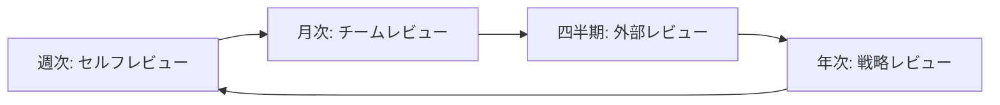

# 批判的レビューフレームワーク

## 🎯 目的

プロジェクトの成果物を多角的かつ批判的に評価し、継続的な改善を促進するフレームワーク。

## 📊 レビュー観点マトリクス

### 1. 技術的観点

| 観点 | 評価項目 | 重要度 | A2A MVP評価 | 改善提案 |
|------|----------|--------|-------------|----------|
| **再現性** | ゼロから同じ品質を再現可能か | ★★★★★ | ✅ 良好 | チェックリスト自動化 |
| **汎用性** | 他プロジェクトへの転用可能性 | ★★★★★ | ⚠️ 要改善 | 汎用パターン抽出必要 |
| **保守性** | 6ヶ月後の他者による修正容易性 | ★★★★☆ | ✅ 良好 | より詳細なコメント |
| **拡張性** | 新機能追加の容易性 | ★★★★☆ | ✅ 良好 | プラグイン機構検討 |
| **性能** | 実用的なレスポンス時間 | ★★★☆☆ | ✅ 良好 | ベンチマーク追加 |
| **セキュリティ** | 脆弱性対策の網羅性 | ★★★★★ | ⚠️ 基本のみ | セキュリティテスト追加 |

### 2. プロセス観点

| 観点 | 評価項目 | 重要度 | A2A MVP評価 | 改善提案 |
|------|----------|--------|-------------|----------|
| **学習曲線** | 新規参画者の立ち上がり時間 | ★★★★☆ | ⚠️ 要改善 | チュートリアル作成 |
| **自動化度** | 手動作業の最小化 | ★★★★★ | ✅ 良好 | デプロイ自動化追加 |
| **文書化** | 意図と実装の一致度 | ★★★★☆ | ✅ 良好 | 動画解説追加 |
| **標準準拠** | 業界標準への適合度 | ★★★☆☆ | ✅ 良好 | OpenAPI仕様追加 |

### 3. ビジネス観点

| 観点 | 評価項目 | 重要度 | A2A MVP評価 | 改善提案 |
|------|----------|--------|-------------|----------|
| **ROI** | 投資対効果 | ★★★★★ | ✅ 3日で91.77% | 計測自動化 |
| **リスク** | 技術的負債の蓄積度 | ★★★★☆ | ✅ 低い | 定期的な負債計測 |
| **スケール** | 成長への対応力 | ★★★☆☆ | ⚠️ 未検証 | 負荷テスト実施 |

## 🔍 批判的レビューの実施手順

### Phase 1: 自己評価（開発者）

```yaml
self_review_checklist:
  code_quality:
    - [ ] すべてのpublicメソッドにdocstringがあるか
    - [ ] 複雑なロジックに説明コメントがあるか
    - [ ] 命名は自明で一貫性があるか
    
  test_quality:
    - [ ] テストは仕様を表現しているか
    - [ ] エッジケースがカバーされているか
    - [ ] テストは高速で独立しているか
    
  architecture:
    - [ ] 依存関係は単方向か
    - [ ] 各層の責任は明確か
    - [ ] 循環依存は存在しないか
```

### Phase 2: ピアレビュー（チームメンバー）

```yaml
peer_review_checklist:
  understandability:
    - [ ] READMEだけで環境構築できるか
    - [ ] コードの意図が明確か
    - [ ] エラーメッセージは親切か
    
  maintainability:
    - [ ] 変更の影響範囲が予測可能か
    - [ ] テストの修正が容易か
    - [ ] 設定の変更が容易か
```

### Phase 3: 外部レビュー（第三者）

```yaml
external_review_checklist:
  first_impression:
    - [ ] プロジェクトの目的が30秒で理解できるか
    - [ ] 始め方が明確か
    - [ ] 期待される成果が明確か
    
  deep_dive:
    - [ ] アーキテクチャの選択理由が妥当か
    - [ ] 技術選定の根拠が明確か
    - [ ] 制約事項が文書化されているか
```

## 📝 レビュー結果の文書化テンプレート

```markdown
# [プロジェクト名] Critical Review Report

## Executive Summary
- **日付**: YYYY-MM-DD
- **レビュアー**: [名前/役割]
- **総合評価**: [S/A/B/C/D]

## Strengths（強み）
1. [具体的な強み1]
2. [具体的な強み2]

## Weaknesses（弱み）
1. [具体的な弱み1]
2. [具体的な弱み2]

## Opportunities（機会）
1. [改善の機会1]
2. [改善の機会2]

## Threats（脅威）
1. [潜在的なリスク1]
2. [潜在的なリスク2]

## Action Items
| 優先度 | 項目 | 担当 | 期限 |
|--------|------|------|------|
| High | [アクション1] | [担当者] | [期限] |
| Medium | [アクション2] | [担当者] | [期限] |
```

## 🚨 よくある盲点と対策

### 1. 確証バイアス
**問題**: 自分の実装の良い面ばかり見てしまう
**対策**: 
- 悪魔の代弁者（Devil's Advocate）を設定
- 「このコードを削除したら困るか？」を問う
- 外部レビュアーの活用

### 2. 知識の呪い
**問題**: 自明と思うことが他者には不明
**対策**:
- 新人エンジニアによるレビュー
- ドキュメントの音読
- ペアプログラミングでの説明

### 3. 完璧主義の罠
**問題**: 100%を求めて進まない
**対策**:
- 段階的改善計画
- MVPの明確な定義
- タイムボックスの設定

## 📊 メトリクスベースの評価

### 定量的指標

```python
class ProjectMetrics:
    def calculate_health_score(self):
        """プロジェクトの健全性スコア（0-100）"""
        scores = {
            'coverage': self.get_coverage_score(),      # 0-25
            'complexity': self.get_complexity_score(),   # 0-25
            'documentation': self.get_doc_score(),       # 0-25
            'dependencies': self.get_dep_score(),        # 0-25
        }
        return sum(scores.values())
    
    def get_coverage_score(self):
        coverage = self.test_coverage
        if coverage >= 90: return 25
        if coverage >= 80: return 20
        if coverage >= 70: return 15
        if coverage >= 60: return 10
        return 5
    
    def get_complexity_score(self):
        avg_complexity = self.average_cyclomatic_complexity
        if avg_complexity <= 5: return 25
        if avg_complexity <= 10: return 20
        if avg_complexity <= 15: return 15
        if avg_complexity <= 20: return 10
        return 5
```

### トレンド分析

```yaml
trend_metrics:
  weekly:
    - test_coverage_delta
    - code_complexity_delta
    - build_time_delta
    - bug_count_delta
    
  monthly:
    - technical_debt_estimate
    - developer_satisfaction
    - feature_velocity
    - defect_escape_rate
```

## 🔄 継続的改善プロセス

### 1. 定期レビューサイクル



### 2. 改善の優先順位付け

```python
def prioritize_improvements(issues):
    """改善項目の優先順位付け"""
    for issue in issues:
        issue.score = (
            issue.impact * 3 +          # 影響度（1-5）× 3
            issue.effort_inverse * 2 +   # 労力の逆数（1-5）× 2
            issue.risk * 1              # リスク（1-5）× 1
        ) / 6
    
    return sorted(issues, key=lambda x: x.score, reverse=True)
```

### 3. 改善効果の測定

```yaml
improvement_metrics:
  before_after:
    - metric: "ビルド時間"
      before: "2分"
      after: "45秒"
      improvement: "62.5%"
    
    - metric: "新機能追加時間"
      before: "1週間"
      after: "2日"
      improvement: "71.4%"
    
    - metric: "バグ修正時間"
      before: "2時間"
      after: "15分"
      improvement: "87.5%"
```

## 📋 レビューの自動化

### 自動チェックツール

```bash
#!/bin/bash
# review-automation.sh

echo "🔍 Running automated review..."

# 1. Code Quality
echo "Checking code quality..."
flake8 --statistics src/
mypy src/
radon cc src/ -a

# 2. Test Quality
echo "Checking test quality..."
pytest --cov=src --cov-report=term-missing
mutmut run  # Mutation testing

# 3. Documentation
echo "Checking documentation..."
pydocstyle src/
sphinx-build -b linkcheck docs/ _build/

# 4. Security
echo "Checking security..."
bandit -r src/
safety check

# 5. Dependencies
echo "Checking dependencies..."
pip-audit
pip list --outdated

# Generate report
python generate_review_report.py
```

## 🎯 レビュー文化の確立

### 心理的安全性の確保

1. **建設的フィードバック**
   - ❌ 「このコードはひどい」
   - ✅ 「このコードは動作しますが、〇〇パターンを使うとより保守しやすくなります」

2. **学習機会として活用**
   - レビューで学んだことを共有
   - ベストプラクティスの文書化
   - 失敗事例の共有（非難なし）

3. **定期的な振り返り**
   - レビュープロセス自体の改善
   - フィードバックの質の向上
   - 効率化の機会の発見

---

*このフレームワークは継続的に改善されます。フィードバックを歓迎します。*