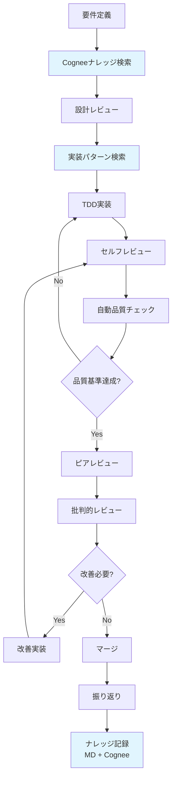

# 開発ワークフロールール

## 🎯 目的

批判的レビューを含む、品質を担保する開発ワークフローの標準化。

## 🚨 必須参照ルール

**開発前に必ず確認すること:**
- **[cognee_mandatory_utilization_rules.md](cognee_mandatory_utilization_rules.md)** - Cogneeナレッジ必須利活用ルール
- **[code_quality_anti_hacking_rules.md](code_quality_anti_hacking_rules.md)** - 品質指標への誠実性を保つ絶対ルール

## 📋 開発フロー全体像



## 🔄 各フェーズの詳細

### 1. 要件定義フェーズ

#### Cogneeナレッジ活用
```bash
# 類似要件の検索
mcp__cognee__search --search_query "類似機能要件" --search_type "GRAPH_COMPLETION"
# 過去の実装パターン確認
mcp__cognee__search --search_query "実装パターン" --search_type "INSIGHTS"
```

#### チェックリスト
```yaml
requirements_checklist:
  cognee_search:
    - [ ] 類似要件をCogneeで検索済み
    - [ ] 過去の教訓を確認済み
    - [ ] 関連パターンを特定済み
    
  functional:
    - [ ] ユーザーストーリーが明確
    - [ ] 受け入れ条件が定義済み
    - [ ] 非機能要件が明確
  
  technical:
    - [ ] 技術的制約が明確
    - [ ] 依存関係が特定済み
    - [ ] リスクが評価済み
  
  validation:
    - [ ] ステークホルダーの合意
    - [ ] 実現可能性の検証
    - [ ] 工数見積もり完了
```

#### 成果物
- 要件定義書
- 受け入れテスト仕様
- リスク評価シート

### 2. 設計レビューフェーズ

#### 設計原則チェック
```yaml
design_principles:
  solid:
    - [ ] Single Responsibility（単一責任）
    - [ ] Open/Closed（開放/閉鎖）
    - [ ] Liskov Substitution（リスコフの置換）
    - [ ] Interface Segregation（インターフェース分離）
    - [ ] Dependency Inversion（依存性逆転）
  
  architecture:
    - [ ] 層構造が明確
    - [ ] 依存関係が単方向
    - [ ] 関心の分離が適切
  
  patterns:
    - [ ] 適切なデザインパターンの選択
    - [ ] 過度な抽象化の回避
    - [ ] YAGNI原則の遵守
```

#### レビュー観点
1. **汎用性評価**
   - 他プロジェクトへの転用可能性
   - フレームワーク依存度
   - ドメイン依存度

2. **拡張性評価**
   - 新機能追加の容易性
   - 既存機能への影響最小化
   - プラグイン機構の検討

### 3. TDD実装フェーズ

#### 実装ルール
```python
# 1. RED: 失敗するテストを書く（5-10分）
def test_new_feature():
    # Arrange
    system = SystemUnderTest()
    
    # Act
    result = system.new_feature()  # まだ存在しない
    
    # Assert
    assert result == expected_value

# 2. GREEN: 最小限の実装（10-15分）
def new_feature(self):
    return expected_value  # とりあえず通す

# 3. REFACTOR: 品質向上（5-10分）
def new_feature(self):
    # 適切な実装に改善
    validated_input = self._validate(input)
    processed = self._process(validated_input)
    return self._format_output(processed)
```

#### カバレッジ基準
```yaml
coverage_requirements:
  minimum:
    overall: 85
    new_code: 90
    core_logic: 95
    infrastructure: 80
    ui_layer: 70
  
  excluded:
    - "*/tests/*"
    - "*/__pycache__/*"
    - "*/migrations/*"
```

### 4. セルフレビューフェーズ

#### セルフレビューチェックリスト
```markdown
## コード品質
- [ ] 命名は意図を表現しているか
- [ ] 関数は単一責任か
- [ ] 複雑度は10以下か
- [ ] 重複コードはないか

## テスト品質
- [ ] テストは仕様を表現しているか
- [ ] エッジケースをカバーしているか
- [ ] モックは適切か
- [ ] テストは高速か

## ドキュメント
- [ ] publicメソッドにdocstringがあるか
- [ ] 複雑なロジックに説明があるか
- [ ] 設計意図が明確か
```

### 5. 自動品質チェックフェーズ

#### 自動チェックスクリプト
```bash
#!/bin/bash
# quality_check.sh

set -e  # エラーで停止

echo "🔍 Running quality checks..."

# 1. Tests
echo "📊 Running tests with coverage..."
pytest --cov=src --cov-fail-under=85 --cov-report=term-missing

# 2. Linting
echo "🧹 Checking code style..."
flake8 src/ tests/ --max-complexity=10
mypy src/ --strict

# 3. Security
echo "🔒 Security scan..."
bandit -r src/
safety check

# 4. Documentation
echo "📚 Documentation check..."
pydocstyle src/

# 5. Complexity
echo "🧮 Complexity analysis..."
radon cc src/ -nb

echo "✅ All checks passed!"
```

### 6. ピアレビューフェーズ

#### レビュー指針
```yaml
peer_review_guidelines:
  focus_areas:
    - correctness: "コードは要件を満たしているか"
    - maintainability: "6ヶ月後に理解できるか"
    - performance: "明らかな性能問題はないか"
    - security: "セキュリティリスクはないか"
  
  feedback_format:
    - specific: "行番号を含む具体的な指摘"
    - constructive: "改善案を含む建設的な内容"
    - prioritized: "Critical/Major/Minor の分類"
  
  response_time:
    - initial: "24時間以内"
    - follow_up: "12時間以内"
```

### 7. 批判的レビューフェーズ

#### 批判的レビューテンプレート
```python
class CriticalReview:
    def __init__(self, project):
        self.project = project
        self.score = 0
        self.findings = []
    
    def review_reproducibility(self):
        """再現性の評価"""
        checks = [
            self.can_build_from_scratch(),
            self.documentation_is_complete(),
            self.dependencies_are_locked(),
            self.ci_cd_is_configured(),
        ]
        score = sum(checks) / len(checks) * 100
        self.add_finding("Reproducibility", score, checks)
    
    def review_genericity(self):
        """汎用性の評価"""
        checks = [
            self.minimal_framework_dependency(),
            self.pluggable_architecture(),
            self.configuration_driven(),
            self.domain_agnostic_core(),
        ]
        score = sum(checks) / len(checks) * 100
        self.add_finding("Genericity", score, checks)
    
    def review_security(self):
        """セキュリティの評価"""
        checks = [
            self.input_validation_exists(),
            self.authentication_implemented(),
            self.secrets_are_protected(),
            self.security_tests_exist(),
        ]
        score = sum(checks) / len(checks) * 100
        self.add_finding("Security", score, checks)
```

#### 改善優先度マトリクス

| 影響度＼工数 | 小（1日以内） | 中（1週間以内） | 大（1ヶ月以内） |
|-------------|--------------|----------------|----------------|
| **大** | 🔴 即実施 | 🟠 次スプリント | 🟡 計画的実施 |
| **中** | 🟠 次スプリント | 🟡 計画的実施 | ⚪ バックログ |
| **小** | 🟡 計画的実施 | ⚪ バックログ | ⚪ 見送り |

### 8. 振り返りフェーズ

#### 振り返りテンプレート
```markdown
## Sprint Retrospective

### 📊 メトリクス
- ベロシティ: [計画] vs [実績]
- 品質: カバレッジ [%], バグ数 [件]
- 工数: 見積もり精度 [%]

### 🌟 Good（継続すること）
1. [良かった点1]
2. [良かった点2]

### 🚧 Problem（改善すべきこと）
1. [問題点1]
2. [問題点2]

### 💡 Try（次に試すこと）
1. [改善案1]
2. [改善案2]

### 📝 Action Items
| 項目 | 担当 | 期限 |
|------|------|------|
| [アクション1] | [担当者] | [期限] |
```

## 🔧 ツールチェーン

### 必須ツール
```yaml
required_tools:
  testing:
    - pytest: "テストフレームワーク"
    - pytest-cov: "カバレッジ測定"
    - pytest-mock: "モック機能"
  
  quality:
    - flake8: "スタイルチェック"
    - black: "フォーマッター"
    - mypy: "型チェッカー"
    - radon: "複雑度分析"
  
  security:
    - bandit: "セキュリティスキャン"
    - safety: "依存関係の脆弱性チェック"
  
  documentation:
    - sphinx: "ドキュメント生成"
    - pydocstyle: "docstringチェック"
```

### 推奨ツール
```yaml
recommended_tools:
  advanced_testing:
    - hypothesis: "プロパティベーステスト"
    - mutmut: "ミューテーションテスト"
    - locust: "負荷テスト"
  
  monitoring:
    - sentry: "エラートラッキング"
    - prometheus: "メトリクス収集"
    - grafana: "可視化"
```

## 📏 品質ゲート

### マージ条件
```yaml
merge_requirements:
  mandatory:
    - all_tests_pass: true
    - coverage_threshold_met: true
    - no_security_issues: true
    - peer_review_approved: true
    - ci_build_success: true
  
  recommended:
    - documentation_updated: true
    - performance_regression_test: true
    - critical_review_passed: true
```

### エスカレーション基準
```yaml
escalation_criteria:
  technical_lead:
    - architecture_change: true
    - new_dependency: true
    - security_exception: true
  
  product_owner:
    - requirement_change: true
    - scope_change: true
    - deadline_impact: true
```

## 🎯 継続的改善

### メトリクス収集
```python
class DevelopmentMetrics:
    def __init__(self):
        self.metrics = {
            'cycle_time': [],
            'defect_rate': [],
            'review_time': [],
            'rework_rate': [],
        }
    
    def analyze_trends(self):
        """トレンド分析"""
        return {
            'improving': self.get_improving_metrics(),
            'degrading': self.get_degrading_metrics(),
            'stable': self.get_stable_metrics(),
        }
    
    def generate_insights(self):
        """改善提案の生成"""
        insights = []
        if self.avg_cycle_time > 3:  # 3日以上
            insights.append("サイクルタイムが長い: タスク分割を検討")
        if self.defect_escape_rate > 0.1:  # 10%以上
            insights.append("バグ流出率が高い: テスト強化を検討")
        return insights
```

### 定期レビュー
```yaml
review_schedule:
  daily:
    - stand_up_meeting
    - blocker_identification
  
  weekly:
    - code_quality_review
    - metric_review
  
  monthly:
    - process_improvement
    - tool_evaluation
  
  quarterly:
    - workflow_optimization
    - skill_assessment
```

---

*このワークフローは継続的に改善されます。チーム固有の要件に応じてカスタマイズしてください。*