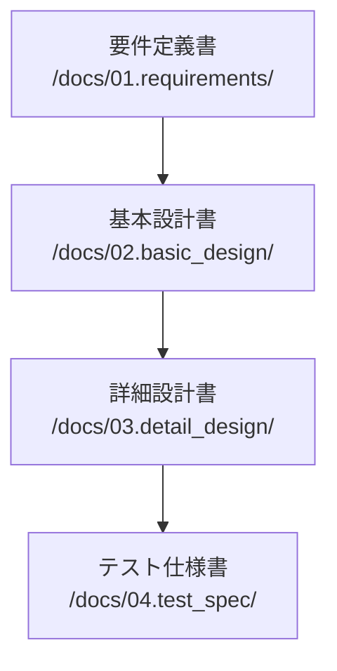

# ドキュメント管理戦略

## 1. ドキュメント階層構造

### 1.1 必須ドキュメント（Must Have）


#### 1.1.1 要件定義書（/docs/01.requirements/）
- requirements.md：プロジェクト全体の要件
- functional_requirements/：機能要件
- non_functional_requirements/：非機能要件
- constraints.md：制約条件

#### 1.1.2 基本設計書（/docs/02.basic_design/）
- architecture.md：システムアーキテクチャ
- data_model.md：データモデル
- component_design.md：コンポーネント設計
- interface_design.md：インターフェース設計

#### 1.1.3 詳細設計書（/docs/03.detail_design/）
- module_specs/：モジュール仕様
- api_specs/：API仕様
- database_specs/：データベース仕様
- security_specs/：セキュリティ仕様

#### 1.1.4 テスト仕様書（/docs/04.test_spec/）
- test_cases/：テストケース
- test_data/：テストデータ
- test_results/：テスト結果

### 1.2 補助ドキュメント（Should Have）
- /docs/11.errors/：エラー記録
- /docs/12.fixes/：修正記録
- /docs/31.progress/：進捗報告
- /docs/90.references/：参考資料
- /docs/91.notes/：作業メモ

## 2. ドキュメントテンプレート

### 2.1 要件定義書テンプレート
```markdown
# 要件定義書

## 1. 概要
### 1.1 目的
### 1.2 スコープ
### 1.3 用語定義

## 2. 機能要件
### 2.1 必須機能（Must Have）
### 2.2 重要機能（Should Have）
### 2.3 追加機能（Could Have）

## 3. 非機能要件
### 3.1 性能要件
### 3.2 セキュリティ要件
### 3.3 運用要件

## 4. 制約条件
### 4.1 技術的制約
### 4.2 ビジネス制約
### 4.3 法的制約
```

### 2.2 設計書テンプレート
```markdown
# 設計書

## 1. 設計概要
### 1.1 目的
### 1.2 スコープ
### 1.3 前提条件

## 2. 設計詳細
### 2.1 構造
### 2.2 動作
### 2.3 インターフェース

## 3. 考慮事項
### 3.1 セキュリティ
### 3.2 パフォーマンス
### 3.3 保守性

## 4. 依存関係
### 4.1 外部依存
### 4.2 内部依存
```

## 3. ドキュメント更新ルール

### 3.1 更新が必要なケース
1. コードの変更を伴う場合（必須）
   - 機能追加
   - バグ修正
   - リファクタリング

2. 設計変更を伴う場合（必須）
   - アーキテクチャの変更
   - インターフェースの変更
   - データモデルの変更

3. 要件変更を伴う場合（必須）
   - 機能要件の変更
   - 非機能要件の変更
   - 制約条件の変更

### 3.2 更新手順
1. 変更影響範囲の特定
2. 関連ドキュメントの特定
3. ドキュメント更新案の作成
4. レビュー依頼
5. 承認取得
6. 更新実施
7. 変更履歴の記録

### 3.3 変更履歴の記録形式
```markdown
## 変更履歴

| 日付 | 版数 | 変更内容 | 変更理由 | 承認者 |
|------|------|----------|----------|---------|
| YYYY-MM-DD | x.y.z | 変更内容 | 変更理由 | 承認者名 |
```

## 4. ドキュメント間の依存関係管理

### 4.1 依存関係の記録
```markdown
## 関連ドキュメント

| ドキュメント名 | 関係性 | 影響度 | 更新要否 |
|----------------|---------|---------|----------|
| doc_name | 参照/被参照 | 高/中/低 | 要/否 |
```

### 4.2 相互参照の記述
```markdown
参照：[ドキュメント名](../path/to/document.md#section)
```

## 5. 品質基準

### 5.1 必須要件
- 日本語として正しい
- 技術的に正確
- 最新の状態を維持
- 相互参照が有効
- 変更履歴が記録されている

### 5.2 レビュー基準
```markdown
## ドキュメントレビューチェックリスト

### 形式
- [ ] テンプレートに準拠している
- [ ] 目次が正しい
- [ ] 章立てが適切
- [ ] 図表番号が正しい

### 内容
- [ ] 技術的に正確
- [ ] 用語の使用が一貫
- [ ] 説明が明確
- [ ] 必要な情報が揃っている

### 相互参照
- [ ] リンクが有効
- [ ] 参照先が適切
- [ ] 依存関係が明確

### 変更管理
- [ ] 変更履歴が記録されている
- [ ] 承認が得られている
- [ ] 影響範囲が評価されている
```

## 6. メンテナンス

### 6.1 定期レビュー
- 週次：進捗報告書
- 月次：設計書、テスト仕様書
- 四半期：要件定義書、全体アーキテクチャ

### 6.2 アーカイブ基準
- 2世代前のドキュメントはアーカイブ
- アーカイブは/docs/archive/YYYY-MM/に保存
- アーカイブ時は索引を更新

### 6.3 アーカイブ索引
```markdown
## ドキュメントアーカイブ索引

| アーカイブ日 | 元の場所 | アーカイブ場所 | 理由 |
|--------------|----------|----------------|------|
| YYYY-MM-DD | /original/path | /archive/path | 理由 |
```
```

この体系化により：
1. ドキュメントの必須/任意が明確になる
2. 更新プロセスが標準化される
3. 品質基準が明確になる
4. メンテナンス手順が確立される
