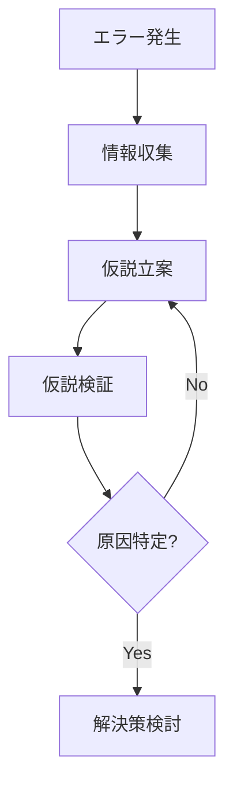
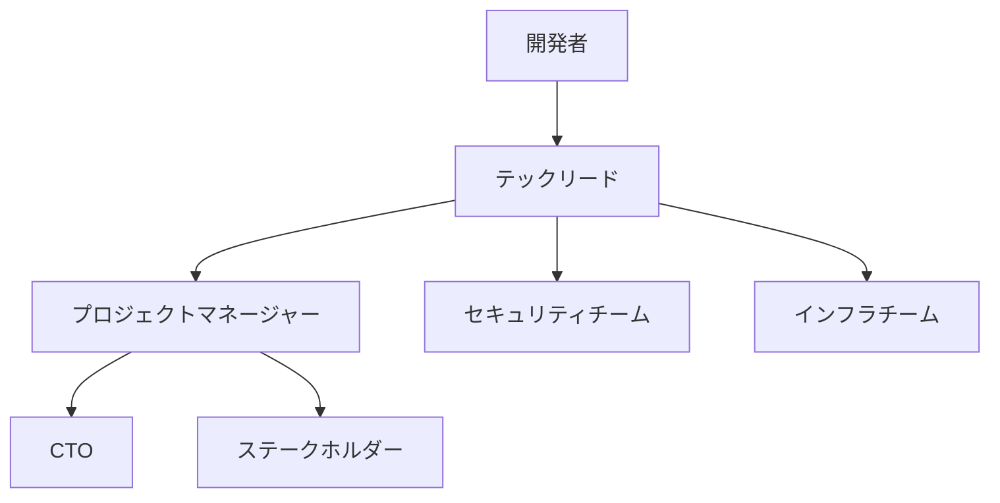

# エラー解析プロセス

## 1. エラーの分類と優先度

### 1.1 重大度レベル

#### P0（Critical）- 即時対応必須
- システム全体が機能停止
- データ破損/消失
- セキュリティ侵害
- 金銭的損失が発生
- サービス停止

対応時間：即時（24時間以内）

#### P1（High）- 早急な対応が必要
- 主要機能の停止
- 重大なパフォーマンス低下
- データ整合性の問題
- ユーザー体験の深刻な低下

対応時間：48時間以内

#### P2（Medium）- 計画的な対応
- 非主要機能の問題
- 軽微なパフォーマンス低下
- UIの不具合
- 代替手段が存在する問題

対応時間：1週間以内

#### P3（Low）- 通常対応
- 表示の軽微な乱れ
- ドキュメントの不整合
- 改善要望
- 最適化の提案

対応時間：2週間以内

### 1.2 影響範囲の評価

```markdown
## 影響範囲評価シート

### 技術的影響
- [ ] システムコア機能
- [ ] データベース
- [ ] 外部連携
- [ ] パフォーマンス
- [ ] セキュリティ

### ビジネス影響
- [ ] ユーザー数
- [ ] 収益への影響
- [ ] 法的リスク
- [ ] レピュテーション
- [ ] SLA違反

### 対応リソース
- [ ] 必要な技術スキル
- [ ] 投入人数
- [ ] 予想工数
- [ ] 外部リソースの要否
```

## 2. 調査プロセス

### 2.1 初動対応
1. エラー情報の収集
   - エラーメッセージ
   - スタックトレース
   - システムログ
   - 環境情報
   - 再現手順

2. 影響範囲の特定
   - 影響を受けるユーザー数
   - 影響を受ける機能
   - データへの影響
   - 関連システムへの影響

3. 一時対応の検討
   - システム停止の要否
   - 代替手段の提供
   - 暫定的な回避策

### 2.2 原因特定プロセス



#### 2.2.1 情報収集チェックリスト
```markdown
## エラー調査シート

### 基本情報
- 発生日時：
- 報告者：
- 環境：
- 再現性：

### 技術情報
- エラーコード：
- スタックトレース：
- ログ：
- メモリ使用状況：
- CPU使用状況：

### 環境情報
- OS：
- ブラウザ：
- デバイス：
- ネットワーク状態：

### 再現手順
1. 
2. 
3. 

### 試行済の対応
1. 
2. 
3. 
```

#### 2.2.2 アブダクション（仮説推論）プロセス
1. 観察された現象の整理
2. 可能性のある原因のリストアップ
3. 各仮説の検証計画の立案
4. 優先順位付けと実行

### 2.3 検証プロセス
1. テスト環境での再現
2. ログ解析
3. コードレビュー
4. デバッグ実行
5. 負荷テスト（必要な場合）

## 3. 解決プロセス

### 3.1 解決策の評価基準
```markdown
## 解決策評価シート

### 技術的評価
- [ ] 根本原因への対処
- [ ] 副作用のリスク
- [ ] 実装の複雑さ
- [ ] テスト可能性
- [ ] パフォーマンスへの影響

### 運用面の評価
- [ ] デプロイの容易さ
- [ ] ダウンタイム
- [ ] 監視可能性
- [ ] 運用コスト
- [ ] ロールバックの容易さ

### ビジネス面の評価
- [ ] 解決までの時間
- [ ] コスト
- [ ] ユーザーへの影響
- [ ] 長期的な持続可能性
```

### 3.2 実装プロセス
1. 修正方針の策定
2. コードレビュー
3. テスト実施
4. 承認取得
5. デプロイ計画の作成

### 3.3 検証プロセス
1. 単体テスト
2. 統合テスト
3. 負荷テスト（必要な場合）
4. セキュリティテスト（必要な場合）
5. ユーザー受入テスト

## 4. 文書化要件

### 4.1 エラー報告書
```markdown
# エラー報告書

## 1. 概要
- エラーID：
- 発生日時：
- 報告者：
- 重大度：
- 状態：

## 2. 技術詳細
### 2.1 エラー内容
### 2.2 発生環境
### 2.3 再現手順
### 2.4 影響範囲

## 3. 原因分析
### 3.1 直接原因
### 3.2 根本原因
### 3.3 寄与要因

## 4. 解決策
### 4.1 暫定対応
### 4.2 恒久対応
### 4.3 予防措置

## 5. タイムライン
| 時刻 | イベント | 対応者 | 内容 |
|------|----------|---------|------|
|      |          |         |      |

## 6. 教訓と改善点
### 6.1 得られた教訓
### 6.2 改善提案
```

### 4.2 解決報告書
```markdown
# 解決報告書

## 1. 対応概要
- エラーID：
- 解決日時：
- 対応者：
- 承認者：

## 2. 解決詳細
### 2.1 実施した対応
### 2.2 検証結果
### 2.3 残存リスク

## 3. フォローアップ
### 3.1 監視項目
### 3.2 追加対応事項
```

## 5. 予防措置

### 5.1 再発防止策の検討
1. 同様のエラーの可能性がある箇所の特定
2. 予防的な改善の実施
3. 監視体制の強化
4. アラート基準の見直し

### 5.2 ナレッジベースの更新
1. エラーパターンの記録
2. 解決手順の文書化
3. チェックリストの更新
4. レビュー基準の見直し

## 6. エスカレーションフロー

### 6.1 エスカレーション基準
```markdown
## エスカレーション判断基準

### 即時エスカレーション（P0）
- システム全体の停止
- データ消失
- セキュリティ侵害

### 通常エスカレーション（P1）
- 解決に2日以上要する
- 複数チームの協力が必要
- 外部ベンダーの支援が必要

### 報告エスカレーション（P2/P3）
- 定期報告
- 進捗報告
- リソース要請
```

### 6.2 エスカレーションパス

```

この体系化により：
1. エラーの重要度に応じた適切な対応
2. 体系的な原因分析プロセス
3. 標準化された解決プロセス
4. 明確なエスカレーションフロー
が確立されます。

認識済のルールファイル：
- global.mdc
- development.mdc
- project.mdc
- workflow.mdc
- rules.mdc 