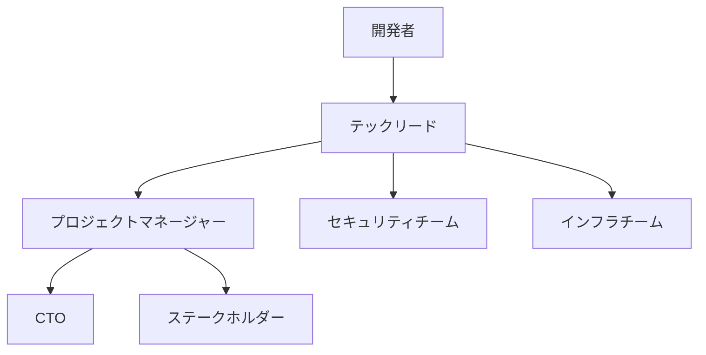

# エラー解析プロセス

## 基本方針
*   [project.mdc](mdc:.cursor/rules/project.mdc) の指示に従い、障害発生時は対象部分と周辺を調査し、**アブダクション（仮説推論）** を用いて原因を特定し、解消する。

## 重大度レベル (例)
*   **P0 (Critical):** システム停止、主要機能の完全停止、深刻なデータ損失・破損。即時対応が必要。
*   **P1 (High):** 主要機能の重大な不具合、ユーザーへの広範な影響。迅速な対応が必要。
*   **P2 (Medium):** 特定機能の不具合、ユーザーへの限定的な影響、回避策あり。計画的な対応。
*   **P3 (Low):** 軽微な不具合、UI/UXの問題、ドキュメントの誤りなど。次期リリース等で対応。

## 解析手順
1.  **エラー情報収集:**
    *   エラーメッセージ、ログ（アプリケーションログ、システムログ）
    *   発生時刻、発生頻度、再現手順
    *   影響を受けているユーザー、環境
2.  **影響範囲特定:**
    *   エラーがどの機能、コンポーネント、データに影響しているか特定する。
    *   他の部分への波及効果がないか確認する。
3.  **一時対応検討:**
    *   サービス継続のために、暫定的な回避策やロールバックが可能か検討・実施する。
4.  **原因特定（アブダクション）:**
    *   収集した情報に基づき、考えられる原因の仮説を複数立てる。
    *   各仮説を検証するために、追加のログ調査、コードレビュー、デバッグ、再現テスト等を行う。
    *   最も確からしい原因を特定する。
5.  **恒久対策の立案と実装:**
    *   特定した原因を根本的に解決するための修正策を設計・実装する。
    *   再発防止策も合わせて検討する。
6.  **修正内容の検証:**
    *   修正によってエラーが解消されたことを確認する。
    *   修正によるデグレード（新たな不具合）が発生していないか確認する（単体テスト、結合テスト、回帰テスト）。
7.  **文書化:**
    *   発生した事象、原因、対応策、再発防止策を記録する (`docs/11.errors/`, `docs/12.fixes/` など)。
    *   必要に応じて関連ドキュメント（設計書、テスト仕様書など）を更新する。

## 影響範囲評価シート

### 技術的影響
- [ ] システムコア機能
- [ ] データベース
- [ ] 外部連携
- [ ] パフォーマンス
- [ ] セキュリティ

### ビジネス影響
- [ ] ユーザー数
- [ ] 収益への影響
- [ ] 法的リスク
- [ ] レピュテーション
- [ ] SLA違反

### 対応リソース
- [ ] 必要な技術スキル
- [ ] 投入人数
- [ ] 予想工数
- [ ] 外部リソースの要否

## エラー調査シート

### 基本情報
- 発生日時：
- 報告者：
- 環境：
- 再現性：

### 技術情報
- エラーコード：
- スタックトレース：
- ログ：
- メモリ使用状況：
- CPU使用状況：

### 環境情報
- OS：
- ブラウザ：
- デバイス：
- ネットワーク状態：

### 再現手順
1. 
2. 
3. 

### 試行済の対応
1. 
2. 
3. 

## 解決策評価シート

### 技術的評価
- [ ] 根本原因への対処
- [ ] 副作用のリスク
- [ ] 実装の複雑さ
- [ ] テスト可能性
- [ ] パフォーマンスへの影響

### 運用面の評価
- [ ] デプロイの容易さ
- [ ] ダウンタイム
- [ ] 監視可能性
- [ ] 運用コスト
- [ ] ロールバックの容易さ

### ビジネス面の評価
- [ ] 解決までの時間
- [ ] コスト
- [ ] ユーザーへの影響
- [ ] 長期的な持続可能性

## エラー報告書

### 1. 概要
- エラーID：
- 発生日時：
- 報告者：
- 重大度：
- 状態：

### 2. 技術詳細
#### 2.1 エラー内容
#### 2.2 発生環境
#### 2.3 再現手順
#### 2.4 影響範囲

### 3. 原因分析
#### 3.1 直接原因
#### 3.2 根本原因
#### 3.3 寄与要因

### 4. 解決策
#### 4.1 暫定対応
#### 4.2 恒久対応
#### 4.3 予防措置

### 5. タイムライン
| 時刻 | イベント | 対応者 | 内容 |
|------|----------|---------|------|
|      |          |         |      |

### 6. 教訓と改善点
#### 6.1 得られた教訓
#### 6.2 改善提案

## 解決報告書

### 1. 対応概要
- エラーID：
- 解決日時：
- 対応者：
- 承認者：

### 2. 解決詳細
#### 2.1 実施した対応
#### 2.2 検証結果
#### 2.3 残存リスク

### 3. フォローアップ
#### 3.1 監視項目
#### 3.2 追加対応事項

## 予防措置

### 1. 再発防止策の検討
1. 同様のエラーの可能性がある箇所の特定
2. 予防的な改善の実施
3. 監視体制の強化
4. アラート基準の見直し

### 2. ナレッジベースの更新
1. エラーパターンの記録
2. 解決手順の文書化
3. チェックリストの更新
4. レビュー基準の見直し

## エスカレーション判断基準

### 即時エスカレーション（P0）
- システム全体の停止
- データ消失
- セキュリティ侵害

### 通常エスカレーション（P1）
- 解決に2日以上要する
- 複数チームの協力が必要
- 外部ベンダーの支援が必要

### 報告エスカレーション（P2/P3）
- 定期報告
- 進捗報告
- リソース要請

## エスカレーションパス

この体系化により：
1. エラーの重要度に応じた適切な対応
2. 体系的な原因分析プロセス
3. 標準化された解決プロセス
4. 明確なエスカレーションフロー
が確立されます。

認識済のルールファイル：
- global.mdc
- development.mdc
- project.mdc
- workflow.mdc
- rules.mdc 

## 既知の問題と対策
### Difyサーバー接続タイムアウト
#### 症状
- 60秒のデフォルトタイムアウトでは接続が切断
- "Failed to execute query after 3 attempts"エラーが発生

#### 解決策
1. REQUEST_TIMEOUT環境変数を360秒に設定
2. 実行時間の監視とログ記録
3. リトライ処理による回復性の確保

#### 予防策
- 本番環境では定期的な応答時間モニタリング
- サーバーの負荷状況に応じたタイムアウト値の調整 