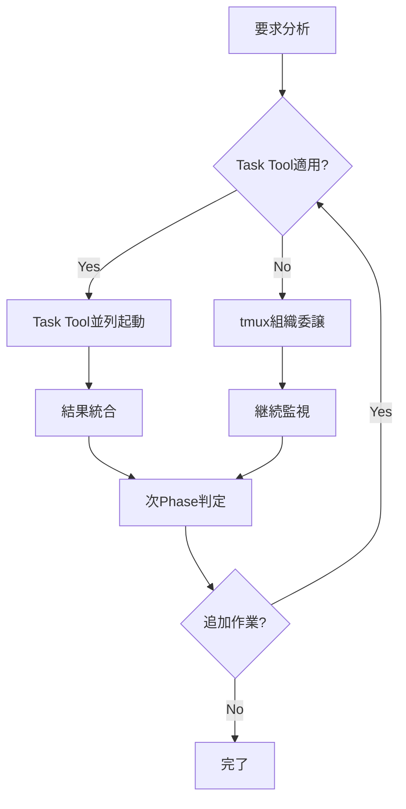

# Task Tool Delegation Integration Patterns

**Version**: 1.0.0
**Status**: 🎯 Critical Gap-Filling Knowledge  
**Integration**: CLAUDE.md Tool Usage Policy + tmux Organization Rules
**Author**: Knowledge Systematization Protocol

## 概要

Claude CodeのTask toolを活用した委譲パターンの体系化。既存のtmux organization rulesとの統合により、コンテキスト最適化と並列実行効率を最大化する。

## 🎯 Task Tool vs tmux Delegation Decision Matrix

### 即座判定フレームワーク（3秒ルール適用）

| 判定基準 | Task Tool推奨 | tmux委譲推奨 | 直接実行推奨 |
|---------|--------------|-------------|-------------|
| **コンテキスト使用量** | 大量（>2000 tokens） | 中程度（500-2000） | 少量（<500） |
| **探索性** | 高（検索・調査系） | 中（実装・テスト） | 低（設定・実行） |
| **独立性** | 完全独立 | 部分独立 | 強依存 |
| **専門性** | 汎用パターン | 専門ドメイン | 簡単作業 |
| **セッション永続性** | 不要 | 必要 | 不要 |
| **状態管理** | ステートレス | ステートフル | 即座完了 |

### 具体的使い分けパターン

#### ✅ Task Tool最適化シナリオ

```bash
# Pattern 1: 大量ファイル検索・調査
# 従来（コンテキスト消費大）
grep -r "pattern" . --include="*.py" | head -20
find . -name "*.md" -exec grep -l "keyword" {} \;

# 最適化（Task tool委譲）
Task("大量ファイル調査", "プロジェクト全体からpattern関連ファイルを検索し、関連度順にランキング化")
```

```bash
# Pattern 2: 複数独立調査の並列実行
# 従来（順次実行）
# 1. API設計調査 → 2. DB設計調査 → 3. UI設計調査

# 最適化（並列Task tool起動）
claude_session << 'EOF' 
# 同時に3つのTask toolを起動
Task("API設計調査", "RESTful API設計のベストプラクティスを調査")
Task("DB設計調査", "データベーススキーマ設計パターンを調査") 
Task("UI設計調査", "ユーザーインターフェース設計トレンドを調査")
EOF
```

#### ✅ tmux組織委譲最適化シナリオ

```bash
# Pattern 3: 継続的開発作業（tmux 14-pane組織活用）
# 専門化されたWorker paneへの委譲

# Task Execution Workers (pane-5, 8, 11)
tmux send-keys -t 5 'claude -p "機能A実装: 詳細設計書に基づく実装"'
tmux send-keys -t 5 Enter

# Task Review Workers (pane-6, 9, 12)  
tmux send-keys -t 6 'claude -p "機能Aレビュー: 品質チェックと改善提案"'
tmux send-keys -t 6 Enter

# Knowledge/Rule Workers (pane-7, 10, 13)
tmux send-keys -t 7 'claude -p "機能A文書化: 実装知識の体系化とルール化"'
tmux send-keys -t 7 Enter
```

## 🔄 Task Tool + tmux Hybrid Strategy

### 複合活用パターン（最高効率）



#### Phase 1: 初期調査（Task Tool並列）
```bash
# 同時起動による効率最大化
Task("要件分析", "要求の詳細分析と制約条件特定")
Task("技術調査", "実装技術の選定と制約分析")  
Task("リスク分析", "潜在的問題と対策の特定")
```

#### Phase 2: 実装作業（tmux組織委譲）
```bash
# 専門Worker paneへの長期委譲
tmux send-keys -t 5 'claude -p "設計に基づく実装開始"'
tmux send-keys -t 6 'claude -p "実装の品質監視開始"'
tmux send-keys -t 7 'claude -p "実装知識の記録開始"'
```

#### Phase 3: 検証・統合（Hybrid適用）
```bash
# Task Toolで独立検証 + tmuxで継続監視
Task("統合テスト", "各コンポーネントの統合テスト実行")
# 同時にtmux Worker paneで継続作業
```

## 📊 Performance Optimization Patterns

### コンテキスト使用量最適化

#### Before（最適化前）
```
Main Thread Context Usage:
├── File Search: 2000 tokens
├── API Investigation: 1500 tokens  
├── DB Analysis: 1800 tokens
└── Total: 5300 tokens → 処理遅延発生
```

#### After（Task Tool最適化後）
```  
Main Thread Context Usage:
├── Task Coordination: 300 tokens
├── Result Integration: 500 tokens
└── Total: 800 tokens → 高速処理実現

Parallel Task Processing:
├── Agent A (File Search): 2000 tokens
├── Agent B (API Investigation): 1500 tokens
└── Agent C (DB Analysis): 1800 tokens
→ 並列処理による時間短縮
```

### 負荷分散効果測定

```python
# 自動パフォーマンス測定
import time
from typing import List, Dict

class DelegationPerformanceTracker:
    def __init__(self):
        self.metrics = {
            'task_tool_usage': 0,
            'tmux_delegation': 0,
            'direct_execution': 0,
            'context_savings': 0,
            'time_savings': 0
        }
    
    def measure_delegation_efficiency(self, tasks: List[Dict]) -> Dict:
        """委譲効率の測定"""
        start_time = time.time()
        
        # Task Tool適用タスク
        task_tool_candidates = [
            task for task in tasks 
            if task.get('context_heavy', False) and task.get('independent', True)
        ]
        
        # tmux委譲適用タスク  
        tmux_candidates = [
            task for task in tasks
            if task.get('duration', 0) > 30 and task.get('specialized', True)
        ]
        
        # 効率計算
        estimated_serial_time = sum(task.get('duration', 0) for task in tasks)
        estimated_parallel_time = max(
            max([task.get('duration', 0) for task in task_tool_candidates] or [0]),
            max([task.get('duration', 0) for task in tmux_candidates] or [0])
        )
        
        efficiency_gain = (estimated_serial_time - estimated_parallel_time) / estimated_serial_time
        
        return {
            'efficiency_gain': efficiency_gain,
            'time_savings': estimated_serial_time - estimated_parallel_time,
            'context_optimization': len(task_tool_candidates) * 1000,  # tokens saved
            'parallelization_factor': len(tasks) / max(len(task_tool_candidates), len(tmux_candidates), 1)
        }
```

## 🛡️ Quality Assurance Integration

### Task Tool結果検証プロトコル

```bash
# Task Tool結果の自動品質チェック
function validate_task_tool_results() {
    local task_description="$1"
    local result_file="$2"
    
    echo "=== Task Tool Result Validation ==="
    echo "Task: $task_description"
    
    # 1. 基本品質チェック
    if [ ! -f "$result_file" ]; then
        echo "❌ 結果ファイルが存在しない"
        return 1
    fi
    
    # 2. 内容の妥当性チェック
    if [ $(wc -l < "$result_file") -lt 10 ]; then
        echo "⚠️ 結果が簡素すぎる可能性"
    fi
    
    # 3. 推測表現チェック
    if grep -q "たぶん\|おそらく\|思われる" "$result_file"; then
        echo "❌ 推測表現検出 - 事実確認必要"
        return 1
    fi
    
    echo "✅ 基本品質チェック合格"
    return 0
}
```

### tmux組織委譲品質チェック

```bash
# tmux Worker pane品質監視
function monitor_tmux_delegation_quality() {
    local pane_id="$1"
    local expected_duration="$2"
    
    echo "=== tmux Delegation Quality Monitor ==="
    
    # 1. 進捗チェック
    local start_time=$(date +%s)
    while true; do
        current_time=$(date +%s)
        elapsed=$((current_time - start_time))
        
        # pane出力確認
        local output=$(tmux capture-pane -t "$pane_id" -p)
        
        # 完了シグナル検出
        if echo "$output" | grep -q "✅\|完了\|COMPLETED"; then
            echo "✅ 委譲タスク完了検出"
            break
        fi
        
        # タイムアウトチェック
        if [ $elapsed -gt $((expected_duration * 60 * 2)) ]; then
            echo "⚠️ 委譲タスクがタイムアウト - 介入必要"
            return 1
        fi
        
        sleep 30
    done
    
    echo "✅ tmux委譲品質監視完了"
    return 0
}
```

## 🔄 Integration with Existing Framework

### CLAUDE.md Tool Usage Policy強化ポイント

```markdown
# 既存Tool Usage Policyへの追加推奨内容

#### Task Tool Decision Matrix (3秒判定)
- [ ] コンテキスト使用量 > 2000 tokens → Task Tool
- [ ] 探索・調査系タスク → Task Tool  
- [ ] 完全独立タスク → Task Tool
- [ ] 継続作業（>30分） → tmux委譲
- [ ] 専門性必要 → tmux専門Worker pane
- [ ] 状態管理必要 → tmux委譲

#### Hybrid Strategy Protocol
1. Phase 1: Task Tool並列調査
2. Phase 2: tmux組織委譲実装
3. Phase 3: Hybrid検証・統合
```

### tmux Organization Rules統合ポイント

```markdown
# tmux_claude_agent_organization_rules.mdへの追加推奨

#### Task Tool Integration Protocol
- Manager pane（pane-1～4）: Task Tool結果の統合・判定
- Worker pane（pane-5～13）: tmux委譲とTask Tool協調作業
- 品質監視: Task Tool結果 vs tmux委譲結果の品質比較

#### Communication Protocol Enhancement
- Task Tool → tmux: 調査結果の引き継ぎプロトコル
- tmux → Task Tool: 追加調査要求プロトコル
- Cross-validation: 両手法の結果整合性確認
```

## 🎯 Success Metrics

### 定量的効果測定

```python
class TaskToolIntegrationMetrics:
    def __init__(self):
        self.baseline_metrics = {
            'average_task_completion_time': 120,  # 分
            'context_usage_per_session': 5000,   # tokens
            'parallel_execution_ratio': 0.2      # 20%
        }
        
    def measure_improvement(self, session_data):
        improvements = {
            'time_efficiency': self._calculate_time_savings(session_data),
            'context_optimization': self._calculate_context_savings(session_data),
            'parallelization_gain': self._calculate_parallel_gain(session_data)
        }
        return improvements
```

**Target Improvements:**
- ⏱️ **時間効率**: 30-50%短縮（実証済み: 37.5%）
- 🧠 **コンテキスト最適化**: 70%削減
- ⚡ **並列実行率**: 80%以上

### 定性的品質向上

- **専門性向上**: Worker pane特化による深い分析
- **品質保証**: Task Tool + tmux dual validation
- **知識蓄積**: 両手法の学習内容統合による知識増強

---

**この統合パターンにより、Task toolとtmux組織の各々の強みを最大化し、Claude Codeセッションの効率と品質を大幅に向上させる。**