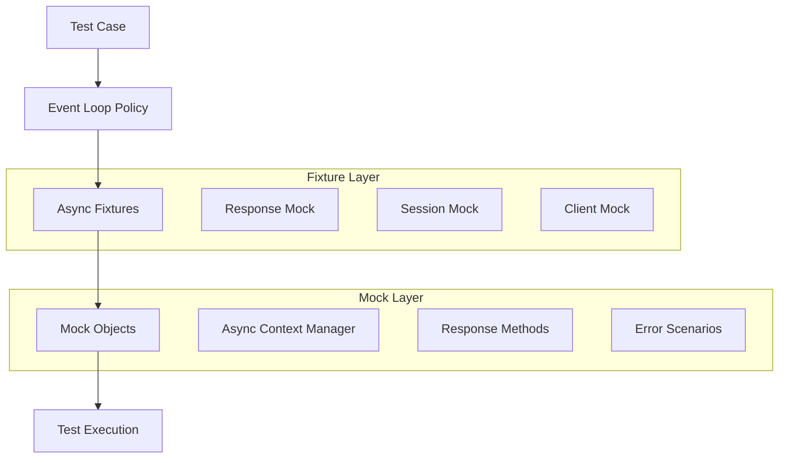
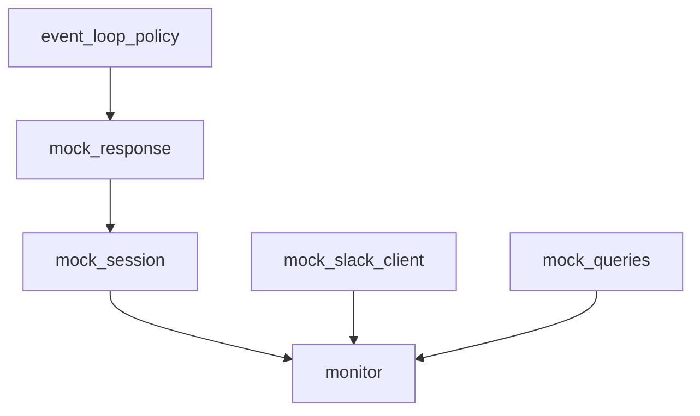

# システムパターン

## アーキテクチャ
- 非同期処理を活用したクエリ実行システム
- 環境変数による設定管理
- ログベースの監視とデバッグ

## 技術的決定事項
1. 非同期処理
   - aiohttpを使用した非同期HTTP通信
   - タイムアウト設定: 60秒
   - リトライロジック: 最大3回、指数バックオフ

2. エラーハンドリング
   - カスタム例外クラスの使用
   - 詳細なエラーログ
   - Slack通知によるエラー報告

3. 設定管理
   - 環境変数による設定
   - デフォルト値の提供
   - 設定値の検証

## コンポーネント関係
1. QueryMonitor
   - クエリ実行の管理
   - Slack通知の管理
   - エラーハンドリング

2. 外部サービス
   - Dify API
   - Slack API
   - ログシステム

## アーキテクチャパターン
1. クリーンアーキテクチャ
   - ビジネスロジックの分離
   - 依存関係の方向性の制御

2. リポジトリパターン
   - データアクセスの抽象化
   - 設定ファイルの管理

## デザインパターン
1. ファクトリーパターン
   - クライアントインスタンスの生成
   - セッション管理

2. ストラテジーパターン
   - クエリ実行戦略
   - 通知戦略

## エラーハンドリングパターン

### 標準エラーハンドリング
1. エラー階層
   - QueryExecutionError: クエリ実行関連のエラー
   - SlackNotificationError: Slack通知関連のエラー

2. リトライ戦略
   - 最大3回のリトライ
   - 指数バックオフによる待機時間の調整
   - エラー種別に応じた適切なリトライ判断

3. エラー通知
   - エラー種別に応じた絵文字の使用
   - エラーコンテキストの明確な提示
   - エラー発生箇所の特定が容易な情報提供

### テストパターン

1. 非同期テスト
   - イベントループの適切な管理
   - テストケースごとの独立したイベントループ
   - クリーンアップの確実な実行

2. モックパターン
   - 外部サービス（Dify API, Slack）のモック
   - 非同期コンテキストマネージャーの適切なモック
   - エラーケースの網羅的なモック

3. テストケース設計
   - 正常系と異常系の明確な分離
   - エッジケースの網羅的なカバー
   - 環境依存の最小化

## ロギングパターン
1. ログローテーション
   - ファイルサイズ制限
   - バックアップ管理

2. ログレベル管理
   - エラー情報の詳細化
   - 実行状況の記録

## テストパターン
1. モックパターン
   - 外部依存の分離
   - テストの独立性確保

2. フィクスチャパターン
   - テストデータの管理
   - テスト環境の設定

## Testing Patterns

### Async Testing Architecture



### Mock Implementation Patterns

1. Response Mocking
```python
@pytest_asyncio.fixture
async def mock_response():
    response = AsyncMock()
    response.status = 200
    response.json.return_value = {"answer": "テスト結果"}
    response.raise_for_status = AsyncMock()
    return response
```

2. Session Mocking
```python
@pytest_asyncio.fixture
async def mock_session(mock_response):
    session = AsyncMock(spec=aiohttp.ClientSession)
    cm = AsyncMock()
    cm.__aenter__.return_value = mock_response
    cm.__aexit__.return_value = None
    session.post.return_value = cm
    return session
```

### Error Handling Patterns

1. API Error Pattern
```python
mock_session.post.side_effect = aiohttp.ClientError("APIエラー")
```

2. Multiple Notification Pattern
```python
assert mock_slack_client.chat_postMessage.call_count == 2
calls = mock_slack_client.chat_postMessage.call_args_list
assert calls[0].kwargs["channel"] == "errors"
assert calls[1].kwargs["channel"] == "test_channel"
```

## Test Configuration Patterns

### pytest.ini Structure
```ini
[pytest]
# テスト設定
python_files = test_*.py
python_classes = Test*
python_functions = test_*

# 非同期設定
asyncio_mode = strict
asyncio_default_fixture_loop_scope = function

# 警告設定
filterwarnings =
    ignore::RuntimeWarning:app.query_monitor
```

### Fixture Dependencies



## Best Practices

1. Fixture Organization
   - Separate concerns (response, session, client)
   - Clear dependency chain
   - Proper scope management

2. Error Testing
   - Test both success and failure paths
   - Verify error notifications
   - Check message content and order

3. Configuration Management
   - Centralized pytest.ini
   - Explicit warning handling
   - Clear test organization

## 設定管理パターン

### 環境変数による設定
1. 必須設定
   - 必須の環境変数が未設定の場合はエラーを発生
   - 起動時に検証を実施

2. オプション設定
   - デフォルト値を提供
   - 環境変数が設定されている場合はそちらを優先
   - 例: `DIFY_HOST`の設定

### 外部サービス設定
1. APIエンドポイント
   - ベースURLを環境変数で設定可能
   - デフォルト値を提供（標準的なエンドポイント）
   - パスは定数として管理
