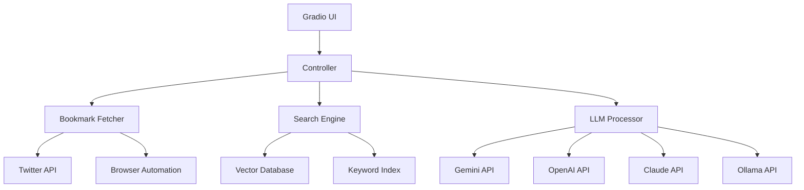

# システムパターン

## アーキテクチャ概要


## 主要コンポーネント
1. データ取得層
   - TwitterAPI連携
   - ブラウザ自動化
   - ポーリング管理

2. 検索エンジン層
   - ベクトルデータベース
   - キーワードインデックス
   - ハイブリッド検索

3. LLM処理層
   - マルチバックエンド対応
   - プロンプト管理
   - コンテキスト制御

4. UI層
   - Gradioインターフェース
   - 検索・フィルタリング
   - 結果表示

## 設計パターン
1. Repository Pattern
   - ブックマークデータのCRUD操作を抽象化
   - データソースの切り替えを容易に

2. Strategy Pattern
   - LLMバックエンドの動的切り替え
   - 検索アルゴリズムの切り替え

3. Observer Pattern
   - ブックマーク更新の監視
   - インデックス更新の通知

4. Factory Pattern
   - LLMインスタンスの生成
   - 検索エンジンの初期化

## データフロー
1. ブックマーク取得
   ```mermaid
   sequenceDiagram
       Controller->>BookmarkFetcher: 取得要求
       BookmarkFetcher->>TwitterAPI: API呼び出し
       TwitterAPI-->>BookmarkFetcher: ブックマークデータ
       BookmarkFetcher->>SearchEngine: インデックス更新
   ```

2. 検索処理
   ```mermaid
   sequenceDiagram
       UI->>Controller: 検索クエリ
       Controller->>SearchEngine: 検索実行
       SearchEngine->>VectorDB: ベクトル検索
       SearchEngine->>KeywordIndex: キーワード検索
       SearchEngine-->>Controller: 統合結果
       Controller->>LLMProcessor: 回答生成
       LLMProcessor-->>UI: 結果表示
   ``` 