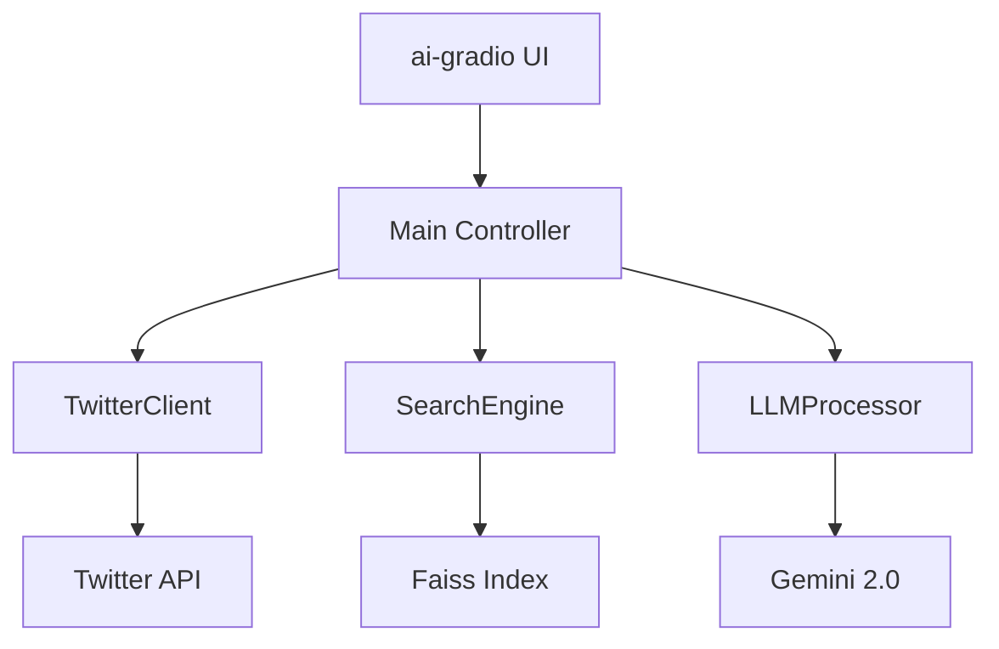
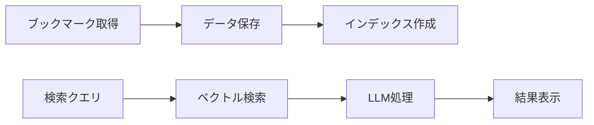
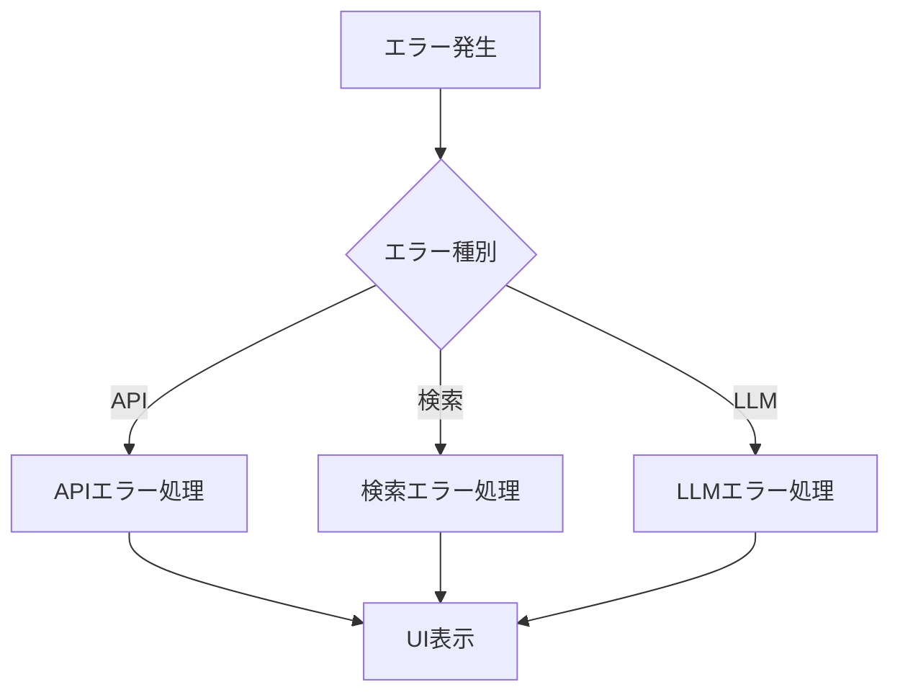
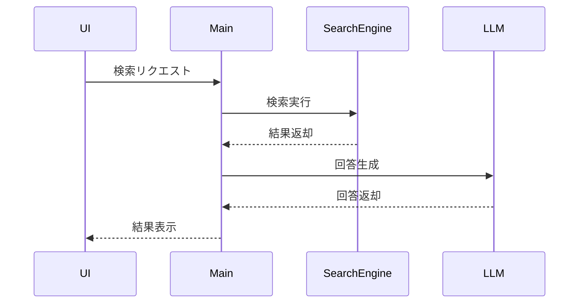

# システムパターン（MVP版）

## 1. アーキテクチャ概要

### 1.1 全体構造


### 1.2 データフロー


## 2. モジュール構成

### 2.1 TwitterClient
- **責務:** ブックマークデータの取得
- **パターン:** Adapter Pattern
- **実装:**
  ```python
  class TwitterClient:
      def __init__(self, auth_config: dict):
          self.auth = OAuth2Handler(auth_config)
          
      async def get_bookmarks(self) -> List[Tweet]:
          # 基本的なブックマーク取得
          pass
  ```

### 2.2 SearchEngine
- **責務:** ベクトル検索の実行
- **パターン:** Repository Pattern
- **実装:**
  ```python
  class SearchEngine:
      def __init__(self, index_path: str):
          self.index = faiss.IndexFlatL2(...)
          
      def search(self, query: str) -> List[SearchResult]:
          # 基本的な検索処理
          pass
  ```

### 2.3 LLMProcessor
- **責務:** LLMによる回答生成
- **パターン:** Strategy Pattern
- **実装:**
  ```python
  class LLMProcessor:
      def __init__(self, model_config: dict):
          self.model = GeminiModel(model_config)
          
      async def generate_response(self, context: str) -> str:
          # 基本的な回答生成
          pass
  ```

### 2.4 UI
- **責務:** ユーザーインターフェース
- **パターン:** Facade Pattern
- **実装:**
  ```python
  class UI:
      def __init__(self, controller: MainController):
          self.controller = controller
          
      def build_interface(self):
          # 基本的なUI構築
          pass
  ```

## 3. デザインパターン

### 3.1 採用パターン
1. **Adapter Pattern**
   - TwitterAPIとの連携
   - LLM APIとの連携

2. **Repository Pattern**
   - 検索エンジンの実装
   - データ永続化

3. **Strategy Pattern**
   - LLMの処理
   - 検索ロジック

4. **Facade Pattern**
   - UIインターフェース
   - メインコントローラー

### 3.2 エラー処理


## 4. データ構造

### 4.1 Tweet
```python
@dataclass
class Tweet:
    id: str
    text: str
    author: str
    created_at: datetime
    url: str
```

### 4.2 SearchResult
```python
@dataclass
class SearchResult:
    tweet: Tweet
    score: float
```

### 4.3 LLMResponse
```python
@dataclass
class LLMResponse:
    text: str
    context: List[Tweet]
```

## 5. 非同期処理

### 5.1 基本フロー


## 6. エラー処理戦略

### 6.1 基本方針
1. **エラーの種類**
   - APIエラー
   - 検索エラー
   - LLMエラー
   - UIエラー

2. **エラーハンドリング**
   - 基本的な例外捕捉
   - ユーザーへのフィードバック
   - ログ出力

### 6.2 実装例
```python
try:
    result = await process_request()
except APIError as e:
    log_error(e)
    show_error_message(str(e))
except SearchError as e:
    log_error(e)
    show_error_message(str(e))
```

## 7. テスト戦略

### 7.1 単体テスト
- 各モジュールの基本機能テスト
- 主要メソッドのテスト
- エラーケースのテスト

### 7.2 統合テスト
- モジュール間の連携テスト
- 主要フローのテスト
- エラー処理の確認

## 8. 設定管理

### 8.1 環境変数
```python
TWITTER_API_KEY=xxx
TWITTER_API_SECRET=xxx
GEMINI_API_KEY=xxx
```

### 8.2 設定ファイル
```python
config = {
    'twitter': {
        'max_bookmarks': 800,
        'timeout': 30
    },
    'search': {
        'top_k': 5,
        'threshold': 0.5
    },
    'llm': {
        'model': 'gemini-2.0-flash',
        'max_tokens': 1000
    }
}
```

## 9. MVPの制約

### 9.1 機能制約
- 単一LLMのみ対応
- 基本的な検索機能のみ
- シンプルなUI

### 9.2 性能制約
- 同時1ユーザーのみ
- 基本的なエラー処理
- 最小限の最適化 