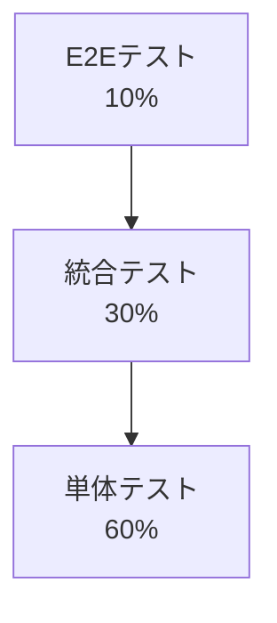

# テスト戦略ガイドライン

## 1. コード不変性の原則

### 1.1 テスト済コードの不変性
- テストに合格したコードは原則として変更禁止
- 新しい要件は新しい関数/クラスとして実装
- 既存コードの再利用は委譲パターンを使用

### 1.2 例外的にテスト済コードを変更できる場合
以下の場合のみ、厳格な承認プロセスを経て変更可能：

1. セキュリティ上の重大な問題
   - セキュリティ監査での指摘
   - 脆弱性の報告
   - インシデント対応

2. 重大なバグ
   - データ整合性に影響
   - システム停止に繋がる問題
   - 決済処理の誤り

3. パフォーマンス上の致命的な問題
   - システム全体に影響する深刻な遅延
   - リソース枯渇を引き起こす問題

### 1.3 テスト済コード変更の承認プロセス
```markdown
## コード変更申請

### 変更対象
- ファイル：
- クラス/関数：
- 該当するテスト：

### 変更理由
- [ ] セキュリティ問題
- [ ] 重大なバグ
- [ ] 致命的なパフォーマンス問題

### 問題の詳細
- 影響度：[Critical/High/Medium/Low]
- 発生頻度：
- 影響範囲：
- 技術的負債の程度：

### 証跡
- 問題の再現手順：
- エラーログ：
- パフォーマンス計測結果：
- セキュリティ監査報告：

### 変更計画
- 現在のコード：
- 変更後のコード：
- 影響を受けるテスト：
- リスク評価：
- ロールバック計画：

### 承認
- レビュワー（最低3名）：
- アーキテクト承認：
- プロジェクトリード承認：
- QA承認：
- セキュリティ承認（必要な場合）：
```

## 2. 新規機能追加プロセス

### 2.1 機能追加の基本原則
- 既存コードの変更は行わない
- 新しい機能は新しいクラス/関数として実装
- 既存機能の再利用は委譲またはラッパーで行う

### 2.2 実装パターン例
```python
# 変更禁止：既存のテスト済コード
class ExistingService:
    def process(self, data):
        # テスト済の処理
        pass

# 良い例：委譲による機能追加
class EnhancedService:
    def __init__(self):
        self._existing = ExistingService()
    
    def process(self, data):
        # 新しい前処理
        processed = self._existing.process(data)
        # 新しい後処理
        return processed

# 良い例：ラッパーによる機能拡張
class ServiceWrapper:
    def __init__(self, service: ExistingService):
        self._service = service
    
    def enhanced_process(self, data):
        # 新機能の実装
        return self._service.process(data)

# 悪い例：既存コードの変更
class ExistingService:  # 変更禁止
    def process(self, data):
        # 既存のコードを変更
        pass
```

### 2.3 リファクタリングの制限
- リファクタリングは新しいクラス/関数の作成のみ許可
- 古いコードは非推奨（deprecated）としてマーク
- 段階的な移行計画を必須とする

## 3. バージョン管理

### 3.1 コードのバージョニング
- メジャーバージョン：互換性のない変更
- マイナーバージョン：後方互換性のある追加
- パッチバージョン：バグ修正のみ

### 3.2 非推奨化プロセス
```python
from deprecated import deprecated

@deprecated(reason="Use EnhancedService instead", version='1.2.0')
class ExistingService:
    pass
```

## 4. 品質管理プロセス

### 4.1 コード変更の影響度評価
```markdown
## 影響度評価チェックリスト

- [ ] 既存機能への影響なし
- [ ] パフォーマンスへの影響なし
- [ ] セキュリティリスクなし
- [ ] 既存テストへの影響なし
```

### 4.2 変更履歴の管理
```markdown
# コード変更履歴

## [YYYY-MM-DD] 変更ID: CHG-XXX
- 変更種別：[Security/Bug/Performance]
- 承認番号：
- 変更内容：
- 影響範囲：
- 承認者リスト：
```

## 5. 移行戦略

### 5.1 新旧コードの共存
- 古いコードは即座に削除しない
- 新しいコードと並行して運用
- 段階的な移行を計画

### 5.2 移行計画テンプレート
```markdown
## 移行計画

### フェーズ1: 新機能の導入
- 新しいクラス/関数の作成
- テストの作成と実行
- ドキュメントの作成

### フェーズ2: 段階的移行
- 既存コードの非推奨化
- 新コードの段階的導入
- 移行状況のモニタリング

### フェーズ3: 完全移行
- 古いコードの使用停止
- 新コードへの完全移行
- 移行完了の確認
```

## 6. レビュー基準の強化

### 6.1 コードレビューチェックリスト
- [ ] 既存コードが変更されていないことの確認
- [ ] 新しいコードが適切に分離されているか
- [ ] テストが先に作成されているか
- [ ] 委譲/ラッパーパターンが適切に使用されているか
- [ ] 非推奨化が適切に行われているか

### 6.2 承認要件
- 最低3名のレビュワーによる承認
- アーキテクトの承認
- QAチームの承認
- セキュリティチームの承認（必要な場合）

## 1. テストピラミッド構造

テストは以下の階層構造で実装します：



### 1.1 単体テスト（Unit Test）
- 割合：全テストの60%
- カバレッジ目標：90%以上
- 対象：
  - 個別の関数やメソッド
  - クラスの独立した機能
  - ユーティリティ関数

### 1.2 統合テスト（Integration Test）
- 割合：全テストの30%
- カバレッジ目標：70%以上
- 対象：
  - APIエンドポイント
  - データベース操作
  - 外部サービスとの連携
  - コンポーネント間の連携

### 1.3 E2Eテスト（End-to-End Test）
- 割合：全テストの10%
- カバレッジ目標：主要フロー100%
- 対象：
  - ユーザーシナリオ
  - クリティカルパス
  - ビジネスフロー全体

## 2. 重要度に基づくテスト優先順位

### 2.1 最重要（P0）
- カバレッジ要件：100%
- テストの種類：単体、統合、E2E
- 対象：
  - セキュリティ関連機能
  - データ整合性に関わる処理
  - 決済処理
  - ユーザー認証

### 2.2 重要（P1）
- カバレッジ要件：90%以上
- テストの種類：単体、統合
- 対象：
  - ビジネスロジック
  - データ変換処理
  - バリデーション
  - エラーハンドリング

### 2.3 通常（P2）
- カバレッジ要件：70%以上
- テストの種類：主に単体
- 対象：
  - ユーティリティ関数
  - ヘルパー関数
  - UI表示ロジック

## 3. 質的指標

### 3.1 テストケースの品質基準
- 一つのテストは一つの機能のみを検証
- 前提条件が明確に記述されている
- 期待される結果が具体的
- エッジケースを含む
- 実行時間が適切（単体：<100ms、統合：<1s、E2E：<5s）

### 3.2 必須テストケース
1. 正常系
   - 典型的な入力での動作
   - 境界値での動作

2. 異常系
   - 無効な入力
   - エラー条件
   - タイムアウト
   - リソース制約

3. エッジケース
   - 空の入力
   - 最大値/最小値
   - 特殊文字
   - 大量データ

## 4. テスト実装ガイドライン

### 4.1 テストコードの構造
```python
def test_機能名_テストケース():
    # Given（準備）
    # テストの前提条件を設定

    # When（実行）
    # テスト対象の機能を実行

    # Then（検証）
    # 結果を検証
```

### 4.2 命名規則
```python
# 単体テスト
test_関数名_条件_期待される結果()

# 統合テスト
test_コンポーネント名_アクション_条件_期待される結果()

# E2Eテスト
test_機能名_シナリオ_期待される結果()
```

### 4.3 モック/スタブの使用基準
- 外部依存がある場合
- 実行時間が長い処理
- 非決定的な処理
- コストが高い処理

## 5. テスト環境

### 5.1 必要な環境
- 開発環境（Dev）
- テスト環境（Test）
- ステージング環境（Staging）
- 本番環境（Production）

### 5.2 環境ごとの要件
```markdown
| 環境      | 単体テスト | 統合テスト | E2Eテスト |
|-----------|------------|------------|-----------|
| Dev       | ✓         | ✓         | -         |
| Test      | ✓         | ✓         | ✓         |
| Staging   | -         | ✓         | ✓         |
| Prod      | -         | -         | -         |
```

## 6. テスト自動化

### 6.1 CI/CDパイプラインでの実行
- コミット時：単体テスト
- PRレビュー時：単体テスト＋統合テスト
- マージ時：全テスト
- デプロイ前：全テスト

### 6.2 定期実行
- 日次：全テスト
- 週次：パフォーマンステスト
- 月次：負荷テスト

## 7. レポーティング要件

### 7.1 必須メトリクス
- テストカバレッジ（行/分岐）
- テスト成功率
- テスト実行時間
- 失敗したテストの詳細

### 7.2 レポート形式
```markdown
## テスト実行レポート

### 概要
- 実行日時：[YYYY-MM-DD HH:MM]
- 環境：[環境名]
- 実行者：[実行者名]

### メトリクス
- 全テスト数：
- 成功数：
- 失敗数：
- スキップ数：
- カバレッジ：
  - 行カバレッジ：
  - 分岐カバレッジ：

### 失敗したテスト
1. [テスト名]
   - 原因：
   - 影響範囲：
   - 修正方針：

### パフォーマンス
- 実行時間：
- 最も時間のかかったテスト：
```

## 8. メンテナンス

### 8.1 定期レビュー
- テストケースの有効性確認
- 不要なテストの特定と削除
- テストカバレッジの評価
- テスト実行時間の最適化

### 8.2 更新基準
- 機能変更時の関連テスト更新
- パフォーマンス問題発生時の見直し
- 新しいエッジケースの発見時
- テストフレームワークのアップデート時 