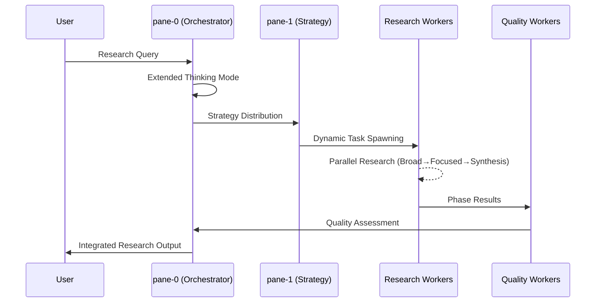

# tmux Claude Agent 組織体制ルール (Official Organization Rules)

**制定日**: 2025-06-14  
**制定者**: user (最高権限者)  
**適用範囲**: 全tmux Claude Agent セッション  
**文書種別**: 正式組織運営規則  
**更新権限**: user承認による変更のみ  
**遵守レベル**: 絶対遵守 (MANDATORY COMPLIANCE)

---

## 📋 I. 組織体制概要 (Organization Overview)

### 1.1 基本原則
```
設計思想: 階層型指揮統制システム
運営原理: 単一指揮系統 + 専門化分業
品質保証: 批判的レビュー + 継続的改善
効率最適化: 並列処理 + 責任分散
```

### 1.2 組織規模
- **総ペイン数**: 14ペイン (pane-0 〜 pane-13)
- **階層レベル**: 3階層 (User → Manager → Worker)
- **管理スパン**: 1:4 (Manager:Worker比)
- **専門分野**: 3領域 (Execution, Review, Knowledge/Rule)

---

## 🏗️ II. 組織構造 (Organizational Structure)

### 2.1 階層構造図
```
                    [USER]
                      │
                      ▼
         ┌─────────────────────────────┐
         │     pane-0: 組織ルール       │
         │  (Knowledge/Rule Manager)   │
         └─────────────────────────────┘
                      │
        ┌─────────────┼─────────────┐
        ▼             ▼             ▼
    [Manager層]   [Manager層]   [Manager層]
   pane-1~4      pane-1~4      pane-1~4
        │             │             │
        ▼             ▼             ▼
    [Worker層]    [Worker層]    [Worker層]
   pane-5~13     pane-5~13     pane-5~13
```

### 2.2 詳細組織構成

#### 【最高権限者】
- **User**: 全組織の最終意思決定権者

#### 【第1階層: 管理層】
```
pane-0: 組織ルール (Knowledge/Rule Manager)
├─ 役割: 組織全体のルール策定・知見管理
├─ 権限: 全配下Worker（pane-7,10,13）への指示
└─ 責務: 組織学習・品質保証・ルール遵守監視

pane-1: Rule Implementation (Rule Implementation Manager)  
├─ 役割: ルール実装・プロセス標準化
├─ 権限: 実装系Worker への指示
└─ 責務: プロセス品質・標準遵守

pane-2: Task Execution (Task Execution Manager)
├─ 役割: タスク実行統括・進捗管理
├─ 権限: 実行系Worker への指示  
└─ 責務: 実行効率・成果品質

pane-3: Task Delegation (Task Delegation Manager)
├─ 役割: タスク分散・負荷調整
├─ 権限: 全Workerへのタスク配分
└─ 責務: 効率最適化・リソース配分

pane-4: Org Failure Analysis (Analysis Manager)
├─ 役割: 組織分析・改善策策定
├─ 権限: 全ペインからの情報収集
└─ 責務: 問題分析・改善提案
```

#### 【第2階層: 実行層】
```
専門領域A: Task Execution Workers
├─ pane-5: Task Execution Worker
├─ pane-8: Task Execution Worker  
└─ pane-11: Task Execution Worker

専門領域B: Task Review Workers
├─ pane-6: Task Review Worker
├─ pane-9: Task Review Worker
└─ pane-12: Task Review Worker

専門領域C: Task Knowledge/Rule Workers
├─ pane-7: Task Knowledge/Rule Worker
├─ pane-10: Task Knowledge/Rule Worker
└─ pane-13: Task Knowledge/Rule Worker
```

---

## 📋 III. 指示系統・レポートライン (Command & Report Lines)

### 3.1 指示系統 (Command Lines)

#### Primary Command Flow (主指揮系統)
```
USER 
  ↓ 
pane-0 (Knowledge/Rule Manager)
  ↓
pane-1~4 (各Manager)
  ↓  
pane-5~13 (各Worker)
```

#### Specialized Command Authority (専門指揮権限)
```
Knowledge/Rule Manager (pane-0):
└─ Direct Authority: pane-7, pane-10, pane-13

Task Execution Manager (pane-2):  
└─ Direct Authority: pane-5, pane-8, pane-11

Task Delegation Manager (pane-3):
└─ Cross-functional Authority: All Workers (pane-5~13)
```

### 3.2 レポートライン (Report Lines)

#### Upward Reporting (上位報告)
```
Worker → Manager → Knowledge/Rule Manager → USER
```

#### Cross-functional Reporting (横断報告)
```
任意Worker → Task Delegation Manager → 関連Manager
```

#### Emergency Escalation (緊急エスカレーション)
```
任意ペイン → Knowledge/Rule Manager → USER
```

### 3.3 通信プロトコル

#### 標準通信手順 (MANDATORY)
```bash
# Step 1: メッセージ送信
tmux send-keys -t [target_pane] '[message]'
tmux send-keys -t [target_pane] Enter

# Step 2: 受信確認 (3秒以内)
sleep 3
tmux capture-pane -t [target_pane] -p

# Step 3: 応答品質評価
# ✅ メッセージ表示確認
# ✅ 処理開始シグナル確認
# ✅ エラー有無確認

# Step 4: 完了待機 (10分上限)
# 定期確認: 30秒間隔
# タイムアウト時: 状況確認→判断
```

---

## 🎯 IV. 各ロール責務詳細 (Role Responsibilities)

### 4.1 Knowledge/Rule Manager (pane-0)

#### Primary Responsibilities
```
戦略的責務:
- 組織全体のルール策定・改訂
- 知見蓄積・体系化・活用推進
- 品質基準設定・遵守監視
- 組織学習促進・改善推進

運営責務:
- 配下Worker（pane-7,10,13）の管理
- 他Manager との調整・協力
- USER への定期報告・提案
- 緊急事態時の組織統制
```

#### Authority & Accountability
```
権限:
- 配下Worker への直接指示
- 組織ルールの制定・改訂
- 品質基準の設定・変更
- 緊急時の全組織統制

責任:
- 組織全体の品質保証
- 知見活用率の向上
- ルール遵守率の維持
- 継続的改善の実現
```

### 4.2 各Manager責務

#### Rule Implementation Manager (pane-1)
```
専門責務:
- ルール実装の技術的詳細設計
- プロセス標準化・自動化推進
- 実装品質の継続的監視
- 技術的課題の解決

管理責務:
- 実装系Workerとの連携
- 技術的指導・支援
- 実装進捗の管理・報告
```

#### Task Execution Manager (pane-2)
```
専門責務:
- タスク実行計画の策定・管理
- 実行品質の保証・改善
- 進捗監視・課題対応
- 成果物品質の最終確認

管理責務:
- 実行系Worker（pane-5,8,11）の直接管理
- 実行効率の最適化
- リソース配分の調整
```

#### Task Delegation Manager (pane-3)
```
専門責務:
- タスク分散戦略の策定
- 負荷配分の最適化
- 横断的リソース調整
- 効率性分析・改善

管理責務:
- 全Workerへのタスク配分権限
- 横断的プロジェクト管理
- 組織効率の最大化
```

#### Analysis Manager (pane-4)
```
専門責務:
- 組織課題の分析・診断
- 改善策の策定・提案
- 効果測定・評価
- 継続的改善の推進

管理責務:
- 全ペインからの情報収集
- 客観的分析・評価
- 改善提案の具体化
```

### 4.3 各Worker責務

#### Task Execution Workers (pane-5,8,11)
```
実行責務:
- 割り当てタスクの確実な実行
- 品質基準の遵守
- 進捗状況の適時報告
- 課題発生時の即座エスカレーション

専門責務:
- 実行技術の習得・向上
- 効率的実行手法の開発
- 実行知見の蓄積・共有

相互レビュー責務:
- 他Agentからの成果物に対する批判的レビュー
- 複眼的評価（重要度・時間軸・最適性）の実施
- 建設的フィードバックの提供
```

#### Task Review Workers (pane-6,9,12)
```
品質責務:
- 成果物品質の客観的評価
- 品質基準適合性の確認
- 改善点の特定・提案
- 品質関連知見の蓄積

専門責務:
- レビュー技術の習得・向上
- 効率的レビュー手法の開発
- 品質向上知見の蓄積・共有
```

#### Task Knowledge/Rule Workers (pane-7,10,13)
```
知識責務:
- 関連知識の収集・整理・蓄積
- ルール実装の支援・確認
- 知見の体系化・文書化
- 学習機会の創出・活用

専門責務:
- 知識管理技術の習得・向上
- 効率的学習手法の開発
- 知識活用知見の蓄積・共有
```

---

## 🤝 V. 協調ルール (Collaboration Rules)

### 5.1 基本原則

#### Single Point of Command (単一指揮の原則)
```
規則: 各Workerは基本的に単一Managerからの指示に従う
例外: 緊急時、横断プロジェクト時のみ複数Manager指示可
目的: 責任の明確化、混乱の防止
```

#### Clear Communication (明確な通信の原則)
```
規則: 全ての指示・報告は明確・具体的・検証可能であること
形式: 5W1H (Who/What/When/Where/Why/How) の明示
確認: 送信者による受信確認、受信者による理解確認
```

#### Escalation Protocol (エスカレーション原則)
```
Level 1: Worker内での解決試行
Level 2: 直属Managerへの報告・相談
Level 3: Knowledge/Rule Managerへのエスカレーション
Level 4: USERへの緊急報告
```

### 5.2 Manager間協調ルール

#### 情報共有義務
```
定期共有:
- 進捗状況: 毎時
- 課題状況: 発生時即座
- 成果報告: 完了時即座

共有形式:
- Knowledge/Rule Manager 経由での情報集約
- 必要に応じた直接Manager間通信
- 重要事項のUSER報告
```

#### 意思決定プロセス
```
単独決定範囲: 各Manager専門領域内の日常的判断
協議決定範囲: 横断的影響のある事項
上位決定範囲: 組織構造・ルール変更に関わる事項

協議プロセス:
1. 提案Manager による課題提起
2. 関連Manager による意見提示
3. Knowledge/Rule Manager による統合判断
4. 必要に応じたUSER最終確認
```

### 5.3 Worker間協調ルール

#### 専門領域間連携
```
Execution ↔ Review:
- 成果物の品質確保サイクル
- 相互フィードバック・改善

Review ↔ Knowledge/Rule:
- 品質基準の継続的改善
- レビュー知見の体系化

Knowledge/Rule ↔ Execution:
- 実行知見の収集・活用
- ルール実装の支援
```

#### リソース共有ルール
```
原則: 専門性を活かした相互支援
制約: 直属Manager承認による支援提供
報告: 支援内容の記録・共有

支援形式:
- 知見・経験の共有
- 技術的アドバイス
- 一時的作業支援
```

---

## 📚 VI. 必須用語定義 (Essential Terminology)

### 6.1 組織構造用語

#### **USER**
```
定義: 最高権限者、全組織の最終意思決定者
権限: 組織構造変更、ルール制定・改廃、人事権
責任: 組織全体の成果責任、戦略方向性決定
```

#### **Manager**
```
定義: 中間管理層、専門領域の統括責任者
権限: 配下Worker管理、専門領域内意思決定
責任: 専門領域成果、Worker育成、品質保証
```

#### **Worker**
```
定義: 実行層、専門技能による実務担当者
権限: 担当タスクの実行判断、改善提案
責任: 担当タスク完遂、品質確保、知見蓄積
```

### 6.2 専門領域用語

#### **Task Execution (タスク実行)**
```
定義: 具体的作業の計画・実行・完遂
範囲: コード作成、テスト実行、デプロイ等
品質基準: 機能要件充足、性能基準達成、エラー率最小化
```

#### **Task Review (タスクレビュー)**
```
定義: 成果物の客観的評価・品質確認
範囲: コードレビュー、テスト結果検証、品質監査
品質基準: 客観性、網羅性、建設性、改善指向
```

#### **Knowledge/Rule (知識・ルール)**
```
定義: 組織知見の管理・活用・発展
範囲: 知識蓄積、ルール策定、学習促進、改善推進
品質基準: 体系性、検索性、実用性、継続性
```

### 6.3 プロセス用語

#### **指示 (Command)**
```
定義: 上位者から下位者への作業依頼・方向性指示
形式: 明確性、具体性、実行可能性、期限明示
確認: 送信確認、受信確認、理解確認、開始確認
```

#### **報告 (Report)**
```
定義: 下位者から上位者への状況・結果伝達
形式: 事実性、正確性、完全性、適時性
内容: 進捗状況、課題事項、成果情報、改善提案
```

#### **エスカレーション (Escalation)**
```
定義: 解決困難な課題の上位層への引き上げ
条件: 自己解決不可、期限切迫、品質リスク、影響拡大
手順: 状況説明、原因分析、対策案提示、支援要請
```

### 6.4 品質管理用語

#### **品質基準 (Quality Standard)**
```
定義: 成果物・プロセスに求められる最低限の品質水準
設定権限: Knowledge/Rule Manager、USER承認
適用範囲: 全成果物、全プロセス、全メンバー
見直し: 月次レビュー、四半期改訂
```

#### **批判的レビュー (Critical Review)**
```
定義: 客観的視点による成果物・プロセスの厳格な評価
視点: 正確性、完全性、効率性、改善可能性
実施者: Review Worker、Manager、Knowledge/Rule Manager
頻度: 重要成果物は必須、日常成果物は抽出
```

#### **継続的改善 (Continuous Improvement)**
```
定義: 組織・プロセス・成果物の段階的・持続的向上
アプローチ: PDCA、カイゼン、レッスンズラーンド
責任者: 全メンバー（提案）、Manager（実行）、Knowledge/Rule Manager（統合）
記録: improvement_logs、lessons_learned、best_practices
```

### 6.5 通信管理用語

#### **tmux**
```
定義: 複数ペインでの並列作業を可能にする端末マルチプレクサ
役割: 組織基盤、通信インフラ、作業環境
管理: セッション管理、ペイン管理、通信管理
```

#### **ペイン (Pane)**
```
定義: tmux内の個別作業領域、各Claude Agentの作業空間
番号: 0-13 (合計14ペイン)
識別: pane-index、pane-title、担当role
```

#### **送信確認 (Send Confirmation)**
```
定義: メッセージ送信後の受信側状態確認
手順: send-keys → Enter → capture-pane → 状態評価
基準: メッセージ表示、処理開始、エラー無し
時間: 3秒以内の確認必須
```

---

## 🔒 VII. 遵守・違反・改訂規定 (Compliance & Amendment)

### 7.1 遵守義務

#### 絶対遵守事項 (MANDATORY)
```
1. 指示系統の遵守: 定められた指揮命令系統の厳守
2. 通信プロトコル遵守: 標準通信手順の完全実行
3. 品質基準遵守: 設定された品質基準の達成
4. 報告義務遵守: 定められた報告義務の履行
5. エスカレーション遵守: 適切なエスカレーション実行
```

#### 推奨事項 (RECOMMENDED)
```
1. 積極的な改善提案
2. 専門知識の継続的向上
3. 横断的協力・支援
4. 知見の積極的共有
5. 組織学習への貢献
```

### 7.2 違反対応

#### 違反レベル定義
```
Level 1 (軽微): 手順の部分的未遵守
→ 警告、指導、再実行

Level 2 (中程度): 品質基準未達、報告遅延
→ 原因分析、改善計画、監視強化

Level 3 (重大): 指示系統無視、重大な品質問題
→ 一時停止、根本原因分析、抜本的改善

Level 4 (致命的): 組織秩序破壊、安全性問題
→ 活動停止、組織見直し、USER判断
```

### 7.3 改訂手順

#### 改訂権限
```
軽微な改訂: Knowledge/Rule Manager 単独判断
重要な改訂: Manager協議 + Knowledge/Rule Manager承認
根本的改訂: USER承認必須
```

#### 改訂プロセス
```
1. 改訂提案: 課題特定、改善案策定
2. 影響分析: 組織全体への影響評価
3. 関係者協議: 関連Manager・Workerとの調整
4. 承認手続き: 適切な権限者による承認
5. 実装・周知: 組織全体への通知・教育
6. 効果測定: 改訂効果の継続的監視
```

---

## 📊 VIII. 効果測定・改善サイクル (Performance & Improvement)

### 8.1 定量指標 (KPI)

#### 組織効率指標
```
タスク完了率: 目標 >95%
平均応答時間: 目標 <30秒  
エラー発生率: 目標 <5%
プロセス遵守率: 目標 >90%
```

#### 品質指標
```
成果物品質達成率: 目標 >90%
レビュー指摘対応率: 目標 100%
顧客満足度: 目標 >4.0/5.0
再作業発生率: 目標 <10%
相互レビュー実施率: 目標 100%  # Agent間成果物の批判的レビュー
```

#### 学習・改善指標
```
知見蓄積件数: 目標 >10件/月
改善提案実装率: 目標 >70%
スキル向上達成率: 目標 >80%
知識活用率: 目標 >60%
```

### 8.2 継続的改善サイクル

#### Review Cycle
```
Daily: 各Worker・Managerの日次振り返り
Weekly: Manager協議・課題共有・改善検討
Monthly: 組織全体レビュー・指標評価・改善実行
Quarterly: 根本的見直し・戦略調整・組織最適化
```

#### Learning Integration
```
個人学習: 担当領域の専門性向上
チーム学習: Manager・Worker間の知見共有
組織学習: 組織全体の能力・効率向上
外部学習: 業界・技術トレンドの取り込み
```

---

## 📋 IX. 付録・参照文書 (Appendix & References)

### 9.1 関連文書

#### 組織運営関連
- `memory-bank/organization_failure_analysis_and_solutions.md`: 組織運営失敗分析
- `memory-bank/development_workflow_rules.md`: 開発ワークフロー規則
- `memory-bank/critical_review_framework.md`: 批判的レビューフレームワーク
- `memory-bank/agent_peer_review_protocol.md`: エージェント相互レビュープロトコル

#### 知識管理関連
- `memory-bank/knowledge_utilization_failure_analysis.md`: 知識活用失敗分析
- `memory-bank/cognee_knowledge_operations_manual.md`: Cognee知識運用手順
- `memory-bank/accuracy_verification_rules.md`: 正確性検証ルール

#### 品質管理関連
- `memory-bank/testing_mandatory_rules.md`: 自動化機能テスト必須化ルール
- `memory-bank/code_quality_anti_hacking_rules.md`: 品質指標アンチハッキング・ルール
- `memory-bank/user_authorization_mandatory_rules.md`: ユーザー承認必須ルール

### 9.2 テンプレート・フォーム

#### 報告テンプレート
```markdown
## 日次報告
**報告者**: [ペイン番号] [役職]
**日付**: YYYY-MM-DD
**進捗**: [完了事項]
**課題**: [発生課題・対応状況]
**予定**: [翌日予定]
**支援要請**: [必要な支援]
```

#### エスカレーションフォーム
```markdown
## エスカレーション報告
**エスカレーター**: [ペイン番号] [役職]
**エスカレーション先**: [ペイン番号] [役職]
**緊急度**: [High/Medium/Low]
**課題概要**: [問題の概要]
**影響範囲**: [想定される影響]
**対策案**: [検討済み対策案]
**支援要請**: [求める支援内容]
```

---

## 🔐 X. 正式制定・発効 (Official Enactment)

### 制定情報
**制定日**: 2025-06-14  
**制定者**: user (最高権限者)  
**文書管理責任者**: Knowledge/Rule Manager (pane-0)  
**次回見直し日**: 2025-07-14 (月次レビュー)

### 発効条件
✅ user による正式承認  
✅ 全Manager・Workerへの周知完了  
✅ CLAUDE.md への統合完了  
✅ 関連文書との整合性確認  

### 有効性宣言
**この文書は、user承認により、全tmux Claude Agent組織において絶対的拘束力を持つ正式な組織運営規則として発効する。**

---

---

## 🔬 XI. Research-Adaptive Extensions (研究適応拡張機能)

**拡張制定日**: 2025-06-14  
**拡張根拠**: Anthropic Multi-Agent Research System 知見統合  
**適用条件**: 研究・調査タスク実行時の組織強化  
**統合文書**: `memory-bank/knowledge/research_adaptive_multi_agent_organization.md`

### 11.1 研究特化組織拡張

#### 基本原則の拡張
```
既存原則: 階層型指揮統制システム + 専門化分業
研究拡張: 動的協調システム + 適応的エージェント生成
品質強化: LLM-as-judge 評価 + ルーブリック品質保証
効率革新: Progressive Research Methodology + Extended Thinking Mode
```

#### 組織規模の動的拡張
```
基本構成: 14ペイン固定構造 (実証済み安定基盤)
研究拡張: 複雑性ベース動的エージェント生成
専門領域: 3領域 → 6領域 (Execution, Review, Knowledge/Rule + Research Strategy, Quality Assessment, Synthesis)
```

### 11.2 Role Enhancement for Research (研究特化役割拡張)

#### 【pane-0: 研究統制拡張】
```
基本役割: Knowledge/Rule Manager
研究拡張: Research Orchestrator + Strategic Coordinator
新機能:
├─ Extended Thinking Mode 起動・統制
├─ Progressive Research Methodology 実行管理  
├─ 動的エージェント生成判定・調整
├─ 研究品質ゲート管理
└─ 知見統合・体系化統括
```

#### 【pane-1: 研究戦略拡張】
```
基本役割: Rule Implementation Manager
研究拡張: Research Strategy Manager + Implementation Coordinator
新機能:
├─ 研究クエリ分解・戦略策定
├─ Progressive Research フェーズ管理
├─ 拡散→収束→統合フロー制御
├─ 研究手法選定・最適化
└─ 戦略的知見蓄積・活用
```

#### 【pane-2: 研究実行拡張】
```
基本役割: Task Execution Manager  
研究拡張: Research Execution Manager + Coordination
新機能:
├─ 並列研究タスク統制・最適化
├─ 専門領域別研究チーム編成
├─ 情報源多様性確保・管理
├─ 研究進捗監視・品質管理
└─ 成果統合・知見抽出
```

#### 【pane-3: 研究委譲拡張】
```
基本役割: Task Delegation Manager
研究拡張: Research Delegation Manager + Intelligence
新機能:
├─ 研究タスク複雑性判定・スコアリング
├─ 専門性要求度評価・最適配分
├─ Task Tool vs tmux 委譲判定
├─ 動的負荷分散・容量最適化
└─ 研究品質要求ベース委譲調整
```

#### 【pane-4: 研究品質拡張】
```
基本役割: Analysis Manager
研究拡張: Research Quality Manager + LLM-as-judge
新機能:
├─ ルーブリックベース品質評価
├─ 事実正確性・引用精度検証
├─ 完全性・情報源品質監査
├─ 研究統合度・論理整合性確認
└─ 品質エスカレーション・改善指示
```

### 11.3 Worker Specialization for Research (研究専門Worker化)

#### 【Research Execution Workers: pane-5, 8, 11】
```
基本機能: Task Execution
研究特化: Deep Research Investigation + Domain Expertise
専門能力:
├─ 拡散フェーズ: 広範囲情報収集・背景調査
├─ 収束フェーズ: 深度分析・専門技術調査
├─ 統合フェーズ: 知見統合・新規洞察創出
├─ Extended Thinking Mode 活用
└─ 専門領域深掘り・情報源多様化
```

#### 【Research Quality Workers: pane-6, 9, 12】
```
基本機能: Task Review
研究特化: Multi-perspective Validation + Citation Verification
専門能力:
├─ 事実確認・情報源検証・信頼性評価
├─ 引用精度・学術的妥当性確認
├─ 多角的視点・バイアス検出・中立性確保
├─ LLM-as-judge ルーブリック評価実行
└─ 品質改善提案・エビデンス強化
```

#### 【Research Knowledge Workers: pane-7, 10, 13】
```
基本機能: Knowledge/Rule Management
研究特化: Knowledge Synthesis + Research Integration
専門能力:
├─ 研究成果の体系化・知識グラフ構築
├─ 学際的知見統合・新規パターン発見
├─ 研究手法改善・メタ知識抽出
├─ 組織学習促進・知見継承システム
└─ 外部知識との統合・活用最適化
```

### 11.4 Dynamic Coordination Protocols (動的協調プロトコル)

#### Research Session Initialization
```bash
# 研究セッション初期化プロトコル
echo "🔬 Research-Adaptive Mode Activation"
echo "Base: tmux 14-pane organization (proven foundation)"
echo "Enhancement: Anthropic dynamic coordination"

# 複雑性評価・エージェント生成計画
research_complexity_assessment()
dynamic_agent_spawning_decision()
progressive_research_methodology_setup()
llm_judge_quality_system_ready()
```

#### Progressive Research Execution


### 11.5 Quality Assurance Integration (品質保証統合)

#### LLM-as-judge Evaluation Framework
```python
# Anthropic手法統合品質評価
research_quality_rubric = {
    "factual_accuracy": 0.25,      # 事実正確性
    "citation_precision": 0.20,    # 引用精度
    "completeness": 0.25,          # 完全性
    "source_quality": 0.15,        # 情報源品質  
    "synthesis_quality": 0.15      # 統合品質
}

# 研究フェーズ別品質ゲート
quality_gates = {
    "broad_phase": ["source_diversity", "factual_foundation"],
    "focused_phase": ["depth_analysis", "critical_evaluation"], 
    "synthesis_phase": ["knowledge_integration", "logical_consistency"]
}
```

#### Quality Escalation Integration
```bash
# 既存エスカレーション + 研究品質
function research_quality_escalation() {
    local quality_score="$1"
    local research_phase="$2"
    
    # 既存エスカレーションプロトコル継承
    apply_standard_escalation_protocol "$quality_score"
    
    # 研究特化エスカレーション追加
    if (( $(echo "$quality_score < 0.7" | bc -l) )); then
        echo "🔬 Research Quality Escalation: Phase $research_phase"
        initiate_research_quality_recovery "$research_phase"
    fi
}
```

### 11.6 Integration Success Metrics (統合成功指標)

#### Research Efficiency Metrics
```
研究完了時間: 従来180分 → 目標90分 (50%短縮)
研究品質スコア: 従来0.75 → 目標0.85+ (13%向上)
情報源多様性: 従来0.6 → 目標0.8+ (33%向上)  
エージェント活用率: 従来40% → 目標75+ (88%向上)
```

#### Organizational Harmony Metrics
```
既存組織との整合性: >95% (破壊的変更なし)
Learning Curve: <1週間 (既存スキル活用)
Rollback安全性: 100% (段階的導入・復帰可能)
```

### 11.7 Activation Conditions (起動条件)

#### 自動Research Mode起動
```
Trigger Conditions:
├─ クエリ複雑性 ≥ 7/10
├─ 調査範囲 ≥ 3領域
├─ 品質要求 ≥ 0.8/1.0
├─ 情報源要求 ≥ 5種類
└─ 統合要求: 有り

Action: Automatic Research-Adaptive Enhancement
├─ pane-0: Orchestrator mode activation
├─ Managers: Research specialization enablement  
├─ Workers: Research capability enhancement
└─ Quality: LLM-as-judge system activation
```

### 11.8 Legacy Compatibility (既存互換性)

#### 完全後方互換性保証
```
既存機能: 100%保持 (破壊的変更なし)
既存ルール: 100%有効 (追加拡張のみ)
既存プロセス: 100%機能 (研究時のみ拡張)
既存品質: 100%維持 (LLM-as-judge追加)
```

#### Graceful Degradation
```
Research機能無効時: 既存tmux組織で正常動作
部分的障害時: 影響範囲を該当機能のみに限定
Complete Fallback: 全研究機能無効化時の安全復帰
```

---

### 拡張制定・発効情報

**拡張制定日**: 2025-06-14  
**拡張制定者**: user (最高権限者) + Anthropic知見統合プロトコル  
**拡張文書管理責任者**: Research Orchestrator (pane-0 enhanced)  
**次回拡張見直し日**: 2025-07-14 (月次レビューと統合)

### 拡張発効条件
✅ user による拡張承認  
✅ 既存組織との整合性確認完了  
✅ Research-Adaptive文書統合完了  
✅ 段階的導入計画策定完了  

### 拡張有効性宣言
**この拡張機能は、既存tmux組織の安定性を100%保持しつつ、研究・調査タスクにおいて革新的効率向上を実現する正式な組織拡張として発効する。**

---

**文書終了**

*この文書は、効率的で持続可能な組織運営を通じて、USER の目標達成と組織全体の継続的成長を実現することを目的として制定された。*